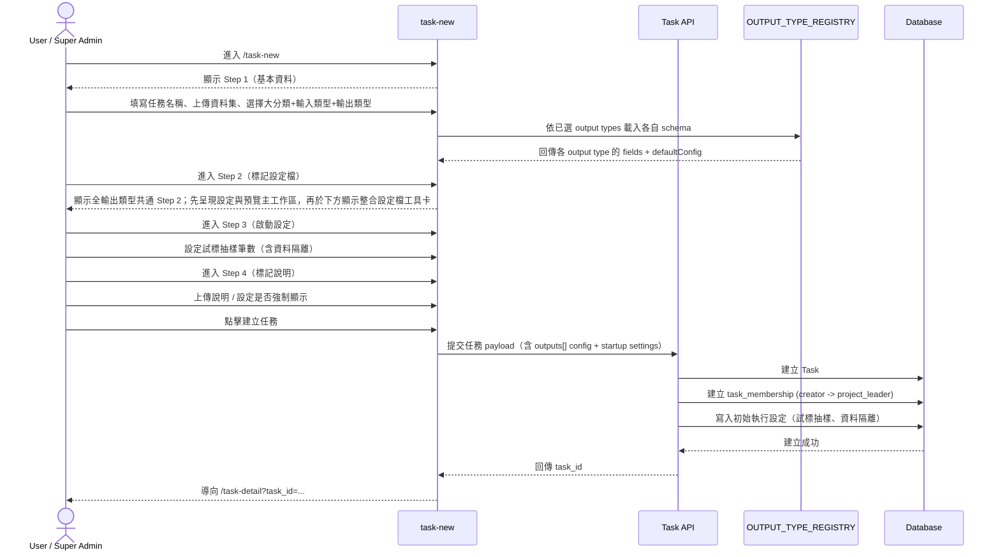
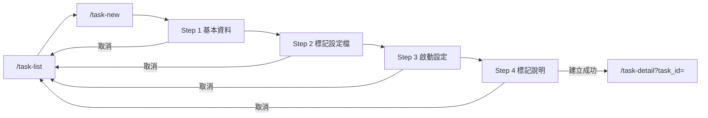

**需求來源**：IA Spec 清單 #013 — 新增任務（Step 1–4 + 啟動設定 + 標記設定檔 全任務類型）（`task-new`）

# 功能規格：New Task — 新增任務（Step 1–4 + 啟動設定 + 標記設定檔）

## 功能目標

讓 Project Leader 透過 config-driven 的四步驟精靈建立任務，並在 Step 1、Step 2 以單一 taxonomy 與 registry 呈現目前支援的輸出類型、設定欄位及可操作預覽。

## 已釐清事項

- 本版以既有需求來源與本文件中的 流程圖、使用者情境、功能需求、成功標準 作為 scope baseline。
- 跨頁或跨模組共用行為需透過「規格相依性」追蹤，不在本文件中隱含建立未列出的依賴。
- 若後續新增實作層契約，需先確認是否構成行為變更；若是，必須依 SDD 流程更新 spec。
- **v3.0.0 架構轉型**：本版依 ADR-029 將固定 `TASK_TYPE_ENUM` 替換為可組合的 `outputs[]` 模型。任務不再對應單一固定型別，而是由使用者從 `OUTPUT_TYPE_REGISTRY` 中選擇一至多個輸出類型組合而成。
- **v4.0.0 taxonomy 收斂**：`entity_relation` 與 `boundary` 自合法輸出類型、Step 1 選項及 Step 2 registry／預覽移除；既有 key `span`、`relation_triple`、`token_class` 分別遷移為 `entity_recognition`、`relation_identification`、`sequence_tagging`，不提供舊 key 相容別名；顯示名稱同步為 Entity Recognition（實體辨識）、Relation Identification（關係識別）、Sequence Tagging（序列標註）。
- **v4.1.0 輸出選擇語意**：Step 1 由 taxonomy 的 `outputSelection` metadata 決定各大分類輸出 chip 的選擇模式；分類與回歸為 radio 單選，序列與生成維持 checkbox 多選語意，跨大分類仍可同時選取。
- **v4.2.0 設定優先佈局初版**：Step 2 建立桌面版左側 schema 設定、右側即時預覽的主工作區；1100px 以下改為設定在上、預覽在下；範本／上傳與 Code 整合為下方單一輔助工具卡。
- **v4.2.1 設定區視覺層級補充**：Step 2 左右主區塊分別顯示「標記設定」與「標記預覽」小標，兩者使用相同文字層級並於桌面版頂端對齊；共通 `allow_bypass` toggle 與前一 schema 欄位保留 12px 群組間距。
- **v4.3.0 全輸出類型統一 Step 2 佈局**：設定優先主工作區與整合設定檔工具卡改為 Step 2 全域共通版面，適用於全部 8 種輸出類型、單一輸出及多輸出組合，不再需要 output type 專屬的 layout metadata。桌面寬度大於 1100px 時設定置左、預覽置右；1100px 以下設定置上、預覽置下；下方工具卡固定以單一外框與分隔線整合範本／上傳及 240px Code 編輯器。`outputs[]` 契約不變。
- **v4.4.0 回歸滑桿互動統一**：`single_dim` 與 `multi_dim` 預覽統一採用 range slider；當前數值以跟隨滑塊的標籤即時顯示於滑塊正上方。`multi_dim` 依維度順序配置不同顏色，但維度辨識仍同時保留名稱與端點文字，不以顏色作為唯一資訊來源。
- **v4.5.0 回歸數值精確輸入**：`single_dim` 與 `multi_dim` 每列滑桿右側改為可直接編輯的 number input，並與滑桿及上方數值標籤雙向同步；完成輸入後滑塊移至對應位置，超出範圍或不符合 step 的輸入自動校正至最近合法值。
- **v4.6.0 回歸小數直接輸入**：右側 number input 允許直接鍵入 min/max 範圍內的小數值，不因 slider `step` 吸附或改寫；`step` 僅控制滑桿拖曳與鍵盤微調，手動輸入仍會同步滑塊與上方數值標籤。
- **v4.7.0 回歸設定卡統一**：`single_dim` 與 `multi_dim` 的維度設定使用相同卡片、欄位標籤及 min/max/step 三欄排列；單維度固定顯示一張不可新增／刪除的卡片，多維度顯示一張以上並保留新增／刪除功能。多維度不再顯示重複的外層「維度設定 *」標題。
- **v4.8.0 實體辨識雙向選取與設定間距**：單一及混合輸出中的 `entity_recognition` 均支援「先選實體類型再圈選文字」與「先圈選文字再選實體類型」；未指定類型的圈選範圍持續反白但不顯示提示，點擊類型後完成新增並保留該類型為作用中狀態。混合式任務由多個單一輸出類型組成，每個輸出類型保留自身互動契約；`entity-list` 後方的 boolean 設定與前一欄保留 12px 群組間距。
- **v4.9.0 關係語意類型改為選填**：`relation_identification.relation_types` 預設為空陣列且不再阻擋 Step 2；純關係與所有包含關係識別的複合任務只在欄位存在至少一個語意類型標籤時顯示三元組列的「類型」選單，空陣列時不顯示類型徽章或選單。純關係預覽移除重複的「關係識別預覽」內層標題，保留輸出類型區塊標題「關係識別」。
- **v5.0.0 階層式多標籤 taxonomy**：`multi_label.label_options` 由扁平 `{name,color}[]` 重定義為遞迴 `LabelOptionNode[]`；Step 2 使用樹狀編輯器與可搜尋的階層選擇器，每一層節點皆可獨立勾選，branch checkbox 與展開／收合控制分離，parent selection 不連動 children。已選 chip 只顯示被選節點名稱，完整 root-to-selected-node ID path 僅作選項身分與資料儲存。既有 flat config／資料只在匯入時正規化相容；014 Task Detail、015 Annotation Workspace、017 Dataset Quality 的顯示、提交與統計契約依本次決策延後同步。
- **v5.1.0 階層選擇器攤平與保持開啟**：`multi_label` 預覽選擇器清單攤平顯示全部層級（移除 branch 展開／收合控制），階層改由縮排與可存取名稱的完整路徑表達；選項不再顯示完整路徑文字；選取節點後選擇器保持開啟，直到使用者以 Escape、關閉按鈕、trigger 或點擊外部關閉，期間搜尋字串、捲動位置與焦點須跨選取保留。搜尋比對節點名稱與祖先鏈；搜尋列與標題固定於選擇器頂端。
- **v5.2.0 taxonomy 分支刪除確認 modal**：`taxonomy-tree` 刪除含子節點的 branch 改用頁內確認 modal（遵循 UXC-10），取代瀏覽器原生 `confirm`；內文載明將一併刪除的子節點數量與不可復原後果，Escape／背景點擊取消，開啟時焦點置於危險紅「刪除」鈕使 Enter 確認。無子節點的 leaf 刪除維持不需確認。
- **v6.0.0 自由文字 Evidence 與預標記契約**：`free_text` 移除 `show_reference`、舊名 `show_reference_to_annotator` 與「顯示參考答案給標記者」設定；Step 1 指定 Evidence 時，Step 2 依「背景參考 (Evidence) → Input → 回答框」順序呈現，回答區只保留輸出卡片的「自由文字」標題。指定 Output 欄位即代表其資料為可供標記者編修的預標記，回答框以該值初始化；未指定 Output 時回答框保持空白。此 Output 預標記不得被解讀為可下發隱藏 test-set ground truth。
- **v6.1.0 Evidence 完整性與自由文字指示**：已指定為 Evidence 的欄位與 Input 採相同全資料完整性檢查，缺值時阻擋進入 Step 2；`free_text` 新增必要的 `input_instruction`／`output_instruction`，由 registry 產生設定欄位並取代原始 JSON key 作為預覽主要標題（作答區標題由 v6.0.0 的固定「自由文字」改為可設定的 `output_instruction`，輸出卡片標題不變）；已移除的 `show_reference` 不得再顯示或序列化。
- **v6.2.0 Sequence Tagging Token 單位與方案**：`sequence_tagging` 採固定 language-aware v1 tokenization（中文逐字、英文逐詞、標點獨立、空白不產生 Token），保留 `BIO / BIOES / IOB2` 並新增無位置前綴的 `SINGLE`。Step 2 專屬預覽以完整 tag 按鈕精確套用到 Token，不再依前一 Token 自動推斷；`tokens` 與可見預標記數量不一致時顯示錯誤並阻擋前進。本版僅完成 013 producer-side，014／015／016／017 consumer 同步延後。
- **v6.3.0 Sequence Tagging 標記單位**：將「標記單位」與「標記方案」拆成兩個獨立設定維度。`tokenization.unit` 支援 `character / word`，預設 `character`；字模式依可見字元切分，詞模式依語言感知詞界切分，兩者皆略過空白並讓標點獨立。切換單位後 Step 2 Token 網格與規則說明須立即重建，既有預覽 tag 不得錯套到新邊界；可見預標記數量改依目前單位重新驗證。數量不一致且預標記與另一單位的 Token 數對齊時，錯誤訊息須點名該單位並提供「切回該單位」或「改用符合目前單位的預標記」兩條出路；切換單位使數量重新一致時，可見預標記須自資料重新初始化（Bypass 明確清空的預覽狀態除外）。本版仍只完成 013 producer-side，正式 Annotation Workspace 與其他 consumer 維持延後。
- **v6.4.0 標記預覽原始文本**：Step 2 序列標註預覽將 Token 網格上方的字／詞切分規則說明，改為顯示帶「原始文本」標題（英文 Text）、未經字／詞切分的原始輸入文本；該文本不隨標記單位切換而改變，切分行為改由 Token 網格本身呈現。通用輸入文字區塊的標籤由 Input 欄位名稱改為「原始文本」（英文 Text）；`item_pair` 於配對區塊上方顯示一次「原始文本」標題並保留兩段文本的欄位名稱小標。`entity_recognition`／`relation_identification` 的互動圈選文本區不另加標題，`free_text` 維持可設定的 `input_instruction` 契約。整合預覽標題由「整合預覽（實體辨識 + 關係識別）」簡化為「整合預覽」（英文 Unified preview）。tokenization 契約與預標記驗證行為不變。
- **v6.4.1 選擇狀態與下游語意釐清**：Step 1 的三組 chip 分別寫入 `selected_categories[]`、`input_type` 與 `selectedOutputTypes[]`，不建立單一固定 `task_type`；完成設定後，`selectedOutputTypes[]` 一對一產生 `outputs[].type`。010 Task List 直接以 `outputs[].type` 顯示與篩選；`docs/product/example-data/` 的 13 份 fixture 僅為 prototype 示例，不是合法任務或輸出組合上限。
- **v6.9.0 項目對名稱設定**：輸入類型為 `item_pair` 時，Step 2 標記設定於輸出類型手風琴清單上方顯示一張不可收合的「項目對名稱」設定卡，提供兩個單行文字欄位設定配對文本的顯示名稱；預設值自動帶入 Step 1 兩個 Input 角色欄位的原始欄位名稱，開放使用者編輯。標記預覽配對區塊的兩個小標即時顯示設定後名稱；欄位清空（trim 後為空）時該側小標回退顯示原始欄位名稱。更換資料集或欄位角色指定時名稱重新以新欄位名初始化。config 於 `input_type: item_pair` 時新增頂層 `item_pair_labels: [string, string]`（序列化生效值），Code 儲存回填同步驗證；014 Task Detail 概覽與標記設定編輯模式經共用引擎同步生效並持久化。`single_item` 與傳統 `sentence_pairs` 路徑不受影響。
- **v6.8.0 序列標註預覽移除輸出卡片標題**：`sequence_tagging` 於 registry 宣告 `hidePreviewTitle: true`，Step 2 標記預覽（含 014 Overview「標記設定」編輯模式的 parity surface）不再顯示輸出卡片的「序列標註」標題，預覽直接以「原始文本」區塊起始。其他輸出類型的卡片標題與多輸出組合之間的分隔線行為不變。
- **v6.7.0 多標籤「所有層級皆可選」提示改為 Tooltip**：`multi_label` 的 `label_options` 欄位於 registry 宣告 `hintAsTooltip: true` 並將「所有層級皆可選 — 父、子標籤可分別勾選，系統會保留其分類位置。」提示移入 `hint_zh`／`hint_en`；taxonomy 樹編輯器內不再顯示固定的提示框（`.taxonomy-editor-note` 移除），改為「標籤選項」欄位標題旁的實心圓形「?」按鈕，hover 或鍵盤 focus 時以 v6.6.0 相同樣式的 tooltip 泡泡顯示。共用引擎抽出 `attachFieldHintTooltip` helper，text 與 taxonomy-tree 欄位共用同一 tooltip 產生邏輯；task-detail 標記設定編輯模式經共用引擎同步生效。
- **v6.6.0 自由文字說明欄位 helper text 改為 Tooltip**：`free_text` 的「輸入區說明」與「作答區說明」欄位於 registry 宣告 `hintAsTooltip: true`，用途與範例說明不再固定顯示於欄位下方，改為欄位標題旁的實心圓形「?」按鈕，hover 或鍵盤 focus 時以 tooltip 泡泡顯示。泡泡樣式對齊 MASTER.md §Tooltip：深色（`--color-ink`）泡泡置於觸發點上方、帶指向觸發點的向下箭頭、opacity 150ms 過場，並因多行說明文字放寬為 `max-width: 320px` 自動換行、左緣對齊觸發點（置中會被欄位左緣裁切）；`.output-accordion` 移除 `overflow: hidden`（圓角改由 header 自身處理），泡泡才能完整彈出 accordion 邊界。`.field-help-tooltip` + `.tooltip-bubble` 樣式集中於共用 `task-config.css`（移除 task-new／task-detail 頁內重複定義），task-new 與 task-detail 的抽樣筆數提示同步套用新樣式，task-detail 標記設定編輯模式經共用引擎同步生效。其他欄位的 helper text 顯示方式不變。
- **v6.5.0 自由文字預覽移除輸出卡片標題與內部分隔線**：`free_text` 於 registry 宣告 `hidePreviewTitle: true`，Step 2 標記預覽（含 014 Overview「標記設定」編輯模式的 parity surface）不再顯示輸出卡片的「自由文字」標題；同步移除預覽內兩條分隔線（Evidence 區塊後、Input 內容卡與作答區之間），區塊間距改以 spacing 維持。其他輸出類型的卡片標題與多輸出組合之間的分隔線行為不變。
- **v6.4.3 Dashboard consumer 同步**：012 Dashboard 與 010／016 一致，直接依 `outputs[].type` 順序顯示一至多個 registry-driven tag；13 筆 fixture 只作 prototype 基線，第 14 筆任意合法組合無需新增 renderer 分支。014／015 consumer 延後範圍不變。

## 規格常數

- `SYSTEM_ROLES = user | super_admin`
- `TASK_ROLES = project_leader | reviewer | annotator`
- `TASK_CREATION_STEPS = step-1-basic | step-2-config-builder | step-3-startup-settings | step-4-guideline`
- `TASK_CATEGORIES = classification | regression | sequence | generation`
- `TASK_INPUT_TYPES = single_item | item_pair`
- `TASK_OUTPUT_SELECTION_MODES = single | multiple`
- `OUTPUT_TYPE_KEYS = sequence_tagging | entity_recognition | relation_identification | single_label | multi_label | single_dim | multi_dim | free_text`

  | 大分類 | `outputSelection` | 對應輸出類型 |
  |--------|--------------------|-------------|
  | `classification` | `single` | `single_label` · `multi_label` |
  | `regression` | `single` | `single_dim` · `multi_dim` |
  | `sequence` | `multiple` | `sequence_tagging` · `entity_recognition` · `relation_identification` |
  | `generation` | `multiple` | `free_text` |

- `OUTPUT_TYPE_DEPENDENCIES`：`relation_identification` 可獨立使用；僅在與 `entity_recognition` 同時被選取時，以 `entity_recognition` 作為可編輯實體來源，預覽與 config 合併為整合模式。此關聯不得自動加入或移除 output type
- `OUTPUT_TYPE_FIELD_TYPES = entity-list | taxonomy-tree | tag-list | select | number | text | boolean | va-dimensions`
- `SEQUENCE_TAGGING_SCHEMES = BIO | BIOES | IOB2 | SINGLE`
- `SEQUENCE_TOKEN_UNITS = character | word`
- `SEQUENCE_TOKENIZATION_VERSION = 2`
- `SEQUENCE_TOKENIZATION_MODE = unit_based`
- `TAXONOMY_MAX_DEPTH = 8`
- `TAXONOMY_MAX_NODES = 500`
- `TAXONOMY_NODE_ID_MAX_LENGTH = 100`
- `TAXONOMY_NODE_NAME_MAX_LENGTH = 100`

> `TAXONOMY_MAX_DEPTH` 以 root 為第 1 層；合法 `LabelPath.length <= 8`。
- `TASK_CONFIG_MODES = visual | code`
- `CONFIG_FORMATS = yaml | json`
- `CONFIG_UPLOAD_FORMATS = yaml | yml | json`
- `TASK_CREATOR_SYSTEM_ROLES = user | super_admin`
- `DATASET_UPLOAD_FORMATS = json`
- `DATASET_MAX_FILE_SIZE_MB = 200`
- `DATASET_ENCODING = utf-8`
- `FIELD_ROLES = evidence | input | output`（欄位角色；未指定角色的欄位不納入 config）
- `GUIDELINE_FORMATS = pdf | image | markdown`
- `GUIDELINE_IMAGE_FORMATS = png | jpg | jpeg | webp`
- `RUN_INIT_SAMPLING_MODE = by_count`
- `RUN_INIT_COUNT_MIN = 1`
- `RUN_ISOLATION_DEFAULT = enabled`
- `SAMPLING_DEFAULTS_BY_CATEGORY` — 各大分類的試標預設參數表（見下方）

| 大分類 | 建議 IAA | Std 上限 | 最少標記者數 | 試標比例參數（用於換算預設筆數） |
| --- | --- | --- | --- | --- |
| `classification` | 0.75 | — | 3 | 12% |
| `regression` | 0.75 | 0.10 | 5 | 15% |
| `sequence` | 0.82 | — | 3 | 15% |
| `generation` | 不適用（free_text 由審核員評估，不計自動 IAA） | — | 3 | 18% |

> **注意**：`試標比例參數` 僅作為系統換算預設抽樣筆數之用（`round(dataset_total × trialPercent / 100)`），UI 不暴露百分比模式，使用者僅輸入筆數。當使用者選擇多個大分類時，取最高試標比例參數。

- `IDEMPOTENCY_WINDOW_HOURS = 24`
- `MOBILE_BP = 767px`
- `RWD_VIEWPORTS = 375px / 768px / 1440px`

## 流程圖


```mermaid
sequenceDiagram
    actor U as User / Super Admin
    participant UI as task-new
    participant API as Task API
    participant Registry as OUTPUT_TYPE_REGISTRY
    participant DB as Database

    U->>UI: 進入 /task-new
    UI-->>U: 顯示 Step 1（基本資料）

    U->>UI: 填寫任務名稱、上傳資料集、選擇大分類+輸入類型+輸出類型
    UI->>Registry: 依已選 output types 載入各自 schema
    Registry-->>UI: 回傳各 output type 的 fields + defaultConfig

    U->>UI: 進入 Step 2（標記設定檔）
    UI-->>U: 顯示全輸出類型共通 Step 2；先呈現設定與預覽主工作區，再於下方顯示整合設定檔工具卡

    U->>UI: 進入 Step 3（啟動設定）
    U->>UI: 設定試標抽樣筆數（含資料隔離）

    U->>UI: 進入 Step 4（標記說明）
    U->>UI: 上傳說明 / 設定是否強制顯示

    U->>UI: 點擊建立任務
    UI->>API: 提交任務 payload（含 outputs[] config + startup settings）
    API->>DB: 建立 Task
    API->>DB: 建立 task_membership (creator -> project_leader)
    API->>DB: 寫入初始執行設定（試標抽樣、資料隔離）
    DB-->>API: 建立成功
    API-->>UI: 回傳 task_id
    UI-->>U: 導向 /task-detail?task_id=...
```

| 步驟 | 角色 | 動作 | 系統回應 |
|------|------|------|---------|
| 1 | `user` / `super_admin` | 進入 `/task-new` | 顯示 Step 1 基本資料 |
| 2 | `user` / `super_admin` | 選擇大分類、輸入類型與輸出類型 | 依 `OUTPUT_TYPE_REGISTRY` 載入各輸出類型的 schema |
| 3 | `user` / `super_admin` | 完成 Step 2 標記設定檔 | 產生可提交的 `outputs[]` config |
| 4 | `user` / `super_admin` | 完成 Step 3 啟動設定 | 記錄初始抽樣方式設定 |
| 5 | `user` / `super_admin` | 完成 Step 4 標記說明設定（可略過） | 記錄說明資產與強制顯示設定 |
| 6 | `user` / `super_admin` | 建立任務 | 建立 task、creator 的 `project_leader` membership、初始執行設定 |
| 7 | `user` / `super_admin` | 取消建立流程 | 導回 `/task-list` |

---

## 使用者情境與測試 *(必填)*

### 使用者故事 1 — 完成 4 步驟任務建立流程（優先級：P1）

使用者可透過 Step 1 → Step 2 → Step 3 → Step 4 完成任務建立，並在成功後進入任務詳情頁。

**此優先級原因**：建立任務是整個任務生命週期的起點。
**獨立測試方式**：依序填完四步驟並提交，驗證建立成功、導頁、membership 建立。

**驗收情境**：

1. **Given** 已登入且可使用任務管理模組，**When** 完成 Step 1~4 並提交，**Then** 成功建立任務且導向 `/task-detail?task_id=...`。
2. **Given** 建立成功，**When** 檢查任務成員資料，**Then** 建立者自動有一筆 `project_leader` 的 `task_membership`。
3. **Given** 正在建立流程中，**When** 點擊取消，**Then** 導回 `/task-list` 且不建立任務。

**介面定義（需與 IA 導覽語意一致）**：

- Step 1：`基本資料`
  - 必要欄位：`task_name`、`dataset_file`、`selected_categories[]`、`input_type`、`selectedOutputTypes[]`（後三者各由一組 chip 維護）
  - `task_name`：
    - 單行文字輸入框，附字數計數器（上限 100 字）
  - `dataset_file`：
    - 上傳區：拖曳或點擊上傳，僅支援 `.json`（`DATASET_UPLOAD_FORMATS`），單檔上限 `DATASET_MAX_FILE_SIZE_MB`（200 MB），編碼 `DATASET_ENCODING`（UTF-8）
    - 支援多檔選取與拖曳；上傳成功後 upload zone 持續可見，可繼續追加檔案
    - 每個已上傳檔案獨立一列，顯示：檔名 · 檔案大小 · 預覽按鈕（眼睛圖示） · 移除按鈕（×）
    - 點擊預覽按鈕或檔案列開啟 Modal，顯示該檔案第 1 筆紀錄的原始 JSON（格式化縮排、唯讀）；Modal 以近全視窗尺寸呈現以盡量完整顯示 JSON，長字串值於區塊寬度內自動換行（無需水平捲動），內容超出高度時於 JSON 區塊內垂直捲動；Modal 可由關閉按鈕或 overlay 關閉
    - 追加檔案時須驗證新檔可於目前所選資料列來源路徑取出紀錄、且欄位集合與已上傳一致，不一致則阻擋該檔並顯示提示（FR-002d）
    - **資料列來源列**（上傳成功後顯示於嵌入式預覽表格上方）：
      - 系統自動偵測 JSON 中可作為紀錄集合的陣列（含巢狀結構與物件包裹形式，如 `{ meta, data: [...] }`），並預設選擇最合適的候選來源
      - 偵測到多個候選來源時提供下拉選單供手動切換，並顯示候選數提示；僅一個候選時下拉選單停用
      - `.json` 檔內容為 JSON Lines（逐行 JSON object）時仍可解析為紀錄集合
      - 完全偵測不到可用紀錄集合時顯示錯誤並阻擋進入下一步
    - **嵌入式欄位預覽表格**（上傳成功後即時顯示，無需點擊觸發）：
      - 顯示前 2 筆資料列，欄位標頭為原始 JSON key 名稱（不做中文轉換）；欄位為所選資料列來源**所有紀錄**第一層 key 的聯集
      - 每個欄位標頭顯示型別摘要 badge（字串／數字／布林／陣列／物件／混合／空）
      - 陣列或物件型儲存格以摘要文字呈現，hover 可檢視原始 JSON 內容
      - 預覽提示列顯示資料總筆數（共 N 筆資料）
      - 每個欄位標頭下方提供角色下拉選單：`Evidence（背景）` · `Input（輸入）` · `Output（輸出）` · `— 不使用 —`
      - 指定角色後於欄位下方顯示回饋註記：Input／Evidence 有缺值 → 紅色錯誤並列出問題紀錄；Input／Evidence 全數有值 → 綠色確認；Output → 藍色預標記覆蓋率資訊（N/total 筆有預標記）
      - 預設全部欄位為「不使用」；重新上傳或移除檔案後角色重設為「不使用」；切換資料列來源時保留各來源已指定的角色，切回原來源時自動還原
      - 角色指定結果以 `field_role_map: Record<string, FieldRole>` 傳入建立任務 payload；僅含已指定角色的欄位
  - 輸出組合選擇狀態：三組 chip（分別維護 `selected_categories[]`、`input_type`、`selectedOutputTypes[]`，不存在單一 `task_type`）
    - 大分類（可多選，`role="checkbox"`）
      - `分類 Classification`
      - `回歸 Regression`
      - `序列 Sequence`
      - `生成 Generation`
    - 輸入類型（單選，`role="radio"`，互斥）
      - `單一項目`
      - `項目對`
    - 輸出類型（cascade 過濾，選擇模式由 taxonomy 的 `outputSelection` 決定，跨組可多選）

      | 大分類 | 選擇語意 | 輸出類型 |
      |--------|----------|----------|
      | 分類 | 單選 radio；兩項互斥 | `單一標籤` · `多標籤` |
      | 回歸 | 單選 radio；兩項互斥 | `單維度` · `多維度` |
      | 序列 | 多選 checkbox | `序列標註` · `實體辨識` · `關係識別` |
      | 生成 | 多選 checkbox | `自由文字` |

    - cascade 行為：未選大分類 → 顯示「請先選擇大分類」；選 1 個 → 直接顯示輸出類型（無分組標題）；選 2+ 個 → 依大分類分組顯示並加子標題；取消大分類 → 該組輸出類型消失且已選項自動取消。分類／回歸切換同組選項時自動取消原選項；序列可保留多個已選項（含 `entity_recognition + relation_identification`）
    - 已移除的 `entity_relation`、`boundary`、`span`、`relation_triple` 與 `token_class` 不得出現在任何分類、輸入類型或語系下
  - `下一步` 啟用條件：`task_name` 非空 ∧ 至少選擇一個輸出類型 ∧ dataset 檔案通過格式/大小/編碼檢查 ∧ Input 欄位數量符合輸入類型（`single_item` 須恰好 1 個、`item_pair` 須恰好 2 個）∧ 所有 Input 與已指定 Evidence 角色欄位無缺值
- Step 2：`標記設定檔`
  - 全域共通佈局：所有輸出類型及多輸出組合皆使用設定優先主工作區。桌面寬度大於 1100px 時，schema 設定區在左、標記預覽在右且頂端對齊；左欄顯示「標記設定」、右欄顯示「標記預覽」小標，兩者字級、字重、色彩與垂直位置一致。1100px 以下依序改為 schema 設定區、標記預覽。範本／上傳與 Code 置於主工作區下方並整合為單一外框工具卡，Code 編輯器高度固定為 240px
  - 整合設定檔工具卡中的範本／上傳列：
    - 範本按鈕：依已選 output types 提供預設模板，點擊即載入
    - 上傳設定檔：支援 `CONFIG_UPLOAD_FORMATS`（yaml / yml / json），載入至 code 區由使用者手動儲存套用
  - schema 設定區（手風琴佈局）：
    - 無論選擇單一或多個輸出類型，每個輸出類型均以**手風琴面板**呈現，面板標題顯示序號與輸出類型名稱
    - 手風琴面板可展開/收合；面板內部由 `OUTPUT_TYPE_REGISTRY` 動態生成對應的設定欄位
    - 存在已啟用來源關聯的輸出類型（如同時選取 `entity_recognition + relation_identification`），Relation Identification（關係識別）面板標題附帶相依提示；純 `relation_identification` 不顯示 Entity Recognition（實體辨識）面板或相依提示
    - 各輸出類型設定欄位的 `entity-list` 新增按鈕文字需依語境顯示（如「新增標籤」、「新增實體類型」、「新增關係標籤」）
  - 整合設定檔工具卡中的 Code 區：可編輯 YAML/JSON，提供格式切換與 `儲存` 按鈕；schema 設定與 Code 區同步同一份 config
  - 標記預覽區：
    - 已上傳資料集時，預覽顯示資料集的實際文字內容；未上傳時顯示預設範例文字
    - 每個輸出類型必須有獨立的互動式預覽，使用者可直接操作體驗標記方式（見 FR-003g）
    - 每個輸出類型（`allow_bypass` 開啟時）於預覽區塊底部提供獨立的「無法判定 (Bypass)」勾選項（見 FR-003j）
    - 存在相依關係的輸出類型（如 `entity_recognition` + `relation_identification`）合併為整合預覽
    - 獨立輸出類型之間以分隔線區隔
  - `下一步` 啟用條件：所有輸出類型的 schema 必填欄位全部通過 ∧ 無 parser/schema error ∧ code 區無未儲存變更
- Step 3：`啟動設定`
  - 提示文案：「任務建立後再至 task-detail 邀請標記員與審核員」（本步驟不提供成員管理）
  - `每回合抽樣筆數`：數字輸入框，抽樣模式固定 `by_count`；初始值依 `SAMPLING_DEFAULTS_BY_CATEGORY` 自動帶入（`round(dataset_total × trialPercent / 100)`）；驗證：`≥ RUN_INIT_COUNT_MIN` 且 `< 資料集總筆數`
  - 資料隔離開關：toggle，預設 `RUN_ISOLATION_DEFAULT`（enabled），附說明文字
  - `下一步` 啟用條件：抽樣筆數通過驗證
- Step 4：`標記說明`（選填，未填寫亦可提交）
  - `標記員說明` 區塊：
    - `標記說明內容` textarea（可獨立於附件存在）
    - 附件上傳：支援多檔（`GUIDELINE_FORMATS`：pdf / image / markdown），逐檔移除
  - `審核員說明` 區塊：
    - `審核說明內容` textarea（可獨立於附件存在）
    - 附件上傳：與標記員附件獨立，同樣支援多檔與逐檔移除
  - `開始標記前強制顯示` toggle：啟用時 annotation-workspace 於同一使用者首次進入該任務時顯示說明彈窗（確認後不重複顯示）
  - `建立任務` 按鈕：永遠可見（Step 4 為選填）
- 操作列：`上一步` · `下一步` · `取消` · `建立任務`（僅 Step 4 顯示）
  - 任一步驟點擊 `取消` 或離頁（側欄跳轉、關閉分頁），若已有變更需顯示「離開將遺失未儲存內容」確認視窗
  - 重新整理（F5）時，若已有變更需顯示瀏覽器離頁確認視窗；使用者確認後頁面重新載入，系統自動還原至先前步驟與所有已填資料（精靈狀態持久化）
  - 驗證錯誤：欄位下方 inline message + 頁首 toast，訊息指出欄位名稱與修正方向

**行為規則**：

- 僅 `TASK_CREATOR_SYSTEM_ROLES` 可進入 `/task-new` 並提交建立任務。
- 未完成當前步驟必要欄位不得進入下一步。
- Step 3 必須完成首次啟動設定（抽樣方式）才可進入 Step 4。
- 建立成功前不得寫入正式任務資料。
- 建立成功後導向 `task-detail`，L0 active 保持「任務管理」；同時清除暫存的精靈狀態。
- 每次從外部導航進入 `/task-new`（如點擊「新增任務」按鈕、側欄連結、或瀏覽器上一頁/下一頁），系統必須清除暫存的精靈狀態並從第一步空白開始；僅 F5 重新整理時才還原先前步驟與已填資料。

**Prototype 互動規格（本版必做）**：

- Step 1 `下一步` 按鈕預設 disabled；當且僅當 `task_name` 非空、至少選擇一個輸出類型、dataset 檔案通過格式/大小/編碼檢查、Input 欄位數量符合輸入類型要求（`single_item` 恰好 1 個 Input、`item_pair` 恰好 2 個 Input）、且所有 Input 角色欄位無缺值後 enabled。
- Step 1 dataset 上傳成功後不得隱藏 upload zone；upload zone 需持續可見，讓使用者可繼續追加多個資料集檔案；每個已上傳檔案在下方獨立一列顯示，各列含移除按鈕可單獨刪除；所有上傳檔案視為同一資料集的集合。
- Step 2 `下一步` 按鈕預設 disabled；所有輸出類型的 schema 必填欄位通過且無 parser/schema error 才 enabled。
- Step 2 在 code 有未儲存變更時，`下一步` 必須維持 disabled 並提示先儲存；不得自動覆寫/自動儲存 code。
- Step 3 `下一步` 按鈕預設 disabled；試標初始化設定通過驗證後才 enabled。
- Step 4 時操作列的 `下一步` 按鈕文字自動改為 `建立任務`（箭頭圖示隱藏），此按鈕永遠啟用；Step 4 為選填，未上傳說明也可提交。
- 任一步驟點擊 `取消` 或離開頁面（側欄跳轉、關閉分頁）時，若已有變更需顯示「離開將遺失未儲存內容」確認視窗。
- 精靈狀態持久化：系統於每次表單變更與步驟切換時，將當前步驟、所有表單值、任務類型選擇、資料集資訊（檔案名稱與大小、已解析欄位與預覽資料）、標記設定、啟動設定、標記說明等完整精靈狀態暫存於 session storage。系統透過瀏覽器導航類型偵測區分「重新整理」與「新進入」：F5 重新整理（navigation type = reload）時，系統自動還原至先前步驟並回填所有已填資料，包含任務名稱輸入欄位、任務類型 chip 選取狀態、資料集檔案列表與欄位預覽、Step 2 schema 設定與預覽；從外部導航進入（navigation type = navigate 或 back_forward）時，系統清除暫存狀態並從第一步空白開始。暫存狀態亦於成功建立任務後清除。
- 驗證錯誤顯示採欄位下方 inline message + 頁首 toast；訊息需指出欄位名稱與修正方向。

---

### 使用者故事 2 — 標記設定檔以 OUTPUT_TYPE_REGISTRY 驅動（優先級：P1）

Step 2 必須由 `OUTPUT_TYPE_REGISTRY` 驅動，每個輸出類型在 registry 中定義自己的 `fields`、`defaultConfig` 與欄位類型（`OUTPUT_TYPE_FIELD_TYPES`），不得把特定輸出類型的設定寫死在核心流程。

**此優先級原因**：符合架構要求「新增 output type 不需修改核心流程」（ADR-029）。
**獨立測試方式**：選擇不同輸出類型組合，驗證 UI 欄位與預覽由 registry 自動生成；schema 與下方 Code 內容一致，且所有組合使用相同的響應式版面。

**驗收情境**：

1. **Given** 在 Step 2 且已選擇一個或多個輸出類型，**When** 載入頁面，**Then** 每個輸出類型以手風琴面板呈現各自的 schema 設定欄位。
2. **Given** 在 Step 2，**When** 調整任一輸出類型的 schema 欄位，**Then** 下方 Code 區需即時呈現等價 `outputs[]` 格式的 YAML/JSON config。
3. **Given** 在下方 Code 區手動修改設定，**When** 點擊 `儲存`，**Then** schema 欄位需同步更新；無效設定需顯示錯誤。
4. **Given** 平台新增一種 output type 到 registry，**When** 使用者進入 Step 1/Step 2，**Then** 可選到該輸出類型並看到對應設定，無需變更核心流程。
5. **Given** 使用者在 Step 2 上傳 `.yaml/.yml/.json` 設定檔，**When** 讀取成功，**Then** code 區應載入檔案內容、切換對應格式並要求使用者按儲存套用。
6. **Given** 使用者切換語言（zh/en），**When** 當前 labels 仍為預設模板值，**Then** Step 2 預覽、schema 標籤與 code labels 應同步切換為對應語系文案。
7. **Given** 任一輸出類型的 `allow_bypass` 為開啟（預設），**When** 在該輸出類型的預覽勾選「無法判定 (Bypass)」，**Then** 該輸出類型的其他預覽互動控制項被清空並停用，且不影響輸入文字與其他輸出類型的預覽；取消勾選後恢復可操作並重新初始化。
8. **Given** 在 schema 設定面板將某輸出類型的 `allow_bypass` 關閉，**When** 預覽刷新，**Then** 該輸出類型的預覽不顯示 Bypass 勾選項，且既有的勾選狀態被清除；code 區同步輸出 `allow_bypass: false`。
9. **Given** 已選輸出類型中至少一項於 registry 宣告 `rendersInputPreview: true`，**When** Step 2 標記預覽載入，**Then** 不顯示額外的通用輸入文字區塊，輸入內容改由該輸出類型的專屬或整合預覽完整呈現。
10. **Given** 選擇 `sequence_tagging`，**When** Step 2 標記預覽載入，**Then** 不顯示重複的通用輸入文字區塊，輸入內容改由專屬 Token 網格完整呈現；設定區依序顯示「標記單位」、「標籤類型」與「標記方案」，預覽不顯示輸出卡片的「序列標註」標題，於 Token 網格上方顯示帶「原始文本」標題（英文 Text）、未經字／詞切分的原始輸入文本。
11. **Given** `sequence_tagging` 的標記單位為「字」，**When** 預覽載入中文或英文輸入，**Then** 每個非空白可見字元各自成為 Token，標點獨立；切換為「詞」後，中文依語言感知詞界、英文依單字重新分組，標點仍獨立，Token 網格於 100ms 內同步更新，預覽顯示的原始輸入文本維持原文不變。
12. **Given** 僅選擇 `relation_identification` 且資料集提供既有實體，**When** Step 2 標記預覽載入，**Then** 僅顯示既有實體的唯讀高亮、關係建構器與三元組列表，不顯示實體類型、實體列表或任何建立／刪除 Span 的控制項，且 config 不輸出 `source_output`。
13. **Given** 同時選擇 `entity_recognition + relation_identification`，**When** Step 2 標記預覽載入，**Then** 顯示整合預覽並允許先建立／修改實體再建立關係，且 `relation_identification.config.source_output` 自動輸出為 `entity_recognition`。
14. **Given** 使用者在任一語系進入 Step 1 或 Step 2，**When** taxonomy 與 registry 載入，**Then** `entity_relation`、`boundary`、`span`、`relation_triple`、`token_class` 均不存在，且 `entity_recognition`、`relation_identification`、`sequence_tagging` 分別顯示 Entity Recognition／實體辨識、Relation Identification／關係識別、Sequence Tagging／序列標註。
15. **Given** 已選擇任一單一輸出類型或多輸出組合，**When** 使用者在寬度大於 1100px 的桌面進入 Step 2，**Then** schema 設定置左、標記預覽置右，範本／上傳與 Code 於下方共用單一外框；**When** 寬度不超過 1100px，**Then** schema 設定改置於標記預覽上方，且所有已選輸出類型仍在設定欄依序以手風琴面板呈現。
16. **Given** 任一輸出類型或多輸出組合的 Step 2 schema 與預覽完成渲染，**When** 檢視主工作區，**Then** 左右小標分別顯示「標記設定」與「標記預覽」，桌面版頂端位置差不得超過 2px；**Given** `allow_bypass` 前方存在其他 schema 欄位，**Then** 每個輸出類型的 Bypass toggle 與前一欄位之間必須保留 12px 垂直間距。
17. **Given** 使用者分別選擇 `single_dim` 或 `multi_dim`，**When** 進入 Step 2 標記設定，**Then** 維度名稱、最小值、最大值與間距皆以同一種維度卡片結構呈現；`single_dim` 固定一張且無新增／刪除控制，`multi_dim` 依維度數量重複卡片並提供新增／刪除控制，且卡片清單上方不顯示「維度設定 *」重複標題。
18. **Given** 使用者選擇純 `relation_identification` 或任一包含它的複合任務，**When** `relation_types` 為空陣列，**Then** 「語意類型標籤」不顯示必填標記、Step 2 仍可通過驗證，且三元組列不顯示類型徽章或「類型」選單；**When** 使用者新增至少一個語意類型標籤，**Then** 三元組列立即顯示「類型」選單且選項只來自目前 `relation_types`。純 `relation_identification` 的預覽不得再顯示重複的「關係識別預覽」內層標題。
19. **Given** 使用者選擇 `multi_label`，**When** 在 Step 2 建立 root、child 與 sibling，**Then** 可完成至少三層的 label taxonomy，且 Code 區同步保留每個節點的穩定 `id`、`name`、選填的 leaf `color` 與遞迴 `children`。
20. **Given** label taxonomy 同時含 branch 與 leaf，**When** 操作標記預覽，**Then** 每個節點皆顯示獨立 checkbox，清單攤平顯示全部層級並以縮排表達階層（無展開／收合控制）；選取 parent 不連動 children，選取後選擇器保持開啟，已選 chip 只顯示被選節點名稱，但內部選取值保留完整 root-to-selected-node ID path。
21. **Given** 不同分支各有一個同名 leaf，**When** 分別選取，**Then** 兩者以完整 ID path 維持獨立選取，不得因顯示名稱相同而互相覆蓋。
22. **Given** 使用者在 Visual 建立至少三層 taxonomy，**When** 依序以 JSON 與 YAML 儲存再回填 Visual，**Then** 樹結構、節點順序、ID、名稱、leaf color 與 `max_selections` deep-equal。
23. **Given** 使用既有 `multi-label.json` 的 flat `string[]` output，**When** Step 2 自動帶入，**Then** 系統建立一層 leaf taxonomy 並將值正規化為單段 preview paths；原 fixture 不需改寫。
24. **Given** 使用階層式 `string[][]` output，**When** Step 2 自動帶入，**Then** 系統依所有 records 首次出現順序合併共同 prefix 建立 union tree，並只以第一筆資料初始化預覽選取。
25. **Given** taxonomy 超過深度、節點數或字串長度上限，或含空值／重複 ID／無效 children，**When** 從 Visual、Code 或資料自動帶入任一入口套用，**Then** 三個入口以相同規則阻擋並保留最後一份有效 config。
26. **Given** 選擇 `free_text` 並在 Step 1 分別指定 Evidence、Input 與 Output 欄位，**When** Step 2 標記預覽載入，**Then** 依「背景參考 (Evidence) → Input → 回答框」順序顯示第一筆實際資料，且回答框以 Output 欄位值預填；預覽不得顯示輸出卡片的「自由文字」標題，也不得於 Evidence 區塊後或作答區前顯示分隔線，回答區顯示可設定的 `output_instruction`，不得再顯示 Output 欄位名稱。
27. **Given** 選擇 `free_text` 並指定 Input、選填 Evidence 但未指定 Output，**When** Step 2 標記預覽載入，**Then** 回答框值為空字串且回答框上方不得顯示「回答」／「Answer」；標記設定與 Code 區均不得顯示或序列化 `show_reference` 或 `show_reference_to_annotator`。
28. **Given** 使用者將欄位指定為 Evidence 且全部紀錄皆有值，**When** 檢查欄位預覽，**Then** 該欄位下方顯示綠色「全部 N 筆有值」，且不阻擋進入 Step 2。
29. **Given** 已指定的 Evidence 欄位有任一紀錄缺值，**When** 檢查欄位預覽，**Then** 該欄位下方顯示紅色缺值數與問題紀錄識別，頁面停用「下一步」；將角色改回「不使用」後錯誤立即清除。
30. **Given** 使用者建立 `free_text` 任務，**When** 在 Step 2 編輯「輸入區說明」與「作答區說明」，**Then** 右側預覽立即以兩段說明取代 Input／Output 原始 JSON key 作為主要標題，且 Code 與 `outputs[].config` 同步保存 `input_instruction`／`output_instruction`。
31. **Given** 使用者開啟 `free_text` 設定或載入含舊 `show_reference` 的 config，**When** Step 2 完成正規化，**Then** 設定面板不顯示「顯示參考答案給標記者」，Code 與 `outputs[].config` 亦不保留 `show_reference`；若舊 config 缺少 instruction，依當前語系補入預設值且不阻擋下一步。
32. **Given** 輸入類型為 `item_pair` 且 Step 1 已指定兩個 Input 欄位，**When** 進入 Step 2，**Then** 手風琴清單上方顯示「項目對名稱」設定卡，兩欄位預設值為兩個 Input 欄位的原始欄位名稱，且預覽配對區塊小標與之一致；**When** 編輯任一名稱，**Then** 對應預覽小標即時更新且 Code 區 `item_pair_labels` 同步序列化生效值；**When** 將欄位清空，**Then** 該側小標回退顯示原始欄位名稱。`single_item` 任務不顯示此設定卡。

**介面定義**：

- 所有輸出類型及多輸出組合皆使用下列 B／A／C 區塊順序：區塊 B 與區塊 A 組成第一個主工作區，寬度大於 1100px 時左右並列，1100px 以下依 B → A 排列；區塊 C 固定置於主工作區下方。

- 區塊 A：`標記預覽（桌面右側；1100px 以下位於設定下方）`
  - 每個輸出類型有各自的互動式預覽區塊，使用者可直接操作體驗標記方式
  - 已上傳資料集時，預覽顯示資料集實際文字內容；未上傳時顯示預設範例文字
  - 預設不為 `evidence` 角色欄位顯示獨立區塊；當已選輸出類型於 registry 宣告 `rendersEvidencePreview: true`（目前為 `free_text`）且 Step 1 已指定 Evidence 時，最上方必須顯示「背景參考 (Evidence)」與該欄位的實際內容。Evidence 角色指定保留於 `field_role_map`（傳統 `sentence_pairs` 設定另記錄於 config 的 `evidence_fields`）
  - 通用輸入文字區塊依輸入類型呈現：`single_item` 顯示「原始文本」標題（英文 Text）+ 單一文字區塊；`item_pair` 於配對區塊上方顯示一次「原始文本」標題，並保留兩個帶項目對名稱小標的文字區塊（名稱依區塊 B 的「項目對名稱」設定，預設為 Input 欄位名稱），呈現配對輸入
  - 當已選輸出類型均未於 registry 宣告 `rendersInputPreview: true` 時，通用輸入文字區塊位於所有輸出類型預覽之上方；任一已選輸出類型宣告該 metadata 時，專屬或整合預覽負責完整呈現輸入內容，不得再顯示通用輸入文字區塊
  - `sequence_tagging`、`entity_recognition`、`relation_identification`、`free_text` 宣告 `rendersInputPreview: true`，由專屬或整合預覽完整呈現輸入內容。複合任務依已選輸出類型的 registry metadata 推導，不得以任務名稱硬編判斷
  - 存在相依關係的輸出類型合併為整合預覽（如 `entity_recognition` + `relation_identification` 合併為含圈選文字、實體列表、關係建構器的統一介面）
  - 各輸出類型的預覽互動方式：

    | 輸出類型 | 預覽互動方式 |
    |----------|-------------|
    | `sequence_tagging` | 依 `tokenization.unit` 動態重建的字／詞 Token 網格 + 依方案產生的完整 tag 按鈕列 + Token 規則／方案顯示 + 數量錯誤提示 |
    | `entity_recognition` | 圈選文字建立實體 + 實體類型按鈕列 + 實體列表（含位置與刪除）；單一或與其他輸出類型組合時皆支援先選類型再圈選，以及先圈選再選類型 |
    | `relation_identification` | 純模式：既有實體唯讀高亮 + 循序關係建構器（E1/Arg1 → Relation → E2/Arg2 → 新增）+ 三元組列表，不顯示 Span 編輯控制項或重複的「關係識別預覽」內層標題；與 `entity_recognition` 組合時：整合預覽允許先建立／修改實體，再建立關係。兩種模式僅在 config `relation_types` 非空時顯示「類型」選單供事後指定語意類型 |
    | `single_label` | 文字顯示 + radio 風格可點選標籤 chip（單選） |
    | `multi_label` | 文字顯示 + 可搜尋的階層多選器；清單攤平顯示全部層級並以縮排表達階層，每個節點皆有獨立 checkbox，選取後選擇器保持開啟，已選 chip 只顯示被選節點名稱 |
    | `single_dim` | 文字顯示 + 維度名稱 + 可拖曳滑桿；當前值即時跟隨滑塊顯示於正上方，左側顯示 min、右側提供 number input 精確輸入 |
    | `multi_dim` | 文字顯示 + 多維度各自獨立可拖曳滑桿；每列使用不同維度色，當前值即時跟隨各自滑塊顯示於正上方，左側顯示 min、右側提供 number input 精確輸入 |
    | `free_text` | 選填的「背景參考 (Evidence)」+ `input_instruction` + Input 實際內容卡 + `output_instruction` + 可編輯 textarea（含字數計數器）；主要標題不得使用 Input／Output 原始 JSON key；有 Output 欄位時預填其資料，無 Output 欄位時保持空白 |

  - 上表所有輸出類型的預覽區塊底部（`allow_bypass` 開啟時）均附「無法判定 (Bypass)」勾選項；勾選後清空並停用該輸出類型的其他預覽互動控制項，取消勾選後恢復（見 FR-003j）

- 區塊 B：`標記設定（桌面左側；1100px 以下為第一個主區塊）`
  - schema 手風琴上方顯示小標「標記設定」（en：`Label settings`），其字級、字重、色彩、下方間距與區塊 A 的「標記預覽」一致
  - 每個輸出類型以手風琴面板呈現，面板標題含序號與輸出類型名稱，可展開/收合
  - 面板內由 registry 動態生成欄位，支援 8 種欄位類型（`OUTPUT_TYPE_FIELD_TYPES`）：
    - `entity-list`：可新增/刪除的 `{ name, color }[]` 列表，每列含色點、名稱輸入框與移除按鈕；新增按鈕文字依語境顯示
    - `taxonomy-tree`：遞迴 `LabelOptionNode[]` 編輯器，可新增 root／child／sibling、編輯穩定 ID 與顯示名稱、設定 leaf color、同層排序、展開／收合及刪除 subtree（刪除含子節點的 branch 需經頁內確認 modal，遵循 UXC-10）；結構操作不得只依賴拖拉
    - `tag-list`：可輸入的標籤列表，按 Enter 新增，各標籤可個別移除
    - `select`：下拉選單
    - `number`：數字輸入框（含 min/max 限制）
    - `text`：單行文字輸入框
    - `boolean`：toggle 開關
    - `va-dimensions`：維度卡片列表，每張卡片含維度名稱 + min/max/step 三欄；多維度模式可新增／刪除，單維度模式固定一張卡片
  - 各輸出類型的 registry 欄位定義：

    | 輸出類型 | 欄位 | 類型 | 必填 |
    |----------|------|------|------|
    | `sequence_tagging` | `entities`（標籤類型） | `entity-list` | 是 |
    | `sequence_tagging` | `tokenization.unit`（標記單位） | `select`（character/word） | 是 |
    | `sequence_tagging` | `tagging_scheme`（標記方案） | `select`（BIO/BIOES/IOB2/SINGLE） | 是 |
    | `entity_recognition` | `entities`（實體類型） | `entity-list` | 是 |
    | `entity_recognition` | `allow_overlapping`（允許重疊標記） | `boolean` | 否 |
    | `relation_identification` | `relation_types`（語意類型標籤，如 `bodyLocation`、`causes`） | `tag-list` | 否 |
    | `single_label` | `label_options`（標籤選項） | `entity-list` | 是 |
    | `multi_label` | `label_options`（階層標籤選項） | `taxonomy-tree` | 是 |
    | `multi_label` | `max_selections`（最多可選數量） | `number` | 否 |
    | `single_dim` | `dimension_name`（維度名稱） | `text` | 是 |
    | `single_dim` | `min` / `max` / `step` | `number` | 是 |
    | `multi_dim` | `dimensions`（維度列表） | `va-dimensions` | 是 |
    | `free_text` | `input_instruction`（輸入區說明，預設「請閱讀以下內容」，最多 100 字） | `text` | 是 |
    | `free_text` | `output_instruction`（作答區說明，預設「請輸入回答」，最多 100 字） | `text` | 是 |
    | `free_text` | `max_length`（最大字數） | `number` | 否 |
    | *（所有輸出類型共通）* | `allow_bypass`（允許無法判定 Bypass） | `boolean`（預設 `true`） | 否 |

  - 共通 `allow_bypass` toggle 視為獨立設定群組；前方存在其他 schema 欄位時，與前一欄位保留 12px 垂直間距，使用既有 spacing tokens 組合，不新增分隔線或額外外框
  - 輸入類型為 `item_pair` 時，手風琴清單上方顯示一張與輸出類型面板同視覺外框、不可收合的「項目對名稱」設定卡（en：`Item pair labels`），內含「項目一名稱」與「項目二名稱」兩個單行文字欄位；預設值為 Step 1 兩個 Input 角色欄位的原始欄位名稱，開放編輯並即時同步預覽小標（見 FR-003k）；`single_item` 時不顯示此卡

- 區塊 C：`整合設定檔工具（主工作區下方）`
  - 以單一外框依序容納橫向範本／上傳列、分隔線、Code 格式切換、固定 240px 編輯器與儲存按鈕；範本與 Code 不得各自再建立外框卡片
  - 必要元素：YAML/JSON 切換、可編輯區、`儲存` 按鈕、格式與 schema 驗證結果
  - code 輸出格式遵循 ADR-029 `outputs[]` 結構：

    ```yaml
    input_type: single_item
    outputs:
      - type: <output_type_key>
        config:
          <field_key>: <value>
    ```

  - `input_type: item_pair` 時，config 另含頂層 `item_pair_labels: [<項目一名稱>, <項目二名稱>]`（見 FR-003k）

**行為規則**：

- 輸出類型選項來源必須為 `OUTPUT_TYPE_REGISTRY`，而非前端硬編碼清單。
- schema 欄位與下方 Code 區需共享同一份結構化 config source-of-truth。
- 提交前需通過所有輸出類型的 schema 驗證；任一失敗不得進入任務建立 API。
- schema 欄位變更時，下方 Code 區需輸出最新 `outputs[]` 格式的 YAML/JSON。
- 標記預覽需呈現每個輸出類型的互動式標記體驗，並隨 schema 欄位變更即時更新。
- 預覽互動必須支援使用者實際操作（點擊、圈選、拖曳、輸入等），非僅靜態展示。
- 各輸出類型的預覽互動（如點擊標籤 chip 切換選取狀態）僅刷新該輸出類型的預覽區塊，不影響輸入文字與其他輸出類型的預覽內容。
- 任何包含 `entity_recognition` 的單一或混合預覽都必須保留兩種建立順序：已選實體類型時，圈選文字後立即新增；尚未選擇類型時，圈選範圍持續反白並暫存，不顯示「請選擇實體類型」或其他提示，待使用者點擊類型後完成新增。新的圈選範圍取代尚未分類的舊範圍；完成新增後該類型維持作用中，供後續連續標記。混合預覽中的同一反白範圍也可由關係建構器消費；使用者點擊實體類型時視為建立實體，點擊關係步驟時視為建立關係草稿。
- 混合式任務必須視為多個單一輸出類型的組合；除已明訂的相依協作外，每個輸出類型在混合預覽中仍保留自身的設定、互動、Bypass 與驗收契約，不得因合併渲染而省略。
- `entity-list` 欄位的新增按鈕文字必須依語境顯示（如 `single_label` 顯示「新增標籤」、`entity_recognition` 顯示「新增實體類型」、`sequence_tagging` 顯示「新增標籤類型」）。
- `taxonomy-tree` 必須完全由 registry field type 驅動，不得在 Step 2 核心流程以 `outputType === "multi_label"` 硬編樹操作。節點 `id` 在整棵樹中唯一且不隨 `name` 修改；`name` 可跨分支重複；新增第一個 child 後該節點轉為 branch 但仍可選取，既有 preview selection 必須保留，原 leaf color 則因 branch 不可設定 color 而移除。
- `taxonomy-tree` 的所有結構操作都必須有可聚焦且具體命名的按鈕；樹使用 `role="tree"`／`treeitem`、`aria-level` 與 `aria-expanded`，支援 Arrow Up/Down 在可見節點移動、Arrow Right 展開或進入第一個 child、Arrow Left 收合或回到 parent、Home/End 移至首末節點。新增、刪除及驗證結果透過 `aria-live` 回報。
- 刪除含 child 的 subtree 前必須確認並顯示影響節點數；若 subtree 含任何預覽已選節點，刪除後一併移除無效預覽選取，並將焦點移至前一個可見節點或 parent。
- `multi_label` 預覽階層選擇器必須可搜尋（比對節點名稱與祖先鏈）；清單攤平顯示全部層級，每個節點皆為獨立 checkbox，選項不顯示完整路徑文字，但完整路徑必須保留於選項的可存取名稱以區分不同 branch 下的同名節點。選取節點後選擇器保持開啟，以 aria-live 播報選取結果與已選數量，焦點停留在剛操作的 checkbox；Escape、關閉按鈕、trigger 或點擊選擇器外部才關閉，Escape／關閉按鈕關閉後焦點回到 trigger。選取 parent 不得自動選取或清除 children。已選 chip 的可見文字只顯示被選節點名稱；移除按鈕的可存取名稱可保留完整 breadcrumb。搜尋列與標題須固定於選擇器頂端，不隨清單捲動。
- `max_selections` 以選取的 node paths 數量計算；達到正數上限時，未選節點設為 `aria-disabled=true`，既有選取仍可取消。`0` 代表不限，正數大於 selectable node count 時顯示非阻擋提示並視同不限。
- 當 boolean 欄位緊接在 `entity-list` 欄位之後時，boolean 設定卡與前一欄必須保留 12px 群組間距；`entity_recognition` 的「允許重疊標記」與上方新增實體類型區，以及其後的「允許無法判定 (Bypass)」皆使用相同間距。
- `multi_dim` 的維度設定為通用模式，使用者可自訂任意維度名稱與 min/max/step，不限於特定維度（如 VA）。
- `single_dim` 與 `multi_dim` 的設定介面必須由 registry 的維度設定 metadata 驅動並共用同一種卡片結構、欄位標籤及數值欄排列，不得依 output type 在核心流程分別硬編版面。`single_dim` 固定一張卡片且不顯示新增／刪除控制；`multi_dim` 顯示可新增／刪除的卡片清單，並省略清單外層重複的「維度設定 *」標題。
- `single_dim` 與 `multi_dim` 必須共用相同的回歸滑桿互動語法：拖曳或鍵盤調整時，數值標籤與右側 number input 需在 100ms 內同步更新，數值標籤跟隨目前滑塊位置顯示於正上方；完成 number input 輸入後，滑塊與數值標籤同步至對應位置。number input 必須允許直接鍵入範圍內的小數，不得依 slider `step` 自動吸附；超出 min/max 時才校正至邊界。`multi_dim` 必須依維度順序配置可區辨顏色；顏色僅作輔助辨識，維度名稱、當前數值與範圍限制仍必須可取得。
- 存在 `OUTPUT_TYPE_DEPENDENCIES` 的輸出類型（如 `entity_recognition` + `relation_identification`）同時被選取時，預覽須合併為整合模式（含圈選文字建立實體、實體列表、關係建構器、三元組列表）。
- `relation_identification` 的 `source_output` 必須由 registry metadata 與目前已選 output types 推導：僅當 `entity_recognition` 同時被選取時輸出 `source_output: entity_recognition`；純 `relation_identification` 不得保留或序列化該欄位。
- Code 內容儲存成功後，schema 欄位需即時重建並顯示更新結果；儲存失敗需顯示可定位錯誤且保留使用者輸入。
- 預覽文字來源：已上傳資料集時讀取實際欄位內容（依 `field_role_map` 中 `input` 角色的欄位），未上傳時顯示預設範例文字。
- 通用輸入文字區塊是否顯示必須由已選輸出類型的 registry metadata 推導：任一項 `rendersInputPreview = true` 時，由專屬或整合預覽呈現輸入內容並省略通用區塊；所有項目皆為 `false` 或未宣告時，保留通用區塊。不得以特定任務名稱或複合任務名稱硬編分支。
- Step 2 版面是所有輸出類型與多輸出組合的全域共通契約，不得以 output type key 或 task-specific registry metadata 分流版面；新增 output type 時亦自動沿用相同的設定優先主工作區與整合設定檔工具卡。
- 預覽狀態初始化：已上傳資料集且有 `output` 角色欄位時，各輸出類型的互動控制項以該欄位的實際值初始化（如預選標籤、設定滑桿值、預填文字）；`single_label` 由 scalar unique values 建立扁平 `label_options`；`multi_label` 依 `string[]` 或 `string[][]` shape-aware 規則建立一層 taxonomy 或共同 prefix union tree；output 欄位值為 JSON object 時自動建立 `multi_dim` 的維度列表（維度範圍依實際資料值推斷）；預標記三元組的語意類型（`relation_type` 欄位）自動帶入 `relation_identification` 的 `relation_types`；存在多個 output 角色欄位時，依欄位值的資料形狀對應各輸出類型，分別取用形狀相符的欄位初始化。Output 角色代表建立者明確指定、可供標記者編修的預標記資料，不得用來繞過 annotator-facing API 對隱藏 test-set ground truth 的禁止下發規則。
- 每個輸出類型的 config 一律包含共通欄位 `allow_bypass`（`boolean`，預設 `true`），由 registry 統一附加至所有輸出類型的 `fields` 與 `defaultConfig`，並隨 `outputs[]` 格式序列化至 code 區；schema 設定面板以 toggle 呈現，關閉時該輸出類型的預覽不顯示 Bypass 勾選項（見 FR-003j）。

---

### 使用者故事 3 — 啟動設定前置於任務建立（優先級：P1）

Project Leader 在建立任務時必須先完成啟動設定中的抽樣與資料隔離，成員邀請改於任務建立後在 task-detail 進行。

**此優先級原因**：避免建立完成後仍缺關鍵啟動條件，造成任務狀態與操作入口割裂。
**獨立測試方式**：於 Step 3 完成抽樣與資料隔離後建立任務，驗證任務詳情可直接讀取初始設定。

**驗收情境**：

1. **Given** 位於 Step 3，**When** 設定每回合抽樣筆數與資料隔離，**Then** 建立後可在 task-detail overview 看到一致的抽樣設定。
2. **Given** 位於 Step 3，**When** 抽樣設定無效，**Then** 不可進入 Step 4 並顯示可修正錯誤訊息。
3. **Given** 位於 Step 3，**When** 使用者查看啟動設定提示，**Then** 系統需明確說明成員邀請將在任務建立後於 task-detail 執行。

**行為規則**：

- Step 3 必須提供試標初始化：
  - 抽樣模式固定為 `RUN_INIT_SAMPLING_MODE`（`by_count`），UI 僅暴露筆數輸入
  - 抽樣驗證：筆數需 `>= RUN_INIT_COUNT_MIN` 且 `< 資料集總筆數`
  - 選定輸出類型後，預設值由 `round(dataset_total × trialPercent / 100)` 自動帶入（多個大分類時取最高比例）
  - 欄位文案必須明確為 `每回合抽樣筆數`
  - UI 不顯示抽樣分佈進度條，避免與 task-detail Overview「抽樣設定」的固定筆數模式不一致
- Step 3 資料隔離開關預設 `RUN_ISOLATION_DEFAULT`。
- Step 3 僅做首次初始化；成員邀請與後續調整由 `task-detail` 負責。

---

### 使用者故事 4 — 標記說明與強制顯示設定（優先級：P2）

Project Leader 在建立任務時可分別設定提供給標記員與審核員的說明資產，並決定 annotator 進入作業前是否強制顯示。

**此優先級原因**：可降低任務啟動時的學習成本與操作錯誤。
**獨立測試方式**：分別上傳標記員/審核員說明資產並啟用強制顯示，驗證設定儲存到任務並可供 annotation 模組使用。

**驗收情境**：

1. **Given** 位於 Step 4，**When** 分別填寫標記員或審核員說明並完成建立，**Then** 任務保存對應角色的說明內容與附件。
2. **Given** 位於 Step 4，**When** 啟用 `開始標記前強制顯示`，**Then** 任務設定需紀錄此旗標供 annotation-workspace 讀取。

**行為規則**：

- Step 4 應提供兩組角色分流的說明設定：
  - `標記員`：`標記說明內容` textarea + 獨立附件列表
  - `審核員`：`審核說明內容` textarea + 獨立附件列表
- 兩個角色區塊皆可單獨只填文字、只上傳檔案，或文字與檔案並行使用。
- 支援 `GUIDELINE_FORMATS`，其中 `image` 僅允許 `GUIDELINE_IMAGE_FORMATS`；超出格式需阻擋並提示。
- 兩個角色的附件上傳皆必須支援多檔。
- Step 4 為選填，不填仍可建立任務。
- 強制顯示設定預設為關閉。
- 當任務啟用 `開始標記前強制顯示` 時，annotation-workspace 應在「同一使用者首次進入該任務標記介面」時顯示任務說明彈窗；後續同任務 page reload 或再次進入不應重複彈出（除非已讀狀態被重置）。
- annotation-workspace 的「說明與檔案」面板中，點擊圖片檔案之 `預覽` 後，應在檔案列表下方的預覽區塊顯示該圖片內容。
- 在 mobile viewport 下，annotation-workspace 若右側「說明與檔案」區塊為收合狀態，主內容區仍須維持單欄滿寬，不得出現欄寬被壓縮或版面位移。

---

### 邊界情況

- 非 `TASK_CREATOR_SYSTEM_ROLES` 造訪 `/task-new`：導回允許入口並顯示無權限提示。
- 上傳資料集格式不是 `.json`（`DATASET_UPLOAD_FORMATS` 僅允許 JSON）：阻擋加入並顯示格式錯誤提示。
- 上傳資料集超過 `DATASET_MAX_FILE_SIZE_MB` 或非 `DATASET_ENCODING`：阻擋進下一步並顯示可定位錯誤。
- 追加上傳的資料集檔案於所選資料列來源路徑取不出紀錄、或紀錄欄位集合與已上傳檔案不一致：阻擋該檔案加入並顯示不相容提示；已通過驗證的其他檔案不受影響。
- 上傳的 JSON 完全偵測不到可用紀錄集合（無任何以物件為元素的陣列且根節點非單一物件）：顯示錯誤並阻擋進入下一步。
- Input 角色欄位存在缺值（缺 key、`null`、空白字串、空陣列、空物件）：阻擋進入 Step 2 並列出問題紀錄；`0` 與 `false` 視為有值不計入缺值。
- 已指定的 Evidence 角色欄位存在缺值：採與 Input 相同的空值定義，阻擋進入 Step 2 並列出問題紀錄；將該欄位改回「不使用」後立即解除該欄位造成的阻擋。
- Output 角色欄位部分或全部為空：不阻擋流程，該些紀錄視為未預標記，覆蓋率資訊如實顯示。
- `free_text` 未指定 Output 角色欄位：回答框保持空白，不得以 Evidence、Input、預設範例或前一筆資料代填。
- `free_text` 同時指定 Evidence、Input 與 Output：Evidence 永遠位於 Input 之前，Output 僅用於初始化最後的回答框，不另顯示「參考答案」區塊。
- 切換資料列來源後再切回原來源：原來源已指定的欄位角色必須完整還原，不得遺失。
- 切換資料列來源後任一已上傳檔案於新來源路徑取不出紀錄：顯示標明該檔案的不相容提示，該檔案紀錄不納入統計；不阻擋使用者切換回相容來源。
- 變更輸出類型選擇後已填 Step 2 設定不相容：移除已被取消選擇的輸出類型之 config，保留仍選中的輸出類型之 config。
- 分類或回歸組已選一個輸出類型後選擇同組另一項：原項目必須自動取消且清除其 config；不得出現同組兩個 radio 同時選取。序列組的多個 checkbox 選取不受影響。
- Code 區輸入非有效 YAML/JSON：保留輸入內容並顯示可定位錯誤。
- Step 3 `每回合抽樣筆數` 輸入為 `0`、負數、或 `>= 資料集總筆數`：阻擋進入 Step 4 並顯示修正提示。
- Step 4 僅填標記員說明、僅填審核員說明，或兩者皆空：皆視為合法；不得強制要求兩個角色都填。
- 任一輸出類型的 `entity-list`、`taxonomy-tree` 或 `tag-list` 必填欄位為空或含空白項目：阻擋進入 Step 3 並顯示可定位錯誤。
- `free_text.input_instruction` 或 `free_text.output_instruction` 為空字串、全空白或超過 100 字：阻擋進入 Step 3，保留使用者輸入並顯示可定位錯誤。
- 舊版 `free_text` config 缺少 instruction 或仍含 `show_reference`：依目前語系補入兩個 instruction 預設值，並移除已退役 key；不得出現「畫面看似有預設值但 state 缺值而無法前進」的狀態。
- `multi_label` taxonomy 無 root、`id` 全樹重複、`children` 為空陣列或非陣列、branch 設定 color、深度超過 `TAXONOMY_MAX_DEPTH`、總節點超過 `TAXONOMY_MAX_NODES`，或節點 `id`／`name` 超過對應字數上限：阻擋套用並保留最後一份有效 config，不得截斷或略過。
- `multi_label` 設定 `max_selections` 大於 selectable node 數量：顯示提示但不阻擋（視為「不限」語意）。
- `multi_label` 的 output 欄位在同一欄混用 flat `string[]` 與 hierarchical `string[][]`、階層 path 未從 root 開始、含 orphan segment 或未對應既有 root-to-node route：阻擋自動帶入並顯示資料列與欄位位置，不猜測或截斷路徑。路徑終止於 branch 或 leaf 均合法。
- 已有 output 預選數量大於正數 `max_selections`：阻擋進入 Step 3 並指出問題資料列與欄位，不得靜默裁掉預選值。
- 刪除含已選節點的 subtree：確認訊息顯示受影響節點數；確認刪除後清除對應 preview paths，不保留 orphan selection。
- 預覽已勾選 Bypass 時關閉該輸出類型的 `allow_bypass`：勾選狀態一併清除，預覽恢復顯示且不殘留停用樣式。
- 已勾選 Bypass 的輸出類型存在預標記資料（`output` 角色欄位）：勾選期間不得被預標記值重新填入；取消勾選後預標記初始化重新套用。
- 整合預覽（`entity_recognition` + `relation_identification`）中勾選 `entity_recognition` 的 Bypass：關係建構器隨實體一併停用；取消勾選後實體與三元組依預標記資料重新初始化。
- 純 `relation_identification` 載入含既有實體的資料集：實體僅以唯讀高亮作為 E1/E2 候選，不顯示實體類型、實體列表、建立實體或刪除實體控制項；切換為 `entity_recognition + relation_identification` 後才顯示完整 Span 編輯介面。
- 由 `entity_recognition + relation_identification` 取消 `entity_recognition`：保留 `relation_identification`，預覽切換為純關係模式並移除 config 的 `source_output`；不得連帶取消關係三元組。
- 已選輸出類型包含 `entity_recognition` 或 `relation_identification`：不得在專屬或整合預覽之外重複顯示通用輸入文字區塊；專屬或整合預覽仍須完整顯示資料集實際輸入內容。
- 已選輸出類型為 `sequence_tagging`：不得重複顯示通用輸入文字區塊；專屬 Token 網格須完整承載輸入。字模式將中文與英文依可見字元切分；詞模式將中文依語言感知詞界、英文依單字切分；兩者皆不為空白建立 Token，標點獨立。
- `sequence_tagging` 切換字／詞後：預覽須依 Input 原文重建 Token，清除無法安全對應新邊界的暫存 tag，並依新 Token 數重新驗證可見預標記；不得沿用相同索引而把舊 tag 錯套到不同文字。
- `sequence_tagging` 的可見預標記陣列與 Token 數量不一致：顯示含兩側數量的可定位錯誤並阻擋進入 Step 3；不得靜默捨棄預標記或全數重設為 `O`。若預標記數量與另一個標記單位產生的 Token 數一致，錯誤訊息須點名該單位並提供「切回該單位」或「改用符合目前單位的預標記」兩條出路；否則維持「請修正資料欄位」的一般指引。
- `sequence_tagging` 標記單位切換後又切回、預標記數量與 Token 數重新一致：可見預標記自資料重新初始化並解除阻擋，不得留在全 `O` 的誤導狀態；Bypass 明確清空的預覽狀態不受重新初始化影響。
- `sequence_tagging` 使用 `IOB2` 且相鄰兩個實體類型相同：第二個實體仍可明確套用 `B-X` 重新開始；不得只依前一 Token 自動推斷為 `I-X`。
- `sequence_tagging` 使用 `BIOES`：單 Token 實體使用 `S-X`；多 Token 實體可分別套用 `B-X / I-X / E-X`。切換至 `SINGLE` 時 Token 只顯示類型或 `O`，不含位置前綴。
- 單一或混合 `entity_recognition` 尚未選擇實體類型時圈選文字：圈選範圍持續反白且不顯示提示；再次圈選時以新範圍取代舊範圍，點擊任一實體類型後才新增一筆實體並清除暫存範圍。混合預覽若先點擊關係建構器步驟，則反白範圍由關係草稿消費，不建立實體。
- `single_dim` 或 `multi_dim` 設定 `min >= max` 或 `step <= 0`：阻擋進入 Step 3 並顯示修正提示。
- `single_item` 輸入類型且欄位預覽中 Input 欄位數 ≠ 1，或 `item_pair` 輸入類型且 Input 欄位數 ≠ 2：阻擋進入 Step 2 並顯示修正提示（需指出正確數量）。
- 使用者在 Step 1~4 有變更後離頁（側欄跳轉、關閉分頁）：需先跳確認視窗，選擇「離開」才可導頁；離頁後再次從外部導航進入時，系統清除暫存狀態並從第一步空白開始。
- 使用者在 Step 1~4 有變更後重新整理頁面（F5）：瀏覽器顯示離頁確認視窗；使用者確認後頁面重新載入，系統偵測為 reload 導航類型並自動還原至先前步驟與所有已填資料。
- 建立中（submit pending）重複點擊 `建立任務`：按鈕進入 loading 並禁止重複提交。
- 建立任務 API 成功但 membership 建立失敗：整體交易需回滾，避免孤兒任務。
- 網路中斷導致重送：同一 `Idempotency-Key` 於 `IDEMPOTENCY_WINDOW_HOURS` 內必須回傳同一 `task_id`，不得重複建立任務。

---

## 需求規格 *(必填)*

### 功能需求

- **FR-001**：系統必須提供 `/task-new` 四步驟建立流程（Step 1/2/3/4）。
- **FR-001a**：僅 `TASK_CREATOR_SYSTEM_ROLES` 可進入 `/task-new` 與呼叫建立任務 API。
- **FR-002**：Step 1 必須要求任務名稱、至少一個資料集檔案、至少一個輸出類型；未上傳任何資料集時不得進入下一步。三組 chip 的狀態分別為大分類 `selected_categories[]`、單一輸入類型 `input_type`、以及依大分類 cascade 過濾且跨組可多選的 `selectedOutputTypes[]`；不得另行推導或儲存單一固定 `task_type`。
- **FR-002e**：Step 1 輸出組合選擇器必須由 `OUTPUT_TYPE_REGISTRY` 與 taxonomy metadata 動態萃取三組 chip。選擇語意如下：`大分類`（寫入 `selected_categories[]`，可多選，`role="checkbox"`）、`輸入類型`（寫入 `input_type`，單選，`role="radio"`，同一組互斥）、`輸出類型`（寫入 `selectedOutputTypes[]`，依大分類 cascade 過濾且跨組可多選）。每個大分類必須以 taxonomy 的 `outputSelection` 宣告輸出選擇模式，不得在 selector 核心流程依大分類 key 硬編分支：`classification` 與 `regression` 為 `single`，其 chip 使用 `role="radio"` 且同組互斥；`sequence` 與 `generation` 為 `multiple`，其 chip 使用 `role="checkbox"` 且可保留同組多個選項。大分類與輸入類型始終可見；未選任何大分類時，輸出類型區塊顯示灰色提示「請先選擇大分類」且不顯示任何 chip；選擇 1 個大分類時，直接顯示該分類對應輸出類型（不加分組標題）；選擇 2 個以上大分類時，輸出類型依已選大分類分組顯示並加分類名稱子標題；取消某個大分類時，該組輸出類型消失且已選項自動取消。chip 標籤必須依 `state.lang` 顯示 zh/en 文案，語言切換時即時更新。`entity_relation`、`boundary`、`span`、`relation_triple` 與 `token_class` 不得出現在 taxonomy 或 registry 產生的選項中。
- **FR-002a**：每個資料集檔案必須為 `.json` 格式（`DATASET_UPLOAD_FORMATS = json`），且符合 `DATASET_MAX_FILE_SIZE_MB`；非 JSON 格式的檔案須個別顯示錯誤並阻擋加入；已通過驗證的其他檔案不受影響。`.json` 檔內容為 JSON Lines（逐行 JSON object）時，系統必須可解析為紀錄集合。
- **FR-002b**：每個已上傳資料集檔案獨立一列，顯示眼睛預覽圖示與 × 移除按鈕；點擊該列（× 除外）或眼睛按鈕開啟 Modal，顯示該檔案第 1 筆紀錄的原始 JSON（依目前所選資料列來源路徑取出，格式化縮排呈現）；Modal 以近全視窗尺寸呈現以盡量完整顯示該筆 JSON：長字串值於區塊寬度內自動換行（無需水平捲動），高度隨內容伸縮、超出上限時於 JSON 區塊內垂直捲動；Modal 提供關閉按鈕，點擊 overlay 亦可關閉；預覽為唯讀。若於目前所選資料列來源路徑取不出該檔案的紀錄，系統須依序回退：先改用該檔案自身偵測出的最佳候選來源，仍取不出時顯示該檔案的原始根節點 JSON，確保 Modal 開啟後必有內容可顯示。系統將所有已上傳檔案合併視為同一資料集進行後續處理。
- **FR-002c**：資料集上傳成功後，系統必須在 Step 1 上傳區塊下方即時顯示一個**嵌入式資料預覽表格**，無需使用者點擊任何按鈕觸發。預覽表格呈現所選資料列來源的**前 2 筆資料列**，表格欄位為該來源**所有紀錄**第一層 key 的聯集，欄位標頭顯示原始 JSON key 名稱（不做中文轉換）並附型別摘要 badge（字串／數字／布林／陣列／物件／混合／空）；陣列或物件型儲存格以摘要文字呈現，hover 可檢視原始 JSON 內容；預覽提示列須顯示資料總筆數。**每個欄位標頭下方提供角色下拉選單**（`FIELD_ROLES`：`Evidence（背景）`、`Input（輸入）`、`Output（輸出）`，以及「不使用」），使用者可逐欄指定角色。
- **FR-002c-1**：欄位角色指定行為規則：預設全部欄位角色為「不使用」；重新上傳或移除檔案後，所有欄位角色重設為「不使用」；**切換資料列來源時，系統必須保留各來源已指定的角色，切回原來源時自動還原**；驗證與 payload 僅以目前所選來源的角色指定為準。最終角色指定結果以 `field_role_map: Record<string, FieldRole>` 傳入建立任務 payload（僅包含已指定角色的欄位；未指定角色欄位不列入）。Evidence 與 Output 角色為 optional，全部留空代表不特別標記角色，所有欄位照常納入 config。**Input 角色受 FR-002c-2 約束**：當使用者已選定輸入類型時，Input 欄位數量必須符合該類型要求，否則阻擋進入 Step 2。
- **FR-002c-2**：當輸入類型為 `single_item` 時，`field_role_map` 中 `input` 角色欄位數量必須恰好為 1；當輸入類型為 `item_pair` 時，必須恰好為 2；不符合時阻擋進入 Step 2 並顯示修正提示。
- **FR-002c-3**：資料集解析 array 型別欄位時必須先辨識 shape，不得一律 flatten。`string[]` 各元素個別收集為 flat unique values（例如 `["positive","negative"]` 拆為兩個值）；`string[][]` 的每個內層陣列視為一條完整 root-to-selected-node ID path，segment 必須在全樹唯一，並依所有 records 首次出現順序合併共同 prefix；路徑終點可以是後續仍有 children 的 branch。同一欄位混用兩種 shape、出現非字串 segment 或相同 ID 出現在不同 parent 下時視為資料錯誤。
- **FR-002c-4**：資料集上傳成功後，系統必須自動偵測 JSON 中可作為紀錄集合的陣列（含巢狀結構與物件包裹形式，如 `{ meta, data: [...] }`），預設選擇最合適的候選作為**資料列來源**；偵測到多個候選時，須於預覽表格上方提供下拉選單供手動切換並顯示候選數提示，僅一個候選時下拉選單停用；完全偵測不到可用紀錄集合時，顯示錯誤並阻擋進入下一步。切換資料列來源後，若任一已上傳檔案於新來源路徑取不出紀錄，系統必須顯示標明該檔案的不相容提示，且該檔案的紀錄不納入合併資料集統計；切換至所有檔案皆可取出紀錄的來源時提示解除。
- **FR-002c-5**：欄位剖析必須涵蓋所選資料列來源的**全部紀錄**（非僅預覽的前 2 筆），逐欄統計缺值筆數。空值定義：缺少該 key、`null`、空字串或僅含空白字元的字串、空陣列、空物件；**`0` 與 `false` 視為有值**。
- **FR-002c-6**：指定欄位角色後，系統必須於該欄位下方顯示回饋註記：Input 或 Evidence 角色且有缺值 → 紅色錯誤，列出問題紀錄識別（紀錄含 `id` 欄位時顯示其值，否則顯示列號，先列出前幾筆）；Input 或 Evidence 角色且全數有值 → 綠色確認；Output 角色 → 藍色預標記覆蓋率資訊（N/total 筆有預標記）。**Output 欄位存在空值不阻擋流程**，視為該筆未預標記；未指定 Evidence 時不檢核、不顯示 Evidence 結果。
- **FR-002c-7**：任一 Input 或已指定 Evidence 角色欄位存在缺值時，系統必須阻擋進入 Step 2，並以欄位下方 inline 錯誤與頁首錯誤提示指出角色、欄位名稱與缺值筆數；多個缺值欄位並存時頁首先顯示第一個不完整欄位。角色改回「不使用」後，該欄位造成的錯誤與阻擋必須立即解除。
- **FR-002d**：當使用者追加上傳資料集檔案時，系統必須驗證新檔案於目前所選資料列來源路徑可取出紀錄、且紀錄欄位集合與已上傳檔案完全一致；不符合時阻擋該檔案加入並顯示不相容提示，已上傳的其他檔案不受影響；嵌入式預覽表格必須於每次上傳成功後即時重新整理；移除任一檔案後，系統必須同步重新偵測資料列來源並重建欄位剖析與預覽。
- **FR-003**：Step 2 標記設定檔必須由 `OUTPUT_TYPE_REGISTRY` 驅動，每個輸出類型的 schema 欄位由 registry 定義。
- **FR-003a**：Step 2 必須採所有輸出類型及多輸出組合共通的單頁設定優先佈局，由設定與預覽主工作區及下方整合設定檔工具卡組成，不得依 output type key 切換為其他版面。
- **FR-003a-1**：Step 2 的範本／上傳設定檔與 Code 必須位於主工作區下方並整合於單一外框；外框內依序呈現橫向範本／上傳列、分隔線、Code 格式切換、固定 240px 編輯器與儲存按鈕，範本列與 Code 區不得各自再顯示外框。
- **FR-003a-2**：Step 2 標記設定區必須採手風琴佈局，無論選擇單一或多個輸出類型，每個輸出類型均以獨立手風琴面板呈現，面板標題顯示序號與輸出類型名稱。
- **FR-003a-3**：任一單一輸出類型或多輸出組合在桌面寬度大於 1100px 時，必須以 schema 設定在左、標記預覽在右的雙欄呈現；左欄小標為「標記設定」（en：`Label settings`），右欄小標為「標記預覽」（en：`Annotation preview`），兩者必須使用相同文字樣式且頂端位置差不得超過 2px。1100px 以下必須依 schema 設定、標記預覽上下排列，且設定欄中的所有輸出類型手風琴面板必須保持可操作。
- **FR-003b**：schema 設定區與 code 區必須同步同一份 config，並在提交前通過所有輸出類型的 schema 驗證。
- **FR-003c**：新增 output type 應可透過 registry 擴充，不修改核心流程（Step 1–4）。
- **FR-003d**：`OUTPUT_TYPE_REGISTRY` 必須包含 8 種輸出類型：`sequence_tagging`、`entity_recognition`、`relation_identification`、`single_label`、`multi_label`、`single_dim`、`multi_dim`、`free_text`。每種輸出類型需定義 `fields`（欄位清單）、`defaultConfig`（預設值）與 zh/en 顯示名稱；其中 `sequence_tagging` 顯示 Sequence Tagging／序列標註，`entity_recognition` 顯示 Entity Recognition／實體辨識，`relation_identification` 顯示 Relation Identification／關係識別。`entity_relation`、`boundary`、`span`、`relation_triple` 與 `token_class` 不得存在於 registry，亦不得作為相容別名接受。
- **FR-003d-1**：`sequence_tagging` 必須支援 `entities`（`{ name, color }[]`）、`tokenization`（`{ unit: character | word, mode: unit_based, punctuation: separate, version: 2 }`）與 `tagging_scheme`（`BIO | BIOES | IOB2 | SINGLE`）。`tokenization.unit` 與 `tagging_scheme` 為兩個獨立可組合維度；設定面板依序顯示必要的「標記單位」、「標籤類型」與「標記方案」，不得把 `character-BIO` 等組合寫死為單一 enum。字模式以 Unicode grapheme 為單位，中文漢字與英文字母皆逐字切分；詞模式以語言感知詞界切分，中文可形成多字詞、英文與拉丁字母／數字連續詞（例如 `the`、`COVID-19`）保持一個 Token。兩種模式皆略過空白並讓標點獨立。`sequence_tagging` 宣告 `hidePreviewTitle: true`，專屬預覽不顯示輸出卡片的「序列標註」標題；預覽於 Token 網格上方顯示「原始文本」標題（英文 Text）與未經切分的 Input 原始文本，並以 Input 原文依目前單位重建 Token；切換單位後須清除無法安全對應新邊界的暫存 tag，於 100ms 內更新 Token 網格，原始文本顯示不隨單位改變。預覽須依方案產生完整可套用 tag：BIO=`B/I/O`、BIOES=`B/I/O/E/S`、IOB2=`B/I/O` 且每個實體起點一律使用 `B`、SINGLE=直接類型標籤或 `O`。使用者先選完整 tag 再點擊 Token，系統不得只依前一 Token 猜測前綴。可見預標記只在標記數量與目前單位產生的 Token 數量一致時初始化；Token 邊界變更（切換單位或更換資料列）後數量重新一致時須自資料重新初始化，Bypass 明確清空的預覽狀態除外。切換單位造成不一致時顯示兩側數量、阻擋進入 Step 3，且不得靜默保留或錯套舊 tag；預標記數量與另一單位的 Token 數對齊時，錯誤訊息須點名該單位並提供「切回該單位」或「改用符合目前單位的預標記」兩條出路。驗證：`entities` 不得為空且不得含空白項目；`tokenization.unit` 必須為列舉值。
- **FR-003d-3**：`entity_recognition` 必須支援 `entities`（`{ name, color }[]`）與 `allow_overlapping`（boolean）。設定：`allow_overlapping` 的設定卡與前一個 `entity-list` 結尾保留 12px，並與後方 `allow_bypass` 的群組間距一致。預覽：文本區域可圈選文字建立實體 + 實體類型按鈕列 + 已標記實體列表（含類型 badge、文字、字元位置、刪除按鈕），已標記實體以對應顏色底線顯示。單一或混合 `entity_recognition` 模式都必須支援兩種順序：（1）先選擇實體類型再圈選文字，圈選後立即新增；（2）先圈選文字再選擇實體類型，圈選範圍持續反白但不顯示提示，點擊類型後才新增並保留該類型為作用中。未分類期間若重新圈選，以最新範圍取代前一範圍。驗證：`entities` 不得為空且不得含空白項目。
- **FR-003d-4**：`relation_identification` 必須支援選填的 `relation_types`（string[]，語意類型標籤，預設 `[]`），且可單獨使用或與 `entity_recognition` 組合。預覽採循序關係建構器：使用者在文本中反白選取後，依序操作 `E1/Arg1 → Relation → E2/Arg2 → Undo → Add`；E1/E2 必須對應既有實體，Relation 為文本中的任意關係觸發詞區間。純 `relation_identification` 的既有實體由資料集提供並僅以唯讀高亮呈現，介面不得顯示實體類型選擇器、實體列表、建立或刪除實體控制項，亦不得顯示重複的「關係識別預覽」內層標題；若選取非既有實體，需提示改選已高亮實體。與 `entity_recognition` 組合時，E1/E2 改由同一整合預覽中可建立／修改的 Span 實體提供。反白選取須持續以藍色背景高亮，直到被按鈕消費或被新選取取代；選取已標記實體時以 outline 疊加於實體色塊。三元組三個元素皆儲存與顯示「文字 + 字元位置 `(start,end)`」；`relation_types` 至少有一個非空白項目時，每筆三元組才顯示 `type` 選單與已指定類型徽章，選項僅來自目前 `relation_types`，不得覆寫觸發詞；`relation_types = []` 時不得顯示類型徽章或選單，且不得使用寫死 fallback。預覽初始化需支援 `gold_triples`、`gold_triplets`、`triples` 與 `{subj, rel, obj}`、`{entity1, relation, entity2}` 格式及選填 `relation_type`。驗證：空陣列合法；若有項目則不得包含空白字串。
- **FR-003d-5**：`single_label` 必須支援 `label_options`（`{ name, color }[]`）。預覽：文字區塊 + radio 風格 chip 按鈕（互斥單選，點擊切換）。驗證：`label_options` 不得為空且不得含空白項目。
- **FR-003d-6**：`multi_label` 必須支援 `label_options: LabelOptionNode[]` 與 `max_selections`（number，0 = 不限）。每個 node 包含全樹唯一且穩定的 `id`、顯示用 `name`、leaf 選填 `color` 及遞迴 `children`；branch 不可設定 color，但每個 node 都可獨立選取；「所有層級皆可選 — 父、子標籤可分別勾選，系統會保留其分類位置。」提示以 tooltip 呈現（registry 宣告 `hintAsTooltip: true`）：「標籤選項」欄位標題旁顯示實心圓形「?」按鈕，hover 或鍵盤 focus 時顯示說明泡泡（`role="tooltip"`），taxonomy 樹編輯器內不得再顯示固定提示框。設定介面使用 `taxonomy-tree` 新增 root／child／sibling、編輯、同層排序、展開／收合與刪除 subtree；刪除含子節點的 branch 必須以頁內確認 modal 攔截（遵循 UXC-10：標題點名動作、內文載明將一併刪除的子節點數量與不可復原後果、危險紅主按鈕「刪除」、次要「取消」，Escape 取消、開啟時焦點置於確認鈕使 Enter 確認），不得使用瀏覽器原生 `confirm`；無子節點的 leaf 刪除不需確認；預覽使用可搜尋階層多選器：清單攤平顯示全部層級並以縮排表達階層（不提供 branch 展開／收合），每個節點顯示 checkbox 且不顯示完整路徑文字（完整路徑保留於可存取名稱），選取後選擇器保持開啟直到使用者以 Escape、關閉按鈕、trigger 或點擊外部關閉。已選 chip 只顯示被選節點名稱，完整 root-to-selected-node ID path 仍作選項身分與資料儲存。驗證：至少一個 root、非空 ID/name、全樹 ID 唯一、`children` 存在時為非空陣列、深度／節點數／字串長度不超過 taxonomy 常數；`max_selections >= 0` 且以 selected node path 數量計算。
- **FR-003d-8**：`single_dim` 必須支援 `dimension_name`（text）、`min`/`max`/`step`（number）。設定介面固定顯示一張與 `multi_dim` 相同結構的維度卡片，依序包含維度名稱與 min/max/step 三欄，不顯示新增或刪除控制。預覽：文字區塊 + 維度名稱 + 可拖曳 range slider；當前值標籤必須即時更新並跟隨滑塊顯示於正上方，左側顯示 min，右側 number input 可直接輸入整數或小數。滑桿與 number input 必須雙向同步並支援鍵盤操作；slider 依 config `step` 微調，number input 採 `step="any"` 並只依 min/max 校正，不得把範圍內小數吸附至 slider step。驗證：`min` < `max`、`step` > `0`。
- **FR-003d-9**：`multi_dim` 必須支援 `dimensions`（`{ name, min, max, step }[]`），使用者可自訂任意維度名稱與範圍，不限於特定維度。設定介面以與 `single_dim` 相同結構的維度卡片重複呈現各維度並提供新增／刪除控制，卡片清單前不得再顯示「維度設定 *」外層標題。預覽：每個維度以獨立區塊呈現維度名稱與**可拖曳** range slider；當前值標籤必須即時更新並跟隨各自滑塊顯示於正上方，左側顯示 min，右側 number input 可直接輸入整數或小數並與該列滑桿雙向同步。每個維度必須依順序配置不同滑桿色，並同時保留文字標籤以避免只靠顏色辨識；無維度時顯示提示。驗證：至少一個維度、每個維度 `min` < `max` 且 `step` > `0`；slider 依各維度 step 微調，number input 採 `step="any"` 並只依各維度 min/max 校正。
- **FR-003d-10**：`free_text` 必須支援必要的 `input_instruction`（string，zh 預設「請閱讀以下內容」、en 預設 `Read the following content`）與 `output_instruction`（string，zh 預設「請輸入回答」、en 預設 `Enter your response`），以及 `max_length`（number）；不得提供或序列化 `show_reference`／舊名 `show_reference_to_annotator`／「顯示參考答案給標記者」設定。兩個 instruction 皆為單行文字、trim 後不可為空且最多 100 字；兩個設定欄位的用途與範例說明以 tooltip 呈現（registry 宣告 `hintAsTooltip: true`）：欄位標題旁顯示實心圓形「?」按鈕，hover 或鍵盤 focus 時顯示說明泡泡（`role="tooltip"`、以 `aria-describedby` 關聯輸入框與按鈕），預設不佔版面。`free_text` 宣告 `rendersInputPreview: true`、`rendersEvidencePreview: true` 與 `hidePreviewTitle: true`，專屬預覽不顯示輸出卡片的「自由文字」標題，依序呈現選填的「背景參考 (Evidence)」、`input_instruction`、Input 實際內容卡、`output_instruction`、textarea 與字元計數 `N / max_length`，各區塊之間不顯示分隔線、以 spacing 區隔；Input／Output 原始 JSON key 不得作為主要可見標題，textarea 上方不得顯示「回答」/「Answer」或 Output 欄位原始名稱；當其他已選輸出類型已宣告 `rendersInputPreview: true`（如與 `entity_recognition` 組合）時，`free_text` 專屬預覽不得重複顯示 Input 內容卡，但 `input_instruction` 標題仍須顯示且可即時反映編輯。Input 內容卡只得取用角色為 Input 的欄位值（非字串值以字串化呈現），不得回退顯示其他欄位（Evidence／Output 資料不得因回退洩漏）。instruction 於 trim 後為空時，預覽須顯示實際空值而非預設值。有 Output 欄位時以該欄位實際值預填 textarea，未指定 Output 時 textarea 值必須為空字串。修改 instruction 後預覽與 Code 必須於 100ms 內同步；切換語系時，仍等於前語系預設值者才切換成新語系預設，自訂內容須保留。勾選 Bypass 時只清空停用作答區，輸入說明與 Input 內容持續可讀。載入舊 config 時移除退役 key，缺少 instruction 時依當前語系補預設。驗證：`input_instruction`／`output_instruction` 非空且各不超過 100 字，`max_length` > `0`。
- **FR-003d-11**：當 `selectedOutputTypes` 同時包含 `entity_recognition + relation_identification` 時，預覽區必須以統一模式呈現，但兩個單一輸出類型仍保留各自互動契約：共用同一份文本，`entity_recognition` 保留 FR-003d-3 的兩種實體建立順序，`relation_identification` 保留循序關係建構器；未指定實體類型的同一反白範圍可由實體類型按鈕消費以建立實體，或由關係步驟消費以建立 relation 草稿。實體列表與三元組列表合併呈現，並支援從無預標記資料的空白狀態完成標記。當僅選取 `relation_identification` 時，預覽沿用相同的循序關係建構器，但既有實體僅為唯讀候選，不得顯示任何 Span 編輯介面。純模式與整合模式的 `type` 選單皆依 FR-003d-4 由非空的 `relation_types` 條件式顯示。其他非依賴鏈的輸出類型以獨立區塊各自渲染。
- **FR-003d-12**：Step 2 標記設定區的每個輸出類型均以獨立手風琴面板呈現；選中超過 2 個時僅第一個面板預設展開，其餘預設收合；面板標題使用可聚焦的 button，支援 Enter／Space 切換並正確暴露 `aria-expanded`／`aria-controls`。有依賴關係時，面板標題下方必須顯示依賴提示。
- **FR-003d-13**：輸出類型來源關聯規則：選擇 `relation_identification` 不得自動加入 `entity_recognition`；只有使用者明確同時選取 `entity_recognition + relation_identification` 時，系統才啟用整合模式並由 registry 的 `source_output` metadata 在輸出 config 加入 `source_output: entity_recognition`。取消 `entity_recognition` 時保留 `relation_identification`、切回純關係模式並移除 `source_output`，不得連帶取消關係三元組。
- **FR-003e**：code 區必須支援可編輯 YAML/JSON，並提供 `儲存` 操作以套用回 schema 設定欄位。
- **FR-003f**：當 code 區有未儲存變更且使用者嘗試進入下一步時，系統必須阻擋前進並提示先儲存；不得自動儲存。
- **FR-003g**：Step 2 標記預覽區必須提供每個輸出類型的互動式標記體驗，使用者可實際操作標記方式（點擊、圈選、拖曳、輸入等），且在設定變更時即時同步更新。
- **FR-003g-1**：預覽文字來源：已上傳資料集時讀取 `field_role_map` 中 `input` 角色欄位的實際內容；未上傳時顯示各輸出類型的預設範例文字。
- **FR-003g-2**：Step 2 標記預覽區預設不得為 `evidence` 角色欄位顯示獨立卡片或區塊；只有已選輸出類型於 registry 宣告 `rendersEvidencePreview: true` 時例外顯示，目前 `free_text` 的該 metadata 為 `true`。例外情況下 Evidence 必須位於 Input 與輸出互動控制項之前；未指定 Evidence 時不得顯示空的背景區塊。Evidence 角色指定保留於 `field_role_map`（傳統 `sentence_pairs` 設定另將欄位記錄於 config 的 `evidence_fields`）。
- **FR-003g-3**：Step 2 標記預覽區的通用輸入文字須依輸入類型呈現：`single_item` 顯示「原始文本」標題（英文 Text）與單一文字區塊，不再顯示 Input 欄位名稱標籤；`item_pair` 於配對區塊上方顯示一次「原始文本」標題，並保留兩個帶項目對名稱小標的文字區塊，小標顯示 FR-003k 的項目對名稱生效值（預設為 Input 欄位名稱）。當所有已選輸出類型的 registry item 均未宣告 `rendersInputPreview: true` 時，通用輸入文字位於輸出類型預覽之前；任一已選輸出類型宣告 `rendersInputPreview: true` 時，系統不得顯示通用輸入文字區塊，輸入內容改由該輸出類型的專屬或整合預覽完整呈現。`sequence_tagging`、`entity_recognition`、`relation_identification`、`free_text` 的該 metadata 均為 `true`。複合任務須依已選輸出類型 metadata 自動套用，不得以任務名稱硬編。
- **FR-003g-4**：各輸出類型的預覽互動（如點擊標籤 chip）僅刷新該輸出類型的預覽區塊，不影響輸入文字與其他輸出類型的預覽。
- **FR-003g-5**：當 `field_role_map` 中存在 `output` 角色欄位時，Step 2 各輸出類型的預覽互動控制項必須以該欄位的實際資料值初始化預覽狀態：`single_label` 預選匹配的標籤；`multi_label` 將 flat `string[]` 正規化為單段 paths，或直接使用 hierarchical `string[][]` 完整 paths，且只以第一筆資料的合法 paths 初始化；`single_dim` 滑桿設於實際分數值；`multi_dim` 各維度滑桿設於對應維度值；`sequence_tagging` 以符合目前方案且與 Token 等長的可見預標記初始化；`free_text` 預填實際答案文字；`entity_recognition` 以實際實體列表初始化；`relation_identification` 以實際三元組初始化。無 output 欄位時其他輸出類型維持各自預設值，`free_text` textarea 則必須為空字串。當存在多個 `output` 角色欄位時，系統必須依各欄位值的資料形狀推斷欄位與輸出類型的對應；`string[][]` 優先識別為 hierarchical `multi_label` path，含位置前綴的 sequence tag 陣列可直接辨識，`SINGLE` 字串陣列則須同時依已選 output type 與 Token 數量對齊判定，不得一律誤判為 `multi_label`。Output 角色資料是建立者明確指定的 annotator-visible preannotation；隱藏 test-set ground truth 仍不得透過 API、前端 state 或 preview 下發給標記者。
- **FR-003g-6**：`single_label` 的 `label_options` 仍由 scalar unique values 自動帶入 `{ name, color }`。`multi_label` 的自動帶入必須 shape-aware：flat `string[]` 建立一層 leaf taxonomy，舊值同時作 `id` 與 `name`；hierarchical `string[][]` 的 segment 是全樹唯一 node ID，依全部 records 合併共同 prefix 建立 union tree，並先以該 ID 作初始 `name`。若需跨分支同名顯示，使用者在 Visual 將不同 ID 節點的 `name` 改為相同文字。節點與 sibling 的順序依資料首次出現順序，已帶入後不重複執行；混合 shape、ID 出現在不同 parent、其他無效 segment 或超過 taxonomy 資源限制時不得建立部分樹。
- **FR-003g-7**：當 `output` 角色欄位的首筆資料為 JSON object（非 array）時，`multi_dim` 的 `dimensions` 必須自動從該 object 的 keys 建立維度列表（每個 key 對應一筆 `{ name, min, max, step }`），免除使用者手動新增；已自動帶入後不重複執行。各維度的 `min`／`max`／`step` 必須依該維度實際資料值範圍推斷（如值域介於 0–1 時採 0～1 範圍與小數步進、含負值時對稱擴展範圍、值較大時依最大值放大範圍上限），不得一律套用固定預設範圍。
- **FR-003g-8**：當預標記三元組資料存在且元素帶有語意類型欄位（`relation_type` 字串，或 record 層級的 `relation_types` 陣列）時，`relation_identification` 的 `relation_types` 必須自動從資料中出現過的語意類型（依出現順序去重）帶入，使設定面板的語意類型欄位與三元組列的 `type` 選單皆反映實際資料、不出現寫死預設值；已自動帶入後不重複執行。收集優先順序：(1) 各三元組的 `relation_type` 欄位；(2) record 層級的 `relation_types` 陣列；(3) `{subj, rel, obj}` 格式中 `rel` 本身為語意標籤時直接採用。若三元組不含可辨識的語意類型（如 ABSA 的 `target_text`／`aspect_text`／`opinion_text` 形式），則維持預設空陣列並依 FR-003d-4 隱藏類型徽章與選單。
- **FR-003h**：Step 2 必須支援上傳 `CONFIG_UPLOAD_FORMATS` 設定檔，載入至 code 區並由使用者手動儲存套用。
- **FR-003i**：Step 2 預設模板需支援 i18n（至少 zh/en）；切換語言時，若 code 區無未儲存變更（`codeDraftDirty = false`）且使用中為預設 labels，需同步轉換為對應語言 labels；若有未儲存變更則不自動覆寫，保留使用者手動修改。
- **FR-003j**：每個輸出類型必須提供獨立的「無法判定 (Bypass)」選項，供標記員在無法判定該輸出類型時選擇。行為規則如下：
  - **共通 schema 欄位**：`OUTPUT_TYPE_REGISTRY` 必須為所有輸出類型統一附加共通欄位 `allow_bypass`（`boolean`，非必填，預設 `true`），出現於每個輸出類型的 `fields` 與 `defaultConfig`，不得在個別輸出類型中重複硬編；schema 設定面板以 toggle 呈現（zh「允許無法判定 (Bypass)」／en「Allow bypass (unable to determine)」），前方存在其他 schema 欄位時須保留 12px 垂直群組間距，並隨 `outputs[]` 格式序列化至 code 區、支援 code 區編輯儲存回填。
  - **預覽勾選項**：`allow_bypass` 開啟時，該輸出類型的預覽區塊底部顯示獨立的「無法判定 (Bypass)」勾選項（toggle button 語意，含 `aria-pressed` 狀態）；關閉時不顯示，且既有勾選狀態必須一併清除、預覽重新初始化。
  - **互斥行為**：勾選 Bypass 後，該輸出類型預覽的其他互動控制項必須**清空既有標記狀態並停用**（視覺弱化且不可操作），僅影響該輸出類型的預覽區塊，不影響輸入文字與其他輸出類型；Bypass 勾選項本身維持可點擊。
  - **取消恢復**：取消勾選後，該輸出類型的預覽必須恢復可操作並**重新初始化如同初次載入**（含 FR-003g-5～FR-003g-8 的預標記初始化重新套用）。
  - **整合預覽邊界**：`entity_recognition` + `relation_identification` 同時選取的整合預覽中，兩者各自顯示帶輸出類型名稱前綴的 Bypass 勾選項（如「實體辨識：無法判定 (Bypass)」與「關係識別：無法判定 (Bypass)」）；勾選 `entity_recognition` 的 Bypass 時，因 `relation_identification` 依賴 entity_recognition 實體，整合預覽全區（含關係建構器）一併清空停用；勾選 `relation_identification` 的 Bypass 時僅清空停用關係建構器與三元組列表，實體標記不受影響。
  - **狀態重設**：重新上傳或移除資料集檔案時，所有輸出類型的 Bypass 勾選狀態一併重設。
  - 本欄位定義標記員在 annotation-workspace 的可用行為契約，實際標記介面的 Bypass 呈現由 015 Annotation Workspace 規格另行定義。
- **FR-003k**：輸入類型為 `item_pair` 時，Step 2 標記設定必須於輸出類型手風琴清單上方顯示一張不可收合的「項目對名稱」設定卡（en：`Item pair labels`），提供「項目一名稱」與「項目二名稱」兩個單行文字欄位。行為規則如下：
  - **預設值**：兩欄位預設帶入 Step 1 兩個 Input 角色欄位的原始欄位名稱（依 Input 欄位順序）；無可用 Input 欄位時退回「句子 A」／「句子 B」（en：`Sentence A`／`Sentence B`）。
  - **編輯同步**：編輯任一欄位時，標記預覽配對區塊對應的小標即時顯示編輯後名稱；欄位 trim 後為空時，該側小標回退顯示預設值（原始欄位名稱），另一側不受影響。
  - **重新初始化**：更換或重新上傳資料集、變更欄位角色指定時，兩欄位重新以新的 Input 欄位名稱初始化，捨棄先前編輯值。
  - **序列化**：`input_type` 為 `item_pair` 時，code 區的 unified config 必須含頂層 `item_pair_labels: [string, string]`，序列化生效值（含空欄位回退後的預設值）；`single_item` 時不得出現此欄位。Code 儲存回填時驗證 `item_pair_labels` 若存在必須為恰好 2 個字串的陣列且輸入類型為 `item_pair`，違反時顯示錯誤並不套用。
  - **範圍**：僅影響 Step 2 設定與預覽顯示名稱，不改變 `field_role_map` 或資料欄位本身；014 Task Detail 概覽與標記設定編輯模式經共用引擎同步生效，儲存時持久化至任務資料。傳統 `sentence_pairs` 設定路徑不受影響。
- **FR-004**：Step 3 必須支援啟動設定，包含抽樣方式與資料隔離。
- **FR-004a**：Step 3 不提供任務成員加入功能；介面必須明確提示使用者於任務建立後到 `task-detail` 進行成員邀請。
- **FR-004c**：Step 3 必須提供試標初始化，抽樣模式固定為 `RUN_INIT_SAMPLING_MODE`（`by_count`）；初始值應依 `SAMPLING_DEFAULTS_BY_CATEGORY` 對應大分類自動帶入，換算公式為 `round(dataset_total × trialPercent / 100)`；多個大分類時取最高比例。
- **FR-004c-1**：選擇輸出類型後，Step 3 的 `每回合抽樣筆數` 必須自動預填換算後的預設筆數。
- **FR-004d**：試標抽樣驗證：筆數 `>= RUN_INIT_COUNT_MIN` 且 `< 資料集總筆數`。
- **FR-004d-1**：Step 3 抽樣設定欄位文案必須明確為 `每回合抽樣筆數`，且 UI 不提供抽樣分佈進度條或百分比分配視覺化。
- **FR-004e**：Step 3 必須提供資料隔離開關，預設值為 `RUN_ISOLATION_DEFAULT`。
- **FR-005**：Step 4 必須支援標記說明資產上傳與強制顯示設定。
- **FR-005a**：Step 4 指南格式必須支援 `GUIDELINE_FORMATS`，其中 `image` 受限於 `GUIDELINE_IMAGE_FORMATS`。
- **FR-005b**：Step 4 必須提供 `標記說明內容` 與 `審核說明內容` 兩個可直接編輯的說明欄位，且各自皆可獨立於上傳檔案存在。
- **FR-005b-1**：Step 4 必須提供兩組彼此獨立的附件上傳區塊：`標記員附件` 與 `審核員附件`；兩組皆支援多檔上傳、逐檔移除與各自獨立清單。
- **FR-005c**：當 `force_guideline = true` 時，annotation-workspace 僅在同一使用者首次進入該任務時顯示說明彈窗；已確認閱讀後不得於每次 page load 重複顯示。
- **FR-005d**：annotation-workspace 的「說明與檔案」面板中，點擊圖片檔案之 `預覽` 後，系統必須在檔案列表下方預覽區塊顯示該圖片。
- **FR-006**：提交成功後，系統必須建立任務並導向 `/task-detail`。
- **FR-006a**：任務建立成功時，系統必須自動建立一筆 `task_membership`，並將建立者設為 `project_leader`。
- **FR-006c**：若 Step 3 已設定抽樣方式，系統必須於任務建立時一併保存。
- **FR-006d**：建立任務 API 必須支援 `Idempotency-Key`；同一 key 在 `IDEMPOTENCY_WINDOW_HOURS` 內重送時回傳同一 `task_id`。
- **FR-007**：取消建立流程時，系統必須導回 `/task-list` 且不寫入任務。
- **FR-007a**：使用者在任一步驟已有未儲存變更時，離頁前必須顯示確認視窗（含取消建立、側欄跳頁、重新整理、關閉分頁）。
- **FR-008**：頁面必須支援 `RWD_VIEWPORTS`，在 `<= MOBILE_BP` 仍可完成四步流程。
- **FR-008a**：在 `375px`、`768px`、`1440px` 三個 viewport，必須可完成：Step 1 填寫與驗證、Step 2 預覽/設定/code 編輯與驗證、Step 3 抽樣與資料隔離設定、Step 4 上傳或略過、建立成功導頁、取消返回。
- **FR-008b**：`multi_label` 階層選擇器在 375px 使用全寬 dialog／bottom sheet 顯示攤平清單，操作目標至少 44×44px，Escape 關閉後焦點回到 trigger；樹編輯器的深層節點不得以無上限縮排推離畫面，須以 level／breadcrumb 補足層級資訊。375px、768px、1440px 均不得產生頁面水平 overflow。
- **FR-008c**：在 mobile viewport 下，annotation-workspace 右側說明區塊收合後，主內容區必須維持單欄滿寬佈局，不得因收合狀態套用桌面欄位寬度造成跑版。
- **FR-008d**：頁面必須支援 `prefers-reduced-motion: reduce`，啟用時所有過渡動畫降至最低。
- **FR-008e**：頁面必須支援深色模式（`data-theme="dark"`），所有表單元素、卡片、預覽區域、步驟指示器皆須正確適配暗色配色。
- **FR-009**：輸出類型組合需覆蓋研究生現行任務情境：情感分類（`single_label`）、多標籤分類（`multi_label`）、多維度評分（`multi_dim`）、實體辨識（`entity_recognition`）、關係識別（`entity_recognition` + `relation_identification`）、自由文字（`free_text`）。

### 使用者流程與導頁


```mermaid
flowchart LR
    tasklist["/task-list"] --> tasknew["/task-new"]
    tasknew --> step1["Step 1 基本資料"]
    step1 --> step2["Step 2 標記設定檔"]
    step2 --> step3["Step 3 啟動設定"]
    step3 --> step4["Step 4 標記說明"]
    step4 -->|建立成功| taskdetail["/task-detail?task_id="]
    step1 -->|取消| tasklist
    step2 -->|取消| tasklist
    step3 -->|取消| tasklist
    step4 -->|取消| tasklist
```

| From | Trigger | To |
|------|---------|-----|
| `/task-list` | 點擊 `新增任務` | `/task-new` |
| Step 1 | 點擊 `下一步`（驗證通過） | Step 2 |
| Step 2 | 點擊 `下一步`（驗證通過） | Step 3 |
| Step 3 | 點擊 `下一步`（驗證通過） | Step 4 |
| Step 4 | 點擊 `建立任務`（提交成功） | `/task-detail?task_id=...` |
| 任一步驟 | 點擊 `取消` | `/task-list` |

**Entry points**：`/task-list` 的 `新增任務` CTA。
**Exit points**：建立成功進 `/task-detail`、取消返回 `/task-list`。

---

### 關鍵實體

- **TaskDraftInput**：建立任務輸入草稿。欄位：`task_name`、`dataset`、`input_type`（`TASK_INPUT_TYPES`）、`selected_categories[]`（`TASK_CATEGORIES`）、`selectedOutputTypes[]`（`OUTPUT_TYPE_KEYS`）、`outputs[]`（`OutputConfig[]`，每項含 `type` + `config`）、`field_role_map: Record<string, FieldRole>`、`run_init`、`annotator_guideline_text`、`annotator_guideline_assets[]`、`reviewer_guideline_text`、`reviewer_guideline_assets[]`、`force_guideline`。`selectedOutputTypes[]` 是 Step 1 UI 選擇狀態；進入設定與提交時，一對一對應 `outputs[].type`。
- **OutputConfig**：單一輸出類型設定。欄位：`type`（`OUTPUT_TYPE_KEYS` 之一）、`config`（由該 output type 的 registry fields 定義的 key-value 物件；一律包含共通欄位 `allow_bypass: boolean`，預設 `true`）。
- **SequenceTaggingConfig**：`sequence_tagging` 的 config。欄位：`entities: { name, color }[]`、`tokenization: { unit: character | word, mode: unit_based, punctuation: separate, version: 2 }`、`tagging_scheme: BIO | BIOES | IOB2 | SINGLE`、`allow_bypass: boolean`。
- **FreeTextConfig**：`free_text` 的 config。欄位：`input_instruction: string`、`output_instruction: string`（皆為必要、trim 後非空且最多 100 字）、`max_length: number`（`> 0`）、`allow_bypass: boolean`；不包含已退役的 `show_reference`。
- **LabelOptionNode**：`multi_label.label_options` 的遞迴節點。欄位：`id: string`（全樹唯一、穩定）、`name: string`（顯示文字）、`color?: string`（僅 leaf）、`children?: LabelOptionNode[]`（存在時必須非空）。
- **LabelPath**：Task New 資料解析與預覽選取使用的 `string[]`，依序記錄 root 到 selected node 的 node IDs；路徑可以結束於 branch 或 leaf。本規格不先定義 015 的持久化 submission envelope。
- **MultiLabelConfig**：欄位：`label_options: LabelOptionNode[]`、`max_selections: number`（`0` = 不限）、`allow_bypass: boolean`。selection policy 固定為 all-node independent selection，parent 不 cascade children；preview selected chip 只顯示被選節點名稱，不提供使用者 toggle。
- **FieldRole**：`'evidence' | 'input' | 'output'`。
- **OutputTypeRegistryItem**：輸出類型 registry 定義。欄位：`key`（`OUTPUT_TYPE_KEYS`）、`zh` / `en`（顯示名稱）、`source_output`（可選的組合來源 output type；只有來源同時被選取時才序列化至該 output config）、`rendersInputPreview`（可選 boolean、預設 `false`；表示專屬或整合預覽已完整呈現輸入內容）、`rendersEvidencePreview`（可選 boolean、預設 `false`；表示該輸出類型允許在輸入之前顯示 Step 1 指定的 Evidence）、`retiredConfigKeys`（可選 string array；序列化時必須移除的舊 config keys，`free_text` 包含 `show_reference` 與 `show_reference_to_annotator`）、`dimensionSettings`（可選的回歸設定呈現 metadata；宣告單張或多張模式及對應 config keys）、`fields[]`（schema 欄位定義，每項含 key / type〔含 `taxonomy-tree`〕/ zh / en / required / addLabel_zh / addLabel_en / options[] / defaultValue / defaultValue_zh / defaultValue_en / placeholder_zh / placeholder_en / hint_zh / hint_en）、`defaultConfig`（預設值物件）。`rendersInputPreview`、`rendersEvidencePreview`、`retiredConfigKeys` 與 `dimensionSettings` 均為 UI／migration metadata，不得序列化至 `outputs[]` config；Step 2 版面為頁面層級共通契約，不屬於 output type registry 欄位。
- **TaskConfig**：提交時的完整設定，含 `input_type` + `outputs[]`（供 annotation/dataset 模組使用）。
- **TaskMembership**：建立者自動加入的任務角色關係（`project_leader`）。
- **RunInitConfig**：首次啟動設定。欄位：`sampling_value`（筆數，`>= 1` 且 `< dataset_total`）、`isolation_enabled`。
- **TaskGuidelineConfig**：任務說明設定。欄位：`annotator_guideline_text`、`annotator_guideline_assets[]`、`reviewer_guideline_text`、`reviewer_guideline_assets[]`、`force_guideline`。

---

## 規格相依性 *(本功能依賴其他規格，或被其他規格依賴時填寫)*

### 上游（本規格依賴的規格）

| 規格編號 | 功能 | 本規格需要的內容 |
|---------|------|----------------|
| 010 | Task List | 新增任務入口與導覽關係 |
| 001 | Login — Email / Password | 已登入狀態與身份識別 |
| 008 | Shared Sidebar Navbar | L0 active 與跨頁導覽一致性 |

### 下游（依賴本規格的規格）

| 規格編號 | 功能 | 依賴本規格的內容 |
|---------|------|----------------|
| 012 | Dashboard | 依 `outputs[].type` 呈現一至多個 registry-driven tag；13 筆示例非白名單 |
| 014 | Task Detail | 建立成功後導向與初始任務資料（含抽樣與資料隔離方式）；成員邀請改於 task-detail member-management 執行；Visual 編輯器沿用 Step 2 registry/schema、`rendersInputPreview` 與預覽語意 |
| 015 | Annotation Workspace | 讀取 `outputs[]` config 驅動標記介面；依各 output type 的 schema 呈現對應標記控制項 |
| 016 | Dataset Analysis List | 依 `outputs[].type` 呈現多 tag、搜尋與 membership 篩選 |
| 017 | Dataset Quality | 依 `outputs[]` config 計算品質指標 |

> **v4.3.0 下游影響檢查**：已檢查 014–017。本次僅統一 `task-new` Step 2 的 presentation 與 responsive layout，不變更 `outputs[]`、registry schema 或提交 payload；014 Visual 編輯器的 registry/schema 語意、015 標記介面，以及 016／017 資料分析契約均不受影響，無需改版。
>
> **v4.7.0 下游影響檢查**：本次只統一 `task-new` Step 2 回歸設定卡的呈現與 registry UI metadata；`single_dim` 的 `dimension_name/min/max/step`、`multi_dim` 的 `dimensions[]`、`outputs[]` 與提交 payload 均不變。014–017 無需改版。
>
> **v4.8.0 下游影響檢查**：已檢查 014–017。本次調整 `task-new` Step 2 單一及混合 `entity_recognition` 預覽的操作順序、暫存反白與設定欄位間距；`entities` schema、`outputs[]`、提交 payload、Annotation Workspace 及資料分析契約均不變，014–017 無需改版。
>
> **v4.9.0 下游影響檢查**：已檢查 014–017。本次將 `relation_types` 放寬為可接受空陣列，並只調整 `task-new` Step 2 的預覽控制項顯示；014 已要求 Visual 編輯器沿用 013 的 registry/schema，無需重複定義；015–017 未規範 `relation_types` 非空限制，且 `outputs[]` 結構與 API 契約不變，因此無需改版。
>
> **v5.0.0 下游同步延後**：本次先確立 013 producer-side 的 `multi_label` Task Config、Step 2 樹編輯、preview `LabelPath` 正規化與驗收界線。014 Task Detail、015 Annotation Workspace、017 Dataset Quality 的顯示、持久化提交 envelope 與階層統計／IAA 契約尚未同步檢查，依產品決策留待後續一起處理；在該同步完成前不得宣稱 consumer contract 已相容，014／015／017 consumer 端功能亦不得進入實作或 PR review。013 producer-side 的 prototype 迭代屬設計階段產物，不受此延後限制。
>
> **v6.0.0 下游影響檢查**：本次移除 `free_text.config.show_reference`，並將 Output 角色明確定義為 annotator-visible preannotation。014 Visual 編輯器與 015 Annotation Workspace 後續接上 `outputs[]` consumer contract 時不得再呈現或依賴 `show_reference`；015 必須以 `field_role_map` 區分 Evidence／Input／Output，且隱藏 test-set ground truth 仍不得下發。016／017 的評估資料需求不因移除可見性 toggle 而刪除 Output 資料。consumer 端同步仍受 v5.0.0 延後規則約束，本次僅實作 013 producer-side prototype。
>
> **v6.1.0 下游影響檢查**：Evidence 完整性屬 013 Step 1 producer-side 上傳驗證，不改變 `field_role_map` 結構，016／017 無需調整。`free_text.config` 新增必要的 `input_instruction`／`output_instruction`，014 Visual 編輯器與 015 Annotation Workspace 後續消費 `outputs[]` 時必須沿用兩個顯示字串且不得再依賴 v6.0.0 已退役的 `show_reference`／`show_reference_to_annotator`；本版只同步 013 prototype 與 producer contract，不宣稱 014／015 consumer 已完成相容實作。
>
> **v6.2.0 下游同步延後**：本次只完成 013 Task New producer-side 的 `sequence_tagging` config、language-aware Token 預覽、scheme 選擇與資料對齊驗證。014 Task Detail 尚未同步設定摘要；015 Annotation Workspace 尚未同步 Token 操作與提交 payload；016／017 尚未同步 Token 分布、IAA 與品質指標。依產品決策留待後續一起調整；在 consumer 完成前不得宣稱正式標記介面已支援本契約。
>
> **v6.3.0 下游同步延後**：本次新增的 `tokenization.unit` 與字／詞切分只同步 013 Task New 設定和預覽。014 尚未顯示標記單位摘要；015 尚未依單位建立正式 Token、驗證提交 payload 或凍結可重現的 production tokenizer（tokenization 契約與凍結義務見 ADR-031）；016／017 尚未依單位調整統計與品質指標。這些 consumer 依產品決策留待後續一起調整。
>
> **v6.4.2 列表消費語意**：010 Task List 與 016 Dataset Analysis List 均直接逐項顯示 `outputs[].type`，並以單一 `output_type` membership 語意篩選。`docs/product/example-data/` 的 13 份 fixture 只提供 prototype 驗收基線，不限制 `OUTPUT_TYPE_REGISTRY` 可建立的任務數量或合法組合；014 Task Detail、015 Annotation Workspace 與 017 Dataset Analysis Detail 的 consumer 仍延後。本版不得把兩個列表的相容性延伸解讀為 detail／workspace 已相容所有輸出組合。
>
> **v6.4.3 Dashboard consumer 同步**：012 Dashboard 已直接逐項顯示 `outputs[].type`，並沿用 8 個 `OUTPUT_TYPE_KEYS`、複合 tag、13 筆非上限示例與第 14 筆 config-driven 泛化契約。014 Task Detail、015 Annotation Workspace 與 017 Dataset Analysis Detail 的 consumer 延後範圍不變；Dashboard 保留的 legacy `task_type` 只是獨立 routing compatibility 欄位，不得由 `outputs[]` 推導。
>
> **未來版本候選（非 013 承諾範圍，2026-07-28 對照 Label Studio／Scale 評估後記錄）**：
>
> 1. **拖曳選取多 Token 實體**：015 Annotation Workspace 的正式標記介面應支援拖曳選取連續 Token 後自動展開 `B-X / I-X` 前綴（參考 Label Studio／Prodigy），取代逐 Token 點選；013 Step 2 預覽維持點選即可。
> 2. **標籤說明欄位**：`label_options` 增加選填 `description`，於標記介面顯示給標注者以提升標注一致性（參考 Scale 的 label taxonomy alias + description）。
> 3. **標籤過濾與快捷鍵**：標籤類型數量大時（如 10+），標記介面提供標籤搜尋過濾與 hotkey 綁定（參考 Label Studio `<Filter>`）。

---

## 成功標準 *(必填)*

- **SC-001**：使用者可在同一流程完成 Step 1~4 並成功建立任務。
- **SC-002**：任務建立成功後，自動建立 creator 的 `project_leader` membership。
- **SC-002b**：Step 3 設定的抽樣方式可於建立後在 task-detail overview 正確呈現。
- **SC-002c**：Step 3 會明確提示成員邀請需於 task-detail 執行，建立後可在 member-management 看到對應入口。
- **SC-002d**：Step 4 分別設定的標記員/審核員說明內容與附件，可於建立後在 task-detail 或 annotation-workspace 依角色正確讀取。
- **SC-002e**：Step 1 的分類（單一標籤／多標籤）與回歸（單維度／多維度）輸出 chip 皆以 radio 呈現且各組同時最多選一項；切換同組選項會取消原項目，跨分類／回歸組可各保留一項；序列輸出仍可用 checkbox 同時選取多項。
- **SC-002f**：Step 1 每個指定為 Evidence 的欄位皆顯示全資料完整性結果；全數有值時顯示綠色「全部 N 筆有值」，任一缺值時顯示紅色缺值筆數與可定位紀錄並阻擋進入 Step 2，改回「不使用」後立即解除該欄位的阻擋。
- **SC-003**：Step 2 可依 `OUTPUT_TYPE_REGISTRY` 產生設定介面，且 schema 設定區與 code 區內容一致。
- **SC-003a**：Step 2 標記預覽可呈現每個輸出類型的互動式標記體驗，並可反映當前設定。
- **SC-003b**：Step 2 預覽支援使用者實際操作（點擊 token 上標、圈選文字、拖曳滑桿、選取標籤等）。
- **SC-003c**：Step 2 預覽文字在已上傳資料集時顯示資料集實際內容，未上傳時顯示預設範例文字。
- **SC-003d**：8 種輸出類型均可在 Step 2 完成 schema 設定與預覽互動；`entity_relation`、`boundary`、`span`、`relation_triple` 與 `token_class` 在 Step 1／Step 2 皆不可選、不可設定且無預覽入口。
- **SC-003e**：純 `relation_identification` 僅顯示既有實體唯讀高亮、關係建構器與三元組列表，且 config 不含 `source_output`；`entity_recognition + relation_identification` 同時選取時才合併為可建立／修改實體的整合模式，並輸出 `source_output: entity_recognition`。
- **SC-003f**：`multi_dim` 可設定任意數量與名稱的維度，不限於特定維度。
- **SC-003g**：`entity-list` 欄位的新增按鈕文字依輸出類型語境正確顯示。
- **SC-003h**：8 種輸出類型的預覽均提供獨立「無法判定 (Bypass)」勾選項（`allow_bypass` 預設開啟）；勾選後該輸出類型的其他互動控制項清空停用、其他輸出類型不受影響，取消勾選後重新初始化；schema 面板中的 `allow_bypass` toggle 與前一欄位保留 12px 間距，關閉後預覽勾選項消失且 code 區同步輸出 `allow_bypass: false`。
- **SC-003j**：`sequence_tagging`、`entity_recognition`、`relation_identification` 及包含它們的複合任務僅由專屬或整合預覽呈現輸入內容，不重複顯示通用輸入文字區塊。此行為由 `rendersInputPreview` registry metadata 推導。
- **SC-003k**：8 種單一輸出類型及多輸出組合在 1440px 的 Step 2 均以設定左／預覽右呈現，左右小標分別為「標記設定」與「標記預覽」、樣式相同且頂端位置差不超過 2px；1024px 均改為設定上／預覽下，且多輸出設定面板完整保留。範本／上傳與 Code 在兩種寬度皆位於主工作區下方並共用單一外框與分隔線，Code 編輯器高度固定為 240px；此版面為頁面層級共通契約，不依 output type metadata 分流。
- **SC-003l**：`single_dim` 與 `multi_dim` 預覽在滑鼠拖曳及鍵盤方向鍵調整後，當前值標籤與右側 number input 皆於 100ms 內更新，標籤對齊滑塊正上方；number input 可直接輸入範圍內的非 step 小數（例如 step=1 時輸入 3.5），滑塊與標籤保留該小數且移至對應位置，僅超出 min/max 時校正。`multi_dim` 同畫面各維度滑桿顏色可區辨，且每列仍顯示維度名稱與範圍限制。
- **SC-003m**：`single_dim` 與 `multi_dim` 的維度設定卡片具相同視覺結構、欄位標籤及 min/max/step 排列；單維度恰有一張卡片且無新增／刪除按鈕，多維度卡片數等於 `dimensions` 筆數且保留新增／刪除按鈕，面板內不存在獨立的「維度設定 *」標題。兩者編輯後仍分別同步至既有 `dimension_name/min/max/step` 與 `dimensions[]` config。
- **SC-003n**：單一及 `entity_recognition + relation_identification` 混合預覽中，「先選類型再圈選文字」會立即新增實體；「先圈選文字再選類型」會先持續反白且不顯示提示，點擊類型後新增相同範圍的實體。兩種順序新增後皆在實體列表顯示正確文字、類型與字元位置，且所選類型維持作用中；混合預覽的關係建構器仍可消費反白範圍。
- **SC-003o**：`entity_recognition` 設定面板中，上方 entity-list 結尾至「允許重疊標記」、以及「允許重疊標記」至「允許無法判定 (Bypass)」的垂直間距均為 12px；單一與混合輸出設定面板結果一致。
- **SC-003p**：純 `relation_identification` 與所有包含它的複合任務均允許 `relation_types = []` 且不阻擋 Step 2；空陣列時三元組列不顯示類型徽章或「類型」選單，新增至少一個語意類型標籤後控制項立即恢復。純模式不顯示重複的「關係識別預覽」內層標題。
- **SC-003q**：`multi_label` 可在 Visual 建立至少三層、總節點不超過 500 的 taxonomy；新增 root／child／sibling、重新命名、同層排序與刪除 subtree 後，Code 區在 100ms 內反映等價 `LabelOptionNode[]`，且核心流程不含 output-key 特例。
- **SC-003r**：`multi_label` 預覽允許 branch 與 leaf selection；每個節點 checkbox 獨立，選取 parent 不 cascade children。不同分支的同名節點可依完整 path 獨立選取，selected chip 的可見文字只顯示被選節點名稱，移除按鈕的可存取名稱可包含完整 breadcrumb，`max_selections` 只計算 selected node paths。
- **SC-003s**：至少三層 taxonomy 依序完成 Visual → JSON → Save → Visual 與 Visual → YAML → Save → Visual 後，樹結構、順序、ID、名稱、leaf color、`max_selections` 與 `allow_bypass` deep-equal；無效 Code 不覆蓋最後有效 config。
- **SC-003t**：既有 flat fixture 可建立一層 taxonomy 並正規化為單段 preview paths；新的 hierarchical fixture 可由所有 records 建立共同 prefix union tree，第一筆的完整 paths 正確預選；flat/path 混用、duplicate ID、invalid path、深度 9、節點 501 及 101 字元 ID/name 均被拒絕。
- **SC-003u**：`taxonomy-tree` 與 preview selector 可由鍵盤完整操作並暴露正確 tree ARIA 狀態；375px 使用全寬 dialog／bottom sheet 且 Escape 還原焦點，375px／768px／1440px 的 `document.scrollWidth` 不超過 viewport width。
- **SC-003v**：`free_text` 在指定 Evidence、Input、Output 時，Step 2 可驗證 DOM 與視覺順序為「背景參考 (Evidence) → Input → 回答框」，回答區顯示可設定的 `output_instruction`（不再顯示「回答」或 Output 欄位名稱），回答框值等於首筆 Output；未指定 Output 時值為空字串。schema 與產生的 YAML/JSON 均不含 `show_reference` 或 `show_reference_to_annotator`。
- **SC-003w**：`free_text` 設定面板顯示必要的「輸入區說明」與「作答區說明」，zh 預設值分別為「請閱讀以下內容」與「請輸入回答」，en 預設值分別為 `Read the following content` 與 `Enter your response`；修改後 100ms 內同步至專屬預覽與 Code。任一值 trim 後為空或超過 100 字時阻擋進入 Step 3 並顯示可定位錯誤；Bypass 只停用作答區，輸入內容持續可讀；舊 config 缺少 instruction 時須補預設並可繼續。
- **SC-003x**：`sequence_tagging` 預設字模式下，中文「台積電」顯示為「台／積／電」，英文 `the` 顯示為 `t／h／e`；切換詞模式後，中文範例中的「董事長／今天／出席」可形成多字 Token，英文 `the` 保持一個 Token，標點在兩種模式皆獨立。設定值與 Token 網格於 100ms 內同步，預覽的原始輸入文本於兩種模式皆維持原文；切換單位時不沿用錯位暫存 tag，並依新 Token 數重新顯示可見預標記對齊錯誤。方案選單仍包含 BIO／BIOES／IOB2／單一標籤，完整 tag 可精確套用，IOB2 可建立相鄰 `B-X, B-X`，BIOES 可建立 `S-X`。
- **SC-004**：新增 output type 到 registry 後，可直接在流程中使用，不需改核心流程程式碼。
- **SC-004a**：研究生現行任務情境（情感分類、多標籤、多維度評分、實體辨識、關係識別、自由文字）可在 `task-new` 透過輸出類型組合完成設定。
- **SC-004b**：在 code 區編輯 YAML/JSON 後，點擊 `儲存` 可立即回填並反映於 schema 欄位；格式錯誤時不覆蓋既有設定。
- **SC-004c**：上傳 `.yaml/.yml/.json` 設定檔後，code 區可載入內容並等待使用者手動儲存套用。
- **SC-004d**：切換 zh/en 時，新增任務頁 sidebar 與 Step 2 預設模板 labels 皆可正確切換語系。
- **SC-005**：在 `375px`、`768px`、`1440px` 下皆可完成：Step 1 填寫與驗證、Step 2 預覽/設定/code 驗證、Step 3 抽樣與資料隔離設定、Step 4 上傳或略過、建立成功導頁、取消返回，且驗證錯誤可被清楚定位。
- **SC-005b**：在 mobile viewport 中，即使 annotation-workspace 右側說明區塊為收合狀態，主內容區仍維持單欄滿寬顯示，且無水平擠壓或異常留白。
- **SC-006**：非 `TASK_CREATOR_SYSTEM_ROLES` 不可建立任務；同一 `Idempotency-Key` 於 `IDEMPOTENCY_WINDOW_HOURS` 內重送不會重複建立任務。
- **SC-006a**：啟用 `開始標記前強制顯示` 的任務中，同一使用者首次進入 annotation-workspace 會看到任務說明彈窗；完成確認後重新整理或再次進入不會重複彈出。
- **SC-006b**：annotation-workspace 於「說明與檔案」點擊圖片檔案 `預覽` 後，可在檔案列表下方預覽區塊看到對應圖片。

---

## Changelog

| 版本 | 日期 | 變更摘要 |
|------|------|---------|
| 6.9.2 | 2026-08-24 | **修正 prototype 送出未落地（patch，issue #285）**：`task-new.html` 的 `submitTask()` 先前只產生 `task_id` 並導頁，未寫入任何 prototype 資料層，導致 FR-006a／SC-002 描述的「建立成功即有 membership／任務清單資料」在 prototype 端無法示範（新任務清單看不到、task-detail 落 not-found）。修正後 `submitTask()` 將精靈已收集的欄位（名稱、taxonomy 選擇、`outputs[]`、`fieldRoleMap`、2 筆資料集預覽列）寫入 `labelsuite.createdTasks` localStorage bucket；`task-list.data.js`／`task-detail.data.js` 於載入時合併該 bucket 進 `window.LabelSuiteTaskListData.tasks`／`window.LabelSuiteTaskDetailData.profiles`，使建立的任務以 `draft` 狀態出現在任務清單並可從 task-detail 開啟。FR-006a／FR-008a／SC-002／SC-005 描述的「正式後端」行為不變，本次僅修正 prototype 端過去從未真正示範到的落地缺口；不影響 011（列表）/014（詳情）既有 seed 資料契約。 |
| 6.9.1 | 2026-08-12 | **IAA 策略 v2 — generation 分類不再顯示建議 IAA（patch）**：`SAMPLING_DEFAULTS_BY_CATEGORY` 表格 `generation` 列「建議 IAA」欄由 `0.70` 改為「不適用（free_text 由審核員評估，不計自動 IAA）」，對齊 `dataset-017` v2.0.0 `free_text` 排除自動 IAA 的規則；`試標比例參數` 與其餘欄位不變，不新增 UI 或 FR。**（同版本內修訂，speckit.analyze）**：依 spec-template v1.6.0 移除過時 meta 區塊（輸入與生成規則樣板、審查與驗收清單、執行狀態），「已釐清事項」升為頂層章節 |
| 6.9.0 | 2026-07-31 | **項目對名稱設定**：輸入類型為 `item_pair` 時，Step 2 標記設定於手風琴清單上方新增不可收合的「項目對名稱」設定卡，兩個單行文字欄位預設帶入 Step 1 兩個 Input 欄位的原始欄位名稱並開放編輯；標記預覽配對區塊小標即時顯示生效值，欄位清空時該側回退原始欄位名稱，更換資料集或角色指定時重新初始化。unified config 於 `item_pair` 輸入時新增頂層 `item_pair_labels: [string, string]` 並於 Code 儲存回填時驗證；014 經共用引擎同步生效並於儲存時持久化。新增 FR-003k 與驗收情境 32，更新 FR-003g-3、介面定義與 Prototype Playwright 斷言；`single_item` 與傳統 `sentence_pairs` 路徑不受影響。 |
| 6.8.0 | 2026-07-31 | **序列標註預覽移除輸出卡片標題**：`sequence_tagging` 於 `OUTPUT_TYPE_REGISTRY` 宣告 `hidePreviewTitle: true`，Step 2 標記預覽不再顯示輸出卡片的「序列標註」標題（含多輸出組合的獨立卡片路徑），預覽直接以「原始文本」區塊起始；014 Overview「標記設定」編輯模式經共用引擎同步生效。其他輸出類型卡片標題與多輸出組合之間的分隔線行為不變；更新驗收情境 10、FR-003d-1 與 Prototype Playwright 斷言。 |
| 6.7.0 | 2026-07-31 | **多標籤「所有層級皆可選」提示改為 Tooltip**：`multi_label` 的 `label_options` 欄位宣告 `hintAsTooltip: true`，「所有層級皆可選 — 父、子標籤可分別勾選，系統會保留其分類位置。」提示移入 registry `hint_zh`／`hint_en`，taxonomy 樹編輯器移除固定提示框（`.taxonomy-editor-note`），改為「標籤選項」標題旁實心圓形「?」按鈕的 tooltip（hover／focus 顯示，樣式同 v6.6.0）；共用引擎抽出 `attachFieldHintTooltip` helper 供 text 與 taxonomy-tree 欄位共用；014 標記設定編輯模式經共用引擎同步生效。更新 FR-003d-6 與 Prototype Playwright 斷言。 |
| 6.6.0 | 2026-07-31 | **自由文字說明欄位 helper text 改為 Tooltip**：`free_text` 的 `input_instruction`／`output_instruction` 設定欄位於 registry 宣告 `hintAsTooltip: true`，用途與範例說明改為欄位標題旁實心圓形「?」按鈕的 tooltip（hover／focus 顯示，`role="tooltip"` + `aria-describedby`），不再固定佔用欄位下方版面；泡泡樣式對齊 MASTER.md §Tooltip（深色泡泡置於觸發點上方、帶箭頭、150ms opacity 過場，多行文字放寬 `max-width: 320px`、左緣對齊觸發點），樣式集中於共用 `task-config.css` 並移除 task-new／task-detail 頁內重複定義，task-new 與 task-detail 抽樣筆數提示同步套用；`.output-accordion` 移除 `overflow: hidden`（header 自帶圓角）避免泡泡被 accordion 裁切；014 標記設定編輯模式經共用引擎同步生效。其他欄位 helper text 顯示方式不變；更新 FR-003d-10 與 Prototype Playwright 斷言。 |
| 6.5.0 | 2026-07-31 | **自由文字預覽移除輸出卡片標題與內部分隔線**：`free_text` 於 `OUTPUT_TYPE_REGISTRY` 宣告 `hidePreviewTitle: true`，Step 2 標記預覽不再顯示輸出卡片的「自由文字」標題（含多輸出組合的獨立卡片路徑）；同步移除預覽內兩條分隔線（Evidence 區塊後、Input 內容卡與作答區之間），區塊間距改以 spacing 維持；014 Overview「標記設定」編輯模式經共用引擎同步生效。其他輸出類型卡片標題與多輸出組合之間的分隔線行為不變；更新驗收情境 26、FR-003d-10 與 Prototype Playwright 斷言。 |
| 6.4.3 | 2026-07-29 | **同步 Dashboard consumer**：012 Dashboard 任務摘要改為依 `outputs[].type` 順序顯示一至多個 registry-driven tag，沿用 8 類、13 筆非上限示例與第 14 筆 config-driven 泛化契約；014／015／017 consumer 延後範圍不變。 |
| 6.4.2 | 2026-07-29 | **同步 Dataset Analysis List 消費語意**：016 列表與 010 一致，逐項顯示 `outputs[].type` 並採單一 `output_type` membership 篩選；13 筆 fixture 維持非上限的 prototype 基線。延後範圍收斂為 014／015／017，列表相容性不代表 detail／workspace 已全面相容。 |
| 6.4.1 | 2026-07-29 | **選擇狀態與 Task List 消費語意釐清**：Step 1 三組 chip 明確分別維護 `selected_categories[]`、`input_type` 與 `selectedOutputTypes[]`，不再以 `task_type` 指稱或儲存單一固定任務型別；`selectedOutputTypes[]` 一對一產生 `outputs[].type`。010 依該欄位逐項顯示與 membership 篩選；13 份 example-data fixture 僅為 prototype 示例，不構成任務數量或合法組合上限。無 producer payload 行為變更。 |
| 6.4.0 | 2026-07-28 | **標記預覽原始文本**：Step 2 序列標註預覽區將 Token 網格上方的切分規則說明改為顯示帶「原始文本」標題（英文 Text）、未經字／詞切分的原始輸入文本，文本不隨標記單位切換改變；通用輸入文字區塊標籤由 Input 欄位名稱改為「原始文本」，`item_pair` 於配對區塊上方顯示一次該標題並保留欄位名稱小標；`entity_recognition`／`relation_identification` 互動文本區與 `free_text` `input_instruction` 契約不變；整合預覽標題簡化為「整合預覽」（英文 Unified preview）。同步 prototype、visual overview 與 Playwright 測試；tokenization 契約與預標記驗證不變。 |
| 6.3.0 | 2026-07-28 | **Sequence Tagging 標記單位**：將 `tokenization.unit` 與 `tagging_scheme` 拆為獨立設定，新增字（character）／詞（word）選單並預設字模式。Step 2 依選定單位即時重建 Token 網格與說明；切換邊界時不沿用錯位暫存 tag，預標記數量依新 Token 數重新驗證，數量重新一致時自資料重新初始化可見預標記（Bypass 清空除外）。不一致錯誤在預標記對齊另一單位時點名該單位並提供切回或改用對應粒度預標記兩條出路。`tokenization` 契約升級為 unit-based v2；正式 Annotation Workspace 與 014／016／017 consumer 仍延後。另記三項未來版本候選（015 拖曳選取多 Token 實體、標籤 `description` 欄位、標籤過濾與快捷鍵），非本版承諾範圍。 |
| 6.2.0 | 2026-07-28 | **Sequence Tagging Token 單位與方案**：中文改為逐字 Token、英文維持逐詞、標點獨立；保留 BIO／BIOES／IOB2 並新增 SINGLE。Step 2 由專屬 Token 網格完整呈現輸入，移除重複通用輸入卡，以完整 tag 按鈕精確套用並支援相鄰同類型 `B-X`；新增固定 language-aware v1 metadata、可見 `pre_tags` fixture、數量不一致阻擋與錯誤提示。同步 taxonomy、task config、visual overview 與 Playwright；正式 Annotation Workspace 及 014／016／017 consumer 依產品決策延後。 |
| 6.1.0 | 2026-07-28 | **Evidence 完整性與自由文字指示**：Step 1 對每個 Evidence 欄位執行全資料缺值檢查，顯示綠／紅欄位回饋並於缺值時阻擋下一步；`free_text` 新增必要且支援 zh/en 預設的 `input_instruction`／`output_instruction`（trim 非空、100 字上限），專屬預覽改以兩段可編輯指示文字呈現輸入與作答區標題（作答區標題由 v6.0.0 的固定「自由文字」改為可設定的 `output_instruction`），並同步 Visual／Code。舊 config 缺 instruction 時補預設並清除 v6.0.0 退役 key；Bypass 僅停用作答區。新增驗收情境 27–30、SC-002f／SC-003w 與 Prototype Playwright 回歸測試；014／015 consumer 影響另行追蹤。 |
| 6.0.0 | 2026-07-24 | **自由文字 Evidence 與預標記契約**：破壞性移除 `free_text.show_reference`、舊名 `show_reference_to_annotator` 與「顯示參考答案給標記者」設定；Step 1 指定 Evidence 時，Step 2 依「背景參考 (Evidence) → Input → 回答框」顯示，回答區只保留輸出卡片的「自由文字」標題，不再重複顯示「回答」或 Output 欄位名稱。指定 Output 即以其資料預填回答框，未指定則保持空白；新增 `rendersEvidencePreview` UI metadata 與 `retiredConfigKeys` 舊設定清理、FR-003d-10／FR-003g-2／FR-003g-5、SC-003v、下游與 test-set ground-truth 安全界線，並同步 prototype Playwright 驗收。 |
| 5.2.1 | 2026-07-24 | **下游延後範圍釐清**：v5.0.0「下游同步延後」原文「不得進入實作或 PR review」範圍過廣，與 013 producer-side prototype 迭代（設計階段產物）矛盾；改為僅限 014／015／017 consumer 端功能。同步修正 ADR-029 對應句。無行為變更。 |
| 5.2.0 | 2026-07-24 | **taxonomy 分支刪除確認 modal**：`taxonomy-tree` 刪除含子節點的 branch 由瀏覽器原生 `confirm` 改為頁內確認 modal（遵循 UXC-10）：標題點名動作、內文含子節點數量與不可復原後果、危險紅「刪除」主按鈕與「取消」次按鈕、Escape／背景點擊取消、焦點置於確認鈕使 Enter 確認；leaf 刪除維持不確認。Prototype 與 Playwright 回歸測試同步。 |
| 5.1.0 | 2026-07-24 | **階層選擇器攤平與保持開啟**：`multi_label` 預覽選擇器移除 branch 展開／收合控制，清單攤平顯示全部層級並以縮排表達階層；選項不再顯示完整路徑文字，完整路徑保留於可存取名稱；選取後選擇器保持開啟（跨選取保留搜尋字串、捲動位置與焦點，aria-live 播報已選數量），新增點擊外部關閉；搜尋列與標題固定於選擇器頂端，搜尋比對節點名稱與祖先鏈。ARIA 由 tree/treeitem 改為扁平 group + checkbox。 |
| 5.0.0 | 2026-07-24 | **階層式多標籤 taxonomy（producer-side）**：`multi_label.label_options` 由扁平列表破壞性重定義為 bounded recursive `LabelOptionNode[]`，新增 registry `taxonomy-tree`、全樹唯一 stable ID、all-node independent selection、branch checkbox 與 disclosure 分離、只顯示 selected node 名稱的 chips、完整 path 身分與儲存、flat／hierarchical 資料 shape-aware 正規化、8 層／500 節點／100 字元限制、JSON/YAML round-trip、鍵盤與 375/768/1440 RWD 驗收。保留原 flat fixture 並規劃另增 hierarchical fixture；014／015／017 consumer 顯示、提交與統計契約依產品決策延後同步，本版不進入實作。 |
| 4.9.0 | 2026-07-24 | `relation_identification.relation_types` 改為選填並預設 `[]`；純關係與所有相關複合任務只在存在語意類型標籤時顯示三元組列的類型徽章與「類型」選單，移除空設定的 `causes/treats` fallback；純關係預覽移除重複的「關係識別預覽」內層標題。新增驗收情境 17、SC-003p 與純／複合 prototype Playwright 回歸測試。 |
| 4.8.0 | 2026-07-23 | 單一及混合 `entity_recognition` 預覽新增雙向操作順序：保留「先選類型再圈選」立即新增，並支援「先圈選再選類型」以持續反白暫存範圍、無提示、點擊類型後新增；明訂混合任務保留各單一輸出類型的互動契約。`allow_overlapping` 與上方 entity-list、下方 Bypass 均保留 12px 間距。新增 SC-003n／SC-003o 與 Prototype Playwright 驗收；schema、`outputs[]` 與下游契約不變。 |
| 4.7.0 | 2026-07-23 | `single_dim`／`multi_dim` 設定介面統一使用相同維度卡片、欄位標籤與 min/max/step 排列；單維度固定一張且無新增／刪除，多維度保留卡片清單與新增／刪除，移除外層「維度設定 *」重複標題。新增 registry `dimensionSettings` 呈現 metadata；既有 config 與 `outputs[]` 契約不變。 |
| 4.6.0 | 2026-07-23 | 右側 number input 改為 `step="any"`，允許直接鍵入範圍內的非 step 小數並同步 slider／數值標籤；slider 仍依 task config step 拖曳與鍵盤微調，手動輸入只依 min/max 校正。同步 FR-003d-8／9、SC-003l 與 annotation-015。 |
| 4.5.0 | 2026-07-23 | `single_dim`／`multi_dim` 每列右側改為 number input，與滑桿及上方數值標籤雙向同步；完成輸入後滑塊移至對應位置，並依 min/max/step 自動校正。同步 FR-003d-8／9、SC-003l 與 annotation-015；`outputs[]` 契約不變。 |
| 4.4.0 | 2026-07-23 | 統一 `single_dim`／`multi_dim` 回歸預覽為可拖曳滑桿；當前值即時跟隨滑塊顯示於正上方，`multi_dim` 各維度採不同輔助色並保留文字辨識與鍵盤操作。同步 FR-003d-8／9、SC-003l 與 annotation-015；`outputs[]` 契約不變。 |
| 4.3.0 | 2026-07-23 | **全輸出類型統一 Step 2 設定優先版面**：全部 8 種輸出類型、單一輸出及多輸出組合統一採桌面大於 1100px 設定左／預覽右、1100px 以下設定上／預覽下；左右小標樣式與頂端對齊一致。範本／上傳與 Code 固定於下方共用單一外框及分隔線，Code 編輯器固定 240px；每個 output 的 `allow_bypass` 與前一 schema 欄位保留 12px。移除 output type 專屬 layout metadata，版面改為頁面層級共通契約；同步 prototype M3 驗收。`outputs[]` 契約不變，已檢查下游 014–017 無需改版。 |
| 4.2.1 | 2026-07-23 | **設定區視覺層級同步**：設定優先佈局新增「標記設定」／`Label settings` 小標，與「標記預覽」使用相同樣式且桌面頂端位置差不超過 2px；共通 `allow_bypass` toggle 與前一 schema 欄位保留 12px token-based 群組間距。同步驗收情境、FR-003a-3、FR-003j、SC-003h／SC-003k 與 prototype Playwright 驗收；`outputs[]` 契約未變，下游規格無需調整。 |
| 4.2.0 | 2026-07-22 | **設定優先與工具卡整合初版**：建立 1440px 設定左／預覽右、1100px 以下設定上／預覽下的 Step 2 版面，並將範本／上傳與 Code 移至主工作區下方整合為單一外框，Code 高度縮為 240px。適用範圍後由 v4.3.0 統一為全部輸出類型及多輸出組合；`outputs[]` 契約未變。 |
| 4.1.0 | 2026-07-22 | **分類／回歸輸出改為 radio 單選**：Step 1 的分類（單一標籤／多標籤）與回歸（單維度／多維度）各自組內互斥，介面沿用輸入類型的圓形 radio chip；新增 taxonomy `outputSelection` metadata 驅動單選／多選語意，序列維持 checkbox 多選以支援 `entity_recognition + relation_identification`，跨大分類仍可多選；新增 SC-002e 與對應邊界行為。下游 `outputs[]` 契約未變，無需調整相依 spec。 |
| 4.0.0 | 2026-07-22 | **任務類型 taxonomy 與 config key 收斂**：從 Step 1、Step 2 與 `OUTPUT_TYPE_REGISTRY` 移除 `entity_relation`、`boundary`；將 `span`、`relation_triple`、`token_class` 破壞性遷移為 `entity_recognition`、`relation_identification`、`sequence_tagging`，不保留相容別名，並同步 zh/en 顯示名稱、config 範例、介面定義、驗收情境、功能需求與成功標準。 |
| 3.4.3 | 2026-07-15 | **分離純關係與 Span 組合預覽**：純 `relation_triple` 只顯示既有實體唯讀高亮、循序關係建構器與三元組列表，不顯示 Span 編輯介面或 `source_output`；只有明確選擇 `span + relation_triple` 才啟用可建立／修改實體的整合預覽並輸出 `source_output: span`。解除自動加入／連帶取消 Span 的舊規則，更新驗收情境、介面表、行為與邊界規則、FR-003d-4／11／13、registry 契約與 SC-003e |
| 3.4.2 | 2026-07-15 | **避免重複輸入預覽**：新增 registry UI metadata `rendersInputPreview`；`span`、`relation_triple`、`entity_relation` 及包含它們的複合任務由專屬／整合預覽完整呈現輸入內容，不再額外顯示通用輸入區；`token_class`、`boundary` 維持通用輸入區。更新驗收情境、介面與行為規則、邊界情況、FR-003g-3、`OutputTypeRegistryItem`、下游相依性與 SC-003j |
| 3.4.1 | 2026-07-13 | **Boundary 類型辨識與間距**：依 `boundary_types` 順序為選擇列與已標記邊界套用一致色系，標記同時顯示 SVG 剪刀與類型首字縮寫且可存取名稱包含完整類型；已標記圖示與左右文字保留至少 2px 間距；同步預覽互動表與換行／切換類型邊界情況（更新 FR-003d-2、SC-003i） |
| 3.4.0 | 2026-07-13 | **Boundary 預覽增強**：每個字元間隙提供固定命中區、可見 hover／鍵盤焦點與 offset 可存取名稱；不依賴 gold 邊界即可自由新增／移除；新增階層式切割結果即時預覽，`sentence` 分句但維持段落、`paragraph` 同時結束句子與段落（更新 FR-003d-2、SC-003i） |
| 3.3.3 | 2026-07-10 | **prototype sync**：精靈狀態持久化導航類型區分——僅 F5 重新整理時恢復暫存狀態，從外部導航進入（點擊新增任務按鈕、側欄連結、瀏覽器上一頁/下一頁）時清除暫存狀態並從第一步空白開始；更新行為規則、Prototype 互動規格與邊界情況 |
| 3.3.2 | 2026-07-09 | **fix**：循序關係建構器反白選取持續高亮——使用者在文本中反白選取後，選取的文字以藍色背景持續標示於文本中，直到被按鈕消費或被新選取取代（對齊既有 NER 標記系統；更新 FR-003d-4） |
| 3.3.1 | 2026-07-09 | **prototype sync**：精靈狀態持久化——使用者重新整理頁面時，系統透過 session storage 自動還原至先前步驟與所有已填資料（任務名稱、任務類型選擇、資料集資訊、標記設定、啟動設定、標記說明）；成功建立任務後清除暫存狀態；更新介面定義、Prototype 互動規格與邊界情況，區分重新整理（狀態保留）與離頁（狀態遺失） |
| 3.3.0 | 2026-07-08 | **概念修正**：`relation_types` 從「關係觸發詞」改為「語意類型標籤」（如 `bodyLocation`、`causes`、`possibleTreatment`）——觸發詞由標記者從文本反白選取（不受 config 約束），語意類型由標記者從下拉選單事後指定；auto-populate 來源改為資料中各三元組的 `relation_type` 欄位或 record 層級 `relation_types` 陣列（更新 FR-003d-4、FR-003g-8、registry 欄位表、預覽互動表） |
| 3.2.0 | 2026-07-06 | **行為新增**：每個輸出類型提供獨立「無法判定 (Bypass)」選項——registry 統一附加共通欄位 `allow_bypass`（`boolean`，預設 `true`）至所有輸出類型的 `fields` 與 `defaultConfig`；預覽區塊底部顯示 Bypass 勾選項，勾選後互斥（清空並停用該輸出類型其他互動控制項）、取消後重新初始化如同初次載入；整合預覽（`span` + `relation_triple`）各自顯示帶名稱前綴的勾選項，span Bypass 連鎖停用全區、relation_triple Bypass 僅停用關係建構器；schema toggle 關閉時勾選項消失並清除狀態（新增 FR-003j、SC-003h、對應邊界情況；更新預覽互動表、registry 欄位表、OutputConfig） |
| 3.1.7 | 2026-07-06 | **prototype sync（code review 修正）**：切換資料列來源後若任一已上傳檔案於新來源路徑取不出紀錄，須顯示標明該檔案的不相容提示且其紀錄不納入統計，切至相容來源時提示解除（FR-002c-4）；補充對應邊界情況 |
| 3.1.6 | 2026-07-06 | **prototype sync**：(1) 存在多個 `output` 角色欄位時，依欄位值資料形狀（BIO 標記陣列／字串陣列／含位置物件／JSON object／數字／字串）推斷欄位與輸出類型的對應，各輸出類型分別取用形狀相符的欄位初始化與自動帶入（FR-003g-5）；(2) `multi_dim` 自動建立維度時 `min`／`max`／`step` 依實際資料值範圍推斷，非固定預設（FR-003g-7）；(3) `token_class` 預覽分詞來源優先採資料集 token 陣列、否則空白切分，預標記僅在標記數與 token 數一致時套用（FR-003d-1）；(4) 檔案預覽 Modal 取紀錄回退鏈：所選來源路徑 → 該檔最佳候選 → 原始根節點，確保不開啟為空（FR-002b） |
| 3.1.5 | 2026-07-06 | **prototype sync**：(1) `relation_triple` 的 `relation_types` 於載入預標記資料時自動帶入資料中的關係觸發詞、取代寫死預設值（`has_aspect`／`has_opinion`），使設定面板欄位與 `type` 選單皆反映實際資料（新增 FR-003g-8）；`type` 選單以「設定值 ∪ 現有三元組觸發詞」為選項（FR-003d-4）；(2) 單獨 `relation_triple`（無 span）預覽改為沿用整合渲染邏輯，與 ABSA 路徑一致（FR-003d-11）；(3) 中文介面按鈕文案 `Undo→退回`、`Add→新增`、`type→類型`（FR-003d-4） |
| 3.1.4 | 2026-07-06 | **prototype sync**：`relation_triple` 關係標記改為對齊既有 NER 標記系統的循序建構器——`E1/Arg1 → Relation → E2/Arg2 → Undo → Add` 按鈕逐步解鎖，E1/E2 須為已標記實體、Relation 為文本中任意觸發詞區間；三元組三元素皆存為帶字元位置的文字區間，語意關係類型改由 `type` 按鈕事後指定（選項來自 `relation_types`，不覆寫觸發詞）；明訂須支援無預標記資料的空白狀態手動建立（FR-003d-4、FR-003d-11、預覽互動方式表格） |
| 3.1.3 | 2026-07-06 | **prototype sync**：檔案預覽 Modal 放大至近全視窗尺寸以盡量完整呈現第 1 筆 JSON；長字串值自動換行（無水平捲動）、高度隨內容伸縮、超出上限於 JSON 區塊內垂直捲動（FR-002b、介面定義） |
| 3.1.2 | 2026-07-06 | **prototype sync**：檔案預覽 Modal 由「前 10 筆資料表格」改為「第 1 筆紀錄的原始 JSON」（依目前所選資料列來源路徑取出、格式化縮排、唯讀）——巢狀資料下表格形式已不符使用情境；更新 FR-002b 與介面定義 |
| 3.1.1 | 2026-07-06 | **prototype sync**：(1) 新增資料列來源自動偵測與手動切換（含巢狀／物件包裹 JSON、多候選下拉、無紀錄錯誤；FR-002c-4）；(2) `.json` 內容為 JSON Lines 時可解析（FR-002a）；(3) 預覽欄位改為所選來源全部紀錄第一層 key 聯集，加入型別摘要 badge、巢狀值摘要 + hover 原始 JSON、資料總筆數提示（FR-002c）；(4) 欄位剖析涵蓋全部紀錄並定義空值規則（`0`／`false` 視為有值；FR-002c-5）；(5) 逐欄角色回饋註記：Input 缺值紅色並列問題紀錄、Input 完整綠色、Output 藍色預標記覆蓋率且空值不阻擋（FR-002c-6）；(6) Input 缺值阻擋進入 Step 2（FR-002c-7，加入下一步啟用條件）；(7) 角色指定依資料列來源記憶、切回還原（FR-002c-1）；(8) FR-002d 改為以所選資料列來源路徑驗證追加檔案，移除檔案後重新偵測；(9) 新增對應邊界情況 |
| 3.1.0 | 2026-07-03 | **行為變更**：Step 2 標記預覽區不再為 `evidence` 角色欄位顯示獨立卡片（FR-003g-2 反轉，所有輸出類型一致；Evidence 內容留待標記工作區呈現）；同步更新 FR-003g-3、FR-003g-4、介面定義與預覽互動隔離描述；修正 Evidence 記錄位置描述（角色指定保留於 `field_role_map`，`evidence_fields` 僅存在於傳統 `sentence_pairs` config） |
| 3.0.3 | 2026-07-01 | **prototype sync**：(1) output 角色欄位資料自動初始化 Step 2 預覽狀態（FR-003g-5）；(2) output unique values 自動帶入 label_options（FR-003g-6）；(3) output JSON object keys 自動建立 multi_dim 維度（FR-003g-7）；(4) array 欄位各元素個別收集為 unique values（FR-002c-3）；(5) free_text 參考答案顯示實際 output 值、答案標題顯示欄位名稱（FR-003d-10）；(6) entity_relation 限定 item_pair 輸入類型（OUTPUT_TYPE_INPUT_CONSTRAINTS）；(7) multi_dim 滑桿改為可拖曳含即時數值（FR-003d-9）；(8) relation_triple 支援多種三元組欄位名稱與格式（FR-003d-4） |
| 3.0.2 | 2026-06-30 | **prototype sync**：(1) Step 1 新增 Input 欄位數量驗證（FR-002c-2：single_item 須 1 個、item_pair 須 2 個）並加入下一步啟用條件；(2) Step 2 標記預覽區新增 Evidence 角色欄位獨立卡片（FR-003g-2）；(3) Step 2 預覽依輸入類型區分 single_item / item_pair 佈局並顯示欄位名稱標籤（FR-003g-3）；(4) 各輸出類型預覽互動僅刷新自身區塊（FR-003g-4）；(5) 新增對應邊界情況 |
| 3.0.1 | 2026-06-29 | **prototype sync**：(1) FR-003d-1~10 補充每種輸出類型的預覽行為描述與驗證規則；(2) 新增 FR-003d-11（ABSA 統一預覽互動規則）、FR-003d-12（手風琴展開/收合行為與依賴提示）、FR-003d-13（輸出類型依賴自動處理規則：relation_triple ↔ span）；(3) 修正 Step 4 按鈕描述為共用「下一步」按鈕文字改為「建立任務」；(4) 新增 FR-008d（prefers-reduced-motion 支援）、FR-008e（深色模式支援）；(5) FR-003i 補充 codeDraftDirty 判斷條件 |
| 3.0.0 | 2026-06-29 | **架構轉型（ADR-029）**：將固定 `TASK_TYPE_ENUM` 替換為可組合 `outputs[]` 模型。(1) 移除 `TASK_TYPE_ENUM`、`SEQUENCE_LABELING_SUBTYPES`、`SENTENCE_PAIRS_*` 常數，新增 `TASK_CATEGORIES`、`TASK_INPUT_TYPES`、`OUTPUT_TYPE_KEYS`（10 種）、`OUTPUT_TYPE_DEPENDENCIES`、`OUTPUT_TYPE_FIELD_TYPES`（7 種）；(2) Step 2 schema 設定區改為手風琴佈局，單一或多個輸出類型均以獨立面板呈現；(3) Step 2 預覽改為每個輸出類型各自的互動式標記體驗（10 種互動方式）；(4) `entity-list` 新增按鈕文字依輸出類型語境化；(5) `multi_dim` 去除 VA 品牌，改為通用維度設定；(6) 預覽支援顯示上傳資料集的實際文字內容；(7) FR-003d 系列重寫為 10 個 output type 各自的 schema 需求；(8) 關鍵實體改為 `OutputConfig`、`OutputTypeRegistryItem`，移除 `SequenceLabelingTaskConfig`、`AspectListTaskConfig`、`SentencePairsTaskConfig`；(9) `SAMPLING_DEFAULTS_BY_TYPE` 改為 `SAMPLING_DEFAULTS_BY_CATEGORY`；(10) code 輸出格式改為 ADR-029 `outputs[]` 結構 |
| 2.3.0 | 2026-06-16 | Step 1 輸出類型兩項變更：(1) 依大分類 cascade 過濾（未選時顯示提示、選 1 個直接顯示、選 2+ 個分組顯示、取消大分類自動清除已選）；(2) 組內互斥改為單選（radio）、跨組可多選。Sequence output_type 合併 multi_type_span/single_type_span/span_with_polarity → span，與 task-type-taxonomy.md 對齊。更新 FR-002、FR-002e、介面定義 |
| 2.2.0 | 2026-06-13 | Step 1 欄位預覽表格改為角色映射（checkbox → role dropdown）：每欄可指定 Evidence / Input / Output 角色；新增 FIELD_ROLES 常數與 FieldRole 型別；TaskDraftInput 將 config_fields: string[] 改為 field_role_map: Record<string, FieldRole>；更新 FR-002c、FR-002c-1；欄位標頭直接顯示原始 JSON key 名稱 |
| 2.1.3 | 2026-06-13 | 修正 Step 1 畫面元素描述：`task_type` 由「下拉選單」改為「三組 chip（大分類多選、輸入類型單選、輸出類型多選，同時顯示、無 cascade 依賴）」，與 prototype 現況一致 |
| 2.1.2 | 2026-06-13 | 移除 TASK_TAXONOMY 中 `mixed`（混合）大分類：大分類已開放多選，「混合」選項語意重複且 granularities 為空，故從 prototype TASK_TAXONOMY 移除 |
| 2.1.1 | 2026-06-13 | 調整任務類型選擇器語意：輸入類型改為單選（role="radio"，互斥）；大分類與輸出類型維持多選（role="checkbox"）；更新 FR-002、FR-002e；prototype 加入 radio chip CSS 圓形指示器 |
| 2.1.0 | 2026-06-13 | 更新 FR-002 與 Prototype 互動規格：task_type 選擇改為三組 chip（大分類、輸入類型、輸出類型）同時顯示、無 cascade 依賴，由 deriveTaskType() 推算 registry key；新增 FR-002e 正式記載此行為；補充 initTaskTypeChips() 初始化呼叫確保 prototype 啟動時 chips 正確渲染 |
| 2.0.8 | 2026-06-13 | 新增 FR-002d：追加上傳時驗證 JSON key 集合一致性，不一致阻擋加入；嵌入式預覽表格每次上傳成功後即時刷新顯示最新檔案前 2 筆；補充對應邊界情況 |
| 2.0.7 | 2026-06-13 | 簡化欄位勾選描述：移除 DATASET_FIELD_ROLES 常數與 background 術語，改為「勾選 = 進入 config；未勾選 = 不需進入 config」的直白說法；更新 FR-002c、FR-002c-1 與 TaskDraftInput |
| 2.0.6 | 2026-06-13 | 新增 FR-002c-1：嵌入式預覽表格欄位標頭加入勾選框，使用者可逐欄標記 config / background 角色；background 欄位不進入 config 亦不在 annotation-workspace 顯示；Step 2 欄位映射下拉選單僅列 config_fields；TaskDraftInput 新增 config_fields 欄位；新增 DATASET_FIELD_ROLES 常數 |
| 2.0.5 | 2026-06-13 | 資料集上傳格式限縮為僅支援 JSON（`DATASET_UPLOAD_FORMATS = json`）；新增 FR-002c：資料集上傳成功後在 Step 1 即時顯示嵌入式資料預覽表格（前 2 筆資料 + JSON key 欄位標頭），讓使用者在選擇 task_type 前掌握資料欄位結構；同步更新 FR-002a 格式描述與邊界情況說明 |
| 2.0.4 | 2026-05-21 | 補充輸入與產生規則、已釐清事項、審查清單與執行狀態；同步功能分支格式 |
| 2.0.3 | 2026-05-08 | 同步最新 prototype：Step 3 移除成員管理，改為僅設定抽樣與資料隔離，並明確規範成員邀請改於 task-detail 執行；更新流程、FR、SC、edge cases 與跨規格依賴 |
| 2.0.2 | 2026-05-08 | 同步新增任務最新原型：Step 3 文案改為「每回合抽樣筆數」並移除抽樣分佈進度條；Step 4 改為標記員/審核員雙角色說明內容與獨立多檔附件區塊；新增 `TaskGuidelineConfig` 與對應 FR/SC |
| 2.0.1 | 2026-05-07 | Step 3 抽樣設定統一改為筆數模式：移除 `by_percentage`、`RUN_INIT_SAMPLING_MODES`、`RUN_INIT_PERCENT_RANGE`；`RunInitConfig` 移除 `sampling_mode` 欄位；抽樣比例參數改為僅供內部換算預設筆數；新增抽樣分佈進度條規格（FR-004d-1）；更新介面定義、行為規則、Edge Cases 與 SAMPLING_DEFAULTS_BY_TYPE 欄位說明 |
| 2.0.0 | 2026-05-07 | 補齊 `sentence_pairs` task config 契約：新增 `pair_mode / response_format / sentence_1_field / sentence_2_field / label_options / score_*` 規格、Step 2 預覽與驗證規則，並同步下游 workspace / analysis 相依 |
| 1.9.6 | 2026-04-29 | 補充 relation_extraction 細規：新增 FR-003d-9（schema 欄位：entity_types / relation_types / tuple_mode）、FR-003d-10（Step 2 預覽：實體類型按鈕、實體清單、關係建構器、Triple 清單）、SC-003g（驗收標準） |
| 1.9.5 | 2026-04-29 | 統一 NER schema 與 task-detail：`sequence_labeling.subtype = ner` 改為核心設定 + 進階設定的漸進揭露；統一 key 為 `entities` / `scheme` / `allow_overlapping`，並保留進階欄位於收合區塊 |
| 1.9.4 | 2026-04-28 | 同步 Aspect List reviewer 直接修正需求 |
| 1.9.3 | 2026-04-28 | 同步 Aspect List Step 2 視覺排版 |
| 1.9.2 | 2026-04-28 | 補強 FR-003d-4/5 |
| 1.9.1 | 2026-04-28 | 補強 `sequence_labeling` 規格 |
| 1.9.0 | 2026-04-28 | 新增 `SAMPLING_DEFAULTS_BY_TYPE` |
