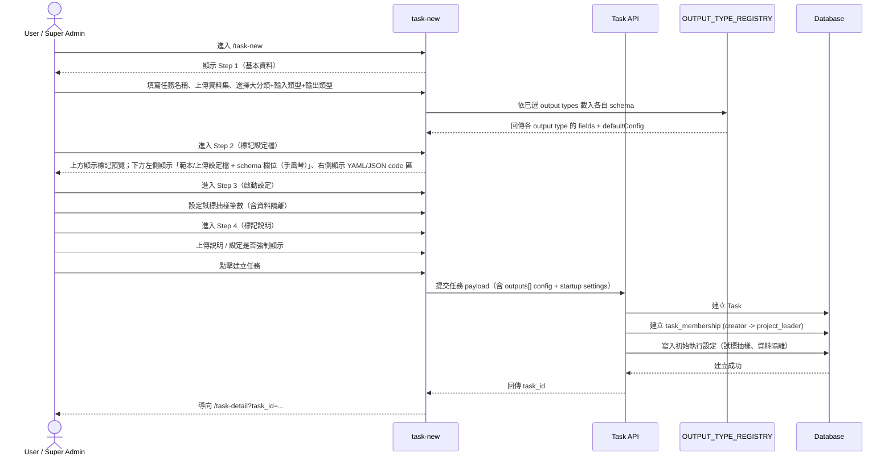
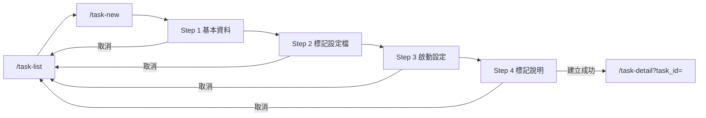

**需求來源**：IA Spec 清單 #013 — 新增任務（Step 1–4 + 啟動設定 + 標記設定檔 全任務類型）（`task-new`）

# 功能規格：New Task — 新增任務（Step 1–4 + 啟動設定 + 標記設定檔）

## 輸入與生成規則

**輸入描述**：本規格需定義 New Task 的任務管理流程、task config 契約、成員/執行狀態、導頁、i18n 與 RWD 行為。

**產生規格時必須遵守**：

1. 先確認本規格範圍與需求來源一致：IA Spec 清單 #013 — 新增任務（Step 1–4 + 啟動設定 + 標記設定檔 全任務類型）（task-new）。
2. 若新增或改動角色權限、導頁、資料欄位、錯誤狀態、i18n、可存取屬性或響應式邊界，必須同步檢查使用者情境、功能需求、成功標準與規格相依性。
3. 若需求描述缺少角色、狀態、資料來源、權限、錯誤處理、導頁目標或量化門檻，需以待釐清標記記錄具體問題，不得自行假設。
4. 規格應描述使用者可觀察行為、業務規則與驗收條件；避免描述框架、檔案結構、API 實作或資料庫實作，除非該內容本身是已定義的產品契約。
5. 本規格若與 prototype、IA 或上游規格不一致，必須明確記錄差異、更新相依性，並新增 changelog。

**已釐清事項**：

- 本版以既有需求來源與本文件中的 流程圖、使用者情境、功能需求、成功標準 作為 scope baseline。
- 跨頁或跨模組共用行為需透過「規格相依性」追蹤，不在本文件中隱含建立未列出的依賴。
- 若後續新增實作層契約，需先確認是否構成行為變更；若是，必須依 SDD 流程更新 spec。
- **v3.0.0 架構轉型**：本版依 ADR-029 將固定 `TASK_TYPE_ENUM` 替換為可組合的 `outputs[]` 模型。任務不再對應單一固定型別，而是由使用者從 `OUTPUT_TYPE_REGISTRY` 中選擇一至多個輸出類型組合而成。

## 規格常數

- `SYSTEM_ROLES = user | super_admin`
- `TASK_ROLES = project_leader | reviewer | annotator`
- `TASK_CREATION_STEPS = step-1-basic | step-2-config-builder | step-3-startup-settings | step-4-guideline`
- `TASK_CATEGORIES = classification | regression | sequence | generation`
- `TASK_INPUT_TYPES = single_item | item_pair`
- `OUTPUT_TYPE_KEYS = token_class | boundary | span | relation_triple | single_label | multi_label | entity_relation | single_dim | multi_dim | free_text`

  | 大分類 | 對應輸出類型 |
  |--------|-------------|
  | `classification` | `single_label` · `multi_label` · `entity_relation`† |
  | `regression` | `single_dim` · `multi_dim` |
  | `sequence` | `token_class` · `boundary` · `span` · `relation_triple` |
  | `generation` | `free_text` |

- `OUTPUT_TYPE_INPUT_CONSTRAINTS`：`entity_relation` 僅在輸入類型為 `item_pair` 時可選（†）
- `OUTPUT_TYPE_DEPENDENCIES`：`relation_triple` 依賴 `span`（當兩者同時被選取時，預覽與 config 須合併為整合模式）
- `OUTPUT_TYPE_FIELD_TYPES = entity-list | tag-list | select | number | text | boolean | va-dimensions`
- `TASK_CONFIG_MODES = visual | code`
- `CONFIG_FORMATS = yaml | json`
- `CONFIG_UPLOAD_FORMATS = yaml | yml | json`
- `TASK_CREATOR_SYSTEM_ROLES = user | super_admin`
- `DATASET_UPLOAD_FORMATS = json`
- `DATASET_MAX_FILE_SIZE_MB = 200`
- `DATASET_ENCODING = utf-8`
- `FIELD_ROLES = evidence | input | output`（欄位角色；未指定角色的欄位不納入 config）
- `GUIDELINE_FORMATS = pdf | image | markdown`
- `GUIDELINE_IMAGE_FORMATS = png | jpg | jpeg | webp`
- `RUN_INIT_SAMPLING_MODE = by_count`
- `RUN_INIT_COUNT_MIN = 1`
- `RUN_ISOLATION_DEFAULT = enabled`
- `SAMPLING_DEFAULTS_BY_CATEGORY` — 各大分類的試標預設參數表（見下方）

| 大分類 | 建議 IAA | Std 上限 | 最少標記者數 | 試標比例參數（用於換算預設筆數） |
| --- | --- | --- | --- | --- |
| `classification` | 0.75 | — | 3 | 12% |
| `regression` | 0.75 | 0.10 | 5 | 15% |
| `sequence` | 0.82 | — | 3 | 15% |
| `generation` | 0.70 | — | 3 | 18% |

> **注意**：`試標比例參數` 僅作為系統換算預設抽樣筆數之用（`round(dataset_total × trialPercent / 100)`），UI 不暴露百分比模式，使用者僅輸入筆數。當使用者選擇多個大分類時，取最高試標比例參數。

- `IDEMPOTENCY_WINDOW_HOURS = 24`
- `MOBILE_BP = 767px`
- `RWD_VIEWPORTS = 375px / 768px / 1440px`

## 流程圖


```mermaid
sequenceDiagram
    actor U as User / Super Admin
    participant UI as task-new
    participant API as Task API
    participant Registry as OUTPUT_TYPE_REGISTRY
    participant DB as Database

    U->>UI: 進入 /task-new
    UI-->>U: 顯示 Step 1（基本資料）

    U->>UI: 填寫任務名稱、上傳資料集、選擇大分類+輸入類型+輸出類型
    UI->>Registry: 依已選 output types 載入各自 schema
    Registry-->>UI: 回傳各 output type 的 fields + defaultConfig

    U->>UI: 進入 Step 2（標記設定檔）
    UI-->>U: 上方顯示標記預覽；下方左側顯示「範本/上傳設定檔 + schema 欄位（手風琴）」、右側顯示 YAML/JSON code 區

    U->>UI: 進入 Step 3（啟動設定）
    U->>UI: 設定試標抽樣筆數（含資料隔離）

    U->>UI: 進入 Step 4（標記說明）
    U->>UI: 上傳說明 / 設定是否強制顯示

    U->>UI: 點擊建立任務
    UI->>API: 提交任務 payload（含 outputs[] config + startup settings）
    API->>DB: 建立 Task
    API->>DB: 建立 task_membership (creator -> project_leader)
    API->>DB: 寫入初始執行設定（試標抽樣、資料隔離）
    DB-->>API: 建立成功
    API-->>UI: 回傳 task_id
    UI-->>U: 導向 /task-detail?task_id=...
```

| 步驟 | 角色 | 動作 | 系統回應 |
|------|------|------|---------|
| 1 | `user` / `super_admin` | 進入 `/task-new` | 顯示 Step 1 基本資料 |
| 2 | `user` / `super_admin` | 選擇大分類、輸入類型與輸出類型 | 依 `OUTPUT_TYPE_REGISTRY` 載入各輸出類型的 schema |
| 3 | `user` / `super_admin` | 完成 Step 2 標記設定檔 | 產生可提交的 `outputs[]` config |
| 4 | `user` / `super_admin` | 完成 Step 3 啟動設定 | 記錄初始抽樣方式設定 |
| 5 | `user` / `super_admin` | 完成 Step 4 標記說明設定（可略過） | 記錄說明資產與強制顯示設定 |
| 6 | `user` / `super_admin` | 建立任務 | 建立 task、creator 的 `project_leader` membership、初始執行設定 |
| 7 | `user` / `super_admin` | 取消建立流程 | 導回 `/task-list` |

---

## 使用者情境與測試 *(必填)*

### 使用者故事 1 — 完成 4 步驟任務建立流程（優先級：P1）

使用者可透過 Step 1 → Step 2 → Step 3 → Step 4 完成任務建立，並在成功後進入任務詳情頁。

**此優先級原因**：建立任務是整個任務生命週期的起點。
**獨立測試方式**：依序填完四步驟並提交，驗證建立成功、導頁、membership 建立。

**驗收情境**：

1. **Given** 已登入且可使用任務管理模組，**When** 完成 Step 1~4 並提交，**Then** 成功建立任務且導向 `/task-detail?task_id=...`。
2. **Given** 建立成功，**When** 檢查任務成員資料，**Then** 建立者自動有一筆 `project_leader` 的 `task_membership`。
3. **Given** 正在建立流程中，**When** 點擊取消，**Then** 導回 `/task-list` 且不建立任務。

**介面定義（需與 IA 導覽語意一致）**：

- Step 1：`基本資料`
  - 必要欄位：`task_name`、`dataset_file`、`task_type`（三組 chip）
  - `task_name`：
    - 單行文字輸入框，附字數計數器（上限 100 字）
  - `dataset_file`：
    - 上傳區：拖曳或點擊上傳，僅支援 `.json`（`DATASET_UPLOAD_FORMATS`），單檔上限 `DATASET_MAX_FILE_SIZE_MB`（200 MB），編碼 `DATASET_ENCODING`（UTF-8）
    - 支援多檔選取與拖曳；上傳成功後 upload zone 持續可見，可繼續追加檔案
    - 每個已上傳檔案獨立一列，顯示：檔名 · 檔案大小 · 預覽按鈕（眼睛圖示） · 移除按鈕（×）
    - 點擊預覽按鈕或檔案列開啟 Modal，顯示前 10 筆原始資料（唯讀）；Modal 可由關閉按鈕或 overlay 關閉
    - 追加檔案時須驗證 JSON key 集合與已上傳一致，不一致則阻擋並顯示提示（FR-002d）
    - **嵌入式欄位預覽表格**（上傳成功後即時顯示，無需點擊觸發）：
      - 顯示前 2 筆資料列，欄位標頭為原始 JSON key 名稱（不做中文轉換）
      - 每個欄位標頭下方提供角色下拉選單：`Evidence（背景）` · `Input（輸入）` · `Output（輸出）` · `— 不使用 —`
      - 預設全部欄位為「不使用」；重新上傳或移除檔案後角色重設為「不使用」
      - 角色指定結果以 `field_role_map: Record<string, FieldRole>` 傳入建立任務 payload；僅含已指定角色的欄位
  - `task_type`：三組 chip
    - 大分類（可多選，`role="checkbox"`）
      - `分類 Classification`
      - `回歸 Regression`
      - `序列 Sequence`
      - `生成 Generation`
    - 輸入類型（單選，`role="radio"`，互斥）
      - `單一項目`
      - `項目對`
    - 輸出類型（cascade 過濾，組內單選 `role="radio"`，跨組可多選）

      | 大分類 | 輸出類型 |
      |--------|----------|
      | 分類 | `單一標籤` · `多標籤` · `實體關係標籤` |
      | 回歸 | `單維度` · `多維度` |
      | 序列 | `Token 分類` · `邊界偵測` · `區間標記` · `關係三元組` |
      | 生成 | `自由文字` |

    - cascade 行為：未選大分類 → 顯示「請先選擇大分類」；選 1 個 → 直接顯示輸出類型（無分組標題）；選 2+ 個 → 依大分類分組顯示並加子標題；取消大分類 → 該組輸出類型消失且已選項自動取消
    - 輸入類型約束：`實體關係標籤`（`entity_relation`）僅在輸入類型為 `項目對` 時出現於分類組；選擇 `單一項目` 時該選項不可見
  - `下一步` 啟用條件：`task_name` 非空 ∧ 至少選擇一個輸出類型 ∧ dataset 檔案通過格式/大小/編碼檢查 ∧ Input 欄位數量符合輸入類型（`single_item` 須恰好 1 個、`item_pair` 須恰好 2 個）
- Step 2：`標記設定檔`
  - 佈局：上方標記預覽區、下方左側「範本/上傳設定檔 + schema 設定區」、下方右側 code 區
  - 範本/上傳設定檔區塊：
    - 範本按鈕：依已選 output types 提供預設模板，點擊即載入
    - 上傳設定檔：支援 `CONFIG_UPLOAD_FORMATS`（yaml / yml / json），載入至 code 區由使用者手動儲存套用
  - schema 設定區（手風琴佈局）：
    - 無論選擇單一或多個輸出類型，每個輸出類型均以**手風琴面板**呈現，面板標題顯示序號與輸出類型名稱
    - 手風琴面板可展開/收合；面板內部由 `OUTPUT_TYPE_REGISTRY` 動態生成對應的設定欄位
    - 存在相依關係的輸出類型（如 `relation_triple` 依賴 `span`），面板標題附帶相依提示
    - 各輸出類型設定欄位的 `entity-list` 新增按鈕文字需依語境顯示（如「新增標籤」、「新增實體類型」、「新增關係標籤」）
  - code 區：可編輯 YAML/JSON，提供格式切換與 `儲存` 按鈕；schema 設定與 code 區同步同一份 config
  - 標記預覽區：
    - 已上傳資料集時，預覽顯示資料集的實際文字內容；未上傳時顯示預設範例文字
    - 每個輸出類型必須有獨立的互動式預覽，使用者可直接操作體驗標記方式（見 FR-003g）
    - 存在相依關係的輸出類型（如 `span` + `relation_triple`）合併為整合預覽
    - 獨立輸出類型之間以分隔線區隔
  - `下一步` 啟用條件：所有輸出類型的 schema 必填欄位全部通過 ∧ 無 parser/schema error ∧ code 區無未儲存變更
- Step 3：`啟動設定`
  - 提示文案：「任務建立後再至 task-detail 邀請標記員與審核員」（本步驟不提供成員管理）
  - `每回合抽樣筆數`：數字輸入框，抽樣模式固定 `by_count`；初始值依 `SAMPLING_DEFAULTS_BY_CATEGORY` 自動帶入（`round(dataset_total × trialPercent / 100)`）；驗證：`≥ RUN_INIT_COUNT_MIN` 且 `< 資料集總筆數`
  - 資料隔離開關：toggle，預設 `RUN_ISOLATION_DEFAULT`（enabled），附說明文字
  - `下一步` 啟用條件：抽樣筆數通過驗證
- Step 4：`標記說明`（選填，未填寫亦可提交）
  - `標記員說明` 區塊：
    - `標記說明內容` textarea（可獨立於附件存在）
    - 附件上傳：支援多檔（`GUIDELINE_FORMATS`：pdf / image / markdown），逐檔移除
  - `審核員說明` 區塊：
    - `審核說明內容` textarea（可獨立於附件存在）
    - 附件上傳：與標記員附件獨立，同樣支援多檔與逐檔移除
  - `開始標記前強制顯示` toggle：啟用時 annotation-workspace 於同一使用者首次進入該任務時顯示說明彈窗（確認後不重複顯示）
  - `建立任務` 按鈕：永遠可見（Step 4 為選填）
- 操作列：`上一步` · `下一步` · `取消` · `建立任務`（僅 Step 4 顯示）
  - 任一步驟點擊 `取消` 或離頁（側欄跳轉、重新整理、關閉分頁），若已有變更需顯示「離開將遺失未儲存內容」確認視窗
  - 驗證錯誤：欄位下方 inline message + 頁首 toast，訊息指出欄位名稱與修正方向

**行為規則**：

- 僅 `TASK_CREATOR_SYSTEM_ROLES` 可進入 `/task-new` 並提交建立任務。
- 未完成當前步驟必要欄位不得進入下一步。
- Step 3 必須完成首次啟動設定（抽樣方式）才可進入 Step 4。
- 建立成功前不得寫入正式任務資料。
- 建立成功後導向 `task-detail`，L0 active 保持「任務管理」。

**Prototype 互動規格（本版必做）**：

- Step 1 `下一步` 按鈕預設 disabled；當且僅當 `task_name` 非空、至少選擇一個輸出類型、dataset 檔案通過格式/大小/編碼檢查、且 Input 欄位數量符合輸入類型要求（`single_item` 恰好 1 個 Input、`item_pair` 恰好 2 個 Input）後 enabled。
- Step 1 dataset 上傳成功後不得隱藏 upload zone；upload zone 需持續可見，讓使用者可繼續追加多個資料集檔案；每個已上傳檔案在下方獨立一列顯示，各列含移除按鈕可單獨刪除；所有上傳檔案視為同一資料集的集合。
- Step 2 `下一步` 按鈕預設 disabled；所有輸出類型的 schema 必填欄位通過且無 parser/schema error 才 enabled。
- Step 2 在 code 有未儲存變更時，`下一步` 必須維持 disabled 並提示先儲存；不得自動覆寫/自動儲存 code。
- Step 3 `下一步` 按鈕預設 disabled；試標初始化設定通過驗證後才 enabled。
- Step 4 時操作列的 `下一步` 按鈕文字自動改為 `建立任務`（箭頭圖示隱藏），此按鈕永遠啟用；Step 4 為選填，未上傳說明也可提交。
- 任一步驟點擊 `取消` 或離開頁面（側欄跳轉、重新整理、關閉分頁）時，若已有變更需顯示「離開將遺失未儲存內容」確認視窗。
- 驗證錯誤顯示採欄位下方 inline message + 頁首 toast；訊息需指出欄位名稱與修正方向。

---

### 使用者故事 2 — 標記設定檔以 OUTPUT_TYPE_REGISTRY 驅動（優先級：P1）

Step 2 必須由 `OUTPUT_TYPE_REGISTRY` 驅動，每個輸出類型在 registry 中定義自己的 `fields`、`defaultConfig` 與欄位類型（`OUTPUT_TYPE_FIELD_TYPES`），不得把特定輸出類型的設定寫死在核心流程。

**此優先級原因**：符合架構要求「新增 output type 不需修改核心流程」（ADR-029）。
**獨立測試方式**：選擇不同輸出類型組合，驗證 UI 欄位與預覽由 registry 自動生成；左側 schema 與右側 code 內容一致。

**驗收情境**：

1. **Given** 在 Step 2 且已選擇一個或多個輸出類型，**When** 載入頁面，**Then** 每個輸出類型以手風琴面板呈現各自的 schema 設定欄位。
2. **Given** 在 Step 2，**When** 調整任一輸出類型的 schema 欄位，**Then** 右側 code 區需即時呈現等價 `outputs[]` 格式的 YAML/JSON config。
3. **Given** 在右側 code 區手動修改設定，**When** 點擊 `儲存`，**Then** 左側 schema 欄位需同步更新；無效設定需顯示錯誤。
4. **Given** 平台新增一種 output type 到 registry，**When** 使用者進入 Step 1/Step 2，**Then** 可選到該輸出類型並看到對應設定，無需變更核心流程。
5. **Given** 使用者在 Step 2 上傳 `.yaml/.yml/.json` 設定檔，**When** 讀取成功，**Then** code 區應載入檔案內容、切換對應格式並要求使用者按儲存套用。
6. **Given** 使用者切換語言（zh/en），**When** 當前 labels 仍為預設模板值，**Then** Step 2 預覽、schema 標籤與 code labels 應同步切換為對應語系文案。

**介面定義**：

- 區塊 A：`標記預覽（上方）`
  - 每個輸出類型有各自的互動式預覽區塊，使用者可直接操作體驗標記方式
  - 已上傳資料集時，預覽顯示資料集實際文字內容；未上傳時顯示預設範例文字
  - 指定為 `evidence` 角色的欄位不在標記預覽中顯示獨立區塊；Evidence 角色指定保留於 `field_role_map`（傳統 `sentence_pairs` 設定另記錄於 config 的 `evidence_fields`），其內容留待標記工作區呈現
  - 輸入文字區塊依輸入類型呈現：`single_item` 顯示 Input 欄位名稱標籤 + 單一文字區塊；`item_pair` 顯示兩個帶欄位名稱標籤的文字區塊，呈現配對輸入
  - 輸入文字區塊位於所有輸出類型預覽之上方
  - 存在相依關係的輸出類型合併為整合預覽（如 `span` + `relation_triple` 合併為含圈選文字、實體列表、關係建構器的統一介面）
  - 各輸出類型的預覽互動方式：

    | 輸出類型 | 預覽互動方式 |
    |----------|-------------|
    | `token_class` | 標籤類型按鈕列 + 可點擊 token 網格（點擊 token 上 BIO 標記）+ 標記方案顯示 |
    | `boundary` | 邊界類型選擇器 + 文段間隙可點擊插入/移除邊界標記（✂） |
    | `span` | 圈選文字建立實體 + 實體類型按鈕列 + 實體列表（含位置與刪除） |
    | `relation_triple` | 文字顯示 + E1/Relation/E2 下拉選單建構器 + 三元組列表（含刪除） |
    | `single_label` | 文字顯示 + radio 風格可點選標籤 chip（單選） |
    | `multi_label` | 文字顯示 + checkbox 風格可點選標籤 chip（多選）+ 已選顯示 |
    | `entity_relation` | 實體配對卡片（E1 ↔ E2）+ 可點選關係標籤 chip |
    | `single_dim` | 文字顯示 + 維度名稱 + 可拖曳滑桿（含 min/max/當前值） |
    | `multi_dim` | 文字顯示 + 多維度各自獨立可拖曳滑桿（含 min/max/當前值標籤） |
    | `free_text` | 文字顯示 + 可編輯 textarea（含字數計數器）；啟用參考答案時顯示參考區塊 |

- 區塊 B：`設定區（下方左側）`
  - 「從範本開始或者上傳設定檔」區塊置於最上方
  - 每個輸出類型以手風琴面板呈現，面板標題含序號與輸出類型名稱，可展開/收合
  - 面板內由 registry 動態生成欄位，支援 7 種欄位類型（`OUTPUT_TYPE_FIELD_TYPES`）：
    - `entity-list`：可新增/刪除的 `{ name, color }[]` 列表，每列含色點、名稱輸入框與移除按鈕；新增按鈕文字依語境顯示
    - `tag-list`：可輸入的標籤列表，按 Enter 新增，各標籤可個別移除
    - `select`：下拉選單
    - `number`：數字輸入框（含 min/max 限制）
    - `text`：單行文字輸入框
    - `boolean`：toggle 開關
    - `va-dimensions`：維度卡片列表，每張卡片含維度名稱 + min/max/step 三欄，可新增/刪除維度
  - 各輸出類型的 registry 欄位定義：

    | 輸出類型 | 欄位 | 類型 | 必填 |
    |----------|------|------|------|
    | `token_class` | `entities`（標籤類型） | `entity-list` | 是 |
    | `token_class` | `tagging_scheme`（標記方案） | `select`（BIO/BIOES/IOB2） | 是 |
    | `boundary` | `boundary_types`（邊界類型） | `tag-list` | 是 |
    | `span` | `entities`（實體類型） | `entity-list` | 是 |
    | `span` | `allow_overlapping`（允許重疊標記） | `boolean` | 否 |
    | `relation_triple` | `relation_types`（關係類型） | `tag-list` | 是 |
    | `single_label` | `label_options`（標籤選項） | `entity-list` | 是 |
    | `multi_label` | `label_options`（標籤選項） | `entity-list` | 是 |
    | `multi_label` | `max_selections`（最多可選數量） | `number` | 否 |
    | `entity_relation` | `label_options`（關係標籤） | `entity-list` | 是 |
    | `single_dim` | `dimension_name`（維度名稱） | `text` | 是 |
    | `single_dim` | `min` / `max` / `step` | `number` | 是 |
    | `multi_dim` | `dimensions`（維度列表） | `va-dimensions` | 是 |
    | `free_text` | `max_length`（最大字數） | `number` | 否 |
    | `free_text` | `show_reference`（顯示參考答案） | `boolean` | 否 |

- 區塊 C：`Code 區（下方右側）`
  - 必要元素：YAML/JSON 切換、可編輯區、`儲存` 按鈕、格式與 schema 驗證結果
  - code 輸出格式遵循 ADR-029 `outputs[]` 結構：

    ```yaml
    input_type: single_item
    outputs:
      - type: <output_type_key>
        config:
          <field_key>: <value>
    ```

**行為規則**：

- 輸出類型選項來源必須為 `OUTPUT_TYPE_REGISTRY`，而非前端硬編碼清單。
- 左側 schema 欄位與右側 code 區需共享同一份結構化 config source-of-truth。
- 提交前需通過所有輸出類型的 schema 驗證；任一失敗不得進入任務建立 API。
- schema 欄位變更時，右側 code 區需輸出最新 `outputs[]` 格式的 YAML/JSON。
- 上方預覽需呈現每個輸出類型的互動式標記體驗，並隨 schema 欄位變更即時更新。
- 預覽互動必須支援使用者實際操作（點擊、圈選、拖曳、輸入等），非僅靜態展示。
- 各輸出類型的預覽互動（如點擊標籤 chip 切換選取狀態）僅刷新該輸出類型的預覽區塊，不影響輸入文字與其他輸出類型的預覽內容。
- `entity-list` 欄位的新增按鈕文字必須依語境顯示（如 `single_label` 顯示「新增標籤」、`span` 顯示「新增實體類型」、`entity_relation` 顯示「新增關係標籤」、`token_class` 顯示「新增標籤類型」）。
- `multi_dim` 的維度設定為通用模式，使用者可自訂任意維度名稱與 min/max/step，不限於特定維度（如 VA）。
- 存在 `OUTPUT_TYPE_DEPENDENCIES` 的輸出類型（如 `span` + `relation_triple`）同時被選取時，預覽須合併為整合模式（含圈選文字建立實體、實體列表、關係建構器、三元組列表）。
- code 內容儲存成功後，左側 schema 欄位需即時重建並顯示更新結果；儲存失敗需顯示可定位錯誤且保留使用者輸入。
- 預覽文字來源：已上傳資料集時讀取實際欄位內容（依 `field_role_map` 中 `input` 角色的欄位），未上傳時顯示預設範例文字。
- 預覽狀態初始化：已上傳資料集且有 `output` 角色欄位時，各輸出類型的互動控制項以該欄位的實際值初始化（如預選標籤、設定滑桿值、預填文字）；output 欄位的 unique values 自動帶入分類型輸出類型的 `label_options`；output 欄位值為 JSON object 時自動建立 `multi_dim` 的維度列表。

---

### 使用者故事 3 — 啟動設定前置於任務建立（優先級：P1）

Project Leader 在建立任務時必須先完成啟動設定中的抽樣與資料隔離，成員邀請改於任務建立後在 task-detail 進行。

**此優先級原因**：避免建立完成後仍缺關鍵啟動條件，造成任務狀態與操作入口割裂。
**獨立測試方式**：於 Step 3 完成抽樣與資料隔離後建立任務，驗證任務詳情可直接讀取初始設定。

**驗收情境**：

1. **Given** 位於 Step 3，**When** 設定每回合抽樣筆數與資料隔離，**Then** 建立後可在 task-detail overview 看到一致的抽樣設定。
2. **Given** 位於 Step 3，**When** 抽樣設定無效，**Then** 不可進入 Step 4 並顯示可修正錯誤訊息。
3. **Given** 位於 Step 3，**When** 使用者查看啟動設定提示，**Then** 系統需明確說明成員邀請將在任務建立後於 task-detail 執行。

**行為規則**：

- Step 3 必須提供試標初始化：
  - 抽樣模式固定為 `RUN_INIT_SAMPLING_MODE`（`by_count`），UI 僅暴露筆數輸入
  - 抽樣驗證：筆數需 `>= RUN_INIT_COUNT_MIN` 且 `< 資料集總筆數`
  - 選定輸出類型後，預設值由 `round(dataset_total × trialPercent / 100)` 自動帶入（多個大分類時取最高比例）
  - 欄位文案必須明確為 `每回合抽樣筆數`
  - UI 不顯示抽樣分佈進度條，避免與 task-detail Overview「抽樣設定」的固定筆數模式不一致
- Step 3 資料隔離開關預設 `RUN_ISOLATION_DEFAULT`。
- Step 3 僅做首次初始化；成員邀請與後續調整由 `task-detail` 負責。

---

### 使用者故事 4 — 標記說明與強制顯示設定（優先級：P2）

Project Leader 在建立任務時可分別設定提供給標記員與審核員的說明資產，並決定 annotator 進入作業前是否強制顯示。

**此優先級原因**：可降低任務啟動時的學習成本與操作錯誤。
**獨立測試方式**：分別上傳標記員/審核員說明資產並啟用強制顯示，驗證設定儲存到任務並可供 annotation 模組使用。

**驗收情境**：

1. **Given** 位於 Step 4，**When** 分別填寫標記員或審核員說明並完成建立，**Then** 任務保存對應角色的說明內容與附件。
2. **Given** 位於 Step 4，**When** 啟用 `開始標記前強制顯示`，**Then** 任務設定需紀錄此旗標供 annotation-workspace 讀取。

**行為規則**：

- Step 4 應提供兩組角色分流的說明設定：
  - `標記員`：`標記說明內容` textarea + 獨立附件列表
  - `審核員`：`審核說明內容` textarea + 獨立附件列表
- 兩個角色區塊皆可單獨只填文字、只上傳檔案，或文字與檔案並行使用。
- 支援 `GUIDELINE_FORMATS`，其中 `image` 僅允許 `GUIDELINE_IMAGE_FORMATS`；超出格式需阻擋並提示。
- 兩個角色的附件上傳皆必須支援多檔。
- Step 4 為選填，不填仍可建立任務。
- 強制顯示設定預設為關閉。
- 當任務啟用 `開始標記前強制顯示` 時，annotation-workspace 應在「同一使用者首次進入該任務標記介面」時顯示任務說明彈窗；後續同任務 page reload 或再次進入不應重複彈出（除非已讀狀態被重置）。
- annotation-workspace 的「說明與檔案」面板中，點擊圖片檔案之 `預覽` 後，應在檔案列表下方的預覽區塊顯示該圖片內容。
- 在 mobile viewport 下，annotation-workspace 若右側「說明與檔案」區塊為收合狀態，主內容區仍須維持單欄滿寬，不得出現欄寬被壓縮或版面位移。

---

### 邊界情況

- 非 `TASK_CREATOR_SYSTEM_ROLES` 造訪 `/task-new`：導回允許入口並顯示無權限提示。
- 上傳資料集格式不是 `.json`（`DATASET_UPLOAD_FORMATS` 僅允許 JSON）：阻擋加入並顯示格式錯誤提示。
- 上傳資料集超過 `DATASET_MAX_FILE_SIZE_MB` 或非 `DATASET_ENCODING`：阻擋進下一步並顯示可定位錯誤。
- 追加上傳的資料集檔案與已上傳檔案的頂層 JSON key 集合不一致：阻擋該檔案加入並顯示欄位不一致提示；已通過驗證的其他檔案不受影響。
- 變更輸出類型選擇後已填 Step 2 設定不相容：移除已被取消選擇的輸出類型之 config，保留仍選中的輸出類型之 config。
- Code 區輸入非有效 YAML/JSON：保留輸入內容並顯示可定位錯誤。
- Step 3 `每回合抽樣筆數` 輸入為 `0`、負數、或 `>= 資料集總筆數`：阻擋進入 Step 4 並顯示修正提示。
- Step 4 僅填標記員說明、僅填審核員說明，或兩者皆空：皆視為合法；不得強制要求兩個角色都填。
- 任一輸出類型的 `entity-list` 或 `tag-list` 必填欄位為空或含空白項目：阻擋進入 Step 3 並顯示可定位錯誤。
- `multi_label` 設定 `max_selections` 大於 `label_options` 數量：顯示提示但不阻擋（視為「不限」語意）。
- `single_dim` 或 `multi_dim` 設定 `min >= max` 或 `step <= 0`：阻擋進入 Step 3 並顯示修正提示。
- `single_item` 輸入類型且欄位預覽中 Input 欄位數 ≠ 1，或 `item_pair` 輸入類型且 Input 欄位數 ≠ 2：阻擋進入 Step 2 並顯示修正提示（需指出正確數量）。
- 使用者在 Step 1~4 有變更後直接離頁：需先跳確認視窗，選擇「離開」才可導頁。
- 建立中（submit pending）重複點擊 `建立任務`：按鈕進入 loading 並禁止重複提交。
- 建立任務 API 成功但 membership 建立失敗：整體交易需回滾，避免孤兒任務。
- 網路中斷導致重送：同一 `Idempotency-Key` 於 `IDEMPOTENCY_WINDOW_HOURS` 內必須回傳同一 `task_id`，不得重複建立任務。

---

## 需求規格 *(必填)*

### 功能需求

- **FR-001**：系統必須提供 `/task-new` 四步驟建立流程（Step 1/2/3/4）。
- **FR-001a**：僅 `TASK_CREATOR_SYSTEM_ROLES` 可進入 `/task-new` 與呼叫建立任務 API。
- **FR-002**：Step 1 必須要求任務名稱、至少一個資料集檔案、至少一個輸出類型；未上傳任何資料集時不得進入下一步。輸出類型由三組 chip 決定（大分類可多選、輸入類型單選、輸出類型依大分類 cascade 過濾且跨組可多選）；選擇結果存為 `selectedOutputTypes[]`。
- **FR-002e**：Step 1 任務類型選擇器必須由 `OUTPUT_TYPE_REGISTRY` 動態萃取三組 chip。選擇語意如下：`大分類`（可多選，`role="checkbox"`）、`輸入類型`（單選，`role="radio"`，同一組互斥）、`輸出類型`（cascade 過濾，**組內單選、跨組可多選**，`role="radio"`）。大分類與輸入類型始終可見；**輸出類型依大分類 cascade 過濾**：未選任何大分類時，輸出類型區塊顯示灰色提示「請先選擇大分類」且不顯示任何 chip；選擇 1 個大分類時，直接顯示該分類對應的輸出類型（不加分組標題），同組內互斥（單選）；選擇 2 個以上大分類時，輸出類型依已選大分類**分組顯示**，每組加分類名稱作為子標題，**每組內互斥（單選），但跨組可各選一個**；取消某個大分類時，該組輸出類型消失且已選的該組項目自動取消。chip 標籤必須依 `state.lang` 顯示 zh/en 文案，語言切換時即時更新。此外，`entity_relation` 僅在輸入類型為 `item_pair` 時可選；切換至 `single_item` 時該選項自動移除。
- **FR-002a**：每個資料集檔案必須為 `.json` 格式（`DATASET_UPLOAD_FORMATS = json`），且符合 `DATASET_MAX_FILE_SIZE_MB`；非 JSON 格式的檔案須個別顯示錯誤並阻擋加入；已通過驗證的其他檔案不受影響。
- **FR-002b**：每個已上傳資料集檔案獨立一列，顯示眼睛預覽圖示與 × 移除按鈕；點擊該列（× 除外）或眼睛按鈕開啟 Modal，顯示前 10 筆原始資料預覽（欄位名稱 + 資料列）；Modal 提供關閉按鈕，點擊 overlay 亦可關閉；預覽為唯讀。系統將所有已上傳檔案合併視為同一資料集進行後續處理。
- **FR-002c**：資料集上傳成功後，系統必須在 Step 1 上傳區塊下方即時顯示一個**嵌入式資料預覽表格**，無需使用者點擊任何按鈕觸發。預覽表格呈現已上傳 JSON 資料的**前 2 筆資料列**，表格欄位標頭顯示原始 JSON key 名稱；**每個欄位標頭下方提供角色下拉選單**（`FIELD_ROLES`：`Evidence（背景）`、`Input（輸入）`、`Output（輸出）`，以及「不使用」），使用者可逐欄指定角色。欄位標頭直接顯示 JSON key 原始名稱（不做中文轉換）。
- **FR-002c-1**：欄位角色指定行為規則：預設全部欄位角色為「不使用」；重新上傳或移除檔案後，所有欄位角色重設為「不使用」；最終角色指定結果以 `field_role_map: Record<string, FieldRole>` 傳入建立任務 payload（僅包含已指定角色的欄位；未指定角色欄位不列入）。Evidence 與 Output 角色為 optional，全部留空代表不特別標記角色，所有欄位照常納入 config。**Input 角色受 FR-002c-2 約束**：當使用者已選定輸入類型時，Input 欄位數量必須符合該類型要求，否則阻擋進入 Step 2。
- **FR-002c-2**：當輸入類型為 `single_item` 時，`field_role_map` 中 `input` 角色欄位數量必須恰好為 1；當輸入類型為 `item_pair` 時，必須恰好為 2；不符合時阻擋進入 Step 2 並顯示修正提示。
- **FR-002c-3**：資料集解析時，array 型別欄位的各元素必須個別收集為該欄位的 unique values（例如 `["positive","negative"]` 應拆為 `positive`、`negative` 兩個 unique values），以支援 multi-label 等陣列型輸出欄位的自動解析。
- **FR-002d**：當使用者追加上傳資料集檔案時，系統必須驗證新檔案的頂層 JSON key 集合與已上傳檔案完全一致；不一致時阻擋加入並顯示欄位不一致提示，已上傳的其他檔案不受影響；嵌入式預覽表格必須於每次上傳成功後即時重新整理，顯示最新上傳檔案的前 2 筆資料。
- **FR-003**：Step 2 標記設定檔必須由 `OUTPUT_TYPE_REGISTRY` 驅動，每個輸出類型的 schema 欄位由 registry 定義。
- **FR-003a**：Step 2 必須採單頁佈局：上方標記預覽、下方左側 schema 設定區、下方右側 code 區。
- **FR-003a-1**：Step 2 左側必須先顯示「從範本開始或者上傳設定檔」區塊，再顯示 schema 設定欄位。
- **FR-003a-2**：Step 2 左側 schema 設定區必須採手風琴佈局，無論選擇單一或多個輸出類型，每個輸出類型均以獨立手風琴面板呈現，面板標題顯示序號與輸出類型名稱。
- **FR-003b**：schema 設定區與 code 區必須同步同一份 config，並在提交前通過所有輸出類型的 schema 驗證。
- **FR-003c**：新增 output type 應可透過 registry 擴充，不修改核心流程（Step 1–4）。
- **FR-003d**：`OUTPUT_TYPE_REGISTRY` 必須至少包含 10 種輸出類型：`token_class`、`boundary`、`span`、`relation_triple`、`single_label`、`multi_label`、`entity_relation`、`single_dim`、`multi_dim`、`free_text`。每種輸出類型需定義 `fields`（欄位清單）、`defaultConfig`（預設值）與 zh/en 顯示名稱。
- **FR-003d-1**：`token_class` 必須支援 `entities`（`{ name, color }[]`）與 `tagging_scheme`（`BIO | BIOES | IOB2`）。預覽：標籤類型按鈕列（含 `O` 標籤）+ 可點擊 token 網格，點擊 token 依當前選中標籤推斷 `B-`/`I-` 前綴。驗證：`entities` 不得為空且不得含空白項目。
- **FR-003d-2**：`boundary` 必須支援 `boundary_types`（string[]）。預覽：邊界類型選擇列 + 文段間隙可點擊按鈕（插入/移除邊界標記），底部顯示已標記數量。驗證：`boundary_types` 不得為空且不得含空白項目。
- **FR-003d-3**：`span` 必須支援 `entities`（`{ name, color }[]`）與 `allow_overlapping`（boolean）。預覽：文本區域可圈選文字建立實體 + 實體類型按鈕列 + 已標記實體列表（含類型 badge、文字、字元位置、刪除按鈕），已標記實體以對應顏色底線顯示。驗證：`entities` 不得為空且不得含空白項目。
- **FR-003d-4**：`relation_triple` 必須支援 `relation_types`（string[]），並宣告依賴 `span`（`OUTPUT_TYPE_DEPENDENCIES`）。預覽：三欄下拉選單（E1/Arg1、Relation、E2/Arg2）+ Add 按鈕 + 三元組列表（Subject → Relation badge → Object，含刪除按鈕）。預覽初始化需支援多種三元組欄位名稱（`gold_triples`、`gold_triplets`、`triples`）與格式（`{subj, rel, obj}` 及 `{entity1, relation, entity2}`）。驗證：`relation_types` 不得為空且不得含空白項目。
- **FR-003d-5**：`single_label` 必須支援 `label_options`（`{ name, color }[]`）。預覽：文字區塊 + radio 風格 chip 按鈕（互斥單選，點擊切換）。驗證：`label_options` 不得為空且不得含空白項目。
- **FR-003d-6**：`multi_label` 必須支援 `label_options`（`{ name, color }[]`）與 `max_selections`（number，0 = 不限）。預覽：文字區塊 + checkbox 風格 chip 按鈕（可多選），下方顯示已選數量。驗證：`label_options` 不得為空且不得含空白項目。
- **FR-003d-7**：`entity_relation` 必須支援 `label_options`（`{ name, color }[]`）。預覽：兩張實體卡片（E1 ↔ E2，含雙向箭頭）+ 關係標籤 chip 按鈕（互斥單選）。驗證：`label_options` 不得為空且不得含空白項目。
- **FR-003d-8**：`single_dim` 必須支援 `dimension_name`（text）、`min`/`max`/`step`（number）。預覽：文字區塊 + 維度名稱 + 可拖曳 range slider（含 min/max/當前值標籤）。驗證：`min` < `max`、`step` > `0`。
- **FR-003d-9**：`multi_dim` 必須支援 `dimensions`（`{ name, min, max, step }[]`），使用者可自訂任意維度名稱與範圍，不限於特定維度。預覽：每個維度以獨立區塊呈現維度名稱與**可拖曳** range slider（含 min/max 標籤與即時更新的當前值標籤）；無維度時顯示提示。驗證：至少一個維度、每個維度 `min` < `max` 且 `step` > `0`。
- **FR-003d-10**：`free_text` 必須支援 `max_length`（number）與 `show_reference`（boolean）。預覽：文字區塊 + textarea（含字元計數 `N / max_length`）；textarea 標題優先顯示 output 欄位原始名稱，無 output 欄位時顯示「回答」/「Answer」。`show_reference = true` 時額外顯示參考答案區塊，已上傳資料集且有 output 欄位時顯示該欄位實際值，否則顯示佔位提示文字。驗證：`max_length` > `0`。
- **FR-003d-11**：當 `selectedOutputTypes` 同時包含具依賴關係的輸出類型（如 `span` + `relation_triple`）時，預覽區必須以統一模式呈現：共用同一份文本，使用者在文本上圈選產生 span 實體，下方建立 relation triple；實體列表與三元組列表合併呈現。其他非依賴鏈的輸出類型以獨立區塊各自渲染。
- **FR-003d-12**：Step 2 左側 schema 設定區每個輸出類型均以獨立手風琴面板呈現；選中超過 2 個時僅第一個面板預設展開，其餘預設收合；面板標題可點擊切換展開/收合。有依賴關係時，面板標題下方必須顯示依賴提示。
- **FR-003d-13**：輸出類型依賴處理規則：新增 `relation_triple` 時若 `span` 未被選中，系統必須自動將 `span` 加入 `selectedOutputTypes`；取消選擇 `span` 時，必須一併取消依賴 `span` 的所有輸出類型（如 `relation_triple`）。
- **FR-003e**：code 區必須支援可編輯 YAML/JSON，並提供 `儲存` 操作以套用回 schema 設定欄位。
- **FR-003f**：當 code 區有未儲存變更且使用者嘗試進入下一步時，系統必須阻擋前進並提示先儲存；不得自動儲存。
- **FR-003g**：Step 2 上方必須提供每個輸出類型的互動式標記預覽區，使用者可實際操作體驗標記方式（點擊、圈選、拖曳、輸入等），且在設定變更時即時同步更新。
- **FR-003g-1**：預覽文字來源：已上傳資料集時讀取 `field_role_map` 中 `input` 角色欄位的實際內容；未上傳時顯示各輸出類型的預設範例文字。
- **FR-003g-2**：Step 2 標記預覽區不得為 `evidence` 角色欄位顯示獨立卡片或區塊（所有輸出類型一致）；Evidence 角色指定保留於 `field_role_map`（傳統 `sentence_pairs` 設定另將欄位記錄於 config 的 `evidence_fields`），其內容留待標記工作區呈現。
- **FR-003g-3**：Step 2 標記預覽區的輸入文字須依輸入類型呈現：`single_item` 顯示 Input 欄位名稱標籤與單一文字區塊；`item_pair` 顯示兩個帶欄位名稱標籤的文字區塊。輸入文字位於輸出類型預覽之前。
- **FR-003g-4**：各輸出類型的預覽互動（如點擊標籤 chip）僅刷新該輸出類型的預覽區塊，不影響輸入文字與其他輸出類型的預覽。
- **FR-003g-5**：當 `field_role_map` 中存在 `output` 角色欄位時，Step 2 各輸出類型的預覽互動控制項必須以該欄位的實際資料值初始化預覽狀態：`single_label` / `entity_relation` 預選匹配的標籤；`multi_label` 預選匹配的多個標籤；`single_dim` 滑桿設於實際分數值；`multi_dim` 各維度滑桿設於對應維度值；`token_class` 以實際 BIO 標記初始化 token 標記；`boundary` 以實際邊界位置初始化邊界標記；`free_text` 預填實際答案文字；`span` 以實際實體列表初始化；`relation_triple` 以實際三元組初始化。無 output 欄位時維持預設值。
- **FR-003g-6**：當 `output` 角色欄位的 unique values 存在時，`single_label`、`multi_label`、`entity_relation` 的 `label_options` 必須自動從該欄位的 unique values 帶入（每個 unique value 對應一筆 `{ name, color }`），免除使用者手動新增；已自動帶入後不重複執行。
- **FR-003g-7**：當 `output` 角色欄位的首筆資料為 JSON object（非 array）時，`multi_dim` 的 `dimensions` 必須自動從該 object 的 keys 建立維度列表（每個 key 對應一筆 `{ name, min, max, step }`），免除使用者手動新增；已自動帶入後不重複執行。
- **FR-003h**：Step 2 必須支援上傳 `CONFIG_UPLOAD_FORMATS` 設定檔，載入至 code 區並由使用者手動儲存套用。
- **FR-003i**：Step 2 預設模板需支援 i18n（至少 zh/en）；切換語言時，若 code 區無未儲存變更（`codeDraftDirty = false`）且使用中為預設 labels，需同步轉換為對應語言 labels；若有未儲存變更則不自動覆寫，保留使用者手動修改。
- **FR-004**：Step 3 必須支援啟動設定，包含抽樣方式與資料隔離。
- **FR-004a**：Step 3 不提供任務成員加入功能；介面必須明確提示使用者於任務建立後到 `task-detail` 進行成員邀請。
- **FR-004c**：Step 3 必須提供試標初始化，抽樣模式固定為 `RUN_INIT_SAMPLING_MODE`（`by_count`）；初始值應依 `SAMPLING_DEFAULTS_BY_CATEGORY` 對應大分類自動帶入，換算公式為 `round(dataset_total × trialPercent / 100)`；多個大分類時取最高比例。
- **FR-004c-1**：選擇輸出類型後，Step 3 的 `每回合抽樣筆數` 必須自動預填換算後的預設筆數。
- **FR-004d**：試標抽樣驗證：筆數 `>= RUN_INIT_COUNT_MIN` 且 `< 資料集總筆數`。
- **FR-004d-1**：Step 3 抽樣設定欄位文案必須明確為 `每回合抽樣筆數`，且 UI 不提供抽樣分佈進度條或百分比分配視覺化。
- **FR-004e**：Step 3 必須提供資料隔離開關，預設值為 `RUN_ISOLATION_DEFAULT`。
- **FR-005**：Step 4 必須支援標記說明資產上傳與強制顯示設定。
- **FR-005a**：Step 4 指南格式必須支援 `GUIDELINE_FORMATS`，其中 `image` 受限於 `GUIDELINE_IMAGE_FORMATS`。
- **FR-005b**：Step 4 必須提供 `標記說明內容` 與 `審核說明內容` 兩個可直接編輯的說明欄位，且各自皆可獨立於上傳檔案存在。
- **FR-005b-1**：Step 4 必須提供兩組彼此獨立的附件上傳區塊：`標記員附件` 與 `審核員附件`；兩組皆支援多檔上傳、逐檔移除與各自獨立清單。
- **FR-005c**：當 `force_guideline = true` 時，annotation-workspace 僅在同一使用者首次進入該任務時顯示說明彈窗；已確認閱讀後不得於每次 page load 重複顯示。
- **FR-005d**：annotation-workspace 的「說明與檔案」面板中，點擊圖片檔案之 `預覽` 後，系統必須在檔案列表下方預覽區塊顯示該圖片。
- **FR-006**：提交成功後，系統必須建立任務並導向 `/task-detail`。
- **FR-006a**：任務建立成功時，系統必須自動建立一筆 `task_membership`，並將建立者設為 `project_leader`。
- **FR-006c**：若 Step 3 已設定抽樣方式，系統必須於任務建立時一併保存。
- **FR-006d**：建立任務 API 必須支援 `Idempotency-Key`；同一 key 在 `IDEMPOTENCY_WINDOW_HOURS` 內重送時回傳同一 `task_id`。
- **FR-007**：取消建立流程時，系統必須導回 `/task-list` 且不寫入任務。
- **FR-007a**：使用者在任一步驟已有未儲存變更時，離頁前必須顯示確認視窗（含取消建立、側欄跳頁、重新整理、關閉分頁）。
- **FR-008**：頁面必須支援 `RWD_VIEWPORTS`，在 `<= MOBILE_BP` 仍可完成四步流程。
- **FR-008a**：在 `375px`、`768px`、`1440px` 三個 viewport，必須可完成：Step 1 填寫與驗證、Step 2 預覽/設定/code 編輯與驗證、Step 3 抽樣與資料隔離設定、Step 4 上傳或略過、建立成功導頁、取消返回。
- **FR-008c**：在 mobile viewport 下，annotation-workspace 右側說明區塊收合後，主內容區必須維持單欄滿寬佈局，不得因收合狀態套用桌面欄位寬度造成跑版。
- **FR-008d**：頁面必須支援 `prefers-reduced-motion: reduce`，啟用時所有過渡動畫降至最低。
- **FR-008e**：頁面必須支援深色模式（`data-theme="dark"`），所有表單元素、卡片、預覽區域、步驟指示器皆須正確適配暗色配色。
- **FR-009**：輸出類型組合需覆蓋研究生現行任務情境：情感分類（`single_label`）、多標籤分類（`multi_label`）、多維度評分（`multi_dim`）、區間標記（`span`）、關係抽取（`span` + `relation_triple`）、自由文字（`free_text`）。

### 使用者流程與導頁


```mermaid
flowchart LR
    tasklist["/task-list"] --> tasknew["/task-new"]
    tasknew --> step1["Step 1 基本資料"]
    step1 --> step2["Step 2 標記設定檔"]
    step2 --> step3["Step 3 啟動設定"]
    step3 --> step4["Step 4 標記說明"]
    step4 -->|建立成功| taskdetail["/task-detail?task_id="]
    step1 -->|取消| tasklist
    step2 -->|取消| tasklist
    step3 -->|取消| tasklist
    step4 -->|取消| tasklist
```

| From | Trigger | To |
|------|---------|-----|
| `/task-list` | 點擊 `新增任務` | `/task-new` |
| Step 1 | 點擊 `下一步`（驗證通過） | Step 2 |
| Step 2 | 點擊 `下一步`（驗證通過） | Step 3 |
| Step 3 | 點擊 `下一步`（驗證通過） | Step 4 |
| Step 4 | 點擊 `建立任務`（提交成功） | `/task-detail?task_id=...` |
| 任一步驟 | 點擊 `取消` | `/task-list` |

**Entry points**：`/task-list` 的 `新增任務` CTA。
**Exit points**：建立成功進 `/task-detail`、取消返回 `/task-list`。

---

### 關鍵實體

- **TaskDraftInput**：建立任務輸入草稿。欄位：`task_name`、`dataset`、`input_type`（`TASK_INPUT_TYPES`）、`selected_categories[]`（`TASK_CATEGORIES`）、`outputs[]`（`OutputConfig[]`，每項含 `type` + `config`）、`field_role_map: Record<string, FieldRole>`、`run_init`、`annotator_guideline_text`、`annotator_guideline_assets[]`、`reviewer_guideline_text`、`reviewer_guideline_assets[]`、`force_guideline`。
- **OutputConfig**：單一輸出類型設定。欄位：`type`（`OUTPUT_TYPE_KEYS` 之一）、`config`（由該 output type 的 registry fields 定義的 key-value 物件）。
- **FieldRole**：`'evidence' | 'input' | 'output'`。
- **OutputTypeRegistryItem**：輸出類型 registry 定義。欄位：`key`（`OUTPUT_TYPE_KEYS`）、`zh` / `en`（顯示名稱）、`source_output`（相依的輸出類型或 null）、`fields[]`（schema 欄位定義，每項含 key / type / zh / en / required / addLabel_zh / addLabel_en / options[] / defaultValue / placeholder_zh / placeholder_en / hint_zh / hint_en）、`defaultConfig`（預設值物件）。
- **TaskConfig**：提交時的完整設定，含 `input_type` + `outputs[]`（供 annotation/dataset 模組使用）。
- **TaskMembership**：建立者自動加入的任務角色關係（`project_leader`）。
- **RunInitConfig**：首次啟動設定。欄位：`sampling_value`（筆數，`>= 1` 且 `< dataset_total`）、`isolation_enabled`。
- **TaskGuidelineConfig**：任務說明設定。欄位：`annotator_guideline_text`、`annotator_guideline_assets[]`、`reviewer_guideline_text`、`reviewer_guideline_assets[]`、`force_guideline`。

---

## 規格相依性 *(本功能依賴其他規格，或被其他規格依賴時填寫)*

### 上游（本規格依賴的規格）

| 規格編號 | 功能 | 本規格需要的內容 |
|---------|------|----------------|
| 010 | Task List | 新增任務入口與導覽關係 |
| 001 | Login — Email / Password | 已登入狀態與身份識別 |
| 008 | Shared Sidebar Navbar | L0 active 與跨頁導覽一致性 |

### 下游（依賴本規格的規格）

| 規格編號 | 功能 | 依賴本規格的內容 |
|---------|------|----------------|
| 014 | Task Detail | 建立成功後導向與初始任務資料（含抽樣與資料隔離方式）；成員邀請改於 task-detail member-management 執行 |
| 015 | Annotation Workspace | 讀取 `outputs[]` config 驅動標記介面；依各 output type 的 schema 呈現對應標記控制項 |
| 016 | Dataset Stats | 依 `outputs[]` config 呈現統計 |
| 017 | Dataset Quality | 依 `outputs[]` config 計算品質指標 |

---

## 成功標準 *(必填)*

- **SC-001**：使用者可在同一流程完成 Step 1~4 並成功建立任務。
- **SC-002**：任務建立成功後，自動建立 creator 的 `project_leader` membership。
- **SC-002b**：Step 3 設定的抽樣方式可於建立後在 task-detail overview 正確呈現。
- **SC-002c**：Step 3 會明確提示成員邀請需於 task-detail 執行，建立後可在 member-management 看到對應入口。
- **SC-002d**：Step 4 分別設定的標記員/審核員說明內容與附件，可於建立後在 task-detail 或 annotation-workspace 依角色正確讀取。
- **SC-003**：Step 2 可依 `OUTPUT_TYPE_REGISTRY` 產生設定介面，且 schema 設定區與 code 區內容一致。
- **SC-003a**：Step 2 上方預覽可呈現每個輸出類型的互動式標記體驗，並可反映當前設定。
- **SC-003b**：Step 2 預覽支援使用者實際操作（點擊 token 上標、圈選文字、拖曳滑桿、選取標籤等）。
- **SC-003c**：Step 2 預覽文字在已上傳資料集時顯示資料集實際內容，未上傳時顯示預設範例文字。
- **SC-003d**：10 種輸出類型均可在 Step 2 完成 schema 設定與預覽互動。
- **SC-003e**：`span` + `relation_triple` 同時選取時，預覽合併為整合模式（圈選文字 + 實體列表 + 關係建構器 + 三元組列表）。
- **SC-003f**：`multi_dim` 可設定任意數量與名稱的維度，不限於特定維度。
- **SC-003g**：`entity-list` 欄位的新增按鈕文字依輸出類型語境正確顯示。
- **SC-004**：新增 output type 到 registry 後，可直接在流程中使用，不需改核心流程程式碼。
- **SC-004a**：研究生現行任務情境（情感分類、多標籤、多維度評分、區間標記、關係抽取、自由文字）可在 `task-new` 透過輸出類型組合完成設定。
- **SC-004b**：在 code 區編輯 YAML/JSON 後，點擊 `儲存` 可立即回填並反映於 schema 欄位；格式錯誤時不覆蓋既有設定。
- **SC-004c**：上傳 `.yaml/.yml/.json` 設定檔後，code 區可載入內容並等待使用者手動儲存套用。
- **SC-004d**：切換 zh/en 時，新增任務頁 sidebar 與 Step 2 預設模板 labels 皆可正確切換語系。
- **SC-005**：在 `375px`、`768px`、`1440px` 下皆可完成：Step 1 填寫與驗證、Step 2 預覽/設定/code 驗證、Step 3 抽樣與資料隔離設定、Step 4 上傳或略過、建立成功導頁、取消返回，且驗證錯誤可被清楚定位。
- **SC-005b**：在 mobile viewport 中，即使 annotation-workspace 右側說明區塊為收合狀態，主內容區仍維持單欄滿寬顯示，且無水平擠壓或異常留白。
- **SC-006**：非 `TASK_CREATOR_SYSTEM_ROLES` 不可建立任務；同一 `Idempotency-Key` 於 `IDEMPOTENCY_WINDOW_HOURS` 內重送不會重複建立任務。
- **SC-006a**：啟用 `開始標記前強制顯示` 的任務中，同一使用者首次進入 annotation-workspace 會看到任務說明彈窗；完成確認後重新整理或再次進入不會重複彈出。
- **SC-006b**：annotation-workspace 於「說明與檔案」點擊圖片檔案 `預覽` 後，可在檔案列表下方預覽區塊看到對應圖片。

---

## 審查與驗收清單

### 內容品質

- [x] 規格聚焦使用者可觀察行為、業務規則與驗收條件。
- [x] 所有必填章節已完成；不適用的內容已明確排除或未納入本版範圍。
- [x] 無未解決的待釐清標記殘留。
- [x] 需求、驗收情境與成功標準皆可測試。

### Label Suite 合規性

- [x] 功能分支格式符合 `feat/[module]/NNN-feature`。
- [x] 已檢查本規格未要求跨 feature import；跨模組共用行為需透過 shared contract 或規格相依性追蹤。
- [x] 涉及 output type 的行為皆要求由 `OUTPUT_TYPE_REGISTRY` 驅動，不以硬編任務邏輯定義。
- [x] 已檢查 annotator-facing API / UI 不得暴露 test-set answer、ground-truth 或等價特權資料。
- [x] Prototype / IA / 上游規格 source of truth 已列於需求來源或規格相依性。
- [x] 上下游規格相依性已列出；若本規格改版，需檢查 downstream 影響。

### 執行狀態

- [x] 輸入描述已解析。
- [x] 角色、互動、資料狀態與限制已萃取。
- [x] 模糊點已釐清或明確排除於本版範圍。
- [x] 使用者情境已定義。
- [x] 功能需求已定義。
- [x] 關鍵實體或狀態模型已定義。
- [x] Review checklist 已通過。

---

## Changelog

| 版本 | 日期 | 變更摘要 |
|------|------|---------|
| 3.1.0 | 2026-07-03 | **行為變更**：Step 2 標記預覽區不再為 `evidence` 角色欄位顯示獨立卡片（FR-003g-2 反轉，所有輸出類型一致；Evidence 內容留待標記工作區呈現）；同步更新 FR-003g-3、FR-003g-4、介面定義與預覽互動隔離描述；修正 Evidence 記錄位置描述（角色指定保留於 `field_role_map`，`evidence_fields` 僅存在於傳統 `sentence_pairs` config） |
| 3.0.3 | 2026-07-01 | **prototype sync**：(1) output 角色欄位資料自動初始化 Step 2 預覽狀態（FR-003g-5）；(2) output unique values 自動帶入 label_options（FR-003g-6）；(3) output JSON object keys 自動建立 multi_dim 維度（FR-003g-7）；(4) array 欄位各元素個別收集為 unique values（FR-002c-3）；(5) free_text 參考答案顯示實際 output 值、答案標題顯示欄位名稱（FR-003d-10）；(6) entity_relation 限定 item_pair 輸入類型（OUTPUT_TYPE_INPUT_CONSTRAINTS）；(7) multi_dim 滑桿改為可拖曳含即時數值（FR-003d-9）；(8) relation_triple 支援多種三元組欄位名稱與格式（FR-003d-4） |
| 3.0.2 | 2026-06-30 | **prototype sync**：(1) Step 1 新增 Input 欄位數量驗證（FR-002c-2：single_item 須 1 個、item_pair 須 2 個）並加入下一步啟用條件；(2) Step 2 標記預覽區新增 Evidence 角色欄位獨立卡片（FR-003g-2）；(3) Step 2 預覽依輸入類型區分 single_item / item_pair 佈局並顯示欄位名稱標籤（FR-003g-3）；(4) 各輸出類型預覽互動僅刷新自身區塊（FR-003g-4）；(5) 新增對應邊界情況 |
| 3.0.1 | 2026-06-29 | **prototype sync**：(1) FR-003d-1~10 補充每種輸出類型的預覽行為描述與驗證規則；(2) 新增 FR-003d-11（ABSA 統一預覽互動規則）、FR-003d-12（手風琴展開/收合行為與依賴提示）、FR-003d-13（輸出類型依賴自動處理規則：relation_triple ↔ span）；(3) 修正 Step 4 按鈕描述為共用「下一步」按鈕文字改為「建立任務」；(4) 新增 FR-008d（prefers-reduced-motion 支援）、FR-008e（深色模式支援）；(5) FR-003i 補充 codeDraftDirty 判斷條件 |
| 3.0.0 | 2026-06-29 | **架構轉型（ADR-029）**：將固定 `TASK_TYPE_ENUM` 替換為可組合 `outputs[]` 模型。(1) 移除 `TASK_TYPE_ENUM`、`SEQUENCE_LABELING_SUBTYPES`、`SENTENCE_PAIRS_*` 常數，新增 `TASK_CATEGORIES`、`TASK_INPUT_TYPES`、`OUTPUT_TYPE_KEYS`（10 種）、`OUTPUT_TYPE_DEPENDENCIES`、`OUTPUT_TYPE_FIELD_TYPES`（7 種）；(2) Step 2 schema 設定區改為手風琴佈局，單一或多個輸出類型均以獨立面板呈現；(3) Step 2 預覽改為每個輸出類型各自的互動式標記體驗（10 種互動方式）；(4) `entity-list` 新增按鈕文字依輸出類型語境化；(5) `multi_dim` 去除 VA 品牌，改為通用維度設定；(6) 預覽支援顯示上傳資料集的實際文字內容；(7) FR-003d 系列重寫為 10 個 output type 各自的 schema 需求；(8) 關鍵實體改為 `OutputConfig`、`OutputTypeRegistryItem`，移除 `SequenceLabelingTaskConfig`、`AspectListTaskConfig`、`SentencePairsTaskConfig`；(9) `SAMPLING_DEFAULTS_BY_TYPE` 改為 `SAMPLING_DEFAULTS_BY_CATEGORY`；(10) code 輸出格式改為 ADR-029 `outputs[]` 結構 |
| 2.3.0 | 2026-06-16 | Step 1 輸出類型兩項變更：(1) 依大分類 cascade 過濾（未選時顯示提示、選 1 個直接顯示、選 2+ 個分組顯示、取消大分類自動清除已選）；(2) 組內互斥改為單選（radio）、跨組可多選。Sequence output_type 合併 multi_type_span/single_type_span/span_with_polarity → span，與 task-type-taxonomy.md 對齊。更新 FR-002、FR-002e、介面定義 |
| 2.2.0 | 2026-06-13 | Step 1 欄位預覽表格改為角色映射（checkbox → role dropdown）：每欄可指定 Evidence / Input / Output 角色；新增 FIELD_ROLES 常數與 FieldRole 型別；TaskDraftInput 將 config_fields: string[] 改為 field_role_map: Record<string, FieldRole>；更新 FR-002c、FR-002c-1；欄位標頭直接顯示原始 JSON key 名稱 |
| 2.1.3 | 2026-06-13 | 修正 Step 1 畫面元素描述：`task_type` 由「下拉選單」改為「三組 chip（大分類多選、輸入類型單選、輸出類型多選，同時顯示、無 cascade 依賴）」，與 prototype 現況一致 |
| 2.1.2 | 2026-06-13 | 移除 TASK_TAXONOMY 中 `mixed`（混合）大分類：大分類已開放多選，「混合」選項語意重複且 granularities 為空，故從 prototype TASK_TAXONOMY 移除 |
| 2.1.1 | 2026-06-13 | 調整任務類型選擇器語意：輸入類型改為單選（role="radio"，互斥）；大分類與輸出類型維持多選（role="checkbox"）；更新 FR-002、FR-002e；prototype 加入 radio chip CSS 圓形指示器 |
| 2.1.0 | 2026-06-13 | 更新 FR-002 與 Prototype 互動規格：task_type 選擇改為三組 chip（大分類、輸入類型、輸出類型）同時顯示、無 cascade 依賴，由 deriveTaskType() 推算 registry key；新增 FR-002e 正式記載此行為；補充 initTaskTypeChips() 初始化呼叫確保 prototype 啟動時 chips 正確渲染 |
| 2.0.8 | 2026-06-13 | 新增 FR-002d：追加上傳時驗證 JSON key 集合一致性，不一致阻擋加入；嵌入式預覽表格每次上傳成功後即時刷新顯示最新檔案前 2 筆；補充對應邊界情況 |
| 2.0.7 | 2026-06-13 | 簡化欄位勾選描述：移除 DATASET_FIELD_ROLES 常數與 background 術語，改為「勾選 = 進入 config；未勾選 = 不需進入 config」的直白說法；更新 FR-002c、FR-002c-1 與 TaskDraftInput |
| 2.0.6 | 2026-06-13 | 新增 FR-002c-1：嵌入式預覽表格欄位標頭加入勾選框，使用者可逐欄標記 config / background 角色；background 欄位不進入 config 亦不在 annotation-workspace 顯示；Step 2 欄位映射下拉選單僅列 config_fields；TaskDraftInput 新增 config_fields 欄位；新增 DATASET_FIELD_ROLES 常數 |
| 2.0.5 | 2026-06-13 | 資料集上傳格式限縮為僅支援 JSON（`DATASET_UPLOAD_FORMATS = json`）；新增 FR-002c：資料集上傳成功後在 Step 1 即時顯示嵌入式資料預覽表格（前 2 筆資料 + JSON key 欄位標頭），讓使用者在選擇 task_type 前掌握資料欄位結構；同步更新 FR-002a 格式描述與邊界情況說明 |
| 2.0.4 | 2026-05-21 | 補充輸入與產生規則、已釐清事項、審查清單與執行狀態；同步功能分支格式 |
| 2.0.3 | 2026-05-08 | 同步最新 prototype：Step 3 移除成員管理，改為僅設定抽樣與資料隔離，並明確規範成員邀請改於 task-detail 執行；更新流程、FR、SC、edge cases 與跨規格依賴 |
| 2.0.2 | 2026-05-08 | 同步新增任務最新原型：Step 3 文案改為「每回合抽樣筆數」並移除抽樣分佈進度條；Step 4 改為標記員/審核員雙角色說明內容與獨立多檔附件區塊；新增 `TaskGuidelineConfig` 與對應 FR/SC |
| 2.0.1 | 2026-05-07 | Step 3 抽樣設定統一改為筆數模式：移除 `by_percentage`、`RUN_INIT_SAMPLING_MODES`、`RUN_INIT_PERCENT_RANGE`；`RunInitConfig` 移除 `sampling_mode` 欄位；抽樣比例參數改為僅供內部換算預設筆數；新增抽樣分佈進度條規格（FR-004d-1）；更新介面定義、行為規則、Edge Cases 與 SAMPLING_DEFAULTS_BY_TYPE 欄位說明 |
| 2.0.0 | 2026-05-07 | 補齊 `sentence_pairs` task config 契約：新增 `pair_mode / response_format / sentence_1_field / sentence_2_field / label_options / score_*` 規格、Step 2 預覽與驗證規則，並同步下游 workspace / analysis 相依 |
| 1.9.6 | 2026-04-29 | 補充 relation_extraction 細規：新增 FR-003d-9（schema 欄位：entity_types / relation_types / tuple_mode）、FR-003d-10（Step 2 預覽：實體類型按鈕、實體清單、關係建構器、Triple 清單）、SC-003g（驗收標準） |
| 1.9.5 | 2026-04-29 | 統一 NER schema 與 task-detail：`sequence_labeling.subtype = ner` 改為核心設定 + 進階設定的漸進揭露；統一 key 為 `entities` / `scheme` / `allow_overlapping`，並保留進階欄位於收合區塊 |
| 1.9.4 | 2026-04-28 | 同步 Aspect List reviewer 直接修正需求 |
| 1.9.3 | 2026-04-28 | 同步 Aspect List Step 2 視覺排版 |
| 1.9.2 | 2026-04-28 | 補強 FR-003d-4/5 |
| 1.9.1 | 2026-04-28 | 補強 `sequence_labeling` 規格 |
| 1.9.0 | 2026-04-28 | 新增 `SAMPLING_DEFAULTS_BY_TYPE` |
