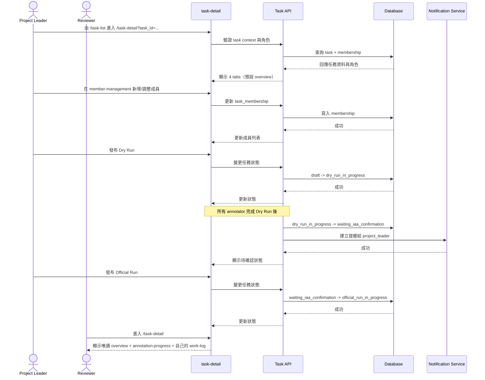
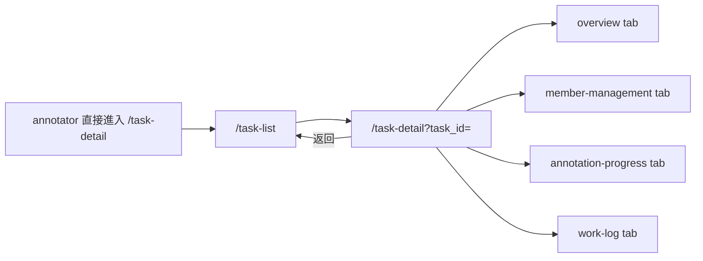

# 功能規格：Task Detail — 任務詳情（4 Tabs + 成員管理 + Run 控制）

**功能分支**：`014-task-detail`
**建立日期**：2026-04-20
**版本**：1.0.0
**狀態**：Draft
**需求來源**：IA Spec 清單 #014 — 任務詳情（成員管理 / 可加入成員名單 / Dry Run / Official Run / 工時紀錄 / 匯出）（`task-detail`）

## 規格常數

- `TASK_ROLES = project_leader | reviewer | annotator`
- `TASK_TABS = overview | member-management | annotation-progress | work-log`
- `TASK_STATUSES = draft | dry_run_in_progress | waiting_iaa_confirmation | official_run_in_progress | completed`
- `EXPORT_FORMATS = json | json-min`
- `EXPORT_SYNC_MAX_ROWS = 10000`
- `TASK_DETAIL_UNAUTHORIZED_REDIRECT = /task-list`
- `DRY_RUN_COMPLETION_RULE = all active annotators: assigned_count == completed_count`
- `MOBILE_BP = 767px`
- `RWD_VIEWPORTS = 375px / 768px / 1440px`

## Process Flow

| 步驟 | 角色 | 動作 | 系統回應 |
|------|------|------|---------|
| 1 | `project_leader` / `reviewer` | 進入 `/task-detail` | 驗證 task context 後顯示頁面，預設 `overview` tab |
| 2 | `project_leader` | 管理成員 | 可新增、調整、移除/停用任務成員 |
| 3 | `project_leader` | 發布 Dry Run | 狀態轉為 `dry_run_in_progress` |
| 4 | 系統 | 所有 annotator 完成 Dry Run | 自動轉為 `waiting_iaa_confirmation` 並產生提醒 |
| 5 | `project_leader` | 發布 Official Run | 狀態轉為 `official_run_in_progress` |
| 6 | `reviewer` | 查看任務詳情 | 僅可唯讀可見授權 tab，且 work-log 僅自己的資料 |
| 7 | `annotator` | 嘗試進入 `/task-detail` | 阻擋存取並導回 `/task-list`，顯示無權限提示 |

---

## 使用者情境與測試 *(必填)*

### User Story 1 — Project Leader 管理任務與成員（優先級：P1）

Project Leader 可在任務詳情頁操作四個 tab，並執行成員管理、run 發布、匯出結果。

**此優先級原因**：任務推進與協作的核心控制面板。  
**獨立測試方式**：以 `project_leader` 登入，驗證四個 tab、成員管理、狀態切換與匯出操作。

**驗收情境**：

1. **Given** `task_role = project_leader`，**When** 進入 `/task-detail`，**Then** 可看到四個 tab 且預設為 `overview`。
2. **Given** 位於 `member-management`，**When** 從平台使用者清單加入成員並指派角色，**Then** 成員列表更新且角色變更生效。
3. **Given** 任務在 `draft`，**When** 點擊發布 Dry Run，**Then** 狀態變為 `dry_run_in_progress`。
4. **Given** 任務在 `waiting_iaa_confirmation`，**When** 點擊發布 Official Run，**Then** 狀態變為 `official_run_in_progress`。
5. **Given** 位於 `overview`，**When** 點擊匯出，**Then** 可匯出 `json` 或 `json-min`。

**介面定義（需與 IA 導覽語意一致）**：

- Tab A：`任務概覽`（預設）
  - 區塊 1：`任務基本資訊`
    - 欄位：任務名稱、`task_id`、`task_type`、建立者、建立時間、最近更新時間
  - 區塊 2：`任務設定摘要`
    - 欄位：資料集摘要（筆數/來源）、config 版本、說明文件狀態（已上傳/未上傳）、是否啟用「開始標記前強制顯示」
  - 區塊 3：`任務狀態與 Run 控制`
    - 狀態列：`draft` / `dry_run_in_progress` / `waiting_iaa_confirmation` / `official_run_in_progress` / `completed`
    - 操作：`發布 Dry Run`、`發布 Official Run`
    - 權限：僅 `project_leader` 可執行；`reviewer` 顯示唯讀狀態與 disabled 按鈕提示
  - 區塊 4：`匯出結果`
    - 操作：`匯出 JSON`、`匯出 JSON-MIN`
    - 顯示：最近一次匯出時間、匯出 run stage（Dry/Official）
    - 空狀態：無可匯出資料時顯示「尚無可匯出結果」
- Tab B：`成員管理`
  - 區塊 1：`目前成員清單`
    - 欄位：姓名、Email、任務角色、狀態（active/disabled）、加入時間、最後活動時間、操作
    - 操作：調整角色、移除成員、停用成員（僅 `project_leader`）
  - 區塊 2：`可加入成員名單`
    - 欄位：平台使用者姓名、Email、系統角色、目前是否已在此任務
    - 操作：加入任務並指派 `reviewer` 或 `annotator`
  - 區塊 3：`角色指派規則提示`
    - 說明：任務角色為 task-level，不影響 system role
    - 防呆：禁止跨任務批次異動；異動前需二次確認
  - 角色可見性：`reviewer` 不顯示此 tab；若以直連方式進入，導回 `overview` 並提示無權限
- Tab C：`標記進度`
  - 區塊 1：`整體進度摘要`
    - 指標：總樣本數、已完成數、完成率、平均速度、剩餘估計時間
    - 維度切換：`Dry Run` / `Official Run`
  - 區塊 2：`成員進度表`
    - 欄位：成員姓名、角色、已完成數、待完成數、平均速度、最後提交時間、品質旗標
    - 排序：預設依已完成數降冪，可切換依速度/最後提交排序
  - 區塊 3：`階段分段進度`
    - 呈現：Dry 與 Official 分開進度條與統計，不可混算
  - 空狀態：尚未開始標記時顯示「尚無進度資料」，並提供回到 `任務概覽` 的 CTA
- Tab D：`工時紀錄`
  - 區塊 1：`工時篩選列`
    - 篩選：日期區間、任務階段（Dry/Official）
    - `project_leader` 額外可用：成員篩選
  - 區塊 2：`工時明細表`
    - 欄位：日期、成員、工作時長、完成筆數、平均速度、run stage
    - 匯總：當前篩選條件下總工時、總完成筆數、加權平均速度
  - 區塊 3：`異常提醒`
    - 顯示：速度異常（過快/過慢）與缺漏打卡提示
  - 角色可見性：
    - `project_leader`：可查看全成員資料
    - `reviewer`：僅查看自己資料，不顯示成員篩選
  - 空狀態：無工時資料時顯示「尚無工時紀錄」

**行為規則**：

- tab 切換為頁內行為，不觸發路由跳轉。
- `project_leader` 可編輯 member-management；其他角色不得有編輯權。
- `project_leader` 僅可管理自己所屬任務的成員，不可跨任務異動。

---

### User Story 2 — Reviewer 的唯讀存取邊界（優先級：P1）

Reviewer 可進入任務詳情查看必要資訊，但不得執行成員管理與其他越權操作。

**此優先級原因**：確保審核角色有足夠資訊但不破壞職責邊界。  
**獨立測試方式**：以 `reviewer` 登入，驗證 tab 可見性、唯讀限制、work-log 資料範圍。

**驗收情境**：

1. **Given** `task_role = reviewer`，**When** 進入 `/task-detail`，**Then** 可見 `overview`、`annotation-progress`、`work-log`。
2. **Given** `task_role = reviewer`，**When** 嘗試以直連進入 `member-management`，**Then** 導回 `overview` 並顯示無權限提示。
3. **Given** `task_role = reviewer`，**When** 進入 `work-log`，**Then** 僅可見自己的工時資料。
4. **Given** `task_role = annotator`，**When** 直接開啟 `/task-detail`，**Then** 系統阻擋並導回 `/task-list` 顯示無權限提示。

**行為規則**：

- Reviewer 對 `overview` 為唯讀，不可執行 run 發布與成員異動。
- Reviewer 不顯示 `member-management` tab；若強行以 URL/query 進入，需導回 `overview`。
- Reviewer 的 `work-log` 篩選維度僅允許日期區間與任務階段，不提供成員篩選。
- 無權限角色不得透過 API 讀到超出授權資料。

---

### User Story 3 — 任務狀態轉換與資料隔離（優先級：P1）

任務需遵守固定狀態機，且 Dry Run 與 Official Run 資料必須隔離。

**此優先級原因**：避免測試資料污染正式成果，確保品質評估有效。  
**獨立測試方式**：模擬完整狀態轉換，驗證轉換條件、通知、資料分區。

**驗收情境**：

1. **Given** 任務為 `draft`，**When** 發布 Dry Run，**Then** 狀態只能轉為 `dry_run_in_progress`。
2. **Given** 所有 `active annotator` 達到 `assigned_count == completed_count`，**When** 系統檢查完成條件，**Then** 自動轉為 `waiting_iaa_confirmation` 並對 `project_leader` 發送提醒。
3. **Given** 任務為 `waiting_iaa_confirmation`，**When** 發布 Official Run，**Then** 狀態轉為 `official_run_in_progress`。
4. **Given** 任務資料含 Dry 與 Official 兩階段，**When** 查詢匯出資料，**Then** 系統不得混入不同階段的資料集。

**行為規則**：

- 狀態轉換必須符合 `TASK_STATUSES` 順序，不允許跳階。
- Dry Run 完成條件採 `DRY_RUN_COMPLETION_RULE`，僅計入 `membership_status = active` 的 annotator。
- Dry Run 完成通知需在 dashboard 待處理區顯示 badge。
- 匯出請求必須指定 run stage（Dry/Official），並保證資料隔離。
- 匯出資料量 `<= EXPORT_SYNC_MAX_ROWS` 採同步回應；超過門檻採背景工作並通知下載連結。

---

### Edge Cases

- `task_id` 不存在或使用者無 membership：導回 `/task-list` 並顯示提示。
- `annotator` 或無權限角色直接進入 `/task-detail`：導回 `TASK_DETAIL_UNAUTHORIZED_REDIRECT` 並顯示無權限提示。
- reviewer 嘗試呼叫成員管理 API：回傳拒絕，且不可修改任何資料。
- reviewer 嘗試直連 `member-management`：導回 `overview` 並顯示無權限提示。
- 成員移除後仍有未完成作業：需有阻擋或警告流程，避免統計中斷。
- Dry Run 未滿足完成條件前嘗試發布 Official Run：系統拒絕並回傳原因。
- 匯出大資料量超時：採背景工作與通知下載連結，避免頁面無回應。

---

## 需求規格 *(必填)*

### 功能需求

- **FR-001**：系統必須提供 `/task-detail` 並以 `task_id` 建立任務上下文。
- **FR-002**：僅 `project_leader` 與 `reviewer` 可進入 `/task-detail`。
- **FR-002a**：無權限角色（含 `annotator`）造訪 `/task-detail` 時，系統必須導回 `TASK_DETAIL_UNAUTHORIZED_REDIRECT` 並顯示無權限提示。
- **FR-003**：頁面必須提供四個 tabs：`overview`、`member-management`、`annotation-progress`、`work-log`，且預設為 `overview`。
- **FR-004**：tab 切換必須為頁內行為，不觸發路由跳轉。
- **FR-005**：`project_leader` 必須可於 `member-management` 執行成員新增、角色調整、移除/停用。
- **FR-006**：`reviewer` 不可見 `member-management` tab；若以直連方式進入，系統必須導回 `overview` 並提示無權限。
- **FR-007**：`reviewer` 的 `work-log` 僅可查看自己的資料。
- **FR-008**：任務狀態轉換必須遵守 `TASK_STATUSES` 狀態機。
- **FR-008a**：當所有 `active annotator` 皆滿足 `assigned_count == completed_count` 時，系統必須自動轉為 `waiting_iaa_confirmation` 並建立提醒。
- **FR-009**：系統必須支援在 `overview` 匯出結果，格式至少含 `EXPORT_FORMATS`。
- **FR-009a**：匯出時必須指定 run stage（Dry/Official）；`<= EXPORT_SYNC_MAX_ROWS` 同步回應，超過門檻改為背景工作並通知下載連結。
- **FR-010**：Dry Run 與 Official Run 資料必須隔離，不得混用。
- **FR-011**：頁面必須支援 `RWD_VIEWPORTS`，在 `<= MOBILE_BP` 仍可完成核心查看與操作。
- **FR-011a**：在 `375px`、`768px`、`1440px` 三個 viewport，必須可完成：進入詳情、tab 切換、run 發布權限顯示、`project_leader` 成員管理、`work-log` 篩選、匯出操作，且不得資訊重疊。

### User Flow & Navigation

| From | Trigger | To |
|------|---------|-----|
| `/task-list` | 點選任務 | `/task-detail?task_id=...` |
| `/task-detail` | 點選 tab | 同頁切換至對應 tab |
| `/task-detail` | 點擊返回 | `/task-list` |
| `annotator` 直接造訪 `/task-detail` | 路由守門 | `/task-list` 並顯示無權限提示 |

**Entry points**：`/task-list` 任務列。  
**Exit points**：返回 `/task-list` 或切換到其他 L0 模組。

### 關鍵實體

- **TaskDetail**：任務詳情聚合。欄位：`task_id`、`task_name`、`task_type`、`status`、`run_stage`、`settings`。
- **TaskMembership**：任務成員。欄位：`task_id`、`user_id`、`task_role`、`membership_status`。
- **RunStateTransition**：狀態轉換紀錄。欄位：`from_status`、`to_status`、`triggered_by`、`triggered_at`。
- **WorkLogEntry**：工時紀錄。欄位：`user_id`、`date`、`duration`、`completed_count`、`avg_speed`、`run_stage`。

---

## 規格相依性 *(本功能依賴其他規格，或被其他規格依賴時填寫)*

### 上游（本規格依賴的規格）

| 規格編號 | 功能 | 本規格需要的內容 |
|---------|------|----------------|
| 010 | Task List | 任務入口與 task_id 導入 |
| 013 | New Task | 任務初始設定、建立者 membership、自動導頁 |
| 012 | Dashboard | 待處理提醒顯示與導覽語意 |

### 下游（依賴本規格的規格）

| 規格編號 | 功能 | 依賴本規格的內容 |
|---------|------|----------------|
| 015 | Annotation Workspace | run 階段控制、說明設定、成員角色授權 |
| 016 | Dataset Stats | 任務階段與產出統計來源 |
| 017 | Dataset Quality | IAA 與品質分析所依賴的 run 階段與資料隔離 |

---

## 成功標準 *(必填)*

- **SC-001**：`project_leader` 可在 `/task-detail` 使用四個 tabs 並完成成員管理與 run 控制。
- **SC-002**：`reviewer` 可唯讀存取授權內容，且 `work-log` 僅顯示本人資料。
- **SC-003**：`annotator` 不能進入 `/task-detail`，會被導向 `/task-list` 並顯示無權限提示。
- **SC-004**：任務狀態轉換遵循定義順序，Dry Run 完成後可自動進入待 IAA 並產生提醒。
- **SC-005**：匯出與查詢結果中，Dry Run / Official Run 資料不會混入。
- **SC-006**：`reviewer` 不可見 `member-management`，且直連嘗試會導回 `overview`。
- **SC-007**：在 `375px`、`768px`、`1440px` 下可完成進入詳情、tab 切換、run 權限顯示、成員管理（PL）、work-log 篩選、匯出操作，且無資訊重疊。

---

## Changelog

| 版本 | 日期 | 變更摘要 |
|------|------|---------|
| 1.0.0 | 2026-04-20 | 初版建立：依 IA 重建 `task-detail` 規格（4 tabs、角色可見性、狀態轉換、資料隔離） |
