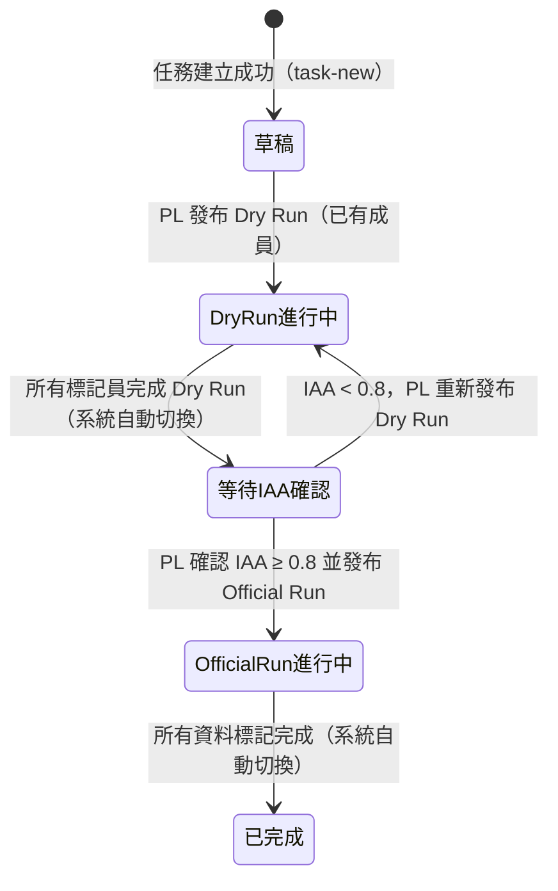
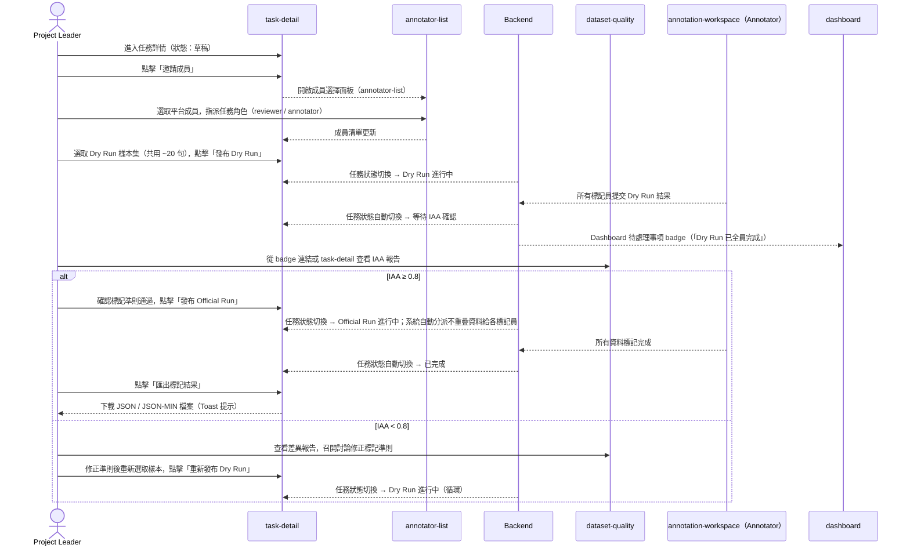
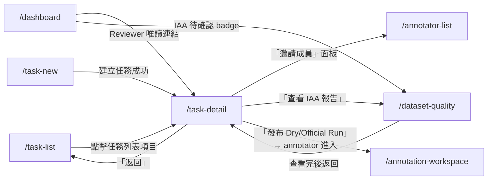

# 功能規格：任務詳情頁

**功能分支**：`014-task-detail`
**建立日期**：2026-04-05
**狀態**：Draft
**需求來源**：IA v7 Spec 清單 #015–017 合併 — 任務詳情資訊顯示、成員管理與發布操作

---

## Process Flow

任務詳情頁是任務整個生命週期的控制中心。Project Leader 透過此頁管理成員、發布 Dry Run、確認 IAA 後發布 Official Run，直到任務完成並匯出結果。

### 任務生命週期狀態轉換

### Dry Run → Official Run 完整流程

| 步驟 | 角色 | 操作 | 系統回應 |
|------|------|------|---------|
| 1 | Project Leader | 查看任務基本資訊、config 摘要、目前狀態 | 顯示任務名稱、類型、狀態 badge、建立時間、config 概要（不含完整 JSON）|
| 2 | Project Leader | 邀請平台成員加入任務，指派 `reviewer` 或 `annotator` 角色 | 從 annotator-list 中選取；成功後成員清單即時更新 |
| 3 | Project Leader | 選取 Dry Run 樣本集，點擊「發布 Dry Run」 | 驗證：成員清單中至少有 1 位 `annotator`；驗證通過後狀態切換為 Dry Run 進行中 |
| 4 | 系統 | 所有 annotator 完成 Dry Run | 自動切換狀態為「等待 IAA 確認」；Dashboard 推送通知 badge 給 PL |
| 5 | Project Leader | 查看 IAA 結果（連結至 dataset-quality） | 顯示 IAA 分數與達標狀態；若 ≥ 0.8 啟用「發布 Official Run」按鈕 |
| 6a | Project Leader（IAA 達標） | 點擊「發布 Official Run」 | 系統自動分派不重疊資料給各 annotator；狀態切換為 Official Run 進行中 |
| 6b | Project Leader（IAA 未達標） | 修正準則後點擊「重新發布 Dry Run」 | 狀態切換回 Dry Run 進行中 |
| 7 | Project Leader | 任務完成後匯出標記結果 | 下載觸發 Toast 提示；頁面不跳轉 |

---

## 使用者情境與測試（必填）

### User Story 1 — Project Leader 發布 Dry Run（優先級：P1）

Project Leader 在任務詳情頁完成成員邀請後，選取共用試標樣本並發布 Dry Run，任務狀態從「草稿」切換為「Dry Run 進行中」。

**此優先級原因**：Dry Run 是標記一致性驗證的前提，也是整個標記流程中最關鍵的第一個里程碑；無法發布 Dry Run 則後續 IAA 確認與 Official Run 均無法進行。

**獨立測試方式**：以 `project_leader` 任務角色登入，邀請至少一位 `annotator` 成員，選取樣本後點擊「發布 Dry Run」，確認任務狀態切換為「Dry Run 進行中」，且 annotator 在 Dashboard 可見待標記任務。

**驗收情境**：

1. **Given** Project Leader 在任務詳情頁（狀態：草稿），任務成員清單為空，**When** 嘗試點擊「發布 Dry Run」，**Then** 按鈕維持停用（disabled）並顯示提示「請先邀請至少一位標記員」。
2. **Given** Project Leader 已邀請至少一位 `annotator` 成員，**When** 選取 Dry Run 樣本集（建議 20 句）並點擊「發布 Dry Run」，**Then** 任務狀態切換為「Dry Run 進行中」；受邀 annotator 的 Dashboard 出現對應任務的標記卡片。
3. **Given** 任務狀態已為「Dry Run 進行中」，**When** Project Leader 查看任務詳情，**Then** 頁面顯示各標記員的完成進度（已完成數 / 分配總數）；「發布 Dry Run」按鈕消失，改為顯示「重新發布 Dry Run」（僅在狀態回到草稿或重新發布流程中可用）。

---

### User Story 2 — Project Leader 確認 IAA 後發布 Official Run（優先級：P1）

所有標記員完成 Dry Run 後，系統自動切換狀態為「等待 IAA 確認」，Project Leader 前往 IAA 報告確認分數達標（≥ 0.8），再從任務詳情頁發布 Official Run。

**此優先級原因**：Official Run 啟動是整個資料標注流程的核心產出；IAA 門檻確認確保標記品質，是系統設計的核心安全機制。

**獨立測試方式**：模擬所有 annotator 完成 Dry Run；確認任務狀態自動切換；模擬 IAA ≥ 0.8 場景，確認「發布 Official Run」按鈕可用，點擊後狀態切換為「Official Run 進行中」且資料分派正確（各 annotator 資料不重疊）。

**驗收情境**：

1. **Given** 所有 annotator 完成 Dry Run 提交，**When** 後端計算完成，**Then** 任務狀態自動切換為「等待 IAA 確認」；Project Leader 的 Dashboard 待處理事項區出現「Dry Run 已全員完成，請確認 IAA 結果」badge。
2. **Given** 任務狀態為「等待 IAA 確認」且 IAA ≥ 0.8，**When** Project Leader 在任務詳情頁查看 IAA 摘要，**Then** 頁面顯示 IAA 分數（對應任務類型的指標，如 `f1_macro` 或 `krippendorff_alpha`）並標示「達標」；「發布 Official Run」按鈕為可用（enabled）狀態。
3. **Given** Project Leader 點擊「發布 Official Run」，**When** 後端處理成功，**Then** 任務狀態切換為「Official Run 進行中」；各 annotator 的資料分派不重疊；annotator Dashboard 出現新的 Official Run 標記任務卡片。

---

### User Story 3 — Project Leader 管理任務成員（優先級：P2）

Project Leader 在任務詳情頁邀請平台成員加入任務，指派任務角色（`reviewer` 或 `annotator`），並可在需要時移除成員。

**此優先級原因**：成員管理是 Dry Run 發布的前提，但成員邀請的複雜互動（搜尋、批量邀請）可作為獨立功能驗收。

**獨立測試方式**：以 `project_leader` 身份邀請一位 `annotator` 並確認成員清單更新；嘗試邀請非平台成員（不存在的 user_id）確認錯誤處理；嘗試移除自己確認操作被拒。

**驗收情境**：

1. **Given** Project Leader 在任務詳情頁點擊「邀請成員」，**When** 搜尋平台成員並選取後指派角色 `annotator`，**Then** 成員清單即時出現新成員；後端建立一筆新的 `task_membership` 記錄。
2. **Given** 成員清單中有 `annotator` 成員，**When** Project Leader 點擊該成員的「移除」按鈕並確認，**Then** 該成員從任務成員清單中移除；後端刪除對應 `task_membership` 記錄；若 Dry Run 或 Official Run 進行中，提示 PL「移除正在進行中的標記員可能影響資料完整性」。
3. **Given** Project Leader 嘗試移除自己（task_role = project_leader）的成員資格，**When** 點擊「移除」，**Then** 系統顯示「無法移除自己的專案負責人資格」提示，操作被拒絕。

---

### User Story 4 — Reviewer 與 Annotator 的唯讀視角（優先級：P2）

具有 `reviewer` 任務角色的使用者可進入任務詳情頁查看任務資訊與進度，但所有管理操作（邀請成員、發布 Dry Run / Official Run、匯出）的按鈕均隱藏或停用。具有 `annotator` 任務角色的使用者不得直接進入任務詳情頁。

**此優先級原因**：角色邊界是系統安全性的基礎；reviewer 需要唯讀視角進行審查工作，但不應有管理操作權限。

**獨立測試方式**：以 `reviewer` 任務角色登入並進入對應任務的 task-detail，確認無邀請、發布、匯出等操作按鈕；以 `annotator` 任務角色嘗試直接訪問 `/task-detail/{task_id}`，確認被導向 Dashboard 或顯示無存取權限提示。

**驗收情境**：

1. **Given** 使用者的任務角色為 `reviewer`，**When** 進入 `/task-detail/{task_id}`，**Then** 頁面顯示任務資訊、狀態、成員清單與進度，但「邀請成員」「發布 Dry Run」「發布 Official Run」「匯出結果」等操作入口均不顯示。
2. **Given** 使用者的任務角色為 `annotator`，**When** 嘗試直接訪問 `/task-detail/{task_id}`，**Then** 系統拒絕存取並顯示「您沒有存取此頁面的權限」，引導返回 Dashboard。
3. **Given** `super_admin` 系統角色使用者（無任務角色），**When** 訪問任意 `/task-detail/{task_id}`，**Then** 可查看完整任務資訊（唯讀），管理操作按鈕依實作時決定是否開放（預設與 `project_leader` 相同權限）。

---

### 邊界情況

- **IAA 未達門檻**：IAA < 0.8 時「發布 Official Run」按鈕維持停用並顯示「IAA 分數未達門檻（目前：{score}，需 ≥ 0.8），請修正標記準則後重新發布 Dry Run」。PL 仍可點擊「重新發布 Dry Run」循環。
- **Dry Run 進行中移除標記員**：若 Dry Run 進行中移除 annotator，顯示「移除後該標記員已完成的 Dry Run 資料仍保留，但不再計入 IAA 計算（若僅剩一人則 IAA 無法計算）」確認 modal，PL 明確確認後才執行移除。
- **成員重複邀請**：嘗試邀請已在成員清單中的使用者時，系統提示「該使用者已是任務成員」並阻止重複建立 `task_membership`。
- **Official Run 中移除 Annotator**：Official Run 進行中移除 annotator，顯示「移除後該標記員已分派但未完成的資料將回收入待分配池，不計入最終資料集」警告，PL 確認後才執行。
- **任務唯一 Project Leader**：系統不允許任務存在零個 `project_leader`；移除 PL 自身資格的操作一律拒絕（見 User Story 3 情境 3）。
- **匯出空任務**：若 Official Run 尚未開始或尚無任何已完成標記，「匯出標記結果」按鈕停用，提示「尚無可匯出的標記結果」。
- **Dry Run 樣本超出資料集大小**：若選取的 Dry Run 樣本數超過資料集總筆數，系統提示「樣本數量超過資料集大小，請重新選取」並阻止發布。

---

## 需求規格（必填）

### 功能需求

- **FR-001**：`/task-detail/{task_id}` 僅允許對應任務的 `project_leader` 或 `reviewer` 任務角色，以及 `super_admin` 系統角色存取；`annotator` 任務角色嘗試存取時系統拒絕並顯示錯誤提示 — 透過 `useTaskRole(taskId)` hook 配合 RoleGuard 強制。
- **FR-002**：頁面頂部必須顯示任務基本資訊：任務名稱、任務類型（以易讀標籤顯示，如 Classification / NER）、目前狀態（狀態 badge）、建立者、建立時間。
- **FR-003**：頁面必須顯示 config 概要（任務類型對應的關鍵設定，如分類任務顯示標籤清單、NER 顯示實體類型清單），不顯示完整 config JSON（完整 JSON 僅在 Code 模式或資料匯出中可見）。
- **FR-004**：頁面必須顯示目前任務的成員清單，每筆成員顯示：姓名、系統角色、任務角色、加入時間。
- **FR-005**：只有 `project_leader` 任務角色可執行以下操作：邀請成員、移除成員、發布 Dry Run、重新發布 Dry Run、發布 Official Run、匯出標記結果 — 以上操作入口對 `reviewer` 及 `super_admin`（預設）隱藏。
- **FR-006**：「邀請成員」功能必須從平台 `annotator-list` 中選取已有系統角色的使用者，指派任務角色（`reviewer` 或 `annotator`）。
- **FR-007**：「移除成員」操作必須有確認 modal；系統不允許 PL 移除自己（唯一 `project_leader`）。
- **FR-008**：「發布 Dry Run」操作條件：（1）任務狀態為「草稿」；（2）成員清單中至少有 1 位 `annotator` 任務角色成員。不滿足時按鈕停用並顯示原因提示。
- **FR-009**：Dry Run 發布後，任務狀態必須切換為 `dry_run`；受邀 annotator 的 Dashboard 必須出現對應的 Dry Run 標記任務卡片。
- **FR-010**：當所有 `annotator` 提交 Dry Run 後，後端必須自動將任務狀態切換為 `waiting_iaa`，並在 Project Leader 的 Dashboard 待處理事項區新增通知 badge。
- **FR-011**：任務狀態為 `waiting_iaa` 時，頁面必須顯示 IAA 結果摘要（分數與對應指標名稱），並標示達標（≥ 0.8）或未達標（< 0.8）。
- **FR-012**：IAA ≥ 0.8 時「發布 Official Run」按鈕為可用（enabled）；IAA < 0.8 時按鈕維持停用並顯示當前分數與門檻說明。
- **FR-013**：「發布 Official Run」點擊後，後端必須自動以不重疊方式將資料分派給所有 `annotator` 成員；任務狀態切換為 `official_run`。
- **FR-014**：「重新發布 Dry Run」操作：僅在 IAA < 0.8（狀態 `waiting_iaa`）時可用；點擊後任務狀態回到 `dry_run`，重新開始 Dry Run 循環。
- **FR-015**：「匯出標記結果」操作：僅在任務狀態為 `completed` 或 Official Run 進行中（部分完成）時可用；提供 JSON 與 JSON-MIN 兩種格式；觸發下載不跳轉頁面，顯示 Toast 提示。
- **FR-016**：頁面必須顯示各標記員的標記進度（已完成數 / 分配總數），`project_leader` 與 `reviewer` 均可查看全體進度。
- **FR-017**：IAA 查看連結（「查看 IAA 報告」）必須導向 `/dataset-quality/{task_id}`，不得在 task-detail 頁面重複渲染完整 IAA 報告。
- **FR-018**：`super_admin` 系統角色可查看所有任務的 task-detail（不需要 task_membership 記錄），預設為唯讀視角；是否開放管理操作由實作時依需求決定，本 spec 不強制。

### User Flow & Navigation

| From | Trigger | To |
|------|---------|-----|
| `/task-list` | 點擊任務 | `/task-detail/{task_id}` |
| `/task-new` | 建立任務成功 | `/task-detail/{task_id}` |
| `/dashboard` | Reviewer 唯讀連結 | `/task-detail/{task_id}` |
| `/dashboard` | IAA 待確認 badge | `/dataset-quality/{task_id}` |
| `/task-detail` | 點擊「邀請成員」 | `/annotator-list`（選取面板）|
| `/task-detail` | 點擊「查看 IAA 報告」 | `/dataset-quality/{task_id}` |
| `/task-detail` | 點擊「返回」 | `/task-list` |
| `/annotation-workspace` | Official Run 全部完成後 | `/task-detail/{task_id}` |

**Entry points**：`/task-list` 點擊任務項目；`/task-new` 建立成功後自動導向；Dashboard 唯讀連結（Reviewer）。
**Exit points**：「返回」→ `/task-list`；「查看 IAA 報告」→ `/dataset-quality`；匯出為頁面內操作（Toast），不觸發跳轉。

### 關鍵實體

- **Task（任務）**：`id`（UUID）、`name`、`task_type`（enum）、`status`（`draft` | `dry_run` | `waiting_iaa` | `official_run` | `completed`）、`config`（JSONB）、`created_by`（user_id FK）、`created_at`、`updated_at`。`status` 是任務詳情頁最核心的欄位，決定可用操作與顯示內容。
- **TaskMembership（任務成員資格）**：`id`、`task_id`（FK）、`user_id`（FK）、`task_role`（`project_leader` | `reviewer` | `annotator`）、`joined_at`（timestamp）。一個 task 可有多筆；每個 task 至少一筆 `project_leader` 記錄。
- **TaskAnnotationProgress（標記進度）**：`task_id`（FK）、`user_id`（FK）、`run_type`（`dry_run` | `official_run`）、`assigned_count`（分配筆數）、`completed_count`（已完成筆數）。用於任務詳情頁顯示各標記員進度。
- **IAAResult（IAA 結果）**：`task_id`（FK）、`run_type`（目前僅 `dry_run`）、`metric`（對應 config-schema.md § 5 Registry）、`score`（float）、`threshold`（0.8）、`is_passed`（boolean）、`computed_at`（timestamp）。由後端 Celery 任務在 Dry Run 全員完成後計算。

---

## 成功標準（必填）

- **SC-001**：Project Leader 可在知悉所有 annotator 完成 Dry Run 後，3 次點擊以內完成「確認 IAA → 發布 Official Run」流程（IAA 達標情況下）。
- **SC-002**：任務狀態轉換正確且即時：系統觸發的自動狀態切換（如 Dry Run 全員完成 → 等待 IAA 確認）在最後一位 annotator 提交後 10 秒內反映於 task-detail 頁面。
- **SC-003**：角色存取控制正確：`annotator` 任務角色無法存取 `/task-detail`；`reviewer` 任務角色可查看但無任何管理操作入口；100% 的存取控制情境在 E2E 測試中驗證。
- **SC-004**：IAA 分數顯示正確：頁面顯示的 IAA 分數與 `dataset-quality` 頁面的分數一致，小數位數依 `config.evaluation.decimal_places` 決定。
- **SC-005**：Official Run 資料分派不重疊：各 annotator 分配到的資料集合不存在重複筆目，可透過後端資料查詢驗證。
- **SC-006**：成員管理邊界正確：嘗試移除唯一 `project_leader` 的操作一律被系統拒絕，不論前端或後端均有防護。
