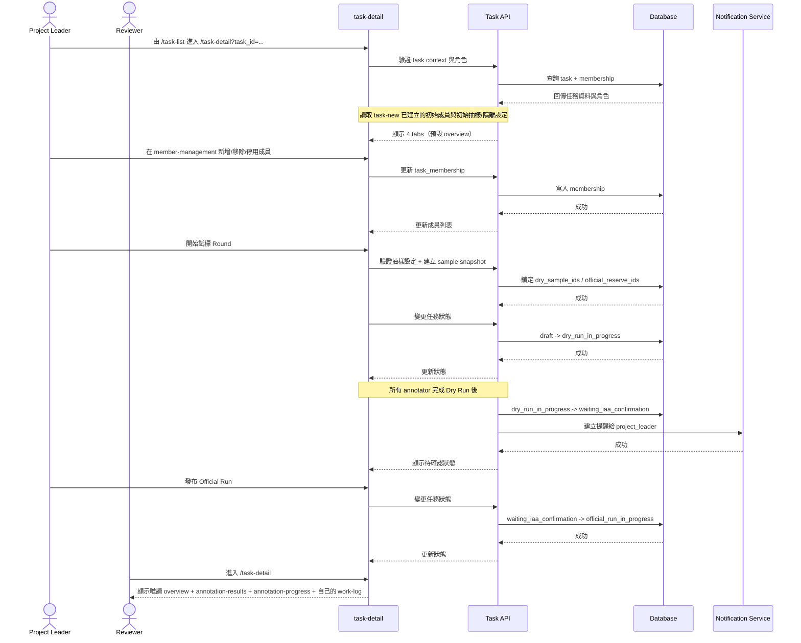
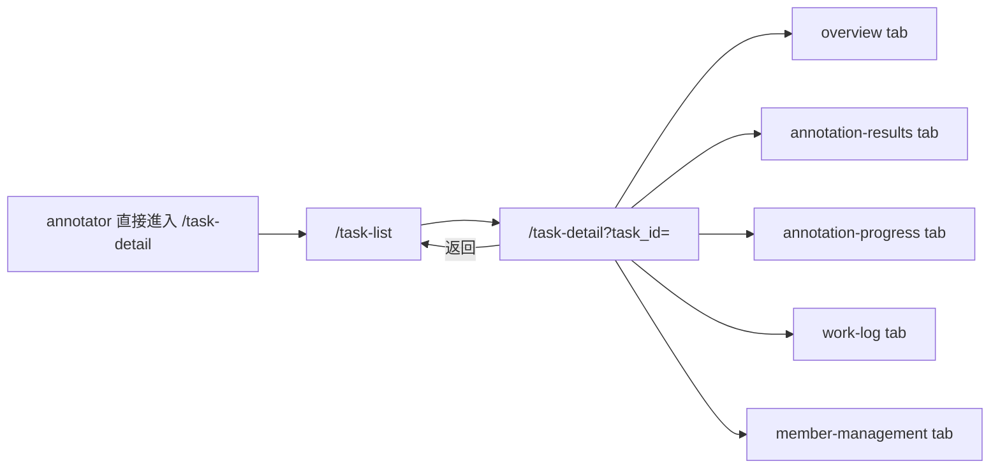

# 功能規格：Task Detail — 任務詳情（5 Tabs + 成員管理 + 執行控制）

**功能分支**：`014-task-detail`
**建立日期**：2026-04-20
**版本**：1.6.2
**狀態**：Draft
**需求來源**：IA Spec 清單 #014 — 任務詳情（成員管理調整 / 執行控制調整 / Dry Run / Official Run / 工時紀錄 / 匯出）（`task-detail`）

## 規格常數

- `TASK_ROLES = project_leader | reviewer | annotator`
- `TASK_TABS = overview | annotation-results | annotation-progress | work-log | member-management`
- `TASK_TYPE_ENUM = single_sentence_classification | single_sentence_va_scoring | sequence_labeling | relation_extraction | sentence_pairs`
- `SEQUENCE_LABELING_SUBTYPES = ner | aspect_list`
- `SENTENCE_PAIRS_MODES = similarity | entailment`
- `SENTENCE_PAIRS_RESPONSE_FORMATS = classification | scoring`
- `TASK_STATUSES = draft | dry_run_in_progress | waiting_iaa_confirmation | official_run_in_progress | completed`
- `EXPORT_FORMATS = json | json-min`
- `EXPORT_JSON_SHAPE = top-level object { manifest, items[] }`
- `EXPORT_JSON_MIN_SHAPE = flat array rows[]`
- `EXPORT_COMMON_FIELDS = task_id | task_name | task_type | run_stage | sample_snapshot_id | sample_id | source_data | annotation_status | review_status | created_at | updated_at`
- `EXPORT_ANNOTATION_FIELDS = annotation_id | annotator_id | annotator_name | submitted_at | lead_time_seconds | is_draft | result`
- `EXPORT_REVIEW_FIELDS = review_id | reviewer_id | reviewer_name | reviewed_at | decision | corrected_result | review_note`
- `EXPORT_DYNAMIC_RESULT_FIELDS = task_type-driven`
- `EXPORT_SYNC_MAX_ROWS = 10000`
- `TASK_DETAIL_UNAUTHORIZED_REDIRECT = /task-list`
- `DRY_RUN_COMPLETION_RULE = all active annotators: assigned_count == completed_count`
- `DRAFT_SAMPLING_MODES = by_count | by_percentage`
- `DRAFT_SAMPLING_PERCENT_RANGE = 1..99`
- `DRAFT_SAMPLING_COUNT_MIN = 1`
- `DRAFT_SAMPLING_DEFAULT_STRATEGY = stratified_random`
- `DRAFT_SAMPLING_STRATA_SOURCE = task_config.sampling_strata_fields`
- `DRAFT_SAMPLING_PERCENT_ROUNDING = floor`
- `SAMPLE_SNAPSHOT_LOCK_EVENT = publish_dry_run`
- `RESAMPLE_ALLOWED_STATUS = draft`
- `OVERVIEW_EDITABLE_STATUS = draft`
- `OVERVIEW_EDITABLE_ROLE = project_leader`
- `OVERVIEW_EDITABLE_FIELDS = task_name | task_type | dataset | config | config_file_name | sampling_mode | sampling_value | random_seed | isolation_enabled | guideline_text | guideline_assets | force_guideline`
- `MOBILE_BP = 767px`
- `RWD_VIEWPORTS = 375px / 768px / 1440px`

## Process Flow

| 步驟 | 角色 | 動作 | 系統回應 |
|------|------|------|---------|
| 1 | `project_leader` / `reviewer` | 進入 `/task-detail` | 驗證 task context 後顯示頁面，預設 `overview` tab |
| 2 | `project_leader` | 管理成員 | 可新增、移除/停用任務成員；既有成員角色唯讀（承接 task-new 初始值） |
| 3 | `project_leader` | 開始試標 Round | 狀態轉為 `dry_run_in_progress` |
| 4 | 系統 | 所有 `active annotator` 完成各自被指派的 Dry Run 全部樣本 | 自動轉為 `waiting_iaa_confirmation` 並產生提醒 |
| 5 | `project_leader` | 發布 Official Run | 狀態轉為 `official_run_in_progress` |
| 6 | `reviewer` | 查看任務詳情 | 僅可唯讀可見授權 tab，且 work-log 僅自己的資料 |
| 7 | `annotator` | 嘗試進入 `/task-detail` | 阻擋存取並導回 `/task-list`，顯示無權限提示 |

---

## 使用者情境與測試 *(必填)*

### User Story 1 — Project Leader 管理任務與成員（優先級：P1）

Project Leader 可在任務詳情頁操作五個 tab，並執行成員調整、執行發布與查看／匯出標記結果。

**此優先級原因**：任務推進與協作的核心控制面板。  
**獨立測試方式**：以 `project_leader` 登入，驗證四個 tab、成員管理、狀態切換與匯出操作。

**驗收情境**：

1. **Given** `task_role = project_leader`，**When** 進入 `/task-detail`，**Then** 可看到五個 tab 且預設為 `overview`。
2. **Given** 位於 `member-management`，**When** 從平台使用者清單加入/移除/停用成員，**Then** 成員列表更新且新加入成員角色生效。
3. **Given** 任務在 `draft`，**When** 點擊「開始試標 Round」，**Then** 狀態變為 `dry_run_in_progress`。
4. **Given** 任務在 `waiting_iaa_confirmation`，**When** 點擊發布 Official Run，**Then** 狀態變為 `official_run_in_progress`。
5. **Given** 位於 `annotation-results`，**When** 點擊匯出，**Then** 可匯出 `json` 或 `json-min`，且欄位結構需依格式與 `task_type` 正確切換。

**介面定義（需與 IA 導覽語意一致）**：

- Tab A：`任務概覽`（預設）
  - 區塊 1：`基本資料`（名稱、類型、資料集上傳）
    - 顯示狀態：任務名稱、`task_type`、資料集摘要（筆數/來源）、建立者、建立時間、最近更新時間
    - 編輯狀態：任務名稱可改(必填)、任務類型可重選(必填)、資料集可重傳(必填)
    - 必填欄位樣式：`任務名稱`、`任務類型`、`資料集` 的 `*` 必須沿用「標記設定 schema 必填欄位」相同 `required` 樣式（label 文字 + 紅色星號 span）
    - 資料集檔案顯示：已上傳資料集需沿用「標記說明 > 上傳檔案」的檔案列樣式呈現，且每個檔案獨立一列
  - 區塊 2：`標記設定`（設定檔介面）
    - 顯示狀態：固定顯示 `設定檔版本`（顯示使用者上傳的 config 檔名；未上傳時為空字串）與 `標記類型`；其餘摘要欄位需依當前 `task_type` 與 subtype 的 schema 動態顯示（例如 `sequence_labeling.subtype = ner` 顯示 `實體類型`、`標記格式`、`允許重疊標記`；`sequence_labeling.subtype = aspect_list` 顯示 `輸入欄位`、`Aspect List 欄位`、`Aspect 編輯規則`、`數量限制`、`Exact match 驗證`、`情緒描述檢查`；`single_sentence_va_scoring` 顯示 `Valence`、`Arousal` 兩列分數維度設定；`sentence_pairs` 顯示 `pair_mode`、`response_format`、兩句欄位對應與作答設定）
    - 編輯狀態：根據不同任務有各自的必填項目，設定檔可透過 Visual/Code 重設（套用範本或上傳 YAML/JSON），儲存後同步更新摘要；Visual 編輯器必須與 `013-task-new` Step 2 使用同一份 registry/schema 與 config source-of-truth
    - 顯示模式必填提示：動態摘要欄位若為 schema 必填欄位，欄位標籤旁必須顯示紅色 `*`
    - `single_sentence_va_scoring` 專屬規則：Visual 編輯需提供 `Valence`、`Arousal` 兩組 `min/max/step` 設定；標記預覽需同頁顯示兩列可操作評分元件（Valence 一列、Arousal 一列）
    - `sequence_labeling.subtype = ner` 專屬規則：
      - 顯示狀態摘要需先顯示 `entities`、`scheme`、`allow_overlapping` 三個核心欄位；若進階欄位有非預設值，仍需納入摘要列，不得遺失。
      - 編輯狀態 Visual schema 需採 `核心設定` + `進階設定` 漸進揭露；`核心設定` 預設展開，`進階設定` 預設收合。
      - NER config key 必須與 `013-task-new` 一致使用 `entities`（`{ name, color }[]`）、`scheme`、`allow_overlapping`；不得在 task-detail 另行改用 `entity_types`、`span_scheme`、`allow_overlapping_spans` 作為主要輸出。
    - `sequence_labeling.subtype = aspect_list` 專屬規則：
      - 顯示狀態摘要需揭露欄位對應：`input_field`（預設 `sentence`）與 `aspect_list_field`（預設 `aspects`）。
      - 顯示狀態摘要需揭露五個 boolean 規則：`allow_sentence_edit`、`allow_aspect_add`、`allow_aspect_delete`、`require_exact_match_in_sentence`、`require_sentiment_context_check`，並以啟用 / 停用語意顯示，不得以 NER 欄位替代。
      - 顯示狀態摘要需揭露 `min_aspects` / `max_aspects`；未設定上限時需以「未限制」或等價空值語意呈現。
      - 編輯狀態 Visual schema 需分為 `欄位對應`、`Aspect 編輯規則`、`數量限制` 三個視覺群組；boolean 規則需以 toggle card 呈現並顯示啟用 / 停用狀態；欄位與數量群組在 desktop 可雙欄並排，在 mobile viewport 必須單欄排列且不得水平 overflow。
      - 編輯狀態標記預覽必須呈現可編輯句子與 Aspect List rows，且新增、刪除、修改 aspect 的狀態需反映到同一份 config/preview source-of-truth。Aspect List rows 的輸入機制為自由文字輸入框（text input），每列代表一個 aspect 文字片段；不採用 NER 式的句子 span 拖拉選取。
      - `require_sentiment_context_check = true` 時，預覽或設定摘要需清楚標示此規則為標記者判斷用的軟性指引，不觸發系統硬性攔截；`require_exact_match_in_sentence = true` 才是阻擋儲存的硬性驗證。
      - 發布至 annotation-workspace 後，Reviewer 對 `aspect_list` 任務需可在審核介面直接新增、刪除或修改標記員提交的 aspect，並保留 reviewer 修正 diff；此為 reviewer-corrected result，不等同於退回標記員。
    - `task_type = sentence_pairs` 專屬規則：
      - 顯示狀態摘要需揭露 `pair_mode`（`similarity | entailment`）與 `response_format`（`classification | scoring`）；`pair_mode = entailment` 時不得顯示評分型設定。
      - 顯示狀態摘要需揭露兩句欄位對應：`sentence_1_field`、`sentence_2_field`，以及顯示文案 `sentence_1_label`、`sentence_2_label`。
      - `response_format = classification` 時，摘要需顯示 `label_options`、`allow_unsure`、`note_enabled`；`response_format = scoring` 時，摘要需顯示 `score_min / score_max / score_step`、`allow_unsure`、`note_enabled`。
      - 編輯狀態 Visual schema 需分為 `任務模式`、`欄位對應`、`顯示文案`、`作答設定` 四個視覺群組；`pair_mode = entailment` 時需即時鎖定 `response_format = classification`。
      - 編輯狀態標記預覽必須呈現雙句卡片與對應作答控制項；`similarity + classification` 顯示單選標籤、`similarity + scoring` 顯示分數選擇器、`entailment + classification` 顯示三分類或自訂分類標籤。
  - 區塊 3：`說明文件上傳`
    - 顯示狀態：說明內容摘要、附件上傳狀態（已上傳/未上傳）、附件清單、是否啟用 `開始標記前強制顯示`
    - 編輯狀態：可編輯說明文字、上傳/移除附件、上傳文件可點開顯示、切換 `開始標記前強制顯示`
  - 區塊 4：`抽樣設定`
    - 顯示狀態：試標回合、抽樣方式、抽樣數值、抽樣策略（含 seed）、分層依據（僅 `stratified_random` 策略時顯示）、停止條件（目標 IAA / 標準差上限 / 最少標註者數）、總筆數/試標/正式分配、資料隔離狀態與隔離異動資訊
    - 編輯狀態：可調整抽樣方式、抽樣數值、抽樣策略、隨機種子、試標回合、分層依據（僅 `stratified_random` 策略時顯示）、停止條件、重算抽樣、資料隔離開關（沿用既有抽樣驗證規則）
    - 抽樣方式元件：必須沿用 `task-new`「抽樣方式」的單選按鈕（radio）樣式與互動（`百分比` / `筆數`），不得改為下拉選單
    - 必填欄位樣式：`抽樣方式`、`抽樣數值` 皆為必填，且在顯示模式與編輯模式都必須顯示紅色 `*`（沿用 `required` 樣式）
  - 區塊 5：`任務狀態與執行控制`
    - 顯示狀態：狀態列（`draft` / `dry_run_in_progress` / `waiting_iaa_confirmation` / `official_run_in_progress` / `completed`）、試標回合摘要卡（回合/目標 IAA/目前 IAA/目前標準差）、達標條件 pills（IAA、標準差、最少標註者）
    - 編輯狀態：`project_leader` 可執行 `開始試標 Round R{n}`、`發布 Official Run`；`reviewer` 顯示唯讀 disabled
  - 概覽雙模式規則（套用區塊 1~5）：
    - 進入編輯條件：`task_role = project_leader` 且 `task_status = draft`
    - 編輯入口：各區塊 `編輯` 按鈕；退出方式：各區塊 `儲存` / `取消`
    - 不在本版範圍：成員設定仍在 `member-management` tab，Overview 不提供成員異動
    - 非可編輯條件（非 `draft` 或非 `project_leader`）：顯示唯讀(隱藏編輯按鈕)與不可編輯原因提示
- Tab B：`標記結果`
  - 區塊 1：`篩選列`
    - 篩選維度：標記階段（試標 / 正式標記）、提交狀態（全部 / 已提交 / 草稿 / 待處理）、標記員多選篩選
    - `project_leader` 與 `reviewer` 皆可使用全部篩選維度
  - 區塊 2：`標記結果表`
    - 樣式：可展開階層式表格，父列與子列的視覺語言需對齊審核員 `annotation-list` 的 reviewer list，但移除所有操作功能
    - 父列欄位：樣本 ID、完成狀態（待處理 / 草稿 / 已提交）、完成時間、標記階段、文本摘要（單行截斷顯示）、標記分布統計
    - 父列規則：
      - `標記階段` 必須獨立成欄，不得跟著 `文本摘要` 一起顯示
      - `標記階段` 必須以 badge 顯示，`試標` / `正式標記` 的顏色與樣式需對齊既有 stage badge
      - 表格標題固定為 `標記結果表`；英文文案為 `Annotation results`
      - `文本摘要` 欄僅保留摘要文字，不得殘留舊的標記階段 meta 區塊或額外空白佔位
    - 標記分布統計規則：
      - `single_sentence_classification` / `sequence_labeling` / `sentence_pairs` / `relation_extraction` 使用 reviewer list 同款 monospace 統計文字
      - `single_sentence_va_scoring` 使用 reviewer list 同款 `mean / std / ±1.5std` 多行統計文字
    - 子列欄位（展開後顯示，每位標記員一列）：
      - 標記員姓名
      - 標記值（依 `task_type` 動態呈現）：
        - `single_sentence_classification`：逗號串接的標籤文字，使用 reviewer list 同款 result tag
        - `single_sentence_va_scoring`：`[Valence, Arousal]` 單一 result tag，顏色判斷沿用 reviewer list 規則
        - `sequence_labeling.subtype = ner`：逗號串接的實體文字（如 `ORG:台積電, PER:張忠謀`），使用 reviewer list 同款 result tag
        - `sequence_labeling.subtype = aspect_list`：逗號串接的 aspect 文字，使用 reviewer list 同款 result tag
        - `relation_extraction`：tuple / relation 字串（如 `(DRUG:阿司匹靈)→treats→(SYMP:頭痛)`），使用 reviewer list 同款 result tag
        - `sentence_pairs`：分類標籤或評分值，使用 reviewer list 同款 result tag
      - 提交時間
      - 審核狀態（唯讀 badge）：`通過` / `退回` / `待審核`
    - 子列規則：
      - 展開列需固定對齊為 `標記員 / 標記值 / 提交時間 / 審核狀態`
      - 任一 `task_type` 下，右側 `審核狀態` badge 不得被裁切或完全不可見
    - 所有欄位皆唯讀，不提供任何標記或審核操作按鈕
  - 區塊 3：`匯出`（自 Tab A「任務概覽」區塊 6 移入）
    - 顯示狀態：最近一次匯出時間、匯出標記階段（Annotation stage：Dry Run / Official Run）、空狀態提示
    - 操作：`匯出 JSON`、`匯出 JSON-MIN`
    - 格式說明：
      - `JSON`：供系統交換、備份與完整追溯使用；格式需參考 Label Studio 完整 JSON 的精神，保留 `source_data + annotations + reviews + export manifest` 的完整巢狀結構，但欄位命名與內容需以 Label Suite domain model 為主，不直接複製 Label Studio key
      - `JSON-MIN`：供分析、二次處理、下游 ETL 與表格工具使用；格式需參考 Label Studio `JSON-MIN` 的精神，採扁平化列資料（flat rows），只保留共通欄位與當前 `task_type` 必要結果欄位
    - 欄位規則：
      - 兩種格式都必須先輸出固定的共通欄位，再依 `task_type` 附加動態結果欄位；不得讓所有任務共用同一組僵化結果欄位
      - `JSON` 以 `sample` 為主體，每個 `item` 需可容納多位 annotator 提交與 reviewer 決策
      - `JSON-MIN` 以單筆 annotation result 為主體，每列預設代表「某 sample 的某位 annotator 在某 run stage 的一次提交結果」；若存在 reviewer 決策，需同列附帶 review 狀態與 reviewer-corrected result 摘要
      - 匯出欄位顯示必須依 `task_type` 差異化；例如分類任務顯示 labels，VA 顯示 valence/arousal，NER 顯示 entities，Aspect List 顯示 aspects，Sentence Pairs 顯示 pair mode 與 label/score
  - 角色可見性：`project_leader` 與 `reviewer` 皆可存取，全部唯讀；`annotator` 無此 tab（已被擋在 `/task-detail` 外）
  - 空狀態：尚無任何標記提交時顯示「尚無標記結果」並提供引導文案，不得顯示空表格
- Tab E：`成員管理`
  - 區塊 1：`目前成員清單`
    - 欄位：姓名、Email、任務角色、狀態（active/disabled）、加入時間、最後活動時間、操作
    - 任務角色顯示：以有色標籤區隔（`reviewer` 與 `annotator` 使用不同色彩），樣式對齊 task-list「標記階段」badge 規格（輕量標籤尺寸與邊框）
    - 成員狀態顯示：`啟用/停用` 需以 badge 呈現，樣式對齊 task-list「標記階段」badge 規格
    - 操作：移除成員、停用成員（僅 `project_leader`）；既有成員角色唯讀不可編輯
    - 操作欄順序：`移除` 固定在左側，`停用/啟用` 固定在右側
  - 區塊 2：`可加入成員名單`
    - 欄位：平台使用者姓名、Email、目前已在任務數量（active task count）
    - 欄位語意：`目前已在任務數量` 代表該人員目前參與中的任務數，提供 `project_leader` 作為加入前負載評估依據
    - 操作：加入任務並指派 `reviewer` 或 `annotator`
  - 角色可見性：`reviewer` 不顯示此 tab；若以直連方式進入，導回 `overview` 並提示無權限
- Tab C：`標記進度`
  - 區塊 1：`整體進度摘要`
    - 指標：總樣本數、已完成數、完成率、平均速度、剩餘估計時間
    - 階段切換：`試標` / `正式標記`（英文介面對應 `Dry Run` / `Official Run`）
  - 區塊 2：`成員進度表`
    - 欄位：成員姓名、角色、已完成數、待完成數、總數量、平均速度、個人進度條、最後提交時間、品質旗標
    - 排序：預設依已完成數降冪，可切換依速度/最後提交排序
  - 區塊 3：`階段分段進度`
    - 呈現：`試標` 與 `正式標記` 分開進度條與統計，不可混算（英文介面對應 `Dry Run` / `Official Run`）
  - 空狀態：尚未開始標記時顯示「尚無進度資料」，並提供回到 `任務概覽` 的 CTA
- Tab D：`工時紀錄`
  - 區塊 1：`工時篩選列`
    - 篩選：日期區間、標記階段（Annotation stage：Dry Run / Official Run）
    - `project_leader` 額外可用：成員篩選
  - 區塊 2：`工時明細表`
    - 版面順序：匯總卡片（總工時、總完成筆數、加權平均速度）固定顯示於明細表上方
    - 欄位：日期、成員、角色（標記員/審核員）、工作時長、完成筆數、平均速度、標記階段
    - 角色顯示：使用與既有介面一致的角色 badge 樣式（`reviewer` / `annotator` 色彩區分）
    - 標記階段顯示：以 badge 呈現，樣式對齊 task-list「標記階段」badge（`試標` / `正式標記`；英文：`Dry Run` / `Official Run`）
    - 匯總：當前篩選條件下總工時、總完成筆數、加權平均速度
  - 區塊 3：`異常提醒`
    - 顯示：速度異常（過快/過慢）
  - 角色可見性：
    - `project_leader`：可查看全成員資料
    - `reviewer`：僅查看自己資料，不顯示成員篩選
  - 空狀態：無工時資料時顯示「尚無工時紀錄」

**行為規則**：

- tab 切換為頁內行為，不觸發路由跳轉。
- prototype 實作需採「單一殼頁 + tab partial」結構：`task-detail.html` 僅負責 shared layout、tab header 與狀態管理；五個 tab 內容拆分為獨立 partial 檔案載入，避免單檔維護過大。
- `project_leader` 可編輯 member-management 中的新增/停用/移除；既有成員角色維持唯讀，其他角色不得有編輯權。
- `project_leader` 僅可管理自己所屬任務的成員，不可跨任務異動。
- Overview 可編輯模式僅在 `OVERVIEW_EDITABLE_STATUS` + `OVERVIEW_EDITABLE_ROLE` 同時成立時啟用。
- Overview 編輯模式需支援未儲存變更保護；切換 tab、返回列表、重新整理時，若有未儲存內容需先確認。
- 變更 `task_type`、`dataset`、`config` 前，系統需顯示影響確認（可能影響抽樣設定與既有預覽設定）；使用者確認後才套用。
- Overview 送出更新需以單一 patch transaction 寫入 `OVERVIEW_EDITABLE_FIELDS`，避免部分成功造成設定不一致。
- Overview 編輯模式的欄位元件、驗證規則、錯誤文案、上傳限制，必須與 `013-task-new` 對應欄位保持一致。
- `task_type`、`dataset`、`config`、`sampling`、`guideline` 的 UI 結構需優先沿用 `task-new`；差異僅允許在版位（多步驟 vs 同頁區塊編輯）與唯讀欄位。
- Overview「基本資料」編輯模式中的必填星號樣式，必須與「標記設定」schema 必填欄位一致。
- Overview「基本資料」中的資料集已上傳檔案顯示，必須與「標記說明」上傳檔案列表一致（每檔案一列）。
- Overview「標記設定」摘要區塊不得固定為「標籤清單/允許多選」；需依 `task_type` 對應 schema 欄位動態渲染摘要列。
- Overview「標記設定」摘要區塊需進一步依 `sequence_labeling.subtype` 分流；`subtype = ner` 才顯示實體/span 相關欄位，`subtype = aspect_list` 必須顯示 Aspect List 專用欄位與規則。
- Overview 編輯模式重設或修改 `sequence_labeling.subtype = ner` config 時，需沿用 `013-task-new` Step 2 的 NER key、預設值、群組方式與預覽語意，不得建立 task-detail 專用 NER schema。
- Overview 編輯模式重設或修改 `sequence_labeling.subtype = aspect_list` config 時，需沿用 `013-task-new` Step 2 的欄位、預設值、驗證與預覽語意，不得建立 task-detail 專用 config key。
- Overview 編輯模式重設或修改 `task_type = sentence_pairs` config 時，需沿用 `013-task-new` Step 2 的 sentence-pairs key、預設值、驗證與預覽語意，不得建立 task-detail 專用 config key。
- Overview 各區塊於顯示模式中，凡屬必填欄位皆需在欄位標籤旁顯示紅色 `*`，用於提示尚未完成風險。
- 若因任務上下文差異需與 `task-new` 不一致，規格必須列出差異清單（欄位/規則/文案）後方可實作。

**Prototype 互動規格（本版必做）**：

- 首次進入 `/task-detail` 時，頁面需有 `loading skeleton` 狀態；資料載入完成後才顯示 tab 內容。
- `overview` 的執行控制按鈕顯示規則固定化：
  - `draft`：顯示 `開始試標 Round R{trial_round}`
  - `waiting_iaa_confirmation`：顯示 `發布 Official Run`
  - 其他狀態：不顯示發布按鈕，只顯示狀態 badge 與說明文字
- `draft` 狀態需可調整試標抽樣（筆數或百分比），並即時顯示總筆數/試標/正式資料量。
- 抽樣方式切換控制需使用與 `task-new`「抽樣方式」一致的 `radio`（`百分比` / `筆數`）呈現與互動語意。
- 抽樣設定需支援：`sampling_strategy`、`random_seed`、`trial_round`、`stratify_by[]`、`target_agreement`、`target_std`、`min_annotators`。
- `draft + project_leader` 需可透過各區塊 `編輯` 進入對應編輯模式，並可儲存 `OVERVIEW_EDITABLE_FIELDS`。
- `資料隔離` 預設為啟用；若使用者關閉，需先顯示不可逆風險警示並要求二次確認後才可發布。
- 抽樣輸入需即時驗證：`百分比僅允許 1..99`、`筆數 >= 1 且 < total`，違規時阻擋發布並顯示錯誤訊息。
- 抽樣進階輸入需即時驗證：`trial_round >= 1`、`stratify_by` 至少 1 項（`stratified_random` 策略時必填）、`target_agreement` 與 `target_std` 皆為 `0..1`、`min_annotators >= 2`。
- `重算抽樣` 僅允許在 `draft` 狀態；若已進入 Dry Run，僅可建立新 run 批次，不可覆寫既有 `sample_snapshot_id`。
- `reviewer` 在 `overview` 需顯示 disabled 執行按鈕（含 tooltip：`僅 project leader 可操作`），避免看不到入口而誤解。
- 各 tab 需定義空狀態區塊（icon + 文案 + 可行下一步 CTA）；空狀態不得使用全白空表格。
- `member-management` 的危險操作（移除/停用）需二次確認 modal，modal 文案包含被影響成員名稱與角色。
- `annotation-progress` 與 `work-log` 的表格在 mobile 使用橫向捲動容器，不壓縮到欄位重疊。
- `annotation-progress` 的階段切換按鈕需與「整體進度摘要」標題同列顯示（左標題、右切換）。
- 當語言切換為中文時，`member-management` 中成員狀態與可加入成員名單欄位標題需使用中文（例如：`active/disabled` 顯示為 `啟用/停用`，`active task count` 顯示為 `目前已在任務數量`）。
- `member-management` 的列內操作按鈕需使用語意色階：`加入任務=primary`、`啟用=success`、`停用=warning`、`移除=danger`，以降低誤操作。
- 列內操作按鈕必須定義 `default / hover / focus-visible / disabled` 狀態，且 `focus-visible` 需有可見外框。
- 成員清單操作欄位按鈕順序固定為：`移除`（左）→ `停用/啟用`（右）。
- Overview 編輯模式需定義欄位級錯誤訊息與頁首錯誤摘要（例如：任務名稱空值、資料集格式錯誤、抽樣值超出範圍）。

---

### User Story 2 — Reviewer 的唯讀存取邊界（優先級：P1）

Reviewer 可進入任務詳情查看必要資訊，但不得執行成員管理與其他越權操作。

**此優先級原因**：確保審核角色有足夠資訊但不破壞職責邊界。  
**獨立測試方式**：以 `reviewer` 登入，驗證 tab 可見性、唯讀限制、work-log 資料範圍。

**驗收情境**：

1. **Given** `task_role = reviewer`，**When** 進入 `/task-detail`，**Then** 可見 `overview`、`annotation-results`、`annotation-progress`、`work-log`。
2. **Given** `task_role = reviewer`，**When** 嘗試以直連進入 `member-management`，**Then** 導回 `overview` 並顯示無權限提示。
3. **Given** `task_role = reviewer`，**When** 進入 `work-log`，**Then** 僅可見自己的工時資料。
4. **Given** `task_role = annotator`，**When** 直接開啟 `/task-detail`，**Then** 系統阻擋並導回 `/task-list` 顯示無權限提示。

**行為規則**：

- Reviewer 對 `overview` 為唯讀，不可執行發布操作與成員異動。
- Reviewer 不顯示 `member-management` tab；若強行以 URL/query 進入，需導回 `overview`。
- Reviewer 的 `work-log` 篩選維度僅允許日期區間與任務階段，不提供成員篩選。
- 無權限角色不得透過 API 讀到超出授權資料。
- Reviewer 在 `overview`、`annotation-progress`、`work-log` 中可見的操作按鈕皆為唯讀樣式（disabled 或隱藏），且需保持同位置以避免版面跳動。

---

### User Story 3 — 任務狀態轉換、執行設定調整與資料隔離（優先級：P1）

任務需遵守固定狀態機，並在承接 `task-new` 初始設定後支援調整試標抽樣比例/筆數，且可選擇是否啟用試標與正式標記資料隔離。

**此優先級原因**：讓團隊可控地切分試標資料，同時避免（或明確承擔）測試資料污染正式成果風險。  
**獨立測試方式**：模擬完整狀態轉換，驗證轉換條件、初始抽樣載入、試標抽樣調整計算、正式標記剩餘資料分配、隔離設定行為。

**驗收情境**：

1. **Given** 任務為 `draft`，**When** 開始試標 Round，**Then** 狀態只能轉為 `dry_run_in_progress`。
2. **Given** 任務內每一位 `active annotator` 皆達到 `assigned_count == completed_count`（代表每人都完成自己被指派的全部試標內容），**When** 系統檢查完成條件，**Then** 自動轉為 `waiting_iaa_confirmation` 並對 `project_leader` 發送提醒。
3. **Given** 任務為 `waiting_iaa_confirmation`，**When** 發布 Official Run，**Then** 狀態轉為 `official_run_in_progress`。
4. **Given** 任務資料含 Dry 與 Official 兩階段且已啟用資料隔離，**When** 查詢匯出資料，**Then** 系統不得混入不同階段的資料集。
5. **Given** 任務為 `draft`，**When** 使用者調整試標抽樣為 `N 筆` 或 `N%`，**Then** 系統需即時計算試標使用資料與正式標記剩餘資料。
6. **Given** 使用者關閉資料隔離，**When** 發布 Run 前確認，**Then** 系統需顯示風險警告、要求二次確認並寫入審計紀錄。

**行為規則**：

- 狀態轉換必須符合 `TASK_STATUSES` 順序，不允許跳階。
- 任務建立後，task-detail 必須先顯示由 `task-new` 帶入的初始成員、抽樣與資料隔離設定，再允許調整。
- Dry Run 完成條件採 `DRY_RUN_COMPLETION_RULE`，僅計入 `membership_status = active` 的 annotator。
- 只要仍有任一位 `active annotator` 未完成其被指派的 Dry Run 樣本，任務狀態不得由 `dry_run_in_progress` 轉為 `waiting_iaa_confirmation`。
- Dry Run 完成通知需在 dashboard 待處理區顯示 badge。
- Draft Run 必須支援以「固定筆數」或「固定百分比」抽樣資料集。
- Draft Run 抽樣百分比輸入僅允許 `1..99`；筆數輸入需 `>= DRAFT_SAMPLING_COUNT_MIN` 且 `< 資料集總筆數`。
- 百分比抽樣換算筆數採 `DRAFT_SAMPLING_PERCENT_ROUNDING`（`floor`）；若換算結果 `< 1`，系統必須阻擋發布並提供修正建議。
- 系統必須保證 Official Run 至少保留 1 筆資料。
- Official Run 預設使用「扣除 Draft Run 後的剩餘資料」作為正式標記資料集。
- 抽樣策略預設 `DRAFT_SAMPLING_DEFAULT_STRATEGY`；分層欄位來源為 `DRAFT_SAMPLING_STRATA_SOURCE`，若不可用則退化為 `random(seed)`，並記錄 `random_seed` 供重現。
- 系統需在 `SAMPLE_SNAPSHOT_LOCK_EVENT` 產生不可變 `sample_snapshot_id`，凍結 Dry/Official 資料切分。
- `重算抽樣` 僅可在 `RESAMPLE_ALLOWED_STATUS` 觸發；超出狀態需改走「建立新 run 批次」。
- 匯出請求必須指定標記階段（Annotation stage：Dry Run / Official Run）；啟用資料隔離時必須保證 Dry/Official 資料不混用。
- 匯出檔案 metadata 必須包含：`run_stage`、`isolation_enabled`、`sampling_mode`、`sampling_value`、`sampling_strategy`、`sample_snapshot_id`。
- 匯出格式規劃需參考 Label Studio 的兩層定位：`JSON` 保留完整結構，`JSON-MIN` 提供扁平化結果列；但最終 schema 必須對齊 Label Suite 的 task / sample / annotation / review domain model。
- 匯出欄位分為「固定共通欄位」與「task_type 動態欄位」兩層；不同任務類型必須顯示不同結果欄位，未使用的任務欄位不得混入同一筆資料。
- `JSON` 匯出頂層必須為 `manifest + items[]`；`manifest` 需描述任務、匯出時間、匯出格式、run stage、filters 與 schema version，`items[]` 則逐筆保存 sample、annotations 與 reviews。
- `JSON-MIN` 匯出必須為 flat rows；每列至少保留 sample context、annotator context、submission context、review context 與 task-specific result summary，便於直接轉 CSV/BI。
- 匯出時若 annotation 尚未被 reviewer 審核，`review_status` 仍需明確輸出為 `pending`，不可省略整段 review 欄位。
- 匯出時若 reviewer 直接修正結果（例如 Aspect List reviewer-corrected result），`JSON` 需保留原始提交與修正後結果；`JSON-MIN` 需保留 `review_status`、`reviewer_id` 與 `corrected_result_summary`。
- 資料隔離為可設定選項，預設啟用；若停用需二次確認並保留審計軌跡。
- 匯出資料量 `<= EXPORT_SYNC_MAX_ROWS` 採同步回應；超過門檻採背景工作並通知下載連結。
- tab partial 檔案結構固定為：
  - `design/prototype/pages/task-management/task-detail.panels/overview.html`
  - `design/prototype/pages/task-management/task-detail.panels/annotation-results.html`
  - `design/prototype/pages/task-management/task-detail.panels/annotation-progress.html`
  - `design/prototype/pages/task-management/task-detail.panels/work-log.html`
  - `design/prototype/pages/task-management/task-detail.panels/member-management.html`

---

### Edge Cases

- `task_id` 不存在或使用者無 membership：導回 `/task-list` 並顯示提示。
- `annotator` 或無權限角色直接進入 `/task-detail`：導回 `TASK_DETAIL_UNAUTHORIZED_REDIRECT` 並顯示無權限提示。
- reviewer 嘗試呼叫成員管理 API：回傳拒絕，且不可修改任何資料。
- reviewer 嘗試直連 `member-management`：導回 `overview` 並顯示無權限提示。
- 成員移除後仍有未完成作業：需有阻擋或警告流程，避免統計中斷。
- Dry Run 未滿足完成條件前嘗試發布 Official Run：系統拒絕並回傳原因。
- Draft Run 抽樣輸入為 `0%`、`100%`、`0 筆`、或 `>= 資料集總數`：系統阻擋發布並顯示可修正提示。
- 百分比抽樣因資料量過小導致換算為 `0`：系統阻擋發布，提示提高百分比或改用固定筆數。
- 資料集在 Draft Run 發布後新增/刪除資料：不影響既有 `sample_snapshot_id`；若需重切分，`draft` 可重算抽樣，其餘狀態僅可建立新 run 批次。
- 使用者停用資料隔離後嘗試匯出：系統需在匯出確認與檔案 metadata 明確標記 `non-isolated` 風險。
- 匯出大資料量超時：採背景工作與通知下載連結，避免頁面無回應。
- 匯出 `JSON-MIN` 時若當前 `task_type` 為結構型結果（如 NER、relation extraction、aspect_list），系統不得強行拆成不可還原的散亂欄位；需以可解析的 summary 欄位或陣列字串保留主要語意。
- 同一任務的不同 `task_type` 不得共用錯誤欄位命名，例如 VA 任務不得輸出 `labels` 當主要結果欄位，Sentence Pairs scoring 不得輸出 classification-only 欄位。
- 任一 tab API 載入失敗：tab 區塊顯示錯誤態（錯誤文案 + `重試` 按鈕），不影響其他 tab 切換。
- 在 Overview 編輯模式中切換 tab 或返回列表：若有未儲存變更，需先顯示離頁確認，要跳彈窗提醒。
- 非 `draft` 狀態（例如 `dry_run_in_progress`）嘗試送出 Overview 編輯：系統需拒絕並提示目前僅草稿可編輯。
- 重新上傳資料集後，若既有抽樣值超出新資料集合法範圍：需阻擋儲存並提示修正抽樣值。
- `sequence_labeling.subtype = aspect_list` 的 config 缺少 `input_field`、`aspect_list_field` 或必要驗證規則：Overview「標記設定」顯示模式需標示設定不完整；編輯儲存時需阻擋並顯示可定位錯誤。
- `sequence_labeling.subtype = aspect_list` 且 `require_exact_match_in_sentence = true` 時，若預覽或 code 範例中的 aspect 無法在句子中找到完全一致片段：Overview 編輯儲存需阻擋並顯示 schema/preview 驗證提示。
- `sequence_labeling.subtype = aspect_list` 且 `allow_sentence_edit = true` 時，標記結果 payload 仍必須區分原始句子、修正後句子與 Aspect List；task-detail 重設 config 不得把資料集原文覆寫為預覽中的修正文。
- `task_type = sentence_pairs` 但缺少 `sentence_1_field` 或 `sentence_2_field`：Overview「標記設定」顯示模式需標示設定不完整；編輯儲存時需阻擋並顯示可定位錯誤。
- `task_type = sentence_pairs` 且 `pair_mode = entailment` 但 `response_format = scoring`：Overview 編輯儲存需阻擋，並提示蘊含任務僅支援分類型。
- `task_type = sentence_pairs` 且 `response_format = classification` 但 `label_options` 為空：Overview 編輯儲存需阻擋。
- `task_type = sentence_pairs` 且 `response_format = scoring` 時，若 `score_min >= score_max` 或 `score_step <= 0`：Overview 編輯儲存需阻擋。

---

## 需求規格 *(必填)*

### 功能需求

- **FR-001**：系統必須提供 `/task-detail` 並以 `task_id` 建立任務上下文。
- **FR-002**：僅 `project_leader` 與 `reviewer` 可進入 `/task-detail`。
- **FR-002a**：無權限角色（含 `annotator`）造訪 `/task-detail` 時，系統必須導回 `TASK_DETAIL_UNAUTHORIZED_REDIRECT` 並顯示無權限提示。
- **FR-003**：頁面必須提供五個 tabs：`overview`、`annotation-results`、`annotation-progress`、`work-log`、`member-management`，且預設為 `overview`。
- **FR-004**：tab 切換必須為頁內行為，不觸發路由跳轉。
- **FR-005**：`project_leader` 必須可於 `member-management` 執行成員新增、移除/停用；新加入時可指派角色。
- **FR-005a**：`member-management` 必須先顯示由 `task-new` 帶入的初始成員；既有成員角色為唯讀，若需變更必須移除後重新加入。
- **FR-006**：`reviewer` 不可見 `member-management` tab；若以直連方式進入，系統必須導回 `overview` 並提示無權限。
- **FR-007**：`reviewer` 的 `work-log` 僅可查看自己的資料。
- **FR-008**：任務狀態轉換必須遵守 `TASK_STATUSES` 狀態機。
- **FR-008a**：當任務內每一位 `active annotator` 皆滿足 `assigned_count == completed_count`（完成各自被指派的全部試標內容）時，系統必須自動轉為 `waiting_iaa_confirmation` 並建立提醒。
- **FR-009**：系統必須支援在 `annotation-results` 匯出結果，格式至少含 `EXPORT_FORMATS`。
- **FR-009a**：匯出時必須指定標記階段（Annotation stage：Dry Run / Official Run）；`<= EXPORT_SYNC_MAX_ROWS` 同步回應，超過門檻改為背景工作並通知下載連結。
- **FR-010**：系統必須提供試標抽樣設定調整，支援以「筆數」或「百分比」指定試標使用資料量。
- **FR-010a**：task-detail 載入時，必須先顯示 `task-new` 建立時的初始抽樣設定；調整後才覆蓋為最新值。
- **FR-010b**：系統必須提供「資料隔離」開關，預設為啟用；啟用時 Dry/Official 資料與結果不得混用。
- **FR-010c**：當使用者停用資料隔離時，系統必須顯示高風險警告、要求二次確認，並記錄審計資訊（操作者、時間、設定值）。
- **FR-010d**：試標抽樣輸入驗證規則必須明確：百分比 `1..99`；筆數 `>= 1` 且 `< 資料集總筆數`，不符時阻擋發布。
- **FR-010e**：百分比轉筆數必須使用 `floor` 規則，且系統必須保證 Official Run 至少保留 1 筆資料。
- **FR-010f**：系統必須在發布 Dry Run 時建立不可變 `sample_snapshot_id`，並凍結 Dry/Official 對應資料 id 清單。
- **FR-010g**：系統必須支援抽樣策略，預設 `stratified_random`；當分層條件不可用時退化為 `random(seed)` 並記錄 seed。
- **FR-010h**：Overview 必須顯示資料隔離狀態（`已隔離`/`未隔離`）與最後變更資訊。
- **FR-010i**：匯出結果檔 metadata 必須包含 `run_stage`、`isolation_enabled`、`sampling_mode`、`sampling_value`、`sampling_strategy`、`sample_snapshot_id`。
- **FR-010i-1**：所有匯出結果檔 metadata 必須額外包含 `export_format`、`exported_at`、`exported_by`、`schema_version` 與 `applied_filters`，以支援審計與下游解析。
- **FR-010j**：`stratified_random` 的分層欄位來源必須為 `task_config.sampling_strata_fields`；若未設定或無效，系統必須自動退化為 `random(seed)`。
- **FR-010k**：當百分比抽樣換算結果 `< 1` 時，系統必須阻擋發布並提供可修正提示，不得自動調整為 1。
- **FR-010l**：`重算抽樣` 僅允許在 `draft` 狀態；非 `draft` 狀態僅可建立新 run 批次，且不得覆寫既有 `sample_snapshot_id`。
- **FR-010m**：Overview「抽樣設定」中的 `抽樣方式` 控制元件必須使用 `radio`（`百分比` / `筆數`），並與 `task-new`「抽樣方式」的元件樣式與鍵盤可及性一致。
- **FR-010n**：Overview「抽樣設定」中的 `抽樣方式` 與 `抽樣數值` 必須標記為必填欄位，且在顯示模式與編輯模式皆需顯示紅色 `*`。
- **FR-010o**：Overview「抽樣設定」必須提供 `sampling_strategy`、`random_seed`、`trial_round`、`stratify_by[]`、`target_agreement`、`target_std`、`min_annotators` 的檢視與編輯能力；其中 `stratify_by[]` 的顯示與編輯入口僅在 `sampling_strategy = stratified_random` 時出現，其他策略時不顯示。
- **FR-010p**：Overview「抽樣設定」必須顯示 `總筆數 / 試標 / 正式` 三段資料分配摘要，並與當前抽樣值即時同步。
- **FR-010q**：抽樣進階欄位驗證規則必須明確：`trial_round >= 1`、`stratify_by` 至少 1 項（`sampling_strategy = stratified_random` 時才驗證）、`target_agreement` 與 `target_std` 範圍 `0..1`、`min_annotators >= 2`；不符時阻擋儲存並顯示可修正錯誤訊息。
- **FR-011**：頁面必須支援 `RWD_VIEWPORTS`，在 `<= MOBILE_BP` 仍可完成核心查看與操作。
- **FR-011a**：在 `375px`、`768px`、`1440px` 三個 viewport，必須可完成：進入詳情、tab 切換、run 發布權限顯示、`project_leader` 成員管理、`work-log` 篩選、匯出操作，且不得資訊重疊。
- **FR-012**：Prototype 必須提供三類畫面狀態：`loading`、`empty`、`error`，且各 tab 至少有一組可展示案例。
- **FR-013**：Run 控制按鈕顯示邏輯需與任務狀態一一對應，避免同時顯示互斥操作（如同時出現 Dry 與 Official 發布）；`draft` 狀態按鈕文案需包含當前回合（`開始試標 Round R{n}`）。
- **FR-014**：Overview 必須支援 `OVERVIEW_EDITABLE_FIELDS` 的編輯能力，且僅 `project_leader` 在 `draft` 狀態可儲存變更。
- **FR-014a**：Overview 編輯需提供各區塊 `編輯 / 儲存 / 取消` 的明確互動流程；取消後需還原未儲存內容。
- **FR-014b**：系統必須支援重新上傳資料集與重設標記設定檔，並在儲存前揭露影響範圍。
- **FR-014c**：Overview 編輯需沿用 `task-new` 對應欄位的驗證規則（任務名稱、資料集格式、抽樣值範圍、標記設定檔格式）。
- **FR-014d**：成員設定不屬於 Overview 可編輯範圍；成員異動必須維持在 `member-management` tab。
- **FR-014e**：Overview 編輯過程若存在未儲存變更，系統必須在離頁/切 tab/重新整理時顯示確認提示。
- **FR-014f**：Overview 必須以 5 區塊雙模式呈現：`基本資料`、`標記設定`、`說明文件上傳`、`抽樣設定`、`任務狀態與執行控制`；各區塊需明確定義顯示狀態與編輯狀態。匯出功能已移至 `annotation-results` tab。
- **FR-014g**：Overview「基本資料」中 `任務名稱`、`任務類型`、`資料集` 的必填星號，必須與「標記設定 schema」必填欄位使用相同 `required` 樣式。
- **FR-014h**：Overview「基本資料」中資料集已上傳檔案，必須使用與「標記說明」上傳檔案列表相同的檔案列元件，並支援每檔案獨立一列呈現。
- **FR-014i**：Overview「標記設定」摘要區塊必須依當前 `task_type` 的 schema 欄位動態顯示摘要列；除 `設定檔版本`、`標記類型` 外，不得固定顯示與當前 task type 無關欄位。
- **FR-014j**：Overview 顯示模式中，所有必填欄位標籤必須顯示紅色 `*`（沿用 `required` 樣式）；不限於編輯模式。
- **FR-014k**：當 `task_type = single_sentence_va_scoring` 時，Overview「標記設定」摘要必須顯示 `Valence`、`Arousal` 兩列維度（含 `min/max/step` 組態），且編輯模式標記預覽必須同步顯示雙列評分元件。
- **FR-014l**：當 `task_type = sequence_labeling` 時，Overview「標記設定」摘要與編輯模式必須讀取 `subtype`；`subtype = ner` 顯示 NER schema 欄位，`subtype = aspect_list` 顯示 Aspect List schema 欄位，不得混用兩種 subtype 的摘要或預覽。
- **FR-014l-1**：當 `sequence_labeling.subtype = ner` 時，Overview 編輯模式 Visual schema 必須依序呈現 `核心設定`、`進階設定`；`核心設定` 預設展開，`進階設定` 預設收合，且須與 `013-task-new` 使用同一份 schema/config source-of-truth。
- **FR-014l-2**：當 `sequence_labeling.subtype = ner` 時，Overview「標記設定」的主要 config key 必須統一為 `entities`（`{ name, color }[]`）、`scheme`、`allow_overlapping`；若載入舊版 config 使用 `entity_types`、`span_scheme`、`allow_overlapping_spans`，系統可做相容轉換，但儲存輸出不得沿用舊 key。
- **FR-014m**：當 `sequence_labeling.subtype = aspect_list` 時，Overview「標記設定」摘要必須至少顯示 `input_field`、`aspect_list_field`、`allow_sentence_edit`、`allow_aspect_add`、`allow_aspect_delete`、`require_exact_match_in_sentence`、`min_aspects`、`max_aspects`、`require_sentiment_context_check`。
- **FR-014n**：當 `sequence_labeling.subtype = aspect_list` 時，Overview 編輯模式 Visual schema 必須依序呈現 `欄位對應`、`Aspect 編輯規則`、`數量限制` 三個群組；boolean 規則需以 toggle card 呈現，且欄位與數量群組在 mobile viewport 必須單欄排列。
- **FR-014o**：當 `sequence_labeling.subtype = aspect_list` 時，Overview 編輯模式標記預覽必須呈現可編輯句子與 Aspect List rows；新增、刪除、修改 aspect 的狀態需與 Visual schema/code 區共享同一份 config/preview source-of-truth。
- **FR-014p**：當 `sequence_labeling.subtype = aspect_list` 且 `require_exact_match_in_sentence = true` 時，Overview 編輯儲存必須驗證 aspect 完全出現在句子中；驗證失敗時不得儲存 config。`require_sentiment_context_check = true` 僅提供標記者判斷用提示文字，不作為硬性阻擋。
- **FR-014q**：當 `sequence_labeling.subtype = aspect_list` 且 `allow_sentence_edit = true` 時，task-detail 儲存後的 config 必須保留 annotation-workspace 可區分原始句子、修正後句子與 Aspect List 的 payload 語意，不得把修正後句子覆寫為資料集原文。
- **FR-014r**：當 `sequence_labeling.subtype = aspect_list` 任務發布至 annotation-workspace 後，Reviewer 端必須能基於 task-detail 凍結的 Aspect List schema 直接產生 reviewer-corrected result（新增 / 刪除 / 修改 aspect 與句子修正），並保留 annotator 原始提交與 reviewer 修正 diff。
- **FR-014s**：當 `task_type = sentence_pairs` 時，Overview「標記設定」摘要必須至少顯示 `pair_mode`、`response_format`、`sentence_1_field`、`sentence_2_field`、`sentence_1_label`、`sentence_2_label` 與作答設定（分類型顯示 `label_options`；評分型顯示 `score_min / score_max / score_step`）。
- **FR-014t**：當 `task_type = sentence_pairs` 時，Overview 編輯模式 Visual schema 必須依序呈現 `任務模式`、`欄位對應`、`顯示文案`、`作答設定` 四個群組，並與 `013-task-new` 使用同一份 registry/schema 與 config source-of-truth。
- **FR-014u**：當 `task_type = sentence_pairs` 且 `pair_mode = entailment` 時，Overview 編輯儲存必須阻擋 `response_format = scoring`；當 `response_format = classification` 時 `label_options[]` 為必填，當 `response_format = scoring` 時 `score_min / score_max / score_step` 為必填且需可直接供 annotation-workspace / dataset-analysis 共用。
- **FR-015**：系統必須提供 `annotation-results` tab，讓 `project_leader` 與 `reviewer` 查看逐筆樣本的標記員提交內容與審核員審核決定，且全部唯讀。
- **FR-015a**：`annotation-results` tab 必須提供篩選列，包含標記階段切換（試標 / 正式標記）、提交狀態篩選（全部 / 已提交 / 草稿 / 待處理）、標記員多選篩選；`project_leader` 與 `reviewer` 皆可使用全部篩選維度。
- **FR-015b**：`annotation-results` tab 的 `標記結果表` 必須為可展開兩層的階層式結構：父列顯示樣本摘要（樣本 ID、完成狀態、完成時間、標記階段、文本摘要截斷、標記分布統計），展開後子列每位標記員各一列。
- **FR-015b-1**：父列 `標記階段` 必須獨立成欄，以 badge 顯示 `試標` / `正式標記`，樣式對齊既有 stage badge；不得將標記階段文案放入 `文本摘要` 欄內。
- **FR-015b-2**：父列 `標記結果表` 的視覺語法必須對齊 reviewer `annotation-list`：統計區使用 reviewer stats 文字樣式，展開列標記值使用 reviewer result tag 樣式。
- **FR-015c**：標記員子列必須以 `task_type` 適配方式顯示標記值，不得以單一 generic string 取代所有類型。
- **FR-015c-1**：`single_sentence_classification`、`sequence_labeling.subtype = ner`、`sequence_labeling.subtype = aspect_list`、`sentence_pairs` 的子列標記值需以 reviewer list 同款 result tag 顯示。
- **FR-015c-2**：`single_sentence_va_scoring` 的父列統計必須顯示 reviewer list 同款 `mean / std / ±1.5std` 多行文字；子列標記值必須顯示 `[valence, arousal]`，並沿用相同顏色判斷規則。
- **FR-015c-3**：`relation_extraction` 的父列統計與子列標記值必須保留 relation / tuple 原始字串語意（例如 `(DRUG:阿司匹靈)→treats→(SYMP:頭痛)`），不得退化為 `實體 / 關係 / Triple` 數字摘要或壓縮代碼。
- **FR-015d**：標記員子列必須顯示該條目的審核員審核結果（`通過` / `退回` / `待審核`），以唯讀 badge 呈現，不提供任何審核操作按鈕。
- **FR-015d-1**：展開列 `提交時間` 與 `審核狀態` 必須固定在右側獨立欄位，任何 `task_type`、字串長度或 viewport 不得導致審核狀態 badge 被截斷或完全不可見。
- **FR-015e**：`annotation-results` tab 必須提供匯出功能（格式至少含 `EXPORT_FORMATS`），需指定標記階段（Dry Run / Official Run）；`<= EXPORT_SYNC_MAX_ROWS` 同步回應，超過門檻採背景工作並通知下載連結；匯出 metadata 規格對齊 FR-010i。
- **FR-015f**：`annotation-results` tab 空狀態（尚無任何標記提交）必須顯示引導文案，不得顯示空表格。
- **FR-015g**：`JSON` 匯出必須採 `EXPORT_JSON_SHAPE`，頂層包含 `manifest` 與 `items[]`；每個 `item` 至少包含 `sample_id`、`source_data`、`annotations[]`、`reviews[]` 與當前 sample 聚合狀態，不得退化為純扁平列。
- **FR-015h**：`JSON-MIN` 匯出必須採 `EXPORT_JSON_MIN_SHAPE`；每列至少包含 `EXPORT_COMMON_FIELDS` 中與 row 語意對應的欄位，加上 `EXPORT_ANNOTATION_FIELDS` 的最小子集與 task-specific result summary。
- **FR-015i**：匯出欄位設計必須採「共通欄位固定、結果欄位依 `task_type` 動態切換」原則。系統不得要求所有任務共用完全相同的結果欄位顯示。
- **FR-015i-1**：`single_sentence_classification` 匯出結果欄位必須至少包含 `labels[]`；`JSON-MIN` 至少包含 `labels_summary` 或等價欄位。
- **FR-015i-2**：`single_sentence_va_scoring` 匯出結果欄位必須至少包含 `valence`、`arousal`；若有 reviewer 判定，需可額外輸出 reviewer-corrected `valence` / `arousal`。
- **FR-015i-3**：`sequence_labeling.subtype = ner` 匯出結果欄位必須至少包含 `entities[]`，每個 entity 至少保留 `text`、`label` 與 span/offset 語意；`JSON-MIN` 可用 `entities_summary` 作為扁平化欄位。
- **FR-015i-4**：`sequence_labeling.subtype = aspect_list` 匯出結果欄位必須至少包含 `original_sentence`、`corrected_sentence`、`aspects[]`；若 reviewer 有直接修正，需保留 `corrected_by_reviewer` 或等價欄位以區分 annotator 原始提交與 reviewer-corrected result。
- **FR-015i-5**：`relation_extraction` 匯出結果欄位必須至少包含 `relations[]`，每筆 relation 需保留 head/tail entity 與 relation type 語意；`JSON-MIN` 可輸出 `relations_summary`。
- **FR-015i-6**：`sentence_pairs` 匯出結果欄位必須至少包含 `pair_mode`、`response_format`、`sentence_1_field`、`sentence_2_field`，以及 `label` 或 `score`；若 `allow_unsure = true`，需保留 `unsure`。
- **FR-015j**：匯出檔案的共通欄位至少必須覆蓋 task context、sample context、annotation context、review context 與 run context；task-specific 欄位則僅在對應 task type 出現。
- **FR-015k**：`JSON-MIN` 的扁平化策略必須以「可被試算表與 BI 工具直接讀取」為優先，但不得犧牲結果可理解性；結構型結果可用 summary string、JSON-encoded string 或等價可解析欄位表達。

### User Flow & Navigation

| From | Trigger | To |
|------|---------|-----|
| `/task-list` | 點選任務 | `/task-detail?task_id=...` |
| `/task-detail` | 點選 tab | 同頁切換至對應 tab |
| `/task-detail` | 點擊返回 | `/task-list` |
| `annotator` 直接造訪 `/task-detail` | 路由守門 | `/task-list` 並顯示無權限提示 |

**Entry points**：`/task-list` 任務列。  
**Exit points**：返回 `/task-list` 或切換到其他 L0 模組。

**麵包屑導航**：頁面頂端顯示 `任務管理 › {task_name}`，`任務管理` 為可點擊連結，導向 `/task-list`；第二段必須顯示當前任務名稱而非固定文案。語言切換後同步更新為當前語系的任務名稱（zh 例如：`任務管理 › 新聞標題多標籤分類`；en 例如：`Task Management › News Headline Multi-label Classification`）。

### 關鍵實體

- **TaskDetail**：任務詳情聚合。欄位：`task_id`、`task_name`、`task_type`、`status`、`run_stage`、`settings`、`sampling_mode`、`sampling_value`、`sampling_strategy`、`random_seed`、`trial_round`、`stratify_by`、`target_agreement`、`target_std`、`min_annotators`、`isolation_enabled`、`sample_snapshot_id`。
- **TaskConfig**：schema 驗證後的任務設定內容，來源與 `013-task-new` 相同。`task_type = sequence_labeling` 時必須包含 `subtype`，並由 subtype 決定摘要、編輯欄位、預覽與驗證規則。
- **AspectListTaskConfig**：`sequence_labeling.subtype = aspect_list` 專用設定。欄位：`input_field`、`aspect_list_field`、`allow_sentence_edit`、`allow_aspect_add`、`allow_aspect_delete`、`require_exact_match_in_sentence`、`min_aspects`、`max_aspects`、`require_sentiment_context_check`。
- **SentencePairsTaskConfig**：`sentence_pairs` 專用設定。欄位：`pair_mode`、`response_format`、`sentence_1_field`、`sentence_2_field`、`sentence_1_label`、`sentence_2_label`、`label_options[]?`、`score_min?`、`score_max?`、`score_step?`、`allow_unsure`、`note_enabled`。
- **TaskMembership**：任務成員。欄位：`task_id`、`user_id`、`task_role`、`membership_status`。
- **RunStateTransition**：狀態轉換紀錄。欄位：`from_status`、`to_status`、`triggered_by`、`triggered_at`。
- **WorkLogEntry**：工時紀錄。欄位：`user_id`、`task_role`、`date`、`duration`、`completed_count`、`avg_speed`、`run_stage`。
- **SampleSnapshot**：run 抽樣快照。欄位：`sample_snapshot_id`、`task_id`、`sampling_mode`、`sampling_value`、`sampling_strategy`、`random_seed`、`trial_round`、`stratify_by`、`target_agreement`、`target_std`、`min_annotators`、`locked_at`、`locked_by`、`selection_manifest_ref`（指向分片或外部清單，不直接內嵌大量 ids）。
- **IsolationAuditLog**：資料隔離設定審計。欄位：`task_id`、`from_isolation_enabled`、`to_isolation_enabled`、`changed_by`、`changed_at`、`reason`。

---

## 規格相依性 *(本功能依賴其他規格，或被其他規格依賴時填寫)*

### 上游（本規格依賴的規格）

| 規格編號 | 功能 | 本規格需要的內容 |
|---------|------|----------------|
| 010 | Task List | 任務入口與 task_id 導入 |
| 013 | New Task | 任務初始設定、建立者 membership、自動導頁、task_type registry/schema、`sequence_labeling.subtype = aspect_list` 與 `sentence_pairs` 的 config 欄位、預設值、預覽與驗證規則 |
| 012 | Dashboard | 待處理提醒顯示與導覽語意 |

### 下游（依賴本規格的規格）

| 規格編號 | 功能 | 依賴本規格的內容 |
|---------|------|----------------|
| 015 | Annotation Workspace | run 階段控制、說明設定、成員角色授權；Aspect List reviewer 直接修正與 diff 追溯；Sentence Pairs 工作區需依凍結 config 顯示雙句內容、標籤或分數控制項 |
| 016 | Dataset Stats | 任務階段與產出統計來源 |
| 017 | Dataset Quality | IAA 與品質分析所依賴的 run 階段與資料隔離；Sentence Pairs 需依 `pair_mode / response_format` 分流 |

---

## 成功標準 *(必填)*

- **SC-001**：`project_leader` 可在 `/task-detail` 使用五個 tabs 並完成成員調整、執行控制與標記結果查看／匯出。
- **SC-001a**：`task-detail` 可正確顯示由 `task-new` 建立時帶入的初始成員、抽樣與資料隔離設定。
- **SC-002**：`reviewer` 可唯讀存取授權內容，且 `work-log` 僅顯示本人資料。
- **SC-003**：`annotator` 不能進入 `/task-detail`，會被導向 `/task-list` 並顯示無權限提示。
- **SC-004**：任務狀態轉換遵循定義順序，且僅在所有 `active annotator` 完成各自全部試標樣本後才可由 `dry_run_in_progress` 自動進入 `waiting_iaa_confirmation` 並產生提醒。
- **SC-005**：當 `isolation_enabled = true` 時，匯出與查詢結果中 Dry Run / Official Run 資料不會混入；當 `isolation_enabled = false` 時，系統可清楚揭露風險狀態與審計紀錄。
- **SC-006**：`reviewer` 不可見 `member-management`，且直連嘗試會導回 `overview`。
- **SC-007**：在 `375px`、`768px`、`1440px` 下可完成進入詳情、tab 切換、執行權限顯示、成員管理（PL）、work-log 篩選、匯出操作，且無資訊重疊。
- **SC-008**：當使用 `stratified_random` 時，系統可追溯分層欄位來源；退化為 `random(seed)` 時可追溯 seed 與退化原因。
- **SC-009**：非 `draft` 狀態不可重算抽樣；系統僅允許建立新 run 批次且保留既有快照完整性。
- **SC-010**：`project_leader` 在 `draft` 可於 Overview 成功修改任務名稱、任務類型、資料集、標記設定檔、試標抽樣值、標記說明（含附件）。
- **SC-011**：`reviewer` 或非 `draft` 狀態下，Overview 編輯入口不可用且顯示唯讀原因，不可提交更新。
- **SC-012**：Overview 編輯若有未儲存變更，切 tab/返回/重整皆會觸發離頁確認，避免資料遺失。
- **SC-013**：Overview 介面可依規格穩定切換 5 區塊雙模式，且資訊層級一致、不混用欄位語意。
- **SC-014**：Overview「基本資料」中的必填星號與資料集檔案列視覺，分別與「標記設定 schema 必填樣式」及「標記說明上傳檔案列」一致。
- **SC-015**：切換不同 `task_type` 時，Overview「標記設定」摘要欄位會同步切換為該 task type 對應欄位（例如序列標記顯示實體類型/標記格式），且不出現無關欄位。
- **SC-016**：Overview 顯示模式下，使用者可透過紅色 `*` 立即辨識各區塊中的必填欄位（包含基本資料與標記設定動態欄位）。
- **SC-017**：Overview「抽樣設定」中的 `抽樣方式` 與 `抽樣數值` 在顯示模式與編輯模式皆顯示紅色 `*`，並與其他必填欄位樣式一致。
- **SC-018**：Overview「抽樣設定」可正確顯示並編輯 `trial_round`、`stratify_by`（僅 `stratified_random` 策略時顯示）、`target_agreement`、`target_std`、`min_annotators`，且違反驗證規則時會阻擋儲存並提供可修正提示。
- **SC-019**：Overview「任務狀態與執行控制」可顯示試標回合與 IAA/標準差達標條件，且 `draft` 狀態的主操作按鈕文案會帶入當前回合（例如 `開始試標 Round R1`）。
- **SC-020**：當任務類型切換為 `single_sentence_va_scoring` 時，Overview「標記設定」摘要會顯示 `Valence`、`Arousal` 兩列維度值，且編輯模式預覽同時出現雙列評分元件。
- **SC-021**：當任務為 `sequence_labeling.subtype = aspect_list` 時，Overview「標記設定」摘要會顯示欄位對應、Aspect 編輯規則、數量限制、exact match 與情緒描述檢查狀態，且不顯示 NER 專用實體/span 欄位。
- **SC-022**：當任務為 `sequence_labeling.subtype = aspect_list` 時，Overview 編輯模式會以 `欄位對應`、`Aspect 編輯規則`、`數量限制` 三個群組呈現設定；五個 boolean 規則以 toggle card 呈現，切換後摘要、code 與預覽同步更新。
- **SC-023**：當 `require_exact_match_in_sentence = true` 時，Overview 編輯模式會阻擋不存在於句子中的 aspect 儲存；當 `require_sentiment_context_check = true` 時，系統只顯示軟性提示，不阻擋儲存。
- **SC-024**：當任務類型為 `sentence_pairs` 時，Overview「標記設定」摘要會顯示 `pair_mode`、`response_format`、兩句欄位對應與作答設定，且不混入 VA 或 sequence labeling 專屬欄位。
- **SC-025**：當任務類型為 `sentence_pairs` 時，Overview 編輯模式會以 `任務模式`、`欄位對應`、`顯示文案`、`作答設定` 四個群組呈現設定；切換 `response_format` 後，摘要、code 與預覽同步更新。
- **SC-026**：當 `pair_mode = entailment` 時，Overview 編輯模式會阻擋 `response_format = scoring`；缺少 `sentence_1_field / sentence_2_field`、分類標籤為空或評分區間非法時皆不可儲存。
- **SC-027**：`annotation-results` tab 正確以可展開兩層的階層式結構顯示每筆樣本的各標記員提交內容，標記值依 `task_type` 動態呈現，且審核員審核結果以唯讀 badge 顯示（無任何操作按鈕）。
- **SC-027a**：六種 prototype 任務型別（`single_sentence_classification`、`single_sentence_va_scoring`、`sequence_labeling.subtype = aspect_list`、`sequence_labeling.subtype = ner`、`relation_extraction`、`sentence_pairs`）於 `annotation-results` 首筆展開列中，文本摘要不得出現殘留的舊標記階段區塊或額外空白佔位。
- **SC-027b**：六種 prototype 任務型別於 `annotation-results` 首筆展開列中，右側 `審核狀態` badge 皆完整可見，且不得超出表格右界。
- **SC-028**：`annotation-results` tab 的匯出功能已自 Overview 移入，且匯出行為（格式、同步／背景切換門檻、metadata 欄位）與原 FR-009、FR-009a、FR-010i 規格保持一致。
- **SC-029**：`reviewer` 進入 `annotation-results` tab 時可唯讀查看全部樣本與審核決定，不可執行任何標記或審核操作。
- **SC-030**：`JSON` 匯出可完整保留任務 metadata、sample 原始資料、多位 annotator 提交、reviewer 決策與 reviewer-corrected result，足以作為系統交換與備份格式。
- **SC-031**：`JSON-MIN` 匯出可直接被試算表、SQL 匯入或 BI 工具使用，且每列都保有 sample、annotator、review 與 task-specific result 的最小必要欄位。
- **SC-032**：不同 `task_type` 的匯出欄位會正確切換：分類顯示 labels、VA 顯示 valence/arousal、NER 顯示 entities、Aspect List 顯示 aspects、RE 顯示 relations、Sentence Pairs 顯示 label/score 與 pair metadata；不會錯置欄位。

---

## Changelog

| 版本 | 日期 | 變更摘要 |
|------|------|---------|
| 1.6.2 | 2026-05-04 | 新增 export schema 規劃：以 Label Studio `JSON / JSON-MIN` 為參考，明確定義 Label Suite 採 `manifest + items[]` 的完整 JSON 與 flat rows 的 JSON-MIN；補齊共通欄位、task-specific 動態欄位與 reviewer-corrected result 匯出原則 |
| 1.6.1 | 2026-05-04 | 同步 `annotation-results` prototype 調整：區塊 2 標題由 `樣本結果表` 改為 `標記結果表`（EN: `Annotation results`）；父列表頭新增獨立 `標記階段` 欄並以 stage badge 呈現；文本摘要移除舊 stage meta 佔位；各 task type 的標記分布統計與展開列 result tag 視覺對齊 reviewer `annotation-list`；補充 `relation_extraction` / `single_sentence_va_scoring` 的字串格式與展開列右側審核狀態不可裁切規則 |
| 1.6.0 | 2026-04-30 | 新增 `annotation-results` tab（Tab B）：PL 與 Reviewer 可唯讀查看逐筆樣本的標記員提交內容（task_type 動態標記值）與審核員逐筆審核結果（唯讀 badge）；匯出功能自 Overview 區塊 6 移入；Overview 從 6 區塊縮減為 5 區塊；Tab 數量 4 → 5，順序：任務概覽 → 標記結果 → 標記進度 → 工時紀錄 → 成員管理 |
| 1.5.17 | 2026-04-29 | 補齊 `sentence_pairs` task-detail 契約：新增 Overview 摘要欄位、Visual schema 分組、欄位映射/標籤/分類與評分設定驗證，並對齊 task-new / annotation-workspace / dataset-analysis 下游需求 |
| 1.5.16 | 2026-04-29 | 對齊 `013-task-new` 的 NER 設定：Overview「標記設定」改為核心設定 + 進階設定的漸進揭露；NER 主要 key 統一為 `entities` / `scheme` / `allow_overlapping`，舊 key 僅保留相容轉換 |
| 1.5.15 | 2026-04-28 | 同步 Aspect List reviewer 直接修正流程：task-detail 發布的 Aspect List schema 需支援 annotation-workspace reviewer 新增、刪除、修改 aspect 並保留 correction diff |
| 1.5.14 | 2026-04-28 | 同步 `013-task-new` 的 `sequence_labeling.subtype = aspect_list`：補齊 task-detail Overview「標記設定」摘要欄位、Visual 編輯分組、Aspect List 預覽、exact match 驗證與 payload 語意 |
| 1.5.13a | 2026-05-04 | 麵包屑導航第二段改為顯示當前 `task_name`，不再使用固定的 `任務詳情 / Task Detail` 文案；prototype 與規格同步更新 |
| 1.5.13 | 2026-04-27 | 新增麵包屑導航：頁面頂端加入 `任務管理 › 任務詳情`，對齊 dataset-analysis-detail 麵包屑樣式與 i18n 模式 |
| 1.5.12 | 2026-04-24 | 分層依據條件顯示：`stratify_by[]` 欄位（顯示/編輯）僅在 `sampling_strategy = stratified_random` 時出現；其他策略不顯示，驗證規則亦同步改為條件觸發 |
| 1.5.11 | 2026-04-23 | 補充 Dry Run 轉態門檻：僅當任務內每位 `active annotator` 完成其被指派的全部試標樣本，狀態才可由 `dry_run_in_progress` 進入 `waiting_iaa_confirmation` |
| 1.5.10 | 2026-04-23 | 同步 `single_sentence_va_scoring`：Overview「標記設定」補齊 Valence/Arousal 雙維度摘要規格（min/max/step）與編輯模式雙列評分預覽要求 |
| 1.5.9 | 2026-04-22 | 同步最新 HTML：Overview 區塊順序改為「抽樣設定 → 執行控制」，並補齊抽樣進階欄位（回合/分層/目標 IAA/標準差/最少標註者）與對應驗證、執行控制回合化文案 |
| 1.5.8 | 2026-04-22 | 補充試標抽樣必填提示：`抽樣方式`、`抽樣數值` 規範為必填，且在 Overview 顯示模式與編輯模式皆需顯示紅色 `*` |
| 1.5.7 | 2026-04-22 | 同步抽樣方式互動規格：task-detail Overview 的「抽樣方式」明確規範為與 task-new「抽樣方式」一致的 `radio`（百分比/筆數），不得使用下拉選單 |
| 1.5.6 | 2026-04-22 | 同步必填提示規則：Overview 顯示模式下，所有必填欄位標籤皆需顯示紅色 `*`（包含基本資料與標記設定動態摘要欄位） |
| 1.5.5 | 2026-04-22 | 同步標記設定摘要規格：改為依 `task_type` schema 動態顯示摘要欄位（固定保留設定檔版本/標記類型），避免固定「標籤清單/允許多選」造成錯誤語意與版面問題 |
| 1.5.4 | 2026-04-22 | 同步 Overview 基本資料區塊細節：必填 `*` 樣式對齊標記設定 schema 必填樣式；資料集已上傳檔案顯示改為對齊標記說明檔案列（每檔案一列） |
| 1.5.3 | 2026-04-22 | 同步 Overview 規格至最新 HTML：調整為 6 區塊（新增「試標資料抽樣設定」、`任務設定` 更名為 `標記設定`），並改為各區塊獨立 `編輯/儲存/取消`；`設定檔版本` 改為顯示上傳檔名（未上傳為空） |
| 1.5.2 | 2026-04-22 | 將 Overview 明確重構為 5 區塊雙模式（顯示狀態/編輯狀態）：基本資料、任務設定、說明文件上傳、任務狀態與執行控制、匯出結果 |
| 1.5.1 | 2026-04-22 | 補充「與 013-task-new 介面一致性」原則：Overview 可編輯欄位元件/驗證/文案/上傳限制需對齊 task-new；若有差異需先列差異清單 |
| 1.5.0 | 2026-04-22 | 新增「Overview 可編輯」規格：`draft + project_leader` 可編輯任務名稱/類型、資料集重傳、標記設定檔重設、試標抽樣值、標記說明與附件；成員設定維持於 member-management |
| 1.0.0 | 2026-04-20 | 初版建立：依 IA 重建 `task-detail` 規格（4 tabs、角色可見性、狀態轉換、資料隔離） |
| 1.1.0 | 2026-04-20 | 補強 prototype 導向規格：Run 按鈕顯示條件、loading/empty/error 狀態、危險操作二次確認、mobile 表格呈現規則 |
| 1.2.0 | 2026-04-21 | 補強資料標記流程規格：抽樣驗證與換算規則、抽樣策略與 seed、sample snapshot 凍結、隔離狀態可觀測性、匯出 metadata、成功標準與隔離開關一致化 |
| 1.3.0 | 2026-04-21 | 補強審查缺口：分層欄位來源、百分比小樣本處置、重算抽樣狀態邊界、隔離審計實體、snapshot 可擴展儲存參照 |
| 1.4.0 | 2026-04-21 | 同步 013：明確將首次成員/抽樣/隔離設定定位於 task-new；task-detail 改為承接初始值後調整與發布；並統一「執行控制／試標抽樣／資料集總筆數」用詞 |
| 1.4.1 | 2026-04-21 | 成員管理規格修正：既有成員任務角色改為唯讀，不可中途切換；若需變更角色必須移除後重新加入，並同步調整流程、驗收情境與 FR-005/FR-005a 描述 |
| 1.4.2 | 2026-04-21 | 移除成員管理頁「角色指派規則提示」區塊，並同步調整 prototype 與介面定義描述 |
| 1.4.3 | 2026-04-21 | 移除任務詳情頁面中的 Task ID 顯示（頁首與基本資訊），並同步調整介面定義欄位 |
| 1.4.4 | 2026-04-21 | 語系顯示修正：中文模式下 member-management 的成員狀態與系統角色改為中文顯示（啟用/停用/一般使用者） |
| 1.4.5 | 2026-04-21 | 操作按鈕語意色階優化：member-management 列內操作改為 primary/success/warning/danger 分層，並補 focus-visible 規範 |
| 1.4.6 | 2026-04-21 | 任務角色視覺區隔優化：member-management 內 `reviewer` / `annotator` 改為不同色彩標籤顯示 |
| 1.4.7 | 2026-04-21 | 任務角色標籤樣式對齊 task-list「標記階段」badge 規格：調整為輕量標籤尺寸並沿用同色系邊框/背景/字色 |
| 1.4.8 | 2026-04-21 | 成員狀態顯示優化：`啟用/停用` 改為 badge 呈現，並對齊 task-list「標記階段」標籤樣式 |
| 1.4.9 | 2026-04-21 | 成員操作順序調整：操作欄位改為 `移除` 在左、`停用/啟用` 在右，並同步補充規格敘述 |
| 1.4.10 | 2026-04-21 | 可加入成員名單欄位調整：移除「系統角色」與「目前是否已在任務」，改為「目前已在任務數量」以支援 Project Leader 評估人員負載 |
| 1.4.11 | 2026-04-21 | Tab C 介面文案與版面同步：階段切換改為中文「試標/正式標記」，且切換按鈕與「整體進度摘要」標題同列顯示 |
| 1.4.12 | 2026-04-21 | Tab C 區塊文案再同步：`階段分段進度` 卡片標題統一為中文「試標／正式標記」，並保留英文介面對應詞 |
| 1.4.13 | 2026-04-21 | Tab C 成員進度表欄位新增「總數量」（已完成數 + 待完成數）並同步 prototype 顯示 |
| 1.4.14 | 2026-04-22 | Tab D 工時明細表欄位新增「角色（標記員/審核員）」並定義沿用既有角色 badge；同步資料模型 `WorkLogEntry.task_role` |
| 1.4.15 | 2026-04-22 | Tab D「標記階段」改為 badge 顯示並同步中文文案（`試標` / `正式標記`），樣式對齊 task-list「標記階段」badge |
| 1.4.16 | 2026-04-22 | 介面詞彙統一：全文件統一使用「標記階段」，並補齊英文對照 `Annotation stage`（`Dry Run` / `Official Run`） |
| 1.4.17 | 2026-04-22 | prototype 架構調整：`task-detail.html` 改為單一殼頁，四個 tab 內容拆分為 `task-detail.panels/*.html` partial 載入，降低單檔維護複雜度並同步規格化檔案結構 |
