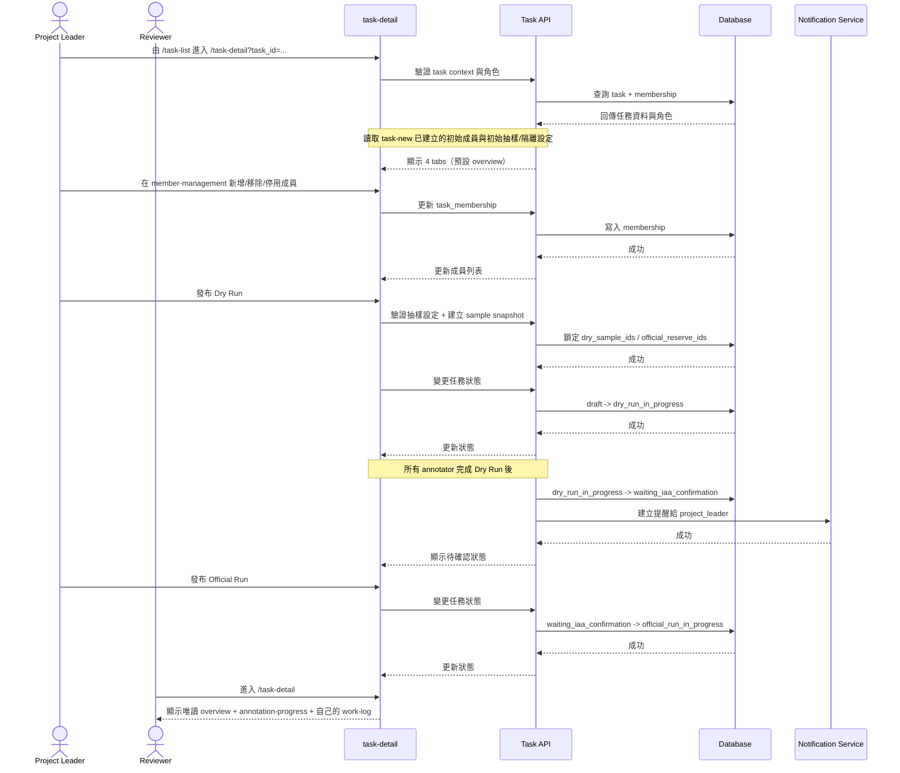
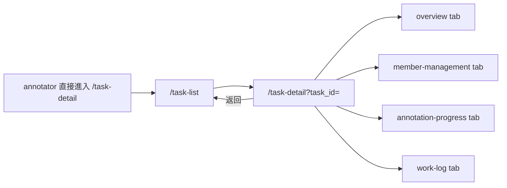

# 功能規格：Task Detail — 任務詳情（4 Tabs + 成員管理 + 執行控制）

**功能分支**：`014-task-detail`
**建立日期**：2026-04-20
**版本**：1.4.5
**狀態**：Draft
**需求來源**：IA Spec 清單 #014 — 任務詳情（成員管理調整 / 執行控制調整 / Dry Run / Official Run / 工時紀錄 / 匯出）（`task-detail`）

## 規格常數

- `TASK_ROLES = project_leader | reviewer | annotator`
- `TASK_TABS = overview | member-management | annotation-progress | work-log`
- `TASK_STATUSES = draft | dry_run_in_progress | waiting_iaa_confirmation | official_run_in_progress | completed`
- `EXPORT_FORMATS = json | json-min`
- `EXPORT_SYNC_MAX_ROWS = 10000`
- `TASK_DETAIL_UNAUTHORIZED_REDIRECT = /task-list`
- `DRY_RUN_COMPLETION_RULE = all active annotators: assigned_count == completed_count`
- `DRAFT_SAMPLING_MODES = by_count | by_percentage`
- `DRAFT_SAMPLING_PERCENT_RANGE = 1..99`
- `DRAFT_SAMPLING_COUNT_MIN = 1`
- `DRAFT_SAMPLING_DEFAULT_STRATEGY = stratified_random`
- `DRAFT_SAMPLING_STRATA_SOURCE = task_config.sampling_strata_fields`
- `DRAFT_SAMPLING_PERCENT_ROUNDING = floor`
- `SAMPLE_SNAPSHOT_LOCK_EVENT = publish_dry_run`
- `RESAMPLE_ALLOWED_STATUS = draft`
- `MOBILE_BP = 767px`
- `RWD_VIEWPORTS = 375px / 768px / 1440px`

## Process Flow

| 步驟 | 角色 | 動作 | 系統回應 |
|------|------|------|---------|
| 1 | `project_leader` / `reviewer` | 進入 `/task-detail` | 驗證 task context 後顯示頁面，預設 `overview` tab |
| 2 | `project_leader` | 管理成員 | 可新增、移除/停用任務成員；既有成員角色唯讀（承接 task-new 初始值） |
| 3 | `project_leader` | 發布 Dry Run | 狀態轉為 `dry_run_in_progress` |
| 4 | 系統 | 所有 annotator 完成 Dry Run | 自動轉為 `waiting_iaa_confirmation` 並產生提醒 |
| 5 | `project_leader` | 發布 Official Run | 狀態轉為 `official_run_in_progress` |
| 6 | `reviewer` | 查看任務詳情 | 僅可唯讀可見授權 tab，且 work-log 僅自己的資料 |
| 7 | `annotator` | 嘗試進入 `/task-detail` | 阻擋存取並導回 `/task-list`，顯示無權限提示 |

---

## 使用者情境與測試 *(必填)*

### User Story 1 — Project Leader 管理任務與成員（優先級：P1）

Project Leader 可在任務詳情頁操作四個 tab，並執行成員調整、執行發布與匯出結果。

**此優先級原因**：任務推進與協作的核心控制面板。  
**獨立測試方式**：以 `project_leader` 登入，驗證四個 tab、成員管理、狀態切換與匯出操作。

**驗收情境**：

1. **Given** `task_role = project_leader`，**When** 進入 `/task-detail`，**Then** 可看到四個 tab 且預設為 `overview`。
2. **Given** 位於 `member-management`，**When** 從平台使用者清單加入/移除/停用成員，**Then** 成員列表更新且新加入成員角色生效。
3. **Given** 任務在 `draft`，**When** 點擊發布 Dry Run，**Then** 狀態變為 `dry_run_in_progress`。
4. **Given** 任務在 `waiting_iaa_confirmation`，**When** 點擊發布 Official Run，**Then** 狀態變為 `official_run_in_progress`。
5. **Given** 位於 `overview`，**When** 點擊匯出，**Then** 可匯出 `json` 或 `json-min`。

**介面定義（需與 IA 導覽語意一致）**：

- Tab A：`任務概覽`（預設）
  - 區塊 1：`任務基本資訊`
    - 欄位：任務名稱、`task_type`、建立者、建立時間、最近更新時間
  - 區塊 2：`任務設定摘要`
    - 欄位：資料集摘要（筆數/來源）、config 版本、說明文件狀態（已上傳/未上傳）、是否啟用「開始標記前強制顯示」
  - 區塊 3：`任務狀態與執行控制`
    - 初始值來源：成員、抽樣模式/數值、資料隔離由 `task-new` 建立時帶入；`task-detail` 負責後續調整與發布控制
    - 狀態列：`draft` / `dry_run_in_progress` / `waiting_iaa_confirmation` / `official_run_in_progress` / `completed`
    - 操作：`發布 Dry Run`、`發布 Official Run`
    - 試標資料抽樣設定（可調整）：
      - 抽樣方式：`筆數` 或 `百分比`
      - 抽樣輸入：可輸入「取 N 筆」或「取 N%」作為試標資料
      - 抽樣策略：預設 `stratified_random`；若無可分層欄位則退化為 `random(seed)`
      - 分層欄位來源：`task_config.sampling_strata_fields`；未設定或欄位無效時退化 `random(seed)`
      - 計算規則：百分比換算筆數採 `floor(total * percent / 100)`；若結果 `< 1` 則阻擋發布並提示改用較大百分比或固定筆數
      - 即時摘要：顯示 `試標使用量` 與 `正式標註預留量（剩餘資料）`
      - 規則：正式標註預設使用「扣除試標後的剩餘資料集」
      - 快照凍結：按下 `發布 Dry Run` 時，系統固定 `sample_snapshot_id` 與資料 id 清單，後續資料集更新不回溯改動本次 run 切分
    - 資料隔離設定：
      - 控制項：`是否啟用資料隔離（試標與正式標註）`
      - 啟用時：試標與正式標註資料/結果分區儲存，試標不污染正式標記資料
      - 停用時：顯示高風險警告與二次確認，並記錄操作審計
      - 可觀測性：Overview 必須顯示目前隔離狀態 badge（`isolated` / `non-isolated`）與最後異動者/時間
    - 權限：僅 `project_leader` 可執行；`reviewer` 顯示唯讀狀態與 disabled 按鈕提示
  - 區塊 4：`匯出結果`
    - 操作：`匯出 JSON`、`匯出 JSON-MIN`
    - 顯示：最近一次匯出時間、匯出 run stage（Dry/Official）
    - 空狀態：無可匯出資料時顯示「尚無可匯出結果」
- Tab B：`成員管理`
  - 區塊 1：`目前成員清單`
    - 欄位：姓名、Email、任務角色、狀態（active/disabled）、加入時間、最後活動時間、操作
    - 操作：移除成員、停用成員（僅 `project_leader`）；既有成員角色唯讀不可編輯
  - 區塊 2：`可加入成員名單`
    - 欄位：平台使用者姓名、Email、系統角色、目前是否已在此任務
    - 操作：加入任務並指派 `reviewer` 或 `annotator`
  - 角色可見性：`reviewer` 不顯示此 tab；若以直連方式進入，導回 `overview` 並提示無權限
- Tab C：`標記進度`
  - 區塊 1：`整體進度摘要`
    - 指標：總樣本數、已完成數、完成率、平均速度、剩餘估計時間
    - 維度切換：`Dry Run` / `Official Run`
  - 區塊 2：`成員進度表`
    - 欄位：成員姓名、角色、已完成數、待完成數、平均速度、最後提交時間、品質旗標
    - 排序：預設依已完成數降冪，可切換依速度/最後提交排序
  - 區塊 3：`階段分段進度`
    - 呈現：Dry 與 Official 分開進度條與統計，不可混算
  - 空狀態：尚未開始標記時顯示「尚無進度資料」，並提供回到 `任務概覽` 的 CTA
- Tab D：`工時紀錄`
  - 區塊 1：`工時篩選列`
    - 篩選：日期區間、任務階段（Dry/Official）
    - `project_leader` 額外可用：成員篩選
  - 區塊 2：`工時明細表`
    - 欄位：日期、成員、工作時長、完成筆數、平均速度、run stage
    - 匯總：當前篩選條件下總工時、總完成筆數、加權平均速度
  - 區塊 3：`異常提醒`
    - 顯示：速度異常（過快/過慢）與缺漏打卡提示
  - 角色可見性：
    - `project_leader`：可查看全成員資料
    - `reviewer`：僅查看自己資料，不顯示成員篩選
  - 空狀態：無工時資料時顯示「尚無工時紀錄」

**行為規則**：

- tab 切換為頁內行為，不觸發路由跳轉。
- `project_leader` 可編輯 member-management 中的新增/停用/移除；既有成員角色維持唯讀，其他角色不得有編輯權。
- `project_leader` 僅可管理自己所屬任務的成員，不可跨任務異動。

**Prototype 互動規格（本版必做）**：

- 首次進入 `/task-detail` 時，頁面需有 `loading skeleton` 狀態；資料載入完成後才顯示 tab 內容。
- `overview` 的執行控制按鈕顯示規則固定化：
  - `draft`：顯示 `發布 Dry Run`
  - `waiting_iaa_confirmation`：顯示 `發布 Official Run`
  - 其他狀態：不顯示發布按鈕，只顯示狀態 badge 與說明文字
- `draft` 狀態需可調整試標抽樣（筆數或百分比），並即時顯示正式標註可用剩餘資料量。
- `資料隔離` 預設為啟用；若使用者關閉，需先顯示不可逆風險警示並要求二次確認後才可發布。
- 抽樣輸入需即時驗證：`百分比僅允許 1..99`、`筆數 >= 1 且 < total`，違規時阻擋發布並顯示錯誤訊息。
- `重算抽樣` 僅允許在 `draft` 狀態；若已進入 Dry Run，僅可建立新 run 批次，不可覆寫既有 `sample_snapshot_id`。
- `reviewer` 在 `overview` 需顯示 disabled 執行按鈕（含 tooltip：`僅 project leader 可操作`），避免看不到入口而誤解。
- 各 tab 需定義空狀態區塊（icon + 文案 + 可行下一步 CTA）；空狀態不得使用全白空表格。
- `member-management` 的危險操作（移除/停用）需二次確認 modal，modal 文案包含被影響成員名稱與角色。
- `annotation-progress` 與 `work-log` 的表格在 mobile 使用橫向捲動容器，不壓縮到欄位重疊。
- 當語言切換為中文時，`member-management` 中成員狀態與系統角色顯示值必須使用中文（例如：`active/disabled/user` 顯示為 `啟用/停用/一般使用者`）。
- `member-management` 的列內操作按鈕需使用語意色階：`加入任務=primary`、`啟用=success`、`停用=warning`、`移除=danger`，以降低誤操作。
- 列內操作按鈕必須定義 `default / hover / focus-visible / disabled` 狀態，且 `focus-visible` 需有可見外框。

---

### User Story 2 — Reviewer 的唯讀存取邊界（優先級：P1）

Reviewer 可進入任務詳情查看必要資訊，但不得執行成員管理與其他越權操作。

**此優先級原因**：確保審核角色有足夠資訊但不破壞職責邊界。  
**獨立測試方式**：以 `reviewer` 登入，驗證 tab 可見性、唯讀限制、work-log 資料範圍。

**驗收情境**：

1. **Given** `task_role = reviewer`，**When** 進入 `/task-detail`，**Then** 可見 `overview`、`annotation-progress`、`work-log`。
2. **Given** `task_role = reviewer`，**When** 嘗試以直連進入 `member-management`，**Then** 導回 `overview` 並顯示無權限提示。
3. **Given** `task_role = reviewer`，**When** 進入 `work-log`，**Then** 僅可見自己的工時資料。
4. **Given** `task_role = annotator`，**When** 直接開啟 `/task-detail`，**Then** 系統阻擋並導回 `/task-list` 顯示無權限提示。

**行為規則**：

- Reviewer 對 `overview` 為唯讀，不可執行發布操作與成員異動。
- Reviewer 不顯示 `member-management` tab；若強行以 URL/query 進入，需導回 `overview`。
- Reviewer 的 `work-log` 篩選維度僅允許日期區間與任務階段，不提供成員篩選。
- 無權限角色不得透過 API 讀到超出授權資料。
- Reviewer 在 `overview`、`annotation-progress`、`work-log` 中可見的操作按鈕皆為唯讀樣式（disabled 或隱藏），且需保持同位置以避免版面跳動。

---

### User Story 3 — 任務狀態轉換、執行設定調整與資料隔離（優先級：P1）

任務需遵守固定狀態機，並在承接 `task-new` 初始設定後支援調整試標抽樣比例/筆數，且可選擇是否啟用試標與正式標註資料隔離。

**此優先級原因**：讓團隊可控地切分試標資料，同時避免（或明確承擔）測試資料污染正式成果風險。  
**獨立測試方式**：模擬完整狀態轉換，驗證轉換條件、初始抽樣載入、試標抽樣調整計算、正式標註剩餘資料分配、隔離設定行為。

**驗收情境**：

1. **Given** 任務為 `draft`，**When** 發布 Dry Run，**Then** 狀態只能轉為 `dry_run_in_progress`。
2. **Given** 所有 `active annotator` 達到 `assigned_count == completed_count`，**When** 系統檢查完成條件，**Then** 自動轉為 `waiting_iaa_confirmation` 並對 `project_leader` 發送提醒。
3. **Given** 任務為 `waiting_iaa_confirmation`，**When** 發布 Official Run，**Then** 狀態轉為 `official_run_in_progress`。
4. **Given** 任務資料含 Dry 與 Official 兩階段且已啟用資料隔離，**When** 查詢匯出資料，**Then** 系統不得混入不同階段的資料集。
5. **Given** 任務為 `draft`，**When** 使用者調整試標抽樣為 `N 筆` 或 `N%`，**Then** 系統需即時計算試標使用資料與正式標註剩餘資料。
6. **Given** 使用者關閉資料隔離，**When** 發布 Run 前確認，**Then** 系統需顯示風險警告、要求二次確認並寫入審計紀錄。

**行為規則**：

- 狀態轉換必須符合 `TASK_STATUSES` 順序，不允許跳階。
- 任務建立後，task-detail 必須先顯示由 `task-new` 帶入的初始成員、抽樣與資料隔離設定，再允許調整。
- Dry Run 完成條件採 `DRY_RUN_COMPLETION_RULE`，僅計入 `membership_status = active` 的 annotator。
- Dry Run 完成通知需在 dashboard 待處理區顯示 badge。
- Draft Run 必須支援以「固定筆數」或「固定百分比」抽樣資料集。
- Draft Run 抽樣百分比輸入僅允許 `1..99`；筆數輸入需 `>= DRAFT_SAMPLING_COUNT_MIN` 且 `< 資料集總筆數`。
- 百分比抽樣換算筆數採 `DRAFT_SAMPLING_PERCENT_ROUNDING`（`floor`）；若換算結果 `< 1`，系統必須阻擋發布並提供修正建議。
- 系統必須保證 Official Run 至少保留 1 筆資料。
- Official Run 預設使用「扣除 Draft Run 後的剩餘資料」作為正式標記資料集。
- 抽樣策略預設 `DRAFT_SAMPLING_DEFAULT_STRATEGY`；分層欄位來源為 `DRAFT_SAMPLING_STRATA_SOURCE`，若不可用則退化為 `random(seed)`，並記錄 `random_seed` 供重現。
- 系統需在 `SAMPLE_SNAPSHOT_LOCK_EVENT` 產生不可變 `sample_snapshot_id`，凍結 Dry/Official 資料切分。
- `重算抽樣` 僅可在 `RESAMPLE_ALLOWED_STATUS` 觸發；超出狀態需改走「建立新 run 批次」。
- 匯出請求必須指定 run stage（Dry/Official）；啟用資料隔離時必須保證 Dry/Official 資料不混用。
- 匯出檔案 metadata 必須包含：`run_stage`、`isolation_enabled`、`sampling_mode`、`sampling_value`、`sampling_strategy`、`sample_snapshot_id`。
- 資料隔離為可設定選項，預設啟用；若停用需二次確認並保留審計軌跡。
- 匯出資料量 `<= EXPORT_SYNC_MAX_ROWS` 採同步回應；超過門檻採背景工作並通知下載連結。

---

### Edge Cases

- `task_id` 不存在或使用者無 membership：導回 `/task-list` 並顯示提示。
- `annotator` 或無權限角色直接進入 `/task-detail`：導回 `TASK_DETAIL_UNAUTHORIZED_REDIRECT` 並顯示無權限提示。
- reviewer 嘗試呼叫成員管理 API：回傳拒絕，且不可修改任何資料。
- reviewer 嘗試直連 `member-management`：導回 `overview` 並顯示無權限提示。
- 成員移除後仍有未完成作業：需有阻擋或警告流程，避免統計中斷。
- Dry Run 未滿足完成條件前嘗試發布 Official Run：系統拒絕並回傳原因。
- Draft Run 抽樣輸入為 `0%`、`100%`、`0 筆`、或 `>= 資料集總數`：系統阻擋發布並顯示可修正提示。
- 百分比抽樣因資料量過小導致換算為 `0`：系統阻擋發布，提示提高百分比或改用固定筆數。
- 資料集在 Draft Run 發布後新增/刪除資料：不影響既有 `sample_snapshot_id`；若需重切分，`draft` 可重算抽樣，其餘狀態僅可建立新 run 批次。
- 使用者停用資料隔離後嘗試匯出：系統需在匯出確認與檔案 metadata 明確標記 `non-isolated` 風險。
- 匯出大資料量超時：採背景工作與通知下載連結，避免頁面無回應。
- 任一 tab API 載入失敗：tab 區塊顯示錯誤態（錯誤文案 + `重試` 按鈕），不影響其他 tab 切換。

---

## 需求規格 *(必填)*

### 功能需求

- **FR-001**：系統必須提供 `/task-detail` 並以 `task_id` 建立任務上下文。
- **FR-002**：僅 `project_leader` 與 `reviewer` 可進入 `/task-detail`。
- **FR-002a**：無權限角色（含 `annotator`）造訪 `/task-detail` 時，系統必須導回 `TASK_DETAIL_UNAUTHORIZED_REDIRECT` 並顯示無權限提示。
- **FR-003**：頁面必須提供四個 tabs：`overview`、`member-management`、`annotation-progress`、`work-log`，且預設為 `overview`。
- **FR-004**：tab 切換必須為頁內行為，不觸發路由跳轉。
- **FR-005**：`project_leader` 必須可於 `member-management` 執行成員新增、移除/停用；新加入時可指派角色。
- **FR-005a**：`member-management` 必須先顯示由 `task-new` 帶入的初始成員；既有成員角色為唯讀，若需變更必須移除後重新加入。
- **FR-006**：`reviewer` 不可見 `member-management` tab；若以直連方式進入，系統必須導回 `overview` 並提示無權限。
- **FR-007**：`reviewer` 的 `work-log` 僅可查看自己的資料。
- **FR-008**：任務狀態轉換必須遵守 `TASK_STATUSES` 狀態機。
- **FR-008a**：當所有 `active annotator` 皆滿足 `assigned_count == completed_count` 時，系統必須自動轉為 `waiting_iaa_confirmation` 並建立提醒。
- **FR-009**：系統必須支援在 `overview` 匯出結果，格式至少含 `EXPORT_FORMATS`。
- **FR-009a**：匯出時必須指定 run stage（Dry/Official）；`<= EXPORT_SYNC_MAX_ROWS` 同步回應，超過門檻改為背景工作並通知下載連結。
- **FR-010**：系統必須提供試標抽樣設定調整，支援以「筆數」或「百分比」指定試標使用資料量。
- **FR-010a**：task-detail 載入時，必須先顯示 `task-new` 建立時的初始抽樣設定；調整後才覆蓋為最新值。
- **FR-010b**：系統必須提供「資料隔離」開關，預設為啟用；啟用時 Dry/Official 資料與結果不得混用。
- **FR-010c**：當使用者停用資料隔離時，系統必須顯示高風險警告、要求二次確認，並記錄審計資訊（操作者、時間、設定值）。
- **FR-010d**：試標抽樣輸入驗證規則必須明確：百分比 `1..99`；筆數 `>= 1` 且 `< 資料集總筆數`，不符時阻擋發布。
- **FR-010e**：百分比轉筆數必須使用 `floor` 規則，且系統必須保證 Official Run 至少保留 1 筆資料。
- **FR-010f**：系統必須在發布 Dry Run 時建立不可變 `sample_snapshot_id`，並凍結 Dry/Official 對應資料 id 清單。
- **FR-010g**：系統必須支援抽樣策略，預設 `stratified_random`；當分層條件不可用時退化為 `random(seed)` 並記錄 seed。
- **FR-010h**：Overview 必須顯示資料隔離狀態 badge（`isolated`/`non-isolated`）與最後變更資訊。
- **FR-010i**：匯出結果檔 metadata 必須包含 `run_stage`、`isolation_enabled`、`sampling_mode`、`sampling_value`、`sampling_strategy`、`sample_snapshot_id`。
- **FR-010j**：`stratified_random` 的分層欄位來源必須為 `task_config.sampling_strata_fields`；若未設定或無效，系統必須自動退化為 `random(seed)`。
- **FR-010k**：當百分比抽樣換算結果 `< 1` 時，系統必須阻擋發布並提供可修正提示，不得自動調整為 1。
- **FR-010l**：`重算抽樣` 僅允許在 `draft` 狀態；非 `draft` 狀態僅可建立新 run 批次，且不得覆寫既有 `sample_snapshot_id`。
- **FR-011**：頁面必須支援 `RWD_VIEWPORTS`，在 `<= MOBILE_BP` 仍可完成核心查看與操作。
- **FR-011a**：在 `375px`、`768px`、`1440px` 三個 viewport，必須可完成：進入詳情、tab 切換、run 發布權限顯示、`project_leader` 成員管理、`work-log` 篩選、匯出操作，且不得資訊重疊。
- **FR-012**：Prototype 必須提供三類畫面狀態：`loading`、`empty`、`error`，且各 tab 至少有一組可展示案例。
- **FR-013**：Run 控制按鈕顯示邏輯需與任務狀態一一對應，避免同時顯示互斥操作（如同時出現 Dry 與 Official 發布）。

### User Flow & Navigation

| From | Trigger | To |
|------|---------|-----|
| `/task-list` | 點選任務 | `/task-detail?task_id=...` |
| `/task-detail` | 點選 tab | 同頁切換至對應 tab |
| `/task-detail` | 點擊返回 | `/task-list` |
| `annotator` 直接造訪 `/task-detail` | 路由守門 | `/task-list` 並顯示無權限提示 |

**Entry points**：`/task-list` 任務列。  
**Exit points**：返回 `/task-list` 或切換到其他 L0 模組。

### 關鍵實體

- **TaskDetail**：任務詳情聚合。欄位：`task_id`、`task_name`、`task_type`、`status`、`run_stage`、`settings`、`sampling_mode`、`sampling_value`、`sampling_strategy`、`random_seed`、`isolation_enabled`、`sample_snapshot_id`。
- **TaskMembership**：任務成員。欄位：`task_id`、`user_id`、`task_role`、`membership_status`。
- **RunStateTransition**：狀態轉換紀錄。欄位：`from_status`、`to_status`、`triggered_by`、`triggered_at`。
- **WorkLogEntry**：工時紀錄。欄位：`user_id`、`date`、`duration`、`completed_count`、`avg_speed`、`run_stage`。
- **SampleSnapshot**：run 抽樣快照。欄位：`sample_snapshot_id`、`task_id`、`sampling_mode`、`sampling_value`、`sampling_strategy`、`random_seed`、`locked_at`、`locked_by`、`selection_manifest_ref`（指向分片或外部清單，不直接內嵌大量 ids）。
- **IsolationAuditLog**：資料隔離設定審計。欄位：`task_id`、`from_isolation_enabled`、`to_isolation_enabled`、`changed_by`、`changed_at`、`reason`。

---

## 規格相依性 *(本功能依賴其他規格，或被其他規格依賴時填寫)*

### 上游（本規格依賴的規格）

| 規格編號 | 功能 | 本規格需要的內容 |
|---------|------|----------------|
| 010 | Task List | 任務入口與 task_id 導入 |
| 013 | New Task | 任務初始設定、建立者 membership、自動導頁 |
| 012 | Dashboard | 待處理提醒顯示與導覽語意 |

### 下游（依賴本規格的規格）

| 規格編號 | 功能 | 依賴本規格的內容 |
|---------|------|----------------|
| 015 | Annotation Workspace | run 階段控制、說明設定、成員角色授權 |
| 016 | Dataset Stats | 任務階段與產出統計來源 |
| 017 | Dataset Quality | IAA 與品質分析所依賴的 run 階段與資料隔離 |

---

## 成功標準 *(必填)*

- **SC-001**：`project_leader` 可在 `/task-detail` 使用四個 tabs 並完成成員調整與執行控制。
- **SC-001a**：`task-detail` 可正確顯示由 `task-new` 建立時帶入的初始成員、抽樣與資料隔離設定。
- **SC-002**：`reviewer` 可唯讀存取授權內容，且 `work-log` 僅顯示本人資料。
- **SC-003**：`annotator` 不能進入 `/task-detail`，會被導向 `/task-list` 並顯示無權限提示。
- **SC-004**：任務狀態轉換遵循定義順序，Dry Run 完成後可自動進入待 IAA 並產生提醒。
- **SC-005**：當 `isolation_enabled = true` 時，匯出與查詢結果中 Dry Run / Official Run 資料不會混入；當 `isolation_enabled = false` 時，系統可清楚揭露風險狀態與審計紀錄。
- **SC-006**：`reviewer` 不可見 `member-management`，且直連嘗試會導回 `overview`。
- **SC-007**：在 `375px`、`768px`、`1440px` 下可完成進入詳情、tab 切換、執行權限顯示、成員管理（PL）、work-log 篩選、匯出操作，且無資訊重疊。
- **SC-008**：當使用 `stratified_random` 時，系統可追溯分層欄位來源；退化為 `random(seed)` 時可追溯 seed 與退化原因。
- **SC-009**：非 `draft` 狀態不可重算抽樣；系統僅允許建立新 run 批次且保留既有快照完整性。

---

## Changelog

| 版本 | 日期 | 變更摘要 |
|------|------|---------|
| 1.0.0 | 2026-04-20 | 初版建立：依 IA 重建 `task-detail` 規格（4 tabs、角色可見性、狀態轉換、資料隔離） |
| 1.1.0 | 2026-04-20 | 補強 prototype 導向規格：Run 按鈕顯示條件、loading/empty/error 狀態、危險操作二次確認、mobile 表格呈現規則 |
| 1.2.0 | 2026-04-21 | 補強資料標記流程規格：抽樣驗證與換算規則、抽樣策略與 seed、sample snapshot 凍結、隔離狀態可觀測性、匯出 metadata、成功標準與隔離開關一致化 |
| 1.3.0 | 2026-04-21 | 補強審查缺口：分層欄位來源、百分比小樣本處置、重算抽樣狀態邊界、隔離審計實體、snapshot 可擴展儲存參照 |
| 1.4.0 | 2026-04-21 | 同步 013：明確將首次成員/抽樣/隔離設定定位於 task-new；task-detail 改為承接初始值後調整與發布；並統一「執行控制／試標抽樣／資料集總筆數」用詞 |
| 1.4.1 | 2026-04-21 | 成員管理規格修正：既有成員任務角色改為唯讀，不可中途切換；若需變更角色必須移除後重新加入，並同步調整流程、驗收情境與 FR-005/FR-005a 描述 |
| 1.4.2 | 2026-04-21 | 移除成員管理頁「角色指派規則提示」區塊，並同步調整 prototype 與介面定義描述 |
| 1.4.3 | 2026-04-21 | 移除任務詳情頁面中的 Task ID 顯示（頁首與基本資訊），並同步調整介面定義欄位 |
| 1.4.4 | 2026-04-21 | 語系顯示修正：中文模式下 member-management 的成員狀態與系統角色改為中文顯示（啟用/停用/一般使用者） |
| 1.4.5 | 2026-04-21 | 操作按鈕語意色階優化：member-management 列內操作改為 primary/success/warning/danger 分層，並補 focus-visible 規範 |
