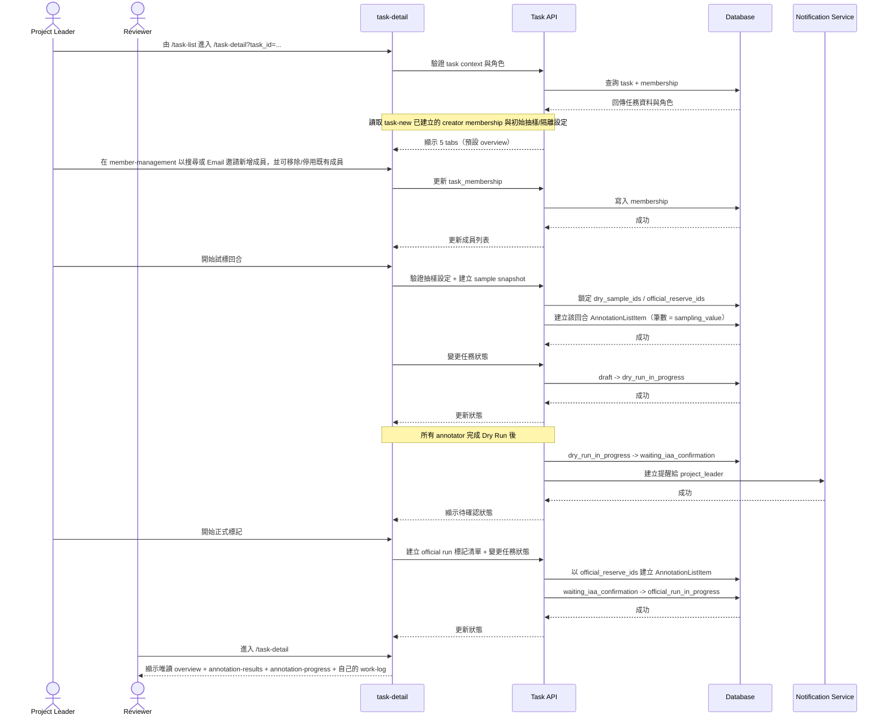
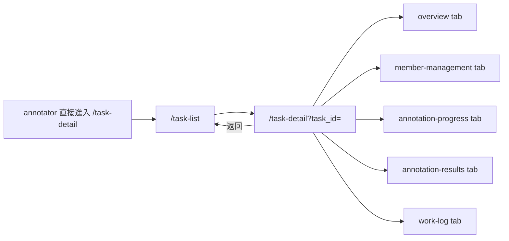

# 功能規格：Task Detail — 任務詳情（5 Tabs + 成員管理 + 執行控制）

**需求來源**: IA Spec 清單 #014 — 任務詳情（成員管理調整 / 執行控制調整 / Dry Run / Official Run / 工時紀錄 / 匯出）（`task-detail`）

## 已釐清事項

- 本版以既有需求來源與本文件中的 流程圖、使用者情境、功能需求、成功標準 作為 scope baseline。
- 跨頁或跨模組共用行為需透過「規格相依性」追蹤，不在本文件中隱含建立未列出的依賴。
- 若後續新增實作層契約，需先確認是否構成行為變更；若是，必須依 SDD 流程更新 spec。

## Clarifications

### Session 2026-05-22

- Q: 當 `project_leader` 對「仍有未完成作業」的成員執行移除時，系統應採用哪個規則？ → A: 允許移除，未完成作業改為未指派狀態，待 PL 手動處理
- Q: 五個 tabs 的顯示順序應以哪個為準？ → A: `overview → member-management → annotation-progress → annotation-results → work-log`
- Q: Dry Run 中存在「未指派作業」時，是否允許自動轉為 `waiting_iaa_confirmation`？ → A: 不允許；需先重新指派並完成或由 PL 明確排除
- Q: 被 PL 明確排除的 Dry Run 作業，後續應如何出現在統計與匯出中？ → A: 不計入完成率與 IAA；匯出只保留排除紀錄 metadata
- Q: 未指派作業是否只限 Dry Run？ → A: 否；應為未指派標記作業，Dry Run 與 Official Run 都可重新指派

### Session 2026-08-27

- Q: IAA 未達門檻時，`waiting_iaa_confirmation` 狀態轉換與「開始正式標記」按鈕是否應被阻擋（issue #488 T1）？ → A: 不阻擋；IAA 語意為顧問性警示，計算方式與門檻正典移至 `dataset-017` FR-039，`014` 僅顯示唯讀指標與使用者可覆寫門檻，不得另行定義計算規則。
- Q: 第 2 輪（含）以後的試標回合是否需強制記錄修訂內容（issue #492 A4/A5）？ → A: 是；`R{n}`（`n >= 2`）建立前必須填寫 `prior_round_findings` 與 `guideline_change_summary`，或勾選 `no_change` 並填寫 `no_change_reason`；`R1` 因無「前一輪」可回顧而豁免。
- Q: 指引版本（`guideline_version`）應以內容快照或版本參照方式與試標回合綁定？ → A: 採 FK 參照（`TrialRound.guideline_version` → `TaskGuidelineConfig.guideline_version`），不複製指引內容快照；版本遞增觸發條件為 `OVERVIEW_EDITABLE_FIELDS` 中指引內容欄位被實際修改並儲存。

## 規格常數

- `TASK_ROLES = project_leader | reviewer | annotator`
- `TASK_TABS = overview | member-management | annotation-progress | annotation-results | work-log`
- `TASK_TYPE_COMPOSITION = categories[] + input_types[] + outputs[]`（ADR-029 組合式任務類型；`013-task-new` Step 1 chips 為 source of truth）
- `OUTPUT_TYPE_KEYS = single_label | multi_label | single_dim | multi_dim | sequence_tagging | entity_recognition | relation_identification | free_text`（來源：`013-task-new` OUTPUT_TYPE_REGISTRY，8-key registry）
- `LEGACY_TASK_TYPE_EXPORT_ENUM = single_sentence_classification | single_sentence_va_scoring | sequence_labeling | relation_extraction | generation_single_item_free_text | sentence_pairs`（僅供匯出檔 `task_type` 欄位與 annotation-results 呈現分流沿用；由 outputs[] 組合推導，非使用者可編輯欄位）
- `LEGACY_SEQUENCE_LABELING_SUBTYPE = ''`（ADR-029 outputs[] config 不再攜帶 `subtype`；匯出檔 `sequence_labeling_subtype` 欄位保留但值為空字串）
- `TASK_STATUSES = draft | dry_run_in_progress | waiting_iaa_confirmation | official_run_in_progress | completed`
- `EXPORT_FORMATS = json | json-min`
- `EXPORT_JSON_SHAPE = top-level object { manifest, items[] }`
- `EXPORT_JSON_MIN_SHAPE = flat array rows[]`
- `EXPORT_COMMON_FIELDS = task_id | task_name | task_type | run_stage | sample_snapshot_id | sample_id | source_data | annotation_status | review_status | created_at | updated_at`
- `EXPORT_ANNOTATION_FIELDS = annotation_id | annotator_id | annotator_name | submitted_at | lead_time_seconds | is_draft | result`
- `EXPORT_REVIEW_FIELDS = review_id | reviewer_id | reviewer_name | reviewed_at | decision | corrected_result | review_note`
- `EXPORT_DYNAMIC_RESULT_FIELDS = task_type-driven`
- `EXPORT_SYNC_MAX_ROWS = 10000`
- `TASK_DETAIL_UNAUTHORIZED_REDIRECT = /task-list`
- `DRY_RUN_COMPLETION_RULE = no unassigned dry-run assignments AND all membership_status=active annotators: assigned_count == completed_count`
- `DRAFT_SAMPLING_COUNT_MIN = 1`
- `OUTPUT_TYPE_IAA_REGISTRY`（唯讀顯示用；source of truth：`dataset-017-dataset-analysis-detail` 規格常數同名表格）——每個 `outputs[].type` 對應一筆 `{ type, primary_metric_name, default_threshold }` 紀錄；task-detail 僅讀取顯示，不得另建第二份指標/預設值定義（憲法：Generalization-First）。實作落地點標註：`task-config.data.js`（spec 僅描述 WHAT，落地點為實作註記，非行為契約）。
- `target_agreement_overrides = { [output_type]: number }`（使用者可對任一 `outputs[].type` 覆寫其 IAA 目標門檻；未設定的 key 回退至 `OUTPUT_TYPE_IAA_REGISTRY` 對應 `default_threshold`）
- `REVIEW_ASSIGNMENT_MODES = auto | manual`（`auto` = 系統輪派審核員直到每筆資料湊滿 `min_reviewers` 位；`manual` = `project_leader` 於成員管理逐一分派）
- `MIN_REVIEWERS_RULE = 整數且 >= 1`（`1` = 單一終審員；`N >= 2` = 每筆資料由 N 位審核員並行審核，收斂語意見 `015` FR-061）
- `ARBITER_CANDIDATE_RULE = task_role = reviewer AND membership_status = active`（`arbiter_ids` 可留空 = 任一未參與該筆審核的審核員皆可認領，對齊 `015` FR-060）
- `AR_REVIEW_STATUS = pending | approved | modified | disputed | finalized`（沿用 `015` `REVIEW_UNIT_STATUS` 五態；中文語彙 `待審 / 已同意 / 已修改 / 爭議中 / 已定稿`；annotation-results 的審核狀態 badge 與審核狀態篩選選項皆由此常數推導，不得於選單硬編狀態清單）
- `SAMPLE_SNAPSHOT_LOCK_EVENT = publish_dry_run`
- `ANNOTATION_LIST_MATERIALIZATION_EVENTS = add_trial_round | start_official_run`
- `OVERVIEW_EDITABLE_STATUS = draft`
- `OVERVIEW_EDITABLE_ROLE = project_leader`
- `OVERVIEW_EDITABLE_FIELDS = task_name | task_type(categories/input_types/outputs) | dataset | field_role_map | outputs[].config | sampling_value | target_agreement_overrides | min_annotators | isolation_enabled | min_reviewers | review_assignment_mode | agreement_auto_finalize | arbitration_enabled | arbiter_ids | annotator_guideline_text | annotator_guideline_assets | reviewer_guideline_text | reviewer_guideline_assets | force_guideline`
- `MOBILE_BP = 767px`
- `RWD_VIEWPORTS = 375px / 768px / 1440px`

## 流程圖

```mermaid
sequenceDiagram
    actor PL as Project Leader
    actor RV as Reviewer
    participant UI as task-detail
    participant API as Task API
    participant DB as Database
    participant Notify as Notification Service

    PL->>UI: 由 /task-list 進入 /task-detail?task_id=...
    UI->>API: 驗證 task context 與角色
    API->>DB: 查詢 task + membership
    DB-->>API: 回傳任務資料與角色
    Note over UI,API: 讀取 task-new 已建立的 creator membership 與初始抽樣/隔離設定
    API-->>UI: 顯示 5 tabs（預設 overview）

    PL->>UI: 在 member-management 以搜尋或 Email 邀請新增成員，並可移除/停用既有成員
    UI->>API: 更新 task_membership
    API->>DB: 寫入 membership
    DB-->>API: 成功
    API-->>UI: 更新成員列表

    PL->>UI: 開始試標回合
    UI->>API: 驗證抽樣設定 + 建立 sample snapshot
    API->>DB: 鎖定 dry_sample_ids / official_reserve_ids
    API->>DB: 建立該回合 AnnotationListItem（筆數 = sampling_value）
    DB-->>API: 成功
    UI->>API: 變更任務狀態
    API->>DB: draft -> dry_run_in_progress
    DB-->>API: 成功
    API-->>UI: 更新狀態

    Note over UI,API: 所有 annotator 完成 Dry Run 後
    API->>DB: dry_run_in_progress -> waiting_iaa_confirmation
    API->>Notify: 建立提醒給 project_leader
    Notify-->>API: 成功
    API-->>UI: 顯示待確認狀態

    PL->>UI: 開始正式標記
    UI->>API: 建立 official run 標記清單 + 變更任務狀態
    API->>DB: 以 official_reserve_ids 建立 AnnotationListItem
    API->>DB: waiting_iaa_confirmation -> official_run_in_progress
    DB-->>API: 成功
    API-->>UI: 更新狀態

    RV->>UI: 進入 /task-detail
    UI-->>RV: 顯示唯讀 overview + annotation-results + annotation-progress + 自己的 work-log
```

| 步驟 | 角色 | 動作 | 系統回應 |
|------|------|------|---------|
| 1 | `project_leader` / `reviewer` | 進入 `/task-detail` | 驗證 task context 後顯示頁面，預設 `overview` tab |
| 2 | `project_leader` | 管理成員 | 可新增、移除/停用任務成員；既有成員角色唯讀（承接 task-new 初始值） |
| 3 | `project_leader` | 開始試標回合 | 狀態轉為 `dry_run_in_progress` |
| 4 | 系統 | 無未指派 Dry Run 標記作業，且所有 `membership_status = active` 的 `annotator` 完成各自被指派的 Dry Run 全部樣本 | 自動轉為 `waiting_iaa_confirmation` 並產生提醒 |
| 5 | `project_leader` | 開始正式標記 | 狀態轉為 `official_run_in_progress` |
| 6 | `reviewer` | 查看任務詳情 | 僅可唯讀可見授權 tab，且 work-log 僅自己的資料 |
| 7 | `annotator` | 嘗試進入 `/task-detail` | 阻擋存取並導回 `/task-list`，顯示無權限提示 |

---

## 使用者情境與測試 *(必填)*

### 使用者故事 1 — Project Leader 管理任務與成員（優先級：P1）

Project Leader 可在任務詳情頁操作五個 tab，並執行成員調整、執行發布與查看／匯出標記結果。

**此優先級原因**：任務推進與協作的核心控制面板。
**獨立測試方式**：以 `project_leader` 登入，驗證五個 tab、成員管理、狀態切換與匯出操作。

**驗收情境**：

1. **Given** `task_role = project_leader`，**When** 進入 `/task-detail`，**Then** 可看到五個 tab 且預設為 `overview`。
2. **Given** 位於 `member-management`，**When** 透過搜尋平台成員或 Email 邀請加入，並對既有成員執行移除/停用，**Then** 成員列表更新且新加入成員角色生效。
3. **Given** 任務在 `draft`，**When** 點擊「開始試標回合」，**Then** 狀態變為 `dry_run_in_progress`。
4. **Given** 任務在 `waiting_iaa_confirmation`，**When** 點擊「開始正式標記」，**Then** 狀態變為 `official_run_in_progress`。
5. **Given** 位於 `annotation-results`，**When** 點擊匯出，**Then** 可匯出 `json` 或 `json-min`，且欄位結構需依格式與 `task_type` 正確切換。
6. **Given** 位於 `member-management` 且 `review_assignment_mode = manual`，**When** 於審核指派區塊操作「自動補齊」、單列「指派…」或「分派給仲裁者」，**Then** 未指派筆數、爭議池數與各審核員負荷（已指派／待審／已完成）即時更新，並同步反映於成員清單「審核負荷」欄。
7. **Given** 一位 `membership_status = active` 的標記員持有 1 筆已提交與 2 筆未提交的標記作業，**When** `project_leader` 於 `member-management` 將其停用並確認，**Then** 已提交作業保留並繼續計入統計，2 筆未提交作業退回未指派池等待重新指派或排除，且該標記員不再出現在可指派對象中（FR-005l）。

**介面定義（需與 IA 導覽語意一致）**：

- Tab A：`任務概覽`（預設）
  - 區塊 1：`基本資料`（名稱、類型、資料集上傳）
    - 顯示狀態：任務名稱、`task_type`、資料集（總筆數）、建立者、建立時間、最近更新時間；資料集欄位僅顯示合計筆數，不顯示檔案名稱；詳細檔案清單需進入編輯模式查看
    - 編輯狀態：任務名稱可改(必填)、任務類型可重選(必填)、資料集可追加/移除（至少保留一個）
    - 必填欄位樣式：`任務名稱`、`任務類型`、`資料集` 的 `*` 必須沿用「標記設定 schema 必填欄位」相同 `required` 樣式（label 文字 + 紅色星號 span）
    - 資料集檔案顯示：已上傳資料集沿用 `013-task-new` Step 1 的 dataset 檔案列元件，每個已上傳檔案獨立一列顯示檔名、檔案大小、眼睛預覽按鈕與移除按鈕；upload zone 持續可見，支援追加多個資料集檔案；所有已上傳檔案合併為同一資料集
  - 區塊 2：`標記設定`（設定檔介面）
    - 顯示狀態：固定顯示 `設定檔版本`（顯示使用者上傳的 config 檔名；未上傳時為空字串）與 `標記類型`；其餘摘要欄位需依當前 `task_type` 與 subtype 的 schema 動態顯示（例如 `sequence_labeling.subtype = ner` 顯示 `實體類型`、`標記格式`、`允許重疊標記`；`sequence_labeling.subtype = aspect_list` 顯示 `輸入欄位`、`Aspect List 欄位`、`Aspect 編輯規則`、`數量限制`、`Exact match 驗證`、`情緒描述檢查`；`single_sentence_va_scoring` 顯示 `Valence`、`Arousal` 兩列分數維度設定；`sentence_pairs` 顯示 `pair_mode`、`response_format`、兩句欄位對應與作答設定）
    - 編輯狀態：根據不同任務有各自的必填項目，設定檔可透過 Visual/Code 重設（套用範本或上傳 YAML/JSON），儲存後同步更新摘要；Visual 編輯器必須與 `013-task-new` Step 2 使用同一份 registry/schema 與 config source-of-truth
    - 顯示模式必填提示：動態摘要欄位若為 schema 必填欄位，欄位標籤旁必須顯示紅色 `*`
    - `single_sentence_va_scoring` 專屬規則：Visual 編輯需提供 `Valence`、`Arousal` 兩組 `min/max/step` 設定；標記預覽需同頁顯示兩列可操作評分元件（Valence 一列、Arousal 一列）
    - `sequence_labeling.subtype = ner` 專屬規則：
      - 顯示狀態摘要需先顯示 `entities`、`scheme`、`allow_overlapping` 三個核心欄位；若進階欄位有非預設值，仍需納入摘要列，不得遺失。
      - 編輯狀態 Visual schema 需採 `核心設定` + `進階設定` 漸進揭露；`核心設定` 預設展開，`進階設定` 預設收合。
      - NER config key 必須與 `013-task-new` 一致使用 `entities`（`{ name, color }[]`）、`scheme`、`allow_overlapping`；不得在 task-detail 另行改用 `entity_types`、`span_scheme`、`allow_overlapping_spans` 作為主要輸出。
    - `sequence_labeling.subtype = aspect_list` 專屬規則：
      - 顯示狀態摘要需揭露欄位對應：`input_field`（預設 `sentence`）與 `aspect_list_field`（預設 `aspects`）。
      - 顯示狀態摘要需揭露五個 boolean 規則：`allow_sentence_edit`、`allow_aspect_add`、`allow_aspect_delete`、`require_exact_match_in_sentence`、`require_sentiment_context_check`，並以啟用 / 停用語意顯示，不得以 NER 欄位替代。
      - 顯示狀態摘要需揭露 `min_aspects` / `max_aspects`；未設定上限時需以「未限制」或等價空值語意呈現。
      - 編輯狀態 Visual schema 需分為 `欄位對應`、`Aspect 編輯規則`、`數量限制` 三個視覺群組；boolean 規則需以 toggle card 呈現並顯示啟用 / 停用狀態；欄位與數量群組在 desktop 可雙欄並排，在 mobile viewport 必須單欄排列且不得水平 overflow。
      - 編輯狀態標記預覽必須呈現可編輯句子與 Aspect List rows，且新增、刪除、修改 aspect 的狀態需反映到同一份 config/preview source-of-truth。Aspect List rows 的輸入機制為自由文字輸入框（text input），每列代表一個 aspect 文字片段；不採用 NER 式的句子 span 拖拉選取。
      - `require_sentiment_context_check = true` 時，預覽或設定摘要需清楚標示此規則為標記者判斷用的軟性指引，不觸發系統硬性攔截；`require_exact_match_in_sentence = true` 才是阻擋儲存的硬性驗證。
      - 發布至 annotation-workspace 後，Reviewer 對 `aspect_list` 任務需可在審核介面直接新增、刪除或修改標記員提交的 aspect，並保留 reviewer 修正 diff；此為 reviewer-corrected result，不等同於退回標記員。
    - `task_type = sentence_pairs` 專屬規則：
      - 顯示狀態摘要需揭露 `pair_mode`（`similarity | entailment`）與 `response_format`（`classification | scoring`）；`pair_mode = entailment` 時不得顯示評分型設定。
      - 顯示狀態摘要需揭露兩句欄位對應：`sentence_1_field`、`sentence_2_field`，以及顯示文案 `sentence_1_label`、`sentence_2_label`。
      - `response_format = classification` 時，摘要需顯示 `label_options`、`allow_unsure`、`note_enabled`；`response_format = scoring` 時，摘要需顯示 `score_min / score_max / score_step`、`allow_unsure`、`note_enabled`。
      - 編輯狀態 Visual schema 需分為 `任務模式`、`欄位對應`、`顯示文案`、`作答設定` 四個視覺群組；`pair_mode = entailment` 時需即時鎖定 `response_format = classification`。
      - 編輯狀態標記預覽必須呈現雙句卡片與對應作答控制項；`similarity + classification` 顯示單選標籤、`similarity + scoring` 顯示分數選擇器、`entailment + classification` 顯示三分類或自訂分類標籤。
  - 區塊 3：`說明文件上傳`
    - 顯示狀態：分為 `提供給標記員` 與 `提供給審核員` 兩個角色區塊；各自顯示說明內容摘要、附件上傳狀態（已上傳/未上傳）、附件清單，以及共用的 `開始標記前強制顯示` 狀態
    - 編輯狀態：可分別編輯 `標記說明內容`、`審核說明內容`，並於兩個角色區塊各自上傳/移除多份附件；上傳文件可點開顯示；可切換 `開始標記前強制顯示`
  - 區塊 4：`抽樣設定`
    - 顯示狀態：每回合抽樣筆數、試標回合（唯讀 round 狀態資訊）、逐輸出類型 IAA 指標清單（唯讀，來源 `OUTPUT_TYPE_IAA_REGISTRY`，每列顯示輸出類型名稱、自動選定指標名稱、目標門檻）、最少標記者數、資料隔離狀態與隔離異動資訊
    - 編輯狀態：可調整每回合抽樣筆數（固定筆數模式，不提供百分比切換）、逐輸出類型目標 IAA 覆寫（`target_agreement_overrides`；每列對應一個 `outputs[].type`，未覆寫時顯示 registry 預設門檻為 placeholder）、最少標記者數、資料隔離開關；IAA 計算方式一律由 registry 依輸出類型自動選定，不提供使用者可選下拉選單
    - 版面排列：編輯狀態第一列依序顯示 `每回合抽樣筆數`、`最少標記者數`；第二列起依 `outputs[]` 順序逐列顯示各輸出類型的 IAA 指標名稱（唯讀）與目標 IAA 覆寫輸入框
    - 輸入方式：`每回合抽樣筆數`、逐輸出類型目標 IAA 覆寫、`最少標記者數` 皆採可直接鍵入的數字輸入框，不使用瀏覽器內建上下箭頭 spinner 控制
    - 必填欄位樣式：`每回合抽樣筆數` 為必填，在顯示模式與編輯模式需顯示紅色 `*`（沿用 `required` 樣式）
    - 輔助說明：`每回合抽樣筆數` 的驗證規則（`筆數需 >= 1 且 < 資料集總筆數`）需改由欄位標籤旁的 info tooltip 顯示，不在輸入框下方常駐顯示 hint 文字
  - 區塊 5：`任務狀態與執行控制`
    - 顯示狀態：任務層級狀態 stepper（`draft` / `trial stage` / `official_run_in_progress` / `completed`）、單一執行判定 banner（僅保留最近回合或正式標記的判定標題與下一步說明；不得再顯示額外的「目前任務階段」標題/描述）、試標回合摘要卡（目前回合 / 已完成試標回合 / 最新回合 IAA / 正式標記池）、樣本池分配摘要（總筆數 / 已用試標 / 可進正式）、達標條件 pills（IAA、標準差、最少標記者；IAA 項為顧問性警示，非阻擋條件，見 FR-010o-3）、試標回合歷程；不得另設獨立「正式標記判定」卡，避免同一狀態在兩個區塊重複呈現。
    - 執行按鈕位置：主操作按鈕必須與 `達標條件` pills 位於同一橫列，desktop 為右對齊，mobile 可換行到下一列但仍屬同一區塊
    - 狀態資訊精簡：不額外顯示 `草稿` / `已隔離` badge，也不顯示 `已用 {n} 個回合`、`正式池 {count} 筆` 等 stage banner meta pills；任務階段語意由 stepper 承載，banner 僅承載判定與下一步，摘要卡與試標回合歷程提供判定依據
    - 樣本池分配：進度條需依回合動態切分；每個試標回合皆使用不同顏色區隔，正式標記池保留獨立顏色；圖例需對應顯示如 `R1 10 筆`、`R2 10 筆`、`正式 3180 筆` 等分段資訊；`draft` 狀態僅顯示總筆數，不預先佔用任何試標區段
    - 試標歷程：`draft` 狀態不顯示任何回合 item；建立 `R1` 後才開始累積歷程；timeline item 之間不使用垂直連接線，日期需維持單行顯示
    - 編輯狀態：`project_leader` 可執行 `新增試標回合 R{n}`、`開始正式標記`、`標記完成`；`reviewer` 顯示唯讀 disabled
  - 概覽雙模式規則（套用區塊 1~5）：
    - 進入編輯條件：`task_role = project_leader` 且 `task_status = draft`
    - 編輯入口：各區塊 `編輯` 按鈕；退出方式：各區塊 `儲存` / `取消`
    - 不在本版範圍：成員設定仍在 `member-management` tab，Overview 不提供成員異動
    - 非可編輯條件（非 `draft` 或非 `project_leader`）：顯示唯讀(隱藏編輯按鈕)與不可編輯原因提示
- Tab D：`標記結果`
  - 區塊 1：`篩選列`
    - 篩選維度：標記階段（試標 / 正式標記）、提交狀態（全部 / 已提交 / 草稿 / 待處理）、標記員多選篩選、審核員篩選（全部 / 各具名審核員與仲裁者）、審核狀態篩選（全部 + `AR_REVIEW_STATUS` 五態，選項由常數推導）
    - 審核員篩選語意：保留「任一標記員條目曾由該審核員審核或仲裁」的樣本；審核狀態篩選語意：保留「任一標記員條目的審核狀態相符」的樣本
    - `project_leader` 與 `reviewer` 皆可使用全部篩選維度
    - 標記員多選篩選器的觸發按鈕（trigger）外觀必須與同篩選列的 `input-select` 元素完全一致：border、border-radius、padding、font-size、line-height、background-color 及 box-shadow 計算值需相等；觸發按鈕仍保留自訂 chevron 圖示以支援多選狀態
  - 區塊 2：`標記結果表`
    - 樣式：可展開階層式表格，父列與子列的視覺語言需對齊審核員 `annotation-list` 的 reviewer list，但移除所有操作功能
    - 父列欄位：樣本 ID、完成狀態（待處理 / 草稿 / 已提交）、完成時間、標記階段、文本摘要（單行截斷顯示）、標記分布統計
    - 列表底部：需顯示與 `task-list` 相同視覺語法的 footer pagination
    - 父列規則：
      - `標記階段` 必須獨立成欄，不得跟著 `文本摘要` 一起顯示
      - `標記階段` 必須以 badge 顯示，`試標` / `正式標記` 的顏色與樣式需對齊既有 stage badge
      - 表格標題固定為 `標記結果表`；英文文案為 `Annotation results`
      - `文本摘要` 欄僅保留單一摘要文字容器，不得殘留舊的標記階段 meta 區塊、重複包裝節點或額外空白佔位
      - 當父列因多行統計文字而增高時，`文本摘要` 欄需維持單一 block 摘要容器，並確保摘要標題貼齊容器頂部；即使摘要內容僅單行，也不得因舊版 meta wrapper 留下額外垂直留白
    - 分頁規則：
      - footer pagination 必須顯示總筆數與目前頁數資訊（例如 `共 6 筆 · 第 1 / 1 頁`）
      - 必須提供每頁筆數切換（`20 / 50 / 100`）與上一頁 / 下一頁 / 頁碼按鈕
      - 視覺樣式、間距、按鈕狀態與 `task-list` pagination 一致
    - 標記分布統計規則：
      - `single_sentence_classification` / `sequence_labeling` / `sentence_pairs` / `relation_extraction` 使用 reviewer list 同款 monospace 統計文字
      - `single_sentence_va_scoring` 使用 reviewer list 同款 `mean / std / ±1.5std` 多行統計文字
      - `relation_extraction` 的每一筆 relation / triple 摘要需各占一行，沿用 reviewer list 的逐行呈現；不得將多筆統計以單行 ` · ` 串接壓縮
    - 子列欄位（展開後顯示，每位標記員一列）：
      - 標記員姓名
      - 標記值（依 `task_type` 動態呈現）：
        - `single_sentence_classification`：逗號串接的標籤文字，使用 reviewer list 同款 result tag
        - `single_sentence_va_scoring`：`[Valence, Arousal]` 單一 result tag，顏色判斷沿用 reviewer list 規則（以該樣本全體標記員的 VA 值計算 mean ± 1.5σ 基準範圍：V 或 A 任一維度超出上界 → 紅色；V 或 A 任一維度低於下界 → 藍色；雙維度皆落在範圍內 → 綠色）
        - `sequence_labeling.subtype = ner`：逗號串接的實體文字（如 `ORG:台積電, PER:張忠謀`），使用 reviewer list 同款 result tag
        - `sequence_labeling.subtype = aspect_list`：逗號串接的 aspect 文字，使用 reviewer list 同款 result tag
        - `relation_extraction`：tuple / relation 字串（如 `(DRUG:阿司匹靈)→treats→(SYMP:頭痛)`），使用 reviewer list 同款 result tag
        - `sentence_pairs`：分類標籤或評分值，使用 reviewer list 同款 result tag
      - 提交時間
      - 審核狀態（唯讀 badge）：`AR_REVIEW_STATUS` 五態（`待審` / `已同意` / `已修改` / `爭議中` / `已定稿`）
      - 審核歷程時間軸（每位標記員列下方縮排顯示）：
        - 每筆審核決策一行：審核員名稱、決策（`同意` 或 `修改→{修正後結果}`）、審核時間
        - 若該條目經仲裁定案，再一行：仲裁者名稱、裁定（`採 A` = 維持標記員結果 / `採 B` = 採審核員修正）、仲裁時間
        - `待審` 條目不顯示任何歷程行；歷程行全部唯讀，不提供操作
    - 子列規則：
      - desktop / tablet 展開列需採 `標記員 + 標記值` 在左、`提交時間 + 審核狀態` 在右的兩群組布局；右側 meta 群組需靠右對齊且不可擠壓 `標記值` 到不可讀
      - mobile viewport 下，展開列需改為垂直堆疊；`提交時間 + 審核狀態` meta 群組需移至下方並左對齊，可換行但不得遮蓋或裁切內容
      - `標記值` result tag 需維持內容寬度驅動的膠囊外觀，不得被拉伸成近乎整列寬度的大色塊；長字串允許換行
      - 任一 `task_type` 下，右側 `審核狀態` badge 不得被裁切或完全不可見；table 發生 overflow 時，整列內容仍需完整落在 `table-scroll` 容器可視範圍內
    - 所有欄位皆唯讀，不提供任何標記或審核操作按鈕
  - 區塊 3：`匯出記錄表`（自 Tab A「任務概覽」區塊 6 移入）
    - 標頭區：`匯出記錄表` 標題 + 右側 `匯出 JSON` / `匯出 JSON-MIN` 操作按鈕
    - 記錄表欄位：匯出時間、匯出類型（全部匯出 / 篩選匯出）、標記階段（試標 / 正式標記 / 試標+正式）、筆數、任務範圍（全任務 / 指定標記員）、匯出人、格式（JSON / JSON-MIN）、操作（重新下載）
    - 空狀態：尚未執行過任何匯出時顯示「尚未執行過匯出」提示文字，不顯示空表格
    - 每次點擊匯出按鈕後，新記錄即時插入表格最前列（降冪排列）
    - `操作` 欄中的 `下載` 語意為 `重新下載`：系統必須依該筆記錄保存的原始匯出條件重新產生相同範圍的匯出結果，不得套用使用者目前畫面上的篩選條件
    - 每筆匯出記錄都必須保存當次匯出條件快照，至少包含 `export_format`、`run_stage`、`submission_status`、`annotator_scope`、`scope_label`、`export_type`，以及任何會影響匯出結果集合的條件；若當次匯出綁定 sample snapshot / dataset version / config version，也必須一併保存，確保可追溯與可重現
    - 操作：`匯出 JSON`、`匯出 JSON-MIN`
    - 下載按鈕樣式：`操作` 欄中的 `下載` 必須採用與 `task-list` 頁面 `編輯` 按鈕一致的主要操作按鈕視覺語言；需對齊按鈕尺寸、padding、圓角、字重、主色背景與 hover / focus 狀態，不得使用純文字連結樣式
    - 分頁列：表格底部必須顯示與 `task-list` 相同樣式的分頁列，包含總筆數 / 目前頁數、每頁筆數下拉、上一頁 / 下一頁與頁碼按鈕；匯出記錄表的分頁狀態與標記結果表獨立，兩者不得共用同一組 `page` / `pageSize` 狀態
    - 格式說明：
      - `JSON`：供系統交換、備份與完整追溯使用；格式需參考 Label Studio 完整 JSON 的精神，保留 `source_data + annotations + reviews + export manifest` 的完整巢狀結構，但欄位命名與內容需以 Label Suite domain model 為主，不直接複製 Label Studio key
      - `JSON-MIN`：供分析、二次處理、下游 ETL 與表格工具使用；格式需參考 Label Studio `JSON-MIN` 的精神，採扁平化列資料（flat rows），只保留共通欄位與當前 `task_type` 必要結果欄位
    - 欄位規則：
      - 兩種格式都必須先輸出固定的共通欄位，再依 `task_type` 附加動態結果欄位；不得讓所有任務共用同一組僵化結果欄位
      - `JSON` 以 `sample` 為主體，每個 `item` 需可容納多位 annotator 提交與 reviewer 決策
      - `JSON-MIN` 以單筆 annotation result 為主體，每列預設代表「某 sample 的某位 annotator 在某 run stage 的一次提交結果」；若存在 reviewer 決策，需同列附帶 review 狀態與 reviewer-corrected result 摘要
      - 匯出欄位顯示必須依 `task_type` 差異化；例如分類任務顯示 labels，VA 顯示 valence/arousal，NER 顯示 entities，Aspect List 顯示 aspects，Sentence Pairs 顯示 pair mode 與 label/score
  - 角色可見性：`project_leader` 與 `reviewer` 皆可存取，全部唯讀；`annotator` 無此 tab（已被擋在 `/task-detail` 外）
  - 空狀態：尚無任何標記提交時顯示「尚無標記結果」並提供引導文案，不得顯示空表格
- Tab B：`成員管理`
  - 區塊 1：`加入成員`
    - 子區塊 A：`搜尋平台成員`
      - 欄位：搜尋輸入框、欲指派任務角色下拉、搜尋結果表
      - 搜尋條件：支援以 `帳號 / 姓名 / Email` 查詢目前平台成員
      - 搜尋結果欄位：帳號、姓名、Email、目前已在任務數量（active task count）、操作
      - 欄位語意：`目前已在任務數量` 代表該人員目前參與中的任務數，提供 `project_leader` 作為加入前負載評估依據
      - 隱私限制：頁面初始載入時不得預載或顯示所有平台成員資料；必須在使用者輸入查詢關鍵字後才可顯示搜尋結果
      - 操作：將搜尋結果加入任務並指派 `reviewer` 或 `annotator`
    - 子區塊 B：`Email 邀請`
      - 欄位：Email 輸入框、欲指派任務角色下拉、寄送邀請按鈕
      - 操作：寄送邀請後，該成員需以 `invited` 狀態出現在目前成員清單
  - 區塊 2：`目前成員清單`
    - 欄位：姓名、Email、任務角色、狀態（active/disabled/invited）、加入時間、最後活動時間、操作
    - 任務角色顯示：以有色標籤區隔（`reviewer` 與 `annotator` 使用不同色彩），樣式對齊 task-list「標記階段」badge 規格（輕量標籤尺寸與邊框）
    - 成員狀態顯示：`啟用/停用/邀請中` 需以 badge 呈現，樣式對齊 task-list「標記階段」badge 規格
    - 操作：移除成員、停用成員（僅 `project_leader`）；既有成員角色唯讀不可編輯；`invited` 狀態僅允許移除，不顯示停用/啟用
    - 操作欄順序：`移除` 固定在左側，`停用/啟用` 固定在右側
    - 分頁列：表格底部必須顯示與 `task-list` 相同樣式的分頁列，包含總筆數 / 目前頁數、每頁筆數下拉、上一頁 / 下一頁與頁碼按鈕
    - RWD 規則：窄 viewport 可使用橫向捲動容器，但表格基準寬度需控制在可用手機寬度附近；一般文字儲存格允許換行，不得依賴全列 `nowrap` 導致過度橫向延展
  - 角色可見性：`reviewer` 不顯示此 tab；若以直連方式進入，導回 `overview` 並提示無權限
- Tab C：`標記進度`
  - 區塊 1：`整體進度摘要`
    - 回合切換 pills（標題同列右側）：各試標回合（`R1 ✗` / `R2 · 進行中` / ...）與 `正式標記`；切換後整個區塊同步顯示對應回合資料
    - 選中回合進度條：顯示該回合 `completed/total（rate%）` 與進度條，位於 metric grid 上方
    - 指標（6 項，單行排列）：總樣本數、已完成數、完成率、平均速度、剩餘估計時間、IAA
  - 區塊 2：`成員進度表`
    - 欄位：成員姓名、角色、已完成數、待完成數、總數量、平均速度、個人進度條、最後提交時間、品質旗標、操作（查看細項）
    - 排序：預設依已完成數降冪，可切換依速度/最後提交排序
    - 每列末尾提供「查看細項」按鈕；點擊後在成員進度表下方顯示該成員標記細項區塊
  - 區塊 3：`成員標記細項`（點擊「查看細項」後展開，預設隱藏）
    - 標題顯示成員姓名，含關閉按鈕可收起區塊
    - 欄位：樣本 ID、文本摘要、標記結果、提交時間、審核狀態
    - 標記結果以 chip 呈現（分類任務）或文字呈現（VA 評分任務）
    - 底部需提供與 `task-list` 相同樣式的分頁列，含總筆數 / 目前頁數、每頁筆數切換（20 / 50 / 100）、上一頁 / 下一頁 / 頁碼按鈕；分頁狀態（`mdPage` / `mdPageSize`）獨立，不得與其他 tab 分頁狀態共用
    - 切換至不同成員時，分頁重設為第 1 頁
  - 空狀態：尚未開始標記時顯示「尚無進度資料」，並提供回到 `任務概覽` 的 CTA
- Tab E：`工時紀錄`
  - 區塊 1：`工時篩選列`
    - 篩選：日期區間、標記階段（Annotation stage：Dry Run / Official Run）
    - `project_leader` 額外可用：成員篩選
  - 區塊 2：`工時明細表`
    - 版面順序：匯總卡片（總工時、總標記筆數、總審核筆數、加權平均速度）固定顯示於明細表上方；`加權平均速度` 卡片附「每筆平均耗時」次要說明列
    - 欄位：日期、成員、角色（標記員/審核員）、登入／登出時間、上線時長、工作時長、標記筆數、審核筆數、仲裁筆數、平均速度、標記階段
    - 筆數三欄依角色適用性顯示：`標記筆數` 僅適用標記員；`審核筆數` 與 `仲裁筆數` 僅適用審核員；角色不適用的欄位顯示 `—`
    - `登入／登出時間`：顯示實際登入時間與實際登出時間
    - `上線時長`：由實際登入時間與實際登出時間計算出的時間差，使用「小時 + 分」呈現（例如：`3 小時 12 分`）
    - `工作時長`：計算實際標記總時數，使用「小時 + 分」呈現（例如：`3 小時 12 分`）
    - 角色顯示：以 badge 呈現任務角色，`reviewer`（審核員）使用靛藍色（`role-badge-reviewer`：`color-primary` / `color-primary-soft-bg` / `color-primary-border`），`annotator`（標記員）使用綠色（`role-badge-annotator`：`color-success` / `color-success-bg` / `color-success-border`）；兩色須明確可區分，成員管理與工時明細表沿用同一套 CSS class
    - 標記階段顯示：以 badge 呈現，樣式對齊 task-list「標記階段」badge（`試標` / `正式標記`；英文：`Dry Run` / `Official Run`）
    - 匯總：當前篩選條件下總工時、總標記筆數、總審核筆數、加權平均速度與每筆平均耗時；其中 `總工時` 顯示格式需與 `工作時長` / `上線時長` 一致，使用「小時 + 分」呈現；加權平均速度與每筆平均耗時以三類筆數總和計算
  - 區塊 3：`異常提醒`
    - 顯示：速度異常（過快/過慢）
  - 角色可見性：
    - `project_leader`：可查看全成員資料
    - `reviewer`：僅查看自己資料，不顯示成員篩選
  - 空狀態：無工時資料時顯示「尚無工時紀錄」

**行為規則**：

- tab 切換為頁內行為，不觸發路由跳轉。
- prototype 實作需採「單一殼頁 + tab partial」結構：`task-detail.html` 僅負責 shared layout、tab header 與狀態管理；五個 tab 內容拆分為獨立 partial 檔案載入，避免單檔維護過大。
- `project_leader` 可編輯 member-management 中的新增/停用/移除；既有成員角色維持唯讀，其他角色不得有編輯權。
- `project_leader` 僅可管理自己所屬任務的成員，不可跨任務異動。
- `project_leader` 移除仍有未完成作業的成員時，系統需先顯示二次確認；確認後該成員未完成的作業改為未指派狀態，已完成提交與歷史統計保留，後續由 `project_leader` 手動重新指派或處理。
- `member-management` 搜尋區在未輸入查詢關鍵字前，不得顯示任何平台成員資料，避免 project leader 直接瀏覽全站使用者 Email。
- `member-management` 搜尋結果必須排除已在當前任務中的成員；被移除後才可再次被搜尋與加入。
- `member-management` 的 Email 邀請必須驗證 email 格式，並阻擋與既有任務成員或既有邀請重複的 email。
- Overview 可編輯模式僅在 `OVERVIEW_EDITABLE_STATUS` + `OVERVIEW_EDITABLE_ROLE` 同時成立時啟用。
- Overview 編輯模式需支援未儲存變更保護；切換 tab、返回列表、重新整理時，若有未儲存內容需先確認。
- 變更 `task_type`、`dataset`、`config` 前，系統需顯示影響確認（可能影響抽樣設定與既有預覽設定）；使用者確認後才套用。
- Overview 送出更新需以單一 patch transaction 寫入 `OVERVIEW_EDITABLE_FIELDS`，避免部分成功造成設定不一致。
- Overview 編輯模式的欄位元件、驗證規則、錯誤文案、上傳限制，必須與 `013-task-new` 對應欄位保持一致。
- `task_type`、`dataset`、`config`、`sampling`、`guideline` 的 UI 結構需優先沿用 `task-new`；差異僅允許在版位（多步驟 vs 同頁區塊編輯）與唯讀欄位。
- Overview「基本資料」編輯模式中的必填星號樣式，必須與「標記設定」schema 必填欄位一致。
- Overview「基本資料」中的資料集已上傳檔案顯示，必須與 `013-task-new` Step 1 dataset 上傳成功後的檔案列一致（每檔案一列、含檔案大小 / 預覽 / 移除）。
- Overview「標記設定」摘要區塊不得固定為「標籤清單/允許多選」；需依 `task_type` 對應 schema 欄位動態渲染摘要列。
- Overview「標記設定」摘要區塊需進一步依 `sequence_labeling.subtype` 分流；`subtype = ner` 才顯示實體/span 相關欄位，`subtype = aspect_list` 必須顯示 Aspect List 專用欄位與規則。
- Overview 編輯模式重設或修改 `sequence_labeling.subtype = ner` config 時，需沿用 `013-task-new` Step 2 的 NER key、預設值、群組方式與預覽語意，不得建立 task-detail 專用 NER schema。
- Overview 編輯模式重設或修改 `sequence_labeling.subtype = aspect_list` config 時，需沿用 `013-task-new` Step 2 的欄位、預設值、驗證與預覽語意，不得建立 task-detail 專用 config key。
- Overview 編輯模式重設或修改 `task_type = sentence_pairs` config 時，需沿用 `013-task-new` Step 2 的 sentence-pairs key、預設值、驗證與預覽語意，不得建立 task-detail 專用 config key。
- Overview 各區塊於顯示模式中，凡屬必填欄位皆需在欄位標籤旁顯示紅色 `*`，用於提示尚未完成風險。
- 若因任務上下文差異需與 `task-new` 不一致，規格必須列出差異清單（欄位/規則/文案）後方可實作。

**Prototype 互動規格（本版必做）**：

- 首次進入 `/task-detail` 時，頁面需有 `loading skeleton` 狀態；資料載入完成後才顯示 tab 內容。
- `overview` 的執行控制按鈕顯示規則固定化：
  - `draft`：顯示 `新增試標回合 R1`
  - `dry_run_in_progress`：顯示 `新增試標回合 R{trial_round+1}`
  - `waiting_iaa_confirmation`：顯示 `開始正式標記`
  - `official_run_in_progress`：顯示 `標記完成`
  - `completed`：不顯示執行按鈕，只顯示狀態 badge 與說明文字
- `draft` 狀態需可調整每回合試標抽樣筆數。
- 抽樣設定需支援：`sampling_value`（固定筆數，語意為每回合抽樣筆數）、`target_agreement_overrides`（逐輸出類型目標 IAA 覆寫）、`min_annotators`。
- `抽樣設定` 區塊不提供 `trial_round` 輸入欄位；回合資訊僅在非編輯摘要與「任務狀態與執行控制」區塊顯示。
- `draft + project_leader` 需可透過各區塊 `編輯` 進入對應編輯模式，並可儲存 `OVERVIEW_EDITABLE_FIELDS`。
- `資料隔離` 預設為啟用；若使用者關閉，需先顯示不可逆風險警示並要求二次確認後才可發布。
- 抽樣輸入需即時驗證：`筆數 >= 1 且 < 資料集總筆數`，違規時阻擋發布並顯示錯誤訊息。
- 抽樣進階輸入需即時驗證：`target_agreement_overrides` 中任一填寫值範圍需為 `0..1`、`min_annotators >= 2`；不符時阻擋儲存並顯示可修正錯誤訊息。
- IAA 計算方式（指標）一律由 `OUTPUT_TYPE_IAA_REGISTRY` 依 `outputs[].type` 自動選定並唯讀顯示，使用者不可選擇或切換計算方式；使用者僅能於 `target_agreement_overrides` 覆寫個別輸出類型的目標門檻，未覆寫時顯示 registry 預設門檻。
- `總筆數 / 已用試標 / 可進正式` 的分配進度條與圖例必須顯示在「任務狀態與執行控制」區塊，不得留在「抽樣設定」區塊；圖例需逐一列出 `R1 / R2 / ... / 正式` 對應筆數。
- `任務狀態與執行控制` 不額外顯示 `草稿` / `已隔離` badge，也不顯示 `已用 {n} 個回合`、`正式池 {count} 筆` 這類 stage banner meta pills。
- `reviewer` 在 `overview` 需顯示 disabled 執行按鈕（含 tooltip：`僅 project leader 可操作`），避免看不到入口而誤解。
- 各 tab 需定義空狀態區塊（icon + 文案 + 可行下一步 CTA）；空狀態不得使用全白空表格。
- `member-management` 的危險操作（移除/停用）需二次確認 modal，modal 文案包含被影響成員名稱與角色。
- `member-management` 的搜尋結果區在 idle state 必須顯示「請先輸入帳號、姓名或 Email 再開始搜尋」或等價提示，不得顯示空白表格或預載名單。
- `annotation-results` 的表格在窄 viewport 必須保留橫向捲動能力與 touch scrolling；基準最小寬度需控制在約 `640px` 等級，避免沿用過寬桌面設定造成手機 viewport 幾乎無法閱讀。
- `annotation-progress` 與 `work-log` 的表格在 mobile 使用橫向捲動容器，不壓縮到欄位重疊。
- `annotation-progress` 的回合切換 pills 需與「整體進度摘要」標題同列顯示（左標題、右 pills）；pills 依序列出每個試標回合（`R{n} ✓` / `R{n} ✗` / `R{n} · 進行中`）與 `正式標記`，不得使用固定的 `試標` / `正式標記` 二分法。
- 當語言切換為中文時，`member-management` 中成員狀態與搜尋結果欄位標題需使用中文（例如：`active/disabled/invited` 顯示為 `啟用/停用/邀請中`，`active task count` 顯示為 `目前已在任務數量`）。
- `member-management` 的列內操作按鈕需使用語意色階：`加入任務=primary`、`啟用=success`、`停用=warning`、`移除=danger`，以降低誤操作。
- 列內操作按鈕必須定義 `default / hover / focus-visible / disabled` 狀態，且 `focus-visible` 需有可見外框。
- 成員清單操作欄位按鈕順序固定為：`移除`（左）→ `停用/啟用`（右）。
- Overview 編輯模式需定義欄位級錯誤訊息與頁首錯誤摘要（例如：任務名稱空值、資料集格式錯誤、抽樣值超出範圍）。

---

### 使用者故事 2 — Reviewer 的唯讀存取邊界（優先級：P1）

Reviewer 可進入任務詳情查看必要資訊，但不得執行成員管理與其他越權操作。

**此優先級原因**：確保審核角色有足夠資訊但不破壞職責邊界。
**獨立測試方式**：以 `reviewer` 登入，驗證 tab 可見性、唯讀限制、work-log 資料範圍。

**驗收情境**：

1. **Given** `task_role = reviewer`，**When** 進入 `/task-detail`，**Then** 可見 `overview`、`annotation-results`、`annotation-progress`、`work-log`。
2. **Given** `task_role = reviewer`，**When** 嘗試以直連進入 `member-management`，**Then** 導回 `overview` 並顯示無權限提示。
3. **Given** `task_role = reviewer`，**When** 進入 `work-log`，**Then** 僅可見自己的工時資料。
4. **Given** `task_role = annotator`，**When** 直接開啟 `/task-detail`，**Then** 系統阻擋並導回 `/task-list` 顯示無權限提示。

**行為規則**：

- Reviewer 對 `overview` 為唯讀，不可執行發布操作與成員異動。
- Reviewer 不顯示 `member-management` tab；若強行以 URL/query 進入，需導回 `overview`。
- Reviewer 的 `work-log` 篩選維度僅允許日期區間與任務階段，不提供成員篩選。
- 無權限角色不得透過 API 讀到超出授權資料。
- Reviewer 在 `overview`、`annotation-progress`、`work-log` 中可見的操作按鈕皆為唯讀樣式（disabled 或隱藏），且需保持同位置以避免版面跳動。

---

### 使用者故事 3 — 任務狀態轉換、執行設定調整與資料隔離（優先級：P1）

任務需遵守固定狀態機，並在承接 `task-new` 初始設定後支援調整試標抽樣比例/筆數，且可選擇是否啟用試標與正式標記資料隔離。

**此優先級原因**：讓團隊可控地切分試標資料，同時避免（或明確承擔）測試資料污染正式成果風險。
**獨立測試方式**：模擬完整狀態轉換，驗證轉換條件、初始抽樣載入、試標抽樣調整計算、正式標記剩餘資料分配、隔離設定行為。

**驗收情境**：

1. **Given** 任務為 `draft`，**When** 開始試標回合，**Then** 狀態只能轉為 `dry_run_in_progress`。
2. **Given** 任務內沒有未指派 Dry Run 標記作業，且每一位 `membership_status = active` 的 `annotator` 皆達到 `assigned_count == completed_count`（代表每人都完成自己被指派的全部試標內容），**When** 系統檢查完成條件，**Then** 自動轉為 `waiting_iaa_confirmation` 並對 `project_leader` 發送提醒。
3. **Given** 任務為 `waiting_iaa_confirmation`，**When** 開始正式標記，**Then** 狀態轉為 `official_run_in_progress`。
4. **Given** 任務資料含 Dry 與 Official 兩階段且已啟用資料隔離，**When** 查詢匯出資料，**Then** 系統不得混入不同階段的資料集。
5. **Given** 任務為 `draft`，**When** 使用者調整每回合試標抽樣為 `N 筆`，**Then** 系統需更新後續回合使用規則；總筆數 / 已用試標 / 可進正式 的分配摘要則顯示於「任務狀態與執行控制」區塊。
6. **Given** 使用者關閉資料隔離，**When** 發布 Run 前確認，**Then** 系統需顯示風險警告、要求二次確認並寫入審計紀錄。
7. **Given** 任務為 `draft`，**When** `project_leader` 在「審核設定」把每筆資料審核員數改為 `3`、指派方式改為手動並勾選仲裁者，**Then** 摘要即時更新為 `3`／`手動指派`／`啟用 · 仲裁者 N 人` 且儲存後持久化。
8. **Given** 使用者在「審核設定」輸入 `0` 或留空，**When** 儲存，**Then** 系統阻擋儲存並顯示可修正錯誤訊息，維持編輯模式。
9. **Given** 任務為 `official_run_in_progress` 且仍有未定案 review unit 或未解決爭議，**When** `project_leader` 嘗試標記完成，**Then** 系統阻擋轉換為 `completed` 並逐項列出未滿足的前置條件（FR-008b）。
10. **Given** 抽樣設定 `min_annotators = 3` 且任務僅有 2 位 `membership_status = active` 的標記員，**When** `project_leader` 嘗試發布試標回合，**Then** 系統阻擋發布並顯示標記員「還差 1 位」的缺口訊息（FR-010t）。
11. **Given** 任務有 3 位 `membership_status = active` 的標記員且扣除試標後剩餘 5 筆正式標記樣本，**When** `project_leader` 開始正式標記，**Then** 系統依輪流分派建立 assignment，每筆樣本恰指派一位標記員，且任兩位標記員的分派筆數差距不超過 1（FR-010f-4）。
12. **Given** 任務已完成 R1 試標且處於 `dry_run_in_progress`，**When** `project_leader` 點擊 `新增試標回合 R2` 但未填寫 `prior_round_findings` 與 `guideline_change_summary`、也未勾選 `no_change`，**Then** 系統阻擋建立並逐欄提示缺項；補齊必填欄位（或勾選 `no_change` 並填寫 `no_change_reason`）後方可成功建立 R2，且新建立的 `TrialRound.sampling_value` 等於本輪實際建立之試標清單筆數（FR-017、FR-010f-2）。

**行為規則**：

- 狀態轉換必須符合 `TASK_STATUSES` 順序，不允許跳階。
- 任務建立後，task-detail 必須先顯示由 `task-new` 帶入的 creator membership、抽樣與資料隔離設定，再允許後續成員調整。
- Dry Run 完成條件採 `DRY_RUN_COMPLETION_RULE`；成員完成度僅計入 `membership_status = active` 的 `annotator`，但未指派 Dry Run 標記作業也必須清零。
- 只要仍有任一位 `membership_status = active` 的 `annotator` 未完成其被指派的 Dry Run 樣本，或仍存在未指派 Dry Run 標記作業，任務狀態不得由 `dry_run_in_progress` 轉為 `waiting_iaa_confirmation`。
- 未指派標記作業可出現在 Dry Run 或 Official Run；`project_leader` 需可將其重新指派給啟用中的標記員（`membership_status = active` 且 `task_role = annotator`），或明確排除並保存原因。
- 被 `project_leader` 明確排除的標記作業不得計入完成率或標記分布統計；若排除作業屬 Dry Run，亦不得計入 IAA。系統需保留排除者、排除時間、排除原因與原作業識別資訊，供匯出 metadata 與審計追溯使用。
- Dry Run 完成通知需在 dashboard 待處理區顯示 badge。
- Draft Run 必須以固定筆數（`>= DRAFT_SAMPLING_COUNT_MIN` 且 `< 資料集總筆數`）指定每回合試標資料量，不提供百分比模式。
- 系統必須保證 Official Run 至少保留 1 筆資料（即 `sampling_value < dataset_total`）。
- Official Run 預設使用「扣除 Draft Run 後的剩餘資料」作為正式標記資料集。
- 系統需在 `SAMPLE_SNAPSHOT_LOCK_EVENT` 產生不可變 `sample_snapshot_id`，凍結 Dry/Official 資料切分。
- 任務建立成功時只建立任務資料、設定、creator membership 與初始抽樣/隔離設定，不得建立 `AnnotationListItem` 或標記 assignment。
- 每次點擊 `新增試標回合 R{n}` 並成功發布時，系統才為該回合建立標記清單資料；清單筆數必須等於當下 `sampling_value`。例如 `R1 = 10 筆` 只建立 10 筆試標清單，`R2 = 10 筆` 再建立另一組 10 筆試標清單。
- 點擊 `開始正式標記` 並成功發布時，系統才以尚未進入任何試標回合的剩餘樣本建立正式標記清單；清單筆數必須等於 `dataset_total - 已用試標總筆數`。
- 匯出請求必須指定標記階段（Annotation stage：Dry Run / Official Run）；啟用資料隔離時必須保證 Dry/Official 資料不混用。
- 匯出檔案 metadata 必須包含：`run_stage`、`isolation_enabled`、`sampling_value`、`applied_iaa_metrics`（逐輸出類型記錄實際採用的 `OUTPUT_TYPE_IAA_REGISTRY` 指標名稱與生效門檻，含 `target_agreement_overrides` 覆寫後的最終值）、`sample_snapshot_id`；若該範圍含已排除標記作業，metadata 需保留排除紀錄摘要，不得把排除作業輸出為一般 annotation result。
- 匯出格式規劃需參考 Label Studio 的兩層定位：`JSON` 保留完整結構，`JSON-MIN` 提供扁平化結果列；但最終 schema 必須對齊 Label Suite 的 task / sample / annotation / review domain model。
- 匯出欄位分為「固定共通欄位」與「task_type 動態欄位」兩層；不同任務類型必須顯示不同結果欄位，未使用的任務欄位不得混入同一筆資料。
- `JSON` 匯出頂層必須為 `manifest + items[]`；`manifest` 需描述任務、匯出時間、匯出格式、run stage、filters 與 schema version，`items[]` 則逐筆保存 sample、annotations 與 reviews。
- `JSON-MIN` 匯出必須為 flat rows；每列至少保留 sample context、annotator context、submission context、review context 與 task-specific result summary，便於直接轉 CSV/BI。
- 匯出時若 annotation 尚未被 reviewer 審核，`review_status` 仍需明確輸出為 `pending`，不可省略整段 review 欄位。
- 匯出時若 reviewer 直接修正結果（例如 Aspect List reviewer-corrected result），`JSON` 需保留原始提交與修正後結果；`JSON-MIN` 需保留 `review_status`、`reviewer_id` 與 `corrected_result_summary`。
- 資料隔離為可設定選項，預設啟用；若停用需二次確認並保留審計軌跡。
- 匯出資料量 `<= EXPORT_SYNC_MAX_ROWS` 採同步回應；超過門檻採背景工作並通知下載連結。
- tab partial 檔案結構固定為：
  - `design/prototype/pages/task-management/task-detail.panels/overview.html`
  - `design/prototype/pages/task-management/task-detail.panels/annotation-results.html`
  - `design/prototype/pages/task-management/task-detail.panels/annotation-progress.html`
  - `design/prototype/pages/task-management/task-detail.panels/work-log.html`
  - `design/prototype/pages/task-management/task-detail.panels/member-management.html`

---

## Prototype Traceability

| Artifact | Responsibility | Covered FR/SC | Verification | Status |
|----------|----------------|---------------|--------------|--------|
| [design/prototype/pages/task-management/task-detail.html](../../../design/prototype/pages/task-management/task-detail.html) | Single-shell page: navigation, tab-loading orchestration, publish/risk-confirm flow, and RWD only; tab CONTENT is owned by the five `task-detail.panels/*.html` partials below. | All FR/SC in this spec | [design/prototype/tests/task-management/](../../../design/prototype/tests/task-management/) (`task-detail-*.spec.ts`, 20 files) | Active; shell |
| [design/prototype/pages/task-management/task-detail.panels/overview.html](../../../design/prototype/pages/task-management/task-detail.panels/overview.html) | Overview tab: task metadata, sampling settings, review settings, isolation risk state. | All FR/SC in this spec | [task-detail-overview-edit.spec.ts](../../../design/prototype/tests/task-management/task-detail-overview-edit.spec.ts) [task-detail-sampling-edit.spec.ts](../../../design/prototype/tests/task-management/task-detail-sampling-edit.spec.ts) [task-detail-settings-edit.spec.ts](../../../design/prototype/tests/task-management/task-detail-settings-edit.spec.ts) [task-detail-review-settings.spec.ts](../../../design/prototype/tests/task-management/task-detail-review-settings.spec.ts) | Active; partial |
| [design/prototype/pages/task-management/task-detail.panels/annotation-progress.html](../../../design/prototype/pages/task-management/task-detail.panels/annotation-progress.html) | Annotation Progress tab: run stage, trial-round timeline, publish/complete controls. | All FR/SC in this spec | [task-detail-stage-flow.spec.ts](../../../design/prototype/tests/task-management/task-detail-stage-flow.spec.ts) [task-detail-publish-risk-confirm.spec.ts](../../../design/prototype/tests/task-management/task-detail-publish-risk-confirm.spec.ts) [task-detail-publish-keyboard.spec.ts](../../../design/prototype/tests/task-management/task-detail-publish-keyboard.spec.ts) [task-detail-dry-run-status-sync.spec.ts](../../../design/prototype/tests/task-management/task-detail-dry-run-status-sync.spec.ts) | Active; partial |
| [design/prototype/pages/task-management/task-detail.panels/annotation-results.html](../../../design/prototype/pages/task-management/task-detail.panels/annotation-results.html) | Annotation Results tab: per-sample review history, export controls. | All FR/SC in this spec | [task-detail-annotation-results.spec.ts](../../../design/prototype/tests/task-management/task-detail-annotation-results.spec.ts) | Active; partial |
| [design/prototype/pages/task-management/task-detail.panels/member-management.html](../../../design/prototype/pages/task-management/task-detail.panels/member-management.html) | Member Management tab: roster, review-load column, review-assignment block, dispute-pool footer. | All FR/SC in this spec | [task-detail-member-management-add.spec.ts](../../../design/prototype/tests/task-management/task-detail-member-management-add.spec.ts) [task-detail-review-assignment.spec.ts](../../../design/prototype/tests/task-management/task-detail-review-assignment.spec.ts) | Active; partial |
| [design/prototype/pages/task-management/task-detail.panels/work-log.html](../../../design/prototype/pages/task-management/task-detail.panels/work-log.html) | Work Log tab: per-member time/count table, aggregate summary cards. | All FR/SC in this spec | [task-detail-work-log-split.spec.ts](../../../design/prototype/tests/task-management/task-detail-work-log-split.spec.ts) [task-detail-work-log-i18n.spec.ts](../../../design/prototype/tests/task-management/task-detail-work-log-i18n.spec.ts) | Active; partial |
| [design/prototype/pages/task-management/task-detail.config.js](../../../design/prototype/pages/task-management/task-detail.config.js) [design/prototype/pages/task-management/task-detail.data.js](../../../design/prototype/pages/task-management/task-detail.data.js) | Page-owned seed profiles (T001–T017), Overview/labeling-settings edit-mode wiring into the shared `OUTPUT_TYPE_REGISTRY` engine. Fixtures are prototype acceptance baselines, never an API, membership, or answer-content whitelist. | All FR/SC in this spec | [design/prototype/tests/task-management/](../../../design/prototype/tests/task-management/) (`task-detail-*.spec.ts`, 20 files) | Active; page-owned data |
| [design/prototype/pages/task-management/task-config.data.js](../../../design/prototype/pages/task-management/task-config.data.js) [design/prototype/pages/task-management/task-config.engine.js](../../../design/prototype/pages/task-management/task-config.engine.js) [design/prototype/pages/task-management/task-config.yaml.js](../../../design/prototype/pages/task-management/task-config.yaml.js) [design/prototype/pages/task-management/task-config.dataset.js](../../../design/prototype/pages/task-management/task-config.dataset.js) [design/prototype/pages/task-management/task-config.css](../../../design/prototype/pages/task-management/task-config.css) | Shared `OUTPUT_TYPE_REGISTRY` config engine; co-owned with `013-task-new`'s Step 1/2, which this spec's Overview/labeling-settings edit mode mirrors for structural parity — not exclusive to this spec. | All FR/SC in this spec | [design/prototype/tests/task-management/](../../../design/prototype/tests/task-management/) (`task-detail-config-parity.spec.ts`) | Active; shared with 013 |
| [design/system/pages/task-detail.md](../../../design/system/pages/task-detail.md) | Page-scoped design reference only; does not define runtime behavior, APIs, data, or product contracts. | No additional FR/SC | N/A (design reference) | Active; no wireframe (frozen baseline predates this page) |

---

### 邊界情況

- `task_id` 不存在或使用者無 membership：導回 `/task-list` 並顯示提示。
- `annotator` 或無權限角色直接進入 `/task-detail`：導回 `TASK_DETAIL_UNAUTHORIZED_REDIRECT` 並顯示無權限提示。
- reviewer 嘗試呼叫成員管理 API：回傳拒絕，且不可修改任何資料。
- reviewer 嘗試直連 `member-management`：導回 `overview` 並顯示無權限提示。
- 成員移除時仍有未完成作業：二次確認後允許移除；未完成作業改為未指派狀態，已完成提交與歷史統計保留，並提示 `project_leader` 需手動重新指派或處理。
- Dry Run 中存在未指派標記作業：不得自動轉為 `waiting_iaa_confirmation`；系統需提示 `project_leader` 重新指派並完成，或明確排除該作業後再檢查完成條件。
- Official Run 中存在未指派標記作業：系統需提示 `project_leader` 重新指派或排除；未處理前不得將任務標記為 `completed`。
- 已排除標記作業：不得計入完成率或標記分布統計；若屬 Dry Run 亦不得計入 IAA。匯出時僅可在 metadata 中保留排除紀錄摘要，不得出現在一般結果列或 annotations 陣列中。
- Dry Run 未滿足完成條件前嘗試開始正式標記：系統拒絕並回傳原因。
- Draft Run 抽樣輸入為 `0 筆` 或 `>= 資料集總數`：系統阻擋發布並顯示可修正提示。
- 資料集在 Draft Run 發布後新增/刪除資料：不影響既有 `sample_snapshot_id`；若需重切分，`draft` 可修改抽樣值後重新發布，其餘狀態僅可建立新 run 批次。
- 使用者停用資料隔離後嘗試匯出：系統需在匯出確認與檔案 metadata 明確標記 `non-isolated` 風險。
- 匯出大資料量超時：採背景工作與通知下載連結，避免頁面無回應。
- 匯出 `JSON-MIN` 時若當前 `task_type` 為結構型結果（如 NER、relation extraction、aspect_list），系統不得強行拆成不可還原的散亂欄位；需以可解析的 summary 欄位或陣列字串保留主要語意。
- 同一任務的不同 `task_type` 不得共用錯誤欄位命名，例如 VA 任務不得輸出 `labels` 當主要結果欄位，Sentence Pairs scoring 不得輸出 classification-only 欄位。
- 任一 tab API 載入失敗：tab 區塊顯示錯誤態（錯誤文案 + `重試` 按鈕），不影響其他 tab 切換。
- 在 Overview 編輯模式中切換 tab 或返回列表：若有未儲存變更，需先顯示離頁確認，要跳彈窗提醒。
- 非 `draft` 狀態（例如 `dry_run_in_progress`）嘗試送出 Overview 編輯：系統需拒絕並提示目前僅草稿可編輯。
- 重新上傳資料集後，若既有抽樣值超出新資料集合法範圍：需阻擋儲存並提示修正抽樣值。
- `sequence_labeling.subtype = aspect_list` 的 config 缺少 `input_field`、`aspect_list_field` 或必要驗證規則：Overview「標記設定」顯示模式需標示設定不完整；編輯儲存時需阻擋並顯示可定位錯誤。
- `sequence_labeling.subtype = aspect_list` 且 `require_exact_match_in_sentence = true` 時，若預覽或 code 範例中的 aspect 無法在句子中找到完全一致片段：Overview 編輯儲存需阻擋並顯示 schema/preview 驗證提示。
- `sequence_labeling.subtype = aspect_list` 且 `allow_sentence_edit = true` 時，標記結果 payload 仍必須區分原始句子、修正後句子與 Aspect List；task-detail 重設 config 不得把資料集原文覆寫為預覽中的修正文。
- `task_type = sentence_pairs` 但缺少 `sentence_1_field` 或 `sentence_2_field`：Overview「標記設定」顯示模式需標示設定不完整；編輯儲存時需阻擋並顯示可定位錯誤。
- `task_type = sentence_pairs` 且 `pair_mode = entailment` 但 `response_format = scoring`：Overview 編輯儲存需阻擋，並提示蘊含任務僅支援分類型。
- `task_type = sentence_pairs` 且 `response_format = classification` 但 `label_options` 為空：Overview 編輯儲存需阻擋。
- `task_type = sentence_pairs` 且 `response_format = scoring` 時，若 `score_min >= score_max` 或 `score_step <= 0`：Overview 編輯儲存需阻擋。
- 新增試標回合 `R{n}`（`n >= 2`）缺少本輪修訂紀錄（`prior_round_findings`、`guideline_change_summary`）或選擇 `no_change` 卻未填 `no_change_reason`：系統阻擋建立並逐欄提示缺項；`R1` 不受此檢查限制（FR-017）。

---

## 需求規格 *(必填)*

### 功能需求

- **FR-001**：系統必須提供 `/task-detail` 並以 `task_id` 建立任務上下文。
- **FR-002**：僅 `project_leader` 與 `reviewer` 可進入 `/task-detail`。
- **FR-002a**：無權限角色（含 `annotator`）造訪 `/task-detail` 時，系統必須導回 `TASK_DETAIL_UNAUTHORIZED_REDIRECT` 並顯示無權限提示。
- **FR-003**：頁面必須提供五個 tabs：`overview`、`member-management`、`annotation-progress`、`annotation-results`、`work-log`，且預設為 `overview`。
- **FR-004**：tab 切換必須為頁內行為，不觸發路由跳轉。
- **FR-005**：`project_leader` 必須可於 `member-management` 執行成員新增、移除/停用；新加入時可指派角色。
- **FR-005a**：`member-management` 必須先顯示任務既有成員（至少包含由 `task-new` 建立時帶入的 `project_leader` membership）；既有成員角色為唯讀，若需變更必須移除後重新加入。
- **FR-005b**：成員新增入口必須拆分為「搜尋平台成員」與「Email 邀請」兩種方式，不得提供可直接瀏覽全部候選成員的靜態名單。
- **FR-005c**：搜尋平台成員功能必須支援以 `帳號 / 姓名 / Email` 查詢；未輸入查詢關鍵字前不得顯示任何平台成員資料。
- **FR-005d**：搜尋結果必須排除已在當前任務中的成員，且加入後需立即自搜尋結果消失。
- **FR-005e**：Email 邀請必須驗證 email 格式並阻擋重複；寄送成功後該成員需以 `invited` 狀態出現在目前成員清單。
- **FR-005f**：移除仍有未完成作業的成員時，系統必須顯示二次確認；確認後保留該成員已完成提交與歷史統計，並將未完成標記作業改為未指派狀態，等待 `project_leader` 手動重新指派或處理。
- **FR-005g**：`project_leader` 必須可在 `annotation-progress` 查看 Dry Run 與 Official Run 的未指派標記作業，並將其重新指派給啟用中的標記員（`membership_status = active` 且 `task_role = annotator`）。
- **FR-005h**：`project_leader` 明確排除未指派標記作業時，系統必須保存排除者、排除時間、排除原因、run stage 與原作業識別資訊；被排除作業不得計入完成率或標記分布統計，Dry Run 排除作業亦不得計入 IAA。
- **FR-005i**：成員清單必須在「任務角色」與「狀態」欄之間提供「審核負荷」欄：`task_role = annotator` 顯示 `—`；`task_role = reviewer` 顯示 `{assigned} 筆 · {pending} 待審`，其中 `assigned` 恆為 `pending + done` 的推導值，不得獨立儲存。
- **FR-005j**：`member-management` 必須在成員清單之後提供「審核指派」區塊：顯示未指派審核筆數，並為每位啟用中審核員（`ARBITER_CANDIDATE_RULE` 同一母集合）呈現已指派／待審／已完成三欄；被列入生效 `arbiter_ids` 的審核員需顯示「仲裁」標籤。`review_assignment_mode = auto` 時整區唯讀（僅顯示輪派結果，不得出現任何操作按鈕）；`manual` 且操作者為 `project_leader` 時提供「自動補齊」（依審核員輪流分配直到未指派 = 0，清空後停用）與逐列「指派…」（自未指派池撥一筆給該審核員，未指派 = 0 時停用）。移除或停用仍有待審負荷的審核員時，其 `pending` 筆數必須退回未指派池，`done` 保留為歷史統計（比照 FR-005f 對標記員的規則）。
- **FR-005k**：審核指派區塊底部必須顯示爭議池列 `{n} 項待仲裁`；`manual` 模式提供「分派給仲裁者」按鈕，將爭議池輪流分派給生效仲裁者並計入其負荷；`arbitration_enabled = false`、無生效仲裁者或爭議池為 0 時該按鈕必須停用，`auto` 模式則不顯示。
- **FR-005l**：停用 `task_role = annotator` 的成員時：(1) 其已提交之標記（試標與正式皆然）必須全數保留，繼續計入歷史統計與 IAA，既有 review unit 不受影響；(2) 其尚未提交的已指派標記作業（含草稿）必須改為未指派狀態退回未指派池，等待 `project_leader` 依 FR-005g 重新指派或依 FR-005h 排除（比照 FR-005j 對審核員 `pending` 退回的規則）；(3) 停用期間該成員不得成為新指派對象，亦不得提交任何標記；(4) 重新啟用僅恢復可被指派資格，不自動取回先前退回的作業。停用操作本身不受 FR-010t 阻擋，但若停用後 active 標記員人數 `< min_annotators`，二次確認 modal 必須加註後續發布將被 FR-010t 阻擋的警告。
- **FR-006**：`reviewer` 不可見 `member-management` tab；若以直連方式進入，系統必須導回 `overview` 並提示無權限。
- **FR-007**：`reviewer` 的 `work-log` 僅可查看自己的資料。
- **FR-007a**：`工時明細表` 底部必須提供與 `task-list` 一致的 footer pagination，至少包含總筆數 / 目前頁數、每頁筆數切換與上一頁 / 下一頁 / 頁碼按鈕；其 `page` / `pageSize` 狀態（`wlPage` / `wlPageSize`）必須獨立，不得與其他 tab 分頁狀態共用；篩選條件變更時 `wlPage` 必須重設為 `1`；匯總卡片與異常提醒區塊必須依據完整篩選結果計算，不得僅計算當前頁資料。
- **FR-007b**：`工時明細表` 的完成筆數必須拆分為 `標記筆數`、`審核筆數`、`仲裁筆數` 三欄；角色不適用的欄位顯示 `—`（標記員僅有標記筆數；審核員僅有審核筆數與仲裁筆數）。匯總卡片必須為 `總工時`、`總標記筆數`、`總審核筆數`、`加權平均速度` 四張，且 `加權平均速度` 卡片附「每筆平均耗時」次要說明列；逐列平均速度、匯總與異常提醒計算需以三類筆數總和為分子。
- **FR-008**：任務狀態轉換必須遵守 `TASK_STATUSES` 狀態機。
- **FR-008a**：當任務內沒有未指派 Dry Run 標記作業，且每一位 `membership_status = active` 的 `annotator` 皆滿足 `assigned_count == completed_count`（完成各自被指派的全部試標內容）時，系統必須自動轉為 `waiting_iaa_confirmation` 並建立提醒。
- **FR-008b**：任務狀態由 `official_run_in_progress` 轉為 `completed` 前，系統必須驗證下列全部前置條件（issue #180 完整條件；ADR-022 2026-08-19 修訂版轉換表）：(1) 正式標記作業全數提交（已排除作業不計入）；(2) 依生效審核設定（`min_reviewers`）應完成的 review unit 全數定案；(3) 無未解決爭議（不存在 `爭議中` 條目）；(4) 應仲裁項目全數完成仲裁；(5) 品質指標計算完成可用。任一條件不符時，系統必須阻擋轉換並逐項列出未滿足的具體原因，不得僅以「全部標記已提交」作為完成依據。
- **FR-009**：系統必須支援在 `annotation-results` 匯出結果，格式至少含 `EXPORT_FORMATS`。
- **FR-009a**：匯出時必須指定標記階段（Annotation stage：Dry Run / Official Run）；`<= EXPORT_SYNC_MAX_ROWS` 同步回應，超過門檻改為背景工作並通知下載連結。
- **FR-010**：系統必須提供試標抽樣設定調整，以固定筆數指定每回合試標使用資料量（不提供百分比模式）。
- **FR-010a**：task-detail 載入時，必須先顯示 `task-new` 建立時的初始抽樣設定；調整後才覆蓋為最新值。
- **FR-010b**：系統必須提供「資料隔離」開關，預設為啟用；啟用時 Dry/Official 資料與結果不得混用。
- **FR-010c**：當使用者停用資料隔離時，系統必須顯示高風險警告、要求二次確認，並記錄審計資訊（操作者、時間、設定值）。
- **FR-010d**：試標抽樣輸入驗證規則：筆數 `>= 1` 且 `< 資料集總筆數`，不符時阻擋發布並顯示可修正提示。
- **FR-010e**：系統必須保證 Official Run 至少保留 1 筆資料（即 `sampling_value < dataset_total`）。
- **FR-010f**：系統必須在發布 Dry Run 時建立不可變 `sample_snapshot_id`，並凍結 Dry/Official 對應資料 id 清單。
- **FR-010f-1**：任務建立時不得預先建立標記清單資料；系統必須只在 `ANNOTATION_LIST_MATERIALIZATION_EVENTS` 發生時建立對應 `AnnotationListItem` / assignment。
- **FR-010f-2**：每次 `新增試標回合 R{n}` 成功時，系統必須建立該回合獨立的試標清單，筆數等於 `sampling_value`，且不得重用前一回合已建立的清單資料；系統必須同時建立對應 `TrialRound` 紀錄並寫入建立當下的 `TaskGuidelineConfig.guideline_version`。`n >= 2` 時，建立前必須先通過 FR-017 之修訂紀錄必填檢查（`prior_round_findings`、`guideline_change_summary`，含 `no_change` 選項與其必填 `no_change_reason`）；`n = 1` 兩欄皆非必填。清單建立完成後，`TrialRound.sampling_value` 必須等於本回合實際建立的 `AnnotationListMaterialization.item_count`——`sampling_value` 之百分比或既有預設值換算僅作為建立前輸入框的預填建議，一經建立即以實際建立筆數為準，系統不得於畫面回退顯示與實際清單筆數脫節的衍生值（issue #491／#489）。
- **FR-010f-3**：`開始正式標記` 成功時，系統必須以扣除所有已建立試標回合後的剩餘樣本建立正式標記清單，筆數等於 `dataset_total - sum(trial_round.sampling_value)`。
- **FR-010f-4**：`開始正式標記` 建立正式標記清單時，系統必須同時以輪流分派（round-robin）建立樣本-標記員 assignment：每筆正式標記樣本恰指派給一位 `membership_status = active` 且 `task_role = annotator` 的標記員，依成員清單固定順序輪流分配直到全部樣本指派完畢；樣本數不可整除時，任兩位標記員的分派筆數差距不得超過 1。`min_annotators` 僅約束試標回合的重疊標記人數與 FR-010t 的發布前人數檢查，不改變正式標記「每筆單一標記員」的分派語意；發布後的成員異動不得自動重算既有 assignment，其處置依成員管理規則（FR-005f 系列）。
- **FR-010h**：Overview 必須顯示資料隔離狀態（`已隔離`/`未隔離`）與最後變更資訊。
- **FR-010i**：匯出結果檔 metadata 必須包含 `run_stage`、`isolation_enabled`、`sampling_value`、`applied_iaa_metrics`（逐輸出類型指標名稱與生效門檻）、`sample_snapshot_id`，以及該匯出範圍內被排除標記作業的摘要紀錄（若有）。
- **FR-010i-1**：所有匯出結果檔 metadata 必須額外包含 `export_format`、`exported_at`、`exported_by`、`schema_version` 與 `applied_filters`，以支援審計與下游解析。
- **FR-010i-2**：匯出記錄表中的每筆紀錄必須保存 `re-download` 所需的條件快照；重新下載時必須以該快照為唯一依據重建匯出結果，不得讀取使用者當前頁面 filter state。條件快照至少包含 `export_format`、`run_stage`、`submission_status`、`annotator_scope`、`scope_label`、`export_type`，以及任何會改變結果集合的版本/快照識別資訊。
- **FR-010o**：Overview「抽樣設定」必須提供 `sampling_value`、逐輸出類型 IAA 指標唯讀清單（來源 `OUTPUT_TYPE_IAA_REGISTRY`，依 `outputs[]` 順序列出各輸出類型名稱、自動選定指標、目標門檻）、`target_agreement_overrides`、`min_annotators` 的檢視與編輯能力，並在非編輯摘要顯示唯讀 `trial_round`；其中 `sampling_value` 文案必須明確為「每回合抽樣筆數」。已建立回合的 `sampling_value` 顯示值必須讀取該回合 `TrialRound.sampling_value`（等於實際建立之 `AnnotationListMaterialization.item_count`），不得另以百分比或資料集總筆數即時衍生計算；百分比換算僅用於尚未建立回合時的輸入框預填建議（issue #491／#489）。
- **FR-010o-1**：Overview「抽樣設定」不得提供 IAA 計算方式的可選下拉選單；每個 `outputs[].type` 的計算方式必須由 `OUTPUT_TYPE_IAA_REGISTRY` 自動選定並唯讀顯示。使用者僅能於 `target_agreement_overrides` 針對個別輸出類型輸入覆寫門檻；未覆寫時顯示 registry 的 `default_threshold` 作為 placeholder 建議值。
- **FR-010o-2**（v2.10.2 新增，issue #207）：Overview「抽樣設定」唯讀摘要區塊，當該任務生效的 `sampling_value`（每回合抽樣筆數）小於 `IAA_SMALL_SAMPLE_THRESHOLD` 時，必須於摘要區塊緊鄰 `sampling_value` 顯示一則小樣本忠告文案：
  - zh：「樣本數過小時，IAA 指標僅為描述性估計，不具統計推論意義。」
  - en：`When the sample size is too small, IAA metrics are descriptive estimates only and do not support statistical inference.`

  本文案顯示門檻沿用 `dataset-017` `IAA_SMALL_SAMPLE_THRESHOLD`（現行值 5）之數值，避免兩處各自定義而漂移；惟該規格常數原始定義對象為「完成標記員數」（見 `dataset-017` FR-034），本條套用對象為 `sampling_value`（試標抽樣筆數）——兩者皆為 IAA 統計信度不足的成因、但屬不同維度，本條僅取其數值以維持使用者體感一致，非宣稱兩者為同一計算輸入。本文案為**唯讀提示、不阻擋任何操作**（比照 `dataset-017` FR-034「不阻擋閘門」之既有原則）；`sampling_value` 的合法值下限維持 FR-010d／FR-010q 既有規則（`>= 1`）不變，本條純屬措辭層級新增，不改變任何驗證、發布或 IAA 計算邏輯。本規格文案為 spec-first 定義；prototype 端呈現屬後續獨立實作 PR 範圍。
- **FR-010o-3**（v2.11.0 新增，issue #488 T1）：`waiting_iaa_confirmation` 狀態、Overview「任務狀態與執行控制」達標條件 pills 中的 IAA 項，以及試標回合歷程中的判定標題（例如「R1 未通過」／「R2 通過」）皆為**顧問性警示**：IAA 未達 `target_agreement_overrides` 或 `OUTPUT_TYPE_IAA_REGISTRY` 預設門檻時，系統僅顯示明顯警示樣式，不得阻擋 `dry_run_in_progress → waiting_iaa_confirmation` 之自動轉換、不得停用「開始正式標記」按鈕、亦不得阻擋 `project_leader` 於檢視警示後自行決定進入正式標記；此狀態轉換本身之條件仍以 `DRY_RUN_COMPLETION_RULE`（FR-008a）為準，與 IAA 達標與否無關。IAA 之計算方式、逐輸出類型達標判定規則與門檻語意，以 `dataset-017` **FR-039** 為正典（single source of truth）；本規格不得另行定義、複製或裁決其計算規則，僅負責顯示 `OUTPUT_TYPE_IAA_REGISTRY` 唯讀指標名稱與使用者可覆寫之 `target_agreement_overrides` 目標門檻。
- **FR-010p**：Overview「任務狀態與執行控制」必須顯示 `總筆數 / 已用試標 / 可進正式` 的樣本池分配摘要，並與當前回合歷程即時同步；每個試標回合必須有獨立色塊與圖例，正式標記池使用另一組獨立顏色，且任一回合的配色不得與正式標記池混淆。
- **FR-010p-1**：Overview「試標回合歷程」中的每筆回合 item 之間不得使用垂直連接線；日期必須維持單行顯示，不得因欄寬不足換成兩行。
- **FR-010q**：抽樣欄位驗證規則必須明確：`sampling_value >= 1 且 < dataset_total`、`target_agreement_overrides` 中任一已填寫值範圍為 `0..1`、`min_annotators >= 2`；不符時阻擋儲存並顯示可修正錯誤訊息。
- **FR-010r**：Overview「抽樣設定」中的數字欄位（至少包含 `sampling_value`、逐輸出類型 `target_agreement_overrides` 輸入框、`min_annotators`）必須採可直接鍵入的數字輸入框；不得使用瀏覽器內建上下箭頭 spinner 作為主要互動方式。
- **FR-010s**：Overview 必須在「抽樣設定」之後提供獨立「審核設定」區塊。檢視模式顯示四個欄位：`每筆資料審核員數`（`min_reviewers`）、`審核指派方式`（`review_assignment_mode`，顯示 `自動輪派`／`手動指派`）、`一致即定案`（`agreement_auto_finalize`，顯示 `啟用`／`停用`）、`第三人仲裁`（`arbitration_enabled` + `arbiter_ids`）。編輯權限與抽樣設定相同（`OVERVIEW_EDITABLE_STATUS` + `OVERVIEW_EDITABLE_ROLE`），編輯／儲存／取消與未儲存離開確認行為與抽樣設定一致。
- **FR-010s-1**：審核設定編輯模式必須提供：`min_reviewers` 可直接鍵入的數字輸入框（不得使用瀏覽器內建 spinner 作為主要互動）、`REVIEW_ASSIGNMENT_MODES` 單選、`agreement_auto_finalize` 與 `arbitration_enabled` 兩個 toggle、仲裁者多選清單（候選 = `ARBITER_CANDIDATE_RULE`）。`arbitration_enabled = false` 時不得顯示仲裁者選擇。驗證：`min_reviewers` 不符 `MIN_REVIEWERS_RULE` 時阻擋儲存並顯示可修正錯誤訊息。
- **FR-010s-2**：`第三人仲裁` 摘要值規則：停用 → `停用`；啟用且 `arbiter_ids` 為空 → `啟用 · 未指定仲裁者`；啟用且已指定 → `啟用 · 仲裁者 N 人`。
- **FR-010t**：發布 `新增試標回合 R{n}` 或 `開始正式標記` 前，系統必須驗證實際啟用成員人數：`membership_status = active` 且 `task_role = annotator` 的人數 `>= min_annotators`，且 `membership_status = active` 且 `task_role = reviewer` 的人數 `>= min_reviewers`；任一角色人數不足時，系統必須阻擋發布，並逐角色顯示缺口訊息「還差 N 位」（`N = 設定最低人數 - 實際啟用人數`）。發布前檢查不得僅驗證抽樣／審核設定值本身（決策 D3，issue #189）。
- **FR-011**：頁面必須支援 `RWD_VIEWPORTS`，在 `<= MOBILE_BP` 仍可完成核心查看與操作。
- **FR-011a**：在 `375px`、`768px`、`1440px` 三個 viewport，必須可完成：進入詳情、tab 切換、run 發布權限顯示、`project_leader` 成員管理、`work-log` 篩選、匯出操作，且不得資訊重疊。
- **FR-012**：Prototype 必須提供三類畫面狀態：`loading`、`empty`、`error`，且各 tab 至少有一組可展示案例。
- **FR-013**：Run 控制按鈕顯示邏輯需與任務狀態一一對應，且按鈕必須與 `達標條件` 位於同一操作列；`draft` 狀態顯示 `新增試標回合 R1`，`dry_run_in_progress` 狀態顯示 `新增試標回合 R{n}`，`waiting_iaa_confirmation` 狀態顯示 `開始正式標記`，`official_run_in_progress` 狀態顯示 `標記完成`；不得同時顯示語意衝突的操作。點擊 `新增試標回合 R{n}`（`n >= 2`）時，若未通過 FR-017 之修訂紀錄必填檢查，系統必須阻擋建立並逐欄列出缺項提示，阻擋樣式比照 FR-010t（逐項顯示未滿足條件，不得靜默忽略點擊）。
- **FR-014**：Overview 必須支援 `OVERVIEW_EDITABLE_FIELDS` 的編輯能力，且僅 `project_leader` 在 `draft` 狀態可儲存變更。
- **FR-014a**：Overview 編輯需提供各區塊 `編輯 / 儲存 / 取消` 的明確互動流程；取消後需還原未儲存內容。
- **FR-014b**：系統必須支援重新上傳資料集與重設標記設定檔，並在儲存前揭露影響範圍。
- **FR-014c**：Overview 編輯需沿用 `task-new` 對應欄位的驗證規則（任務名稱、資料集格式、抽樣值範圍、標記設定檔格式）。
- **FR-014d**：成員設定不屬於 Overview 可編輯範圍；成員異動必須維持在 `member-management` tab。
- **FR-014e**：Overview 編輯過程若存在未儲存變更，系統必須在離頁/切 tab/重新整理時顯示確認提示。
- **FR-014f**：Overview 必須以 5 區塊雙模式呈現：`基本資料`、`標記設定`、`說明文件上傳`、`抽樣設定`、`任務狀態與執行控制`；各區塊需明確定義顯示狀態與編輯狀態。匯出功能已移至 `annotation-results` tab。
- **FR-014f-1**：Overview「說明文件上傳」必須與 `013-task-new` Step 4 對齊為雙角色結構：`提供給標記員` 與 `提供給審核員`；兩區塊需各自獨立維護說明文字與附件清單，不得混為單一 guideline 欄位。
- **FR-014g**：Overview「基本資料」中 `任務名稱`、`任務類型`、`資料集` 的必填星號，必須與「標記設定 schema」必填欄位使用相同 `required` 樣式。
- **FR-014h**：Overview「基本資料」中資料集已上傳檔案，必須使用與 `013-task-new` Step 1 dataset 上傳成功後相同的檔案列元件，顯示檔名、檔案大小、眼睛預覽按鈕與移除按鈕，並支援每檔案獨立一列呈現。
- **FR-014i**：Overview「標記設定」摘要區塊必須依當前 outputs[] 動態顯示摘要列：每個輸出類型一列，key 為該輸出類型的 registry 顯示名稱，value 為該輸出 config 的欄位摘要（由 registry 欄位定義推導，不含 `allow_bypass`）；除 `設定檔版本`、`標記類型` 外，不得固定顯示與當前 outputs 組合無關的欄位，亦不得顯示抽樣相關欄位（抽樣屬「抽樣設定」區塊）。
- **FR-014j**：Overview 顯示模式中，所有必填欄位標籤必須顯示紅色 `*`（沿用 `required` 樣式）；不限於編輯模式。
- **FR-014k**：Overview「基本資料」編輯模式必須與 `013-task-new` Step 1 同構：依序提供資料集上傳（含已上傳檔案列）、`欄位預覽・指定欄位角色` 表（`field_role_map` 檢視與調整）、任務類型 chips（大分類 / 輸入類型 / 輸出類型三組），並沿用 Step 1 的驗證規則與互動行為；進入編輯模式時 chips 與欄位角色表必須反映該任務當前已儲存的組合。
- **FR-014l**：Overview「標記設定」編輯模式必須與 `013-task-new` Step 2 共用同一份 registry/schema/config source-of-truth（`OUTPUT_TYPE_REGISTRY`）：每個已選輸出類型呈現一個獨立設定 accordion，欄位群組、預設展開/收合行為與 Step 2 一致；不得為 task-detail 另行維護第二份 schema 定義。
- **FR-014l-1**：Overview「標記設定」編輯模式的標記預覽必須與 `013-task-new` Step 2 標記預覽同源，依 outputs[] 組合渲染各輸出類型的預覽元件；Visual schema、code 與預覽必須共享同一份 config source-of-truth。
- **FR-014l-2**：Overview「標記設定」編輯模式必須提供與 `013-task-new` Step 2 相同的設定檔 code 區：支援 YAML / JSON 格式切換、code 草稿未儲存時鎖定格式切換、儲存時驗證（格式錯誤與結構錯誤需顯示於 code 錯誤列且不得離開編輯模式）；code 內容必須包含 Step 1 已選取的所有輸出類型，且 `input_type` 必須與 Step 1 設定一致。
- **FR-014l-3**：輸入類型為 `item_pair` 時，「標記設定」編輯模式必須呈現與 `013-task-new` FR-003k 同構的「項目對名稱」設定卡；「基本資料」或「標記設定」儲存時，系統必須將當下生效的兩個項目對名稱隨任務資料持久化，重新進入編輯模式需帶回已儲存名稱；於「基本資料」編輯更換資料集後，名稱必須依 FR-003k 規則以新資料集重新初始化，不得殘留先前資料集的已儲存名稱。
- **FR-014m**：Overview「標記設定」編輯模式的範本按鈕必須沿用 `013-task-new` Step 2 規則：僅當 outputs 組合恰為 `entity_recognition + relation_identification` 時提供 ABSA 範本按鈕；設定檔上傳入口則恆常提供。
- **FR-014n**：Overview 編輯儲存時，系統必須以儲存當下的 categories / input_types / outputs 組合重新推導 `LEGACY_TASK_TYPE_EXPORT_ENUM` 對應值，供 annotation-results 呈現分流與匯出檔 `task_type` 欄位使用。
- **FR-015**：系統必須提供 `annotation-results` tab，讓 `project_leader` 與 `reviewer` 查看逐筆樣本的標記員提交內容與審核員審核決定，且全部唯讀。
- **FR-015a**：`annotation-results` tab 必須提供篩選列，包含標記階段切換（試標 / 正式標記）、提交狀態篩選（全部 / 已提交 / 草稿 / 待處理）、標記員多選篩選、審核員篩選、審核狀態篩選；`project_leader` 與 `reviewer` 皆可使用全部篩選維度。標記員多選篩選的觸發按鈕視覺樣式（border、border-radius、padding、font-size、line-height）必須與相鄰 `input-select` 元素的計算值完全一致。
- **FR-015a-1**：審核員篩選選項為「全部 + 審核歷程中出現過的具名審核員與仲裁者（去重）」；選定後僅保留「任一標記員條目曾由該審核員審核或仲裁」的樣本。審核狀態篩選選項為「全部 + `AR_REVIEW_STATUS` 五態」且必須由該常數推導（不得於選單硬編狀態清單）；選定後僅保留「任一標記員條目的審核狀態相符」的樣本。兩個篩選與既有篩選維度為 AND 疊加。
- **FR-015b**：`annotation-results` tab 的 `標記結果表` 必須為可展開兩層的階層式結構：父列顯示樣本摘要（樣本 ID、完成狀態、完成時間、標記階段、文本摘要截斷、標記分布統計），展開後子列每位標記員各一列。
- **FR-015b-1**：父列 `標記階段` 必須獨立成欄，以 badge 顯示 `試標` / `正式標記`，樣式對齊既有 stage badge；不得將標記階段文案放入 `文本摘要` 欄內。
- **FR-015b-2**：父列 `標記結果表` 的視覺語法必須對齊 reviewer `annotation-list`：統計區使用 reviewer stats 文字樣式，展開列標記值使用 reviewer result tag 樣式。
- **FR-015b-3**：父列 `文本摘要` 儲存格必須只承載單一摘要容器；當列高因多行統計而增加時，摘要標題仍需自容器頂部對齊，不得殘留舊 meta 區塊、額外垂直留白或多餘占位。
- **FR-015b-4**：`annotation-results` 表格底部必須提供與 `task-list` 一致的 footer pagination，至少包含總筆數 / 目前頁數、每頁筆數切換與上一頁 / 下一頁 / 頁碼按鈕。
- **FR-015c**：標記員子列必須以 `task_type` 適配方式顯示標記值，不得以單一 generic string 取代所有類型。
- **FR-015c-1**：`single_sentence_classification`、`sequence_labeling.subtype = ner`、`sequence_labeling.subtype = aspect_list`、`sentence_pairs` 的子列標記值需以 reviewer list 同款 result tag 顯示。
- **FR-015c-2**：`single_sentence_va_scoring` 的父列統計必須顯示 reviewer list 同款 `mean / std / ±1.5std` 多行文字；子列標記值必須顯示 `[valence, arousal]`，並沿用相同顏色判斷規則：以該樣本全體標記員 VA 值計算 mean ± 1.5σ 基準範圍，V 或 A 任一維度超出上界顯示紅色（`result-tag-red`），任一維度低於下界顯示藍色（`result-tag-blue`），雙維度皆落在範圍內顯示綠色（`result-tag-green`）。
- **FR-015c-3**：`relation_extraction` 的父列統計與子列標記值必須保留 relation / tuple 原始字串語意（例如 `(DRUG:阿司匹靈)→treats→(SYMP:頭痛)`），不得退化為 `實體 / 關係 / Triple` 數字摘要或壓縮代碼。
- **FR-015d**：標記員子列必須顯示該條目的審核狀態（`AR_REVIEW_STATUS` 五態：`待審` / `已同意` / `已修改` / `爭議中` / `已定稿`），以唯讀 badge 呈現，不提供任何審核操作按鈕。
- **FR-015d-4**：每位標記員子列下方必須以縮排時間軸唯讀呈現該條目的審核歷程：每筆審核決策一行（審核員名稱、`同意` 或 `修改→{修正後結果}`、審核時間）；若經仲裁定案再一行（仲裁者名稱、`採 A` / `採 B`、仲裁時間）。`待審` 條目不顯示歷程行。同一樣本被多位標記員標註時，歷程逐標記員各自成段，不得合併。
- **FR-015d-1**：展開列 `提交時間` 與 `審核狀態` 必須在 desktop / tablet 維持右側獨立 meta 群組；任何 `task_type`、字串長度或 viewport 不得導致審核狀態 badge 被截斷或完全不可見。
- **FR-015d-2**：展開列在 `<= MOBILE_BP` 時必須改為垂直堆疊，右側 meta 群組需移至內容下方並左對齊；result tag 可換行但不得被拉伸為整列寬度色塊。
- **FR-015d-3**：展開列的可見範圍判定必須以 `annotation-results` 的橫向捲動容器為準，而非以 table 本體寬度為準；table 發生 overflow 時，`審核狀態` badge 與整列內容仍需完整落在 scroll container 內。
- **FR-015e-1**：`匯出記錄表` 底部必須提供與 `task-list` 一致的 footer pagination，至少包含總筆數 / 目前頁數、每頁筆數切換與上一頁 / 下一頁 / 頁碼按鈕；其 `page` / `pageSize` 狀態必須與 `標記結果表` 分頁狀態完全獨立，兩表換頁不得互相干擾。
- **FR-016a**：`annotation-progress` tab 的 `成員進度表` 每列末尾必須顯示「查看細項」按鈕；點擊後在成員進度表下方呈現該成員的標記細項區塊（`memberDetailSection`），包含樣本 ID、文本摘要、標記結果、提交時間、審核狀態。
- **FR-016b**：`成員標記細項` 區塊底部必須提供與 `task-list` 一致的 footer pagination，至少含總筆數 / 目前頁數、每頁筆數切換（20 / 50 / 100）、上一頁 / 下一頁 / 頁碼按鈕；分頁狀態（`mdPage` / `mdPageSize`）必須完全獨立，不得與其他 tab 分頁狀態共用；切換至不同成員時 `mdPage` 必須重設為 `1`。
- **FR-017**：新增試標回合（`新增試標回合 R{n}`，`n >= 2`）時，系統必須要求填寫本輪修訂紀錄，包含 `prior_round_findings`（前一輪發現摘要）與 `guideline_change_summary`（指引異動摘要），兩者皆不得為空；使用者亦可勾選 `no_change`（本輪未變更指引），但選擇 `no_change` 時 `no_change_reason` 為必填，不得同時留空 `guideline_change_summary` 與 `no_change_reason`。R1（首輪、`draft → dry_run_in_progress`）建立時豁免本檢查，因無「前一輪」可回顧。未通過檢查時依 FR-013 阻擋建立動作。
- **FR-017a**：`TaskGuidelineConfig.guideline_version` 於任務建立時由系統初始化，其遞增觸發條件為 `OVERVIEW_EDITABLE_FIELDS` 中 4 個指引內容欄位（`guideline`、`positive_example`、`negative_example`、`taxonomy_notes` 等指引正文相關欄位，實際欄位集合以 `OVERVIEW_EDITABLE_FIELDS` 常數定義為準）任一被實際修改並儲存；`force_guideline` 開關本身變動不觸發遞增。每次新增試標回合時，系統須將當下 `guideline_version` 寫入該 `TrialRound.guideline_version`，作為該輪判讀所依據指引版本的唯一依據；版本綁定的下游消費關係另見 `annotation-015` FR-066 第 4 點。
- **FR-015e**：`annotation-results` tab 必須提供匯出功能（格式至少含 `EXPORT_FORMATS`），需指定標記階段（Dry Run / Official Run）；`<= EXPORT_SYNC_MAX_ROWS` 同步回應，超過門檻採背景工作並通知下載連結；匯出 metadata 規格對齊 FR-010i。
- **FR-015f**：`annotation-results` tab 空狀態（尚無任何標記提交）必須顯示引導文案，不得顯示空表格。
- **FR-015g**：`JSON` 匯出必須採 `EXPORT_JSON_SHAPE`，頂層包含 `manifest` 與 `items[]`；每個 `item` 至少包含 `sample_id`、`source_data`、`annotations[]`、`reviews[]` 與當前 sample 聚合狀態，不得退化為純扁平列。
- **FR-015h**：`JSON-MIN` 匯出必須採 `EXPORT_JSON_MIN_SHAPE`；每列至少包含 `EXPORT_COMMON_FIELDS` 中與 row 語意對應的欄位，加上 `EXPORT_ANNOTATION_FIELDS` 的最小子集與 task-specific result summary。
- **FR-015i**：匯出欄位設計必須採「共通欄位固定、結果欄位依 `task_type` 動態切換」原則；`task_type` 欄位值採 `LEGACY_TASK_TYPE_EXPORT_ENUM`（由 outputs[] 組合推導）。系統不得要求所有任務共用完全相同的結果欄位顯示。ADR-029 遷移後 config 不再攜帶 `subtype`，`sequence_labeling` 系列匯出的 `sequence_labeling_subtype` 欄位值為 `LEGACY_SEQUENCE_LABELING_SUBTYPE`（空字串），結果欄位分流依標記結果實際結構決定。
- **FR-015i-1**：`single_sentence_classification` 匯出結果欄位必須至少包含 `labels[]`；`JSON-MIN` 至少包含 `labels_summary` 或等價欄位。
- **FR-015i-2**：`single_sentence_va_scoring` 匯出結果欄位必須至少包含 `valence`、`arousal`；若有 reviewer 判定，需可額外輸出 reviewer-corrected `valence` / `arousal`。
- **FR-015i-3**：`sequence_labeling`（實體型結果）匯出結果欄位必須至少包含 `entities[]`，每個 entity 至少保留 `text`、`label` 與 span/offset 語意；`JSON-MIN` 可用 `entities_summary` 作為扁平化欄位。
- **FR-015i-4**：`sequence_labeling`（aspect 型結果）匯出結果欄位必須至少包含 `original_sentence`、`corrected_sentence`、`aspects[]`；若 reviewer 有直接修正，需保留 `corrected_by_reviewer` 或等價欄位以區分 annotator 原始提交與 reviewer-corrected result。
- **FR-015i-5**：`relation_extraction` 匯出結果欄位必須至少包含 `relations[]`，每筆 relation 需保留 head/tail entity 與 relation type 語意；`JSON-MIN` 可輸出 `relations_summary`。
- **FR-015i-6**：`sentence_pairs` 匯出結果欄位必須至少包含雙句欄位對應與 `label` 或 `score`；若允許「不確定」作答，需保留 `unsure`。
- **FR-015j**：匯出檔案的共通欄位至少必須覆蓋 task context、sample context、annotation context、review context 與 run context；task-specific 欄位則僅在對應 task type 出現。
- **FR-015k**：`JSON-MIN` 的扁平化策略必須以「可被試算表與 BI 工具直接讀取」為優先，但不得犧牲結果可理解性；結構型結果可用 summary string、JSON-encoded string 或等價可解析欄位表達。
- **FR-015l**：被排除的標記作業不得出現在 `JSON` 的 `items[].annotations[]` 或 `JSON-MIN` 的一般結果列中；若匯出範圍包含排除紀錄，只能以 metadata / manifest 中的排除摘要呈現。

### 使用者流程與導頁

```mermaid
flowchart LR
    tasklist["/task-list"] --> taskdetail["/task-detail?task_id="]
    taskdetail --> overview["overview tab"]
    taskdetail --> member["member-management tab"]
    taskdetail --> progress["annotation-progress tab"]
    taskdetail --> results["annotation-results tab"]
    taskdetail --> worklog["work-log tab"]
    taskdetail -->|返回| tasklist
    annotatorBlocked["annotator 直接進入 /task-detail"] --> tasklist["/task-list"]
```

| From | Trigger | To |
|------|---------|-----|
| `/task-list` | 點選任務 | `/task-detail?task_id=...` |
| `/task-detail` | 點選 tab | 同頁切換至對應 tab |
| `/task-detail` | 點擊返回 | `/task-list` |
| `annotator` 直接造訪 `/task-detail` | 路由守門 | `/task-list` 並顯示無權限提示 |

**Entry points**：`/task-list` 任務列。
**Exit points**：返回 `/task-list` 或切換到其他 L0 模組。

**麵包屑導航**：頁首標題區塊下方顯示 `任務管理 › {task_name}`，`任務管理` 為可點擊連結，導向 `/task-list`；第二段必須顯示當前任務名稱而非固定文案。頁首 `h1` 與副標題位置需維持 shared Dashboard heading baseline，breadcrumb 不得置於 `h1` 前方造成頁首下移。語言切換後同步更新為當前語系的任務名稱（zh 例如：`任務管理 › 新聞標題多標籤分類`；en 例如：`Task Management › News Headline Multi-label Classification`）。

### 關鍵實體

- **TaskDetail**：任務詳情聚合。欄位：`task_id`、`task_name`、`task_type`、`status`、`run_stage`、`settings`、`sampling_value`（每回合抽樣筆數）、`trial_round`（唯讀 round 狀態資訊）、`target_agreement_overrides`（逐輸出類型目標 IAA 覆寫；未覆寫時回退至 `OUTPUT_TYPE_IAA_REGISTRY` 預設門檻）、`min_annotators`、`isolation_enabled`、`min_reviewers`（預設 `1`）、`review_assignment_mode`（`REVIEW_ASSIGNMENT_MODES`，預設 `auto`）、`agreement_auto_finalize`（預設 `true`）、`arbitration_enabled`（預設 `true`）、`arbiter_ids[]`（預設空）、`sample_snapshot_id`。
- **TaskConfig**：schema 驗證後的任務設定內容，來源與 `013-task-new` 相同（ADR-029 組合模型）。結構為 `{ categories[], input_types[], outputs[] }`；每個 output 為 `{ type ∈ OUTPUT_TYPE_KEYS, config }`，config 欄位由 `OUTPUT_TYPE_REGISTRY` 對應輸出類型的欄位定義決定摘要、編輯欄位、預覽與驗證規則。另含 `field_role_map`（資料集欄位 → 角色對應）與 `dataset_file_name`。
- **TaskGuidelineConfig**：任務說明設定。欄位：`annotator_guideline_text`、`annotator_guideline_assets[]`、`reviewer_guideline_text`、`reviewer_guideline_assets[]`、`force_guideline`、`guideline_version`（指引內容版本標記；`OVERVIEW_EDITABLE_FIELDS` 中前四個內容欄位——`annotator_guideline_text`／`annotator_guideline_assets`／`reviewer_guideline_text`／`reviewer_guideline_assets`——任一異動並成功儲存時遞增，`force_guideline` 為顯示策略旗標、其異動不觸發遞增；形狀為遞增版本號或內容雜湊，具體形狀留待後端接上時定義，遞增規則見 FR-017a。供 `TrialRound.guideline_version`（FK，見關鍵實體）與 `annotation-015` FR-066 第 4 點指引閘門確認紀錄比對使用）。
- **OutputConfig**：單一輸出類型的設定內容（`TaskConfig.outputs[].config`）。欄位由 `OUTPUT_TYPE_REGISTRY` 中該輸出類型的 fields 定義驅動（含共通欄位 `allow_bypass`）；不得為特定輸出類型在 task-detail 硬編第二份欄位定義（憲法：Generalization-First）。
- **TaskMembership**：任務成員。欄位：`task_id`、`user_id`、`task_role`、`membership_status`。成員清單「審核負荷」欄顯示值由 `ReviewAssignment` 聚合推導，不儲存於 membership；仲裁身分來自 `TaskDetail.arbiter_ids`，非新的 `task_role`。
- **ReviewAssignment**：審核指派，連結審核員與審核單位。欄位：`task_id`、`reviewer_id`、`review_unit_id`、`assigned_at`、`assigned_by`、`source`（`auto_rotation | manual | dispute_dispatch`）、`review_status`（`pending | done`）。審核負荷統計（`assigned = pending + done`）由本實體聚合推導。
- **RunStateTransition**：狀態轉換紀錄。欄位：`from_status`、`to_status`、`triggered_by`、`triggered_at`。
- **WorkLogEntry**：工時紀錄。欄位：`user_id`、`task_role`、`date`、`login_at`、`logout_at`、`online_duration`、`duration`、`annotated_count`、`reviewed_count`、`arbitrated_count`（角色不適用的筆數欄位為 `null`）、`avg_speed`、`run_stage`。
- **SampleSnapshot**：run 抽樣快照。欄位：`sample_snapshot_id`、`task_id`、`sampling_value`、`trial_round`、`target_agreement_overrides`、`min_annotators`、`locked_at`、`locked_by`、`selection_manifest_ref`（指向分片或外部清單，不直接內嵌大量 ids）。
- **AnnotationListMaterialization**：標記清單建立事件。欄位：`task_id`、`run_stage`（`dry_run` / `official_run`）、`trial_round?`、`sample_snapshot_id`、`source_sample_ids_ref`、`item_count`、`created_by`、`created_at`。`dry_run` 的 `item_count = sampling_value`；`official_run` 的 `item_count = dataset_total - 已用試標總筆數`。
- **TrialRound**：試標回合紀錄（issue #492 A4/A5）。欄位：`task_id`、`round`、`sampling_value`（該回合實際抽樣筆數；建立完成後恆等於對應 `AnnotationListMaterialization.item_count`，見 FR-010f-2）、`guideline_version`（FK → `TaskGuidelineConfig.guideline_version`；建立當下寫入，不隨後續指引異動回填）、`prior_round_findings`（上一輪觀察到的問題；`round = 1` 為 `null`，`round >= 2` 必填，見 FR-017）、`guideline_change_summary`（本輪指引調整內容；`round = 1` 非必填，`round >= 2` 必填，允許值含 `no_change`，見 FR-017）、`no_change_reason?`（`guideline_change_summary = no_change` 時必填）、`created_by`、`created_at`。
- **ExcludedAnnotationAssignment**：被明確排除的標記作業紀錄。欄位：`task_id`、`run_stage`（`dry_run` / `official_run`）、`trial_round?`、`assignment_id`、`sample_id`、`excluded_by`、`excluded_at`、`reason`。排除紀錄僅供完成條件解除、metadata 與審計追溯使用，不計入完成率、標記分布統計或一般匯出結果列；`run_stage = dry_run` 時亦不計入 IAA。
- **IsolationAuditLog**：資料隔離設定審計。欄位：`task_id`、`from_isolation_enabled`、`to_isolation_enabled`、`changed_by`、`changed_at`、`reason`。

---

## 規格相依性 *(本功能依賴其他規格，或被其他規格依賴時填寫)*

### 上游（本規格依賴的規格）

| 規格編號 | 功能 | 本規格需要的內容 |
|---------|------|----------------|
| 010 | Task List | 任務入口與 task_id 導入 |
| 013 | New Task | 任務初始設定、建立者 membership、自動導頁、task_type registry/schema、`sequence_labeling.subtype = aspect_list` 與 `sentence_pairs` 的 config 欄位、預設值、預覽與驗證規則 |
| 012 | Dashboard | 待處理提醒顯示與導覽語意 |
| 017 | Dataset Analysis Detail | IAA 計算方式、逐輸出類型達標判定規則與門檻語意之正典定義（FR-039）；本規格僅顯示 `OUTPUT_TYPE_IAA_REGISTRY` 唯讀指標與使用者可覆寫門檻，不重新定義計算規則 |

### 下游（依賴本規格的規格）

| 規格編號 | 功能 | 依賴本規格的內容 |
|---------|------|----------------|
| 015 | Annotation Workspace | run 階段控制、說明設定、成員角色授權；Aspect List reviewer 直接修正與 diff 追溯；Sentence Pairs 工作區需依凍結 config 顯示雙句內容、標籤或分數控制項；`TaskGuidelineConfig.guideline_version` 與 `TrialRound.guideline_version` 之版本綁定（FR-017a，對應 annotation-015 FR-066 第 4 點） |
| 016 | Dataset Stats | 任務階段與產出統計來源 |
| 017 | Dataset Quality | IAA 與品質分析所依賴的 run 階段與資料隔離；Sentence Pairs 需依 `pair_mode / response_format` 分流 |

---

## 成功標準 *(必填)*

- **SC-001**：`project_leader` 可在 `/task-detail` 使用五個 tabs 並完成成員調整、執行控制與標記結果查看／匯出。
- **SC-001a**：`task-detail` 可正確顯示由 `task-new` 建立時帶入的 `project_leader` membership、抽樣與資料隔離設定。
- **SC-001b**：`member-management` 搜尋區在未輸入查詢關鍵字前，不會顯示任何平台成員資料；輸入查詢後才顯示符合條件且尚未加入任務的結果。
- **SC-001c**：`member-management` 可同時支援「搜尋平台成員加入」與「Email 邀請加入」兩種流程；Email 邀請成功後，新成員會以 `invited` 狀態顯示於目前成員清單。
- **SC-002**：`reviewer` 可唯讀存取授權內容，且 `work-log` 僅顯示本人資料。
- **SC-003**：`annotator` 不能進入 `/task-detail`，會被導向 `/task-list` 並顯示無權限提示。
- **SC-004**：任務狀態轉換遵循定義順序，且僅在沒有未指派 Dry Run 標記作業、所有 `membership_status = active` 的 `annotator` 完成各自全部試標樣本後，才可由 `dry_run_in_progress` 自動進入 `waiting_iaa_confirmation` 並產生提醒。
- **SC-004a**：被 `project_leader` 明確排除的標記作業不會影響完成率或標記分布統計；若屬 Dry Run 亦不影響 IAA。匯出時僅在 metadata 中保留排除摘要，供審計追溯。
- **SC-005**：當 `isolation_enabled = true` 時，匯出與查詢結果中 Dry Run / Official Run 資料不會混入；當 `isolation_enabled = false` 時，系統可清楚揭露風險狀態與審計紀錄。
- **SC-006**：`reviewer` 不可見 `member-management`，且直連嘗試會導回 `overview`。
- **SC-007**：在 `375px`、`768px`、`1440px` 下可完成進入詳情、tab 切換、執行權限顯示、成員管理（PL）、work-log 篩選、匯出操作，且無資訊重疊。
- **SC-010**：`project_leader` 在 `draft` 可於 Overview 成功修改任務名稱、任務類型、資料集、標記設定檔、每回合試標抽樣筆數、IAA 計算方式、目標 IAA，以及標記員/審核員各自的標記說明（含附件）。
- **SC-011**：`reviewer` 或非 `draft` 狀態下，Overview 編輯入口不可用且顯示唯讀原因，不可提交更新。
- **SC-012**：Overview 編輯若有未儲存變更，切 tab/返回/重整皆會觸發離頁確認，避免資料遺失。
- **SC-013**：Overview 介面可依規格穩定切換 5 區塊雙模式，且資訊層級一致、不混用欄位語意。
- **SC-013a**：Overview「說明文件上傳」可穩定呈現 `提供給標記員`、`提供給審核員` 兩個角色區塊，並各自維持獨立的說明文字與附件列表，不發生資料串接或覆寫。
- **SC-014**：Overview「基本資料」顯示模式僅顯示資料集總筆數，不顯示檔案名稱；必填星號與編輯模式中的資料集檔案列視覺，分別與「標記設定 schema 必填樣式」及 `013-task-new` Step 1 dataset 上傳成功檔案列一致。
- **SC-015**：不同 outputs[] 組合的任務，Overview「標記設定」摘要列會同步切換為各輸出類型對應的 registry 欄位摘要（例如序列標註顯示標籤集/標記格式、維度評分顯示維度組態），且不出現無關欄位或抽樣欄位。
- **SC-016**：Overview 顯示模式下，使用者可透過紅色 `*` 立即辨識各區塊中的必填欄位（包含基本資料與標記設定動態欄位）。
- **SC-017**：Overview「抽樣設定」中的 `每回合抽樣筆數` 在顯示模式與編輯模式皆顯示紅色 `*`，並與其他必填欄位樣式一致；編輯模式的抽樣筆數驗證規則需由欄位標籤旁的 info tooltip 顯示，不在輸入框下方常駐顯示。
- **SC-018**：Overview「抽樣設定」可正確顯示逐輸出類型 IAA 指標唯讀清單（來源 `OUTPUT_TYPE_IAA_REGISTRY`，不提供計算方式下拉選單），並可正確顯示與編輯 `sampling_value`、`target_agreement_overrides`（逐輸出類型覆寫，未覆寫時顯示 registry 預設門檻）、`min_annotators`，且違反驗證規則時會阻擋儲存並提供可修正提示；數字欄位採直接鍵入方式，不使用 spinner。
- **SC-019**：Overview「任務狀態與執行控制」可顯示試標回合、樣本池分配摘要與 IAA/標準差達標條件；任務層級 stage flow 維持 `draft → 試標階段 → 正式標記中 → 已完成`，且目前階段只由 stepper 的 current step 呈現；單一執行判定 banner 僅顯示最近回合或正式標記的判定標題與下一步說明，不得再顯示額外的「目前任務階段」標題/描述，也不得再顯示獨立「正式標記判定」卡；`試標階段` 內需逐步呈現例如 `R1 未通過 → R2 通過 → 開始正式標記` 的回合歷程（判定標題為顧問性警示標籤，不代表狀態轉換被阻擋，見 FR-010o-3）；樣本池分配需隨回合動態調整，且不同回合需以不同顏色區隔；執行控制區不顯示額外狀態 badge 或 stage meta pills，trial history 日期維持單行且無垂直連接線。
- **SC-020**：`project_leader` 在 `draft` 任務開啟「基本資料」編輯後，可見與 `013-task-new` Step 1 同構的資料集檔案列、`欄位預覽・指定欄位角色` 表與任務類型 chips，且三者皆正確反映該任務已儲存的組合；調整後儲存，摘要顯示與推導的 legacy 呈現分流同步更新。
- **SC-021**：開啟「標記設定」編輯後，`schemaFields` 內 accordion 數量等於該任務 outputs[] 數量，各 accordion 欄位與 `013-task-new` Step 2 完全同源；多輸出任務（如 `entity_recognition + relation_identification + multi_dim`）逐一呈現各自的設定 accordion 與摘要列。
- **SC-022**：「標記設定」編輯模式的 code 區可在 YAML / JSON 間切換；code 草稿修改未儲存時格式切換被鎖定；貼入格式非法的 code 並儲存時，錯誤顯示於 code 錯誤列且停留在編輯模式。
- **SC-023**：僅當任務 outputs 組合恰為 `entity_recognition + relation_identification` 時，「標記設定」編輯模式顯示 ABSA 範本按鈕；其他組合僅顯示設定檔上傳入口。
- **SC-024**：透過 code 區修改輸出 config（例如改寫某個 label 名稱）並依序儲存 code 與設定後，「標記設定」摘要列即時顯示更新後的值；取消編輯則還原為已儲存摘要。
- **SC-027**：`annotation-results` tab 正確以可展開兩層的階層式結構顯示每筆樣本的各標記員提交內容，標記值依 `task_type` 動態呈現，且審核員審核結果以唯讀 badge 顯示（無任何操作按鈕）。
- **SC-027a**：六種 legacy 呈現分流（`single_sentence_classification`、`single_sentence_va_scoring`、`sequence_labeling`（實體型）、`sequence_labeling`（aspect 型）、`relation_extraction`、`sentence_pairs`；由 `LEGACY_TASK_TYPE_EXPORT_ENUM` 依 outputs[] 推導）於 `annotation-results` 首筆展開列中，文本摘要不得出現殘留的舊標記階段區塊或額外空白佔位。
- **SC-027b**：六種 prototype 任務型別於 `annotation-results` 首筆展開列中，右側 `審核狀態` badge 皆完整可見，且不得超出表格右界。
- **SC-027c**：六種 prototype 任務型別於 `annotation-results` 首筆展開列中，result tag 皆維持內容寬度驅動的膠囊樣式，不得被拉伸至接近整列寬度。
- **SC-027d**：六種 prototype 任務型別於 `annotation-results` 首筆展開列中，`文本摘要` 標題皆需維持頂對齊，且展開列內容不得超出 `table-scroll` 容器右界；mobile viewport 下 `提交時間 + 審核狀態` 可堆疊但不得分離。
- **SC-027e**：`annotation-results` 篩選列中，標記員多選篩選觸發按鈕的計算樣式（border-radius、border-color、background-color、font-size、line-height、padding 四邊、box-shadow）必須與相鄰標記階段 `input-select` 的計算值完全相等。
- **SC-027f**：`single_sentence_va_scoring` 任務的 `annotation-results` 展開列中，各標記員 result tag 的顏色需依 mean ± 1.5σ 基準正確呈現：落在基準範圍內的標記值顯示綠色、任一維度超出上界顯示紅色、任一維度低於下界顯示藍色；配色邏輯須與 annotation workspace 審核員視角一致。
- **SC-028**：`annotation-results` tab 的匯出功能已自 Overview 移入，且匯出行為（格式、同步／背景切換門檻、metadata 欄位）與原 FR-009、FR-009a、FR-010i 規格保持一致。
- **SC-029**：`reviewer` 進入 `annotation-results` tab 時可唯讀查看全部樣本與審核決定，不可執行任何標記或審核操作。
- **SC-030**：`JSON` 匯出可完整保留任務 metadata、sample 原始資料、多位 annotator 提交、reviewer 決策與 reviewer-corrected result，足以作為系統交換與備份格式。
- **SC-031**：`JSON-MIN` 匯出可直接被試算表、SQL 匯入或 BI 工具使用，且每列都保有 sample、annotator、review 與 task-specific result 的最小必要欄位。
- **SC-032**：不同 `task_type` 的匯出欄位會正確切換：分類顯示 labels、VA 顯示 valence/arousal、NER 顯示 entities、Aspect List 顯示 aspects、RE 顯示 relations、Sentence Pairs 顯示 label/score 與 pair metadata；不會錯置欄位。
- **SC-033**：Overview「審核設定」區塊於 `draft` + `project_leader` 可完成完整編輯流程（`min_reviewers`／指派方式／兩個 toggle／仲裁者多選），非法 `min_reviewers` 被阻擋並顯示可修正錯誤，儲存後四個摘要欄位（含 FR-010s-2 仲裁摘要值規則）即時反映且雙語一致。
- **SC-034**：成員管理「審核指派」區塊於 `manual` 模式可完成完整指派流程（自動補齊清空未指派池、單列指派撥一筆、爭議池分派給生效仲裁者），所有數值與成員清單「審核負荷」欄即時一致；`auto` 模式維持唯讀且不出現操作按鈕；全區文案雙語一致。
- **SC-035**：`annotation-results` 展開列可完整呈現「標記員 → 審核員 → 仲裁」縮排時間軸（含具名人員、決策與時間），同一樣本多位標記員時逐標記員各自成段；審核狀態 badge 採 `AR_REVIEW_STATUS` 五態語彙；審核員與審核狀態兩個新篩選可實際過濾樣本列，且全部文案雙語一致。
- **SC-036**：`work-log` 工時明細表以 `標記筆數`／`審核筆數`／`仲裁筆數` 三欄呈現完成筆數，角色不適用欄位顯示 `—`；匯總列呈現 `總工時`、`總標記筆數`、`總審核筆數`、`加權平均速度` 四卡與「每筆平均耗時」次要說明列，且全部文案雙語一致。
- **SC-037**：任務僅在正式標記全數提交、應完成 review unit 全數定案、無未解決爭議、應仲裁項目全數完成且品質指標可用時，才可由 `official_run_in_progress` 轉為 `completed`；任一條件不符時轉換被阻擋，並逐項顯示未滿足的具體原因。
- **SC-038**：實際啟用成員人數不足（active 標記員 `< min_annotators` 或 active 審核員 `< min_reviewers`）時，試標回合與正式標記發布皆被阻擋，且介面逐角色顯示「還差 N 位」缺口訊息；補足人數後方可發布。
- **SC-039**：`開始正式標記` 成功後，每筆正式標記樣本恰有一位啟用中標記員的 assignment，不存在未指派或重複指派的樣本，且任兩位標記員的分派筆數差距不超過 1。
- **SC-040**：停用標記員後，其未提交標記作業全數退回未指派池且該成員無法再提交任何標記，已提交作業與歷史統計完整保留；重新啟用後僅恢復可被指派資格，先前退回的作業不自動歸還。
- **SC-041**：任一試標回合建立完成後，其 `TrialRound.sampling_value` 必須與該回合實際建立之 `AnnotationListMaterialization.item_count` 完全一致；畫面（包含試標回合摘要卡、試標回合歷程）不得顯示以百分比或資料集總數換算、與實際建立筆數脫節的衍生值（issue #491／#489）。
- **SC-042**：`R{n}`（`n >= 2`）之新增試標回合流程，未填寫 `prior_round_findings`／`guideline_change_summary`（或勾選 `no_change` 卻未填 `no_change_reason`）時必被阻擋；`R1` 不受此限制；每次成功建立回合皆同步寫入建立當下的 `guideline_version`（issue #492 A4/A5）。

---

## Changelog

| 版本 | 日期 | 變更摘要 |
|------|------|---------|
| 2.11.1 | 2026-08-27 | **修正：補做 FR-010t 發布前成員人數阻擋（issue #505）**：`design/prototype/pages/task-management/task-detail.html` 的 `publishDryRun()`／`publishOfficialRun()` 原僅透過 `validateSampling()` 驗證抽樣設定合法性，從未依 FR-010t 檢查實際啟用成員人數，使 FR-013「阻擋樣式比照 FR-010t」缺乏可對齊的原型基準。新增 `getMembershipGapMessages()`：比對 `TASK_MEMBERS` 中 `membership_status = active` 且 `task_role = annotator`／`reviewer` 的實際人數與 `min_annotators`／`min_reviewers`，任一角色不足時 `canPublish()` 阻擋發布並逐角色顯示「還差 N 位」缺口訊息（不得靜默忽略點擊）。同步將 T001 種子資料第三位標記員（Jason Huang）由 `disabled` 改為 `active`，使預設示範任務的啟用標記員人數（3 位）與其 `minAnnotators = 3` 一致，避免既有發布流程回歸測試被本次新增的阻擋誤擋。**規格條文未變**（FR-010t、SC-038 已於 v2.8.0 定義，本次僅補齊原型落地）。新增回歸測試 `issue-505-publish-member-gate.spec.ts`（涵蓋標記員缺口單獨阻擋新增試標回合、審核員缺口單獨阻擋開始正式標記、兩角色同時缺口時逐角色顯示三種情境）。 |
| 2.11.0 | 2026-08-27 | **試標品質迴圈：修訂紀錄必填、指引版本綁定、IAA 顧問化、sampling_value 據實記錄（issue #488 T1／#489／#491／#492 A4-A5，minor）**：新增 **TrialRound** 實體（`task_id`、`round`、`sampling_value`、`guideline_version` FK、`prior_round_findings`、`guideline_change_summary`、`no_change_reason?`、`created_by`、`created_at`），紀錄每一試標回合的抽樣、指引版本與修訂脈絡；`TaskGuidelineConfig` 新增 `guideline_version` 欄位，遞增觸發條件為 `OVERVIEW_EDITABLE_FIELDS` 中指引內容欄位被實際修改並儲存，`force_guideline` 變動不觸發遞增（FR-017a，對應 annotation-015 FR-066 第 4 點）。新增 **FR-017**：`R{n}`（`n >= 2`）建立前必須填寫 `prior_round_findings` 與 `guideline_change_summary`，或勾選 `no_change` 並填 `no_change_reason`；`R1` 因無前一輪可回顧而豁免；未通過時依 FR-013 阻擋建立（阻擋樣式比照 FR-010t）。**IAA 語意去阻擋化**（issue #488 T1）：新增 **FR-010o-3**，明定 `waiting_iaa_confirmation`、達標條件 pills 之 IAA 項、試標回合歷程判定標題皆為顧問性警示，不阻擋 `dry_run_in_progress → waiting_iaa_confirmation` 轉換（該轉換條件仍為 `DRY_RUN_COMPLETION_RULE`／FR-008a，與 IAA 無關）、不停用「開始正式標記」；IAA 計算方式與門檻正典移交 `dataset-017` **FR-039**，本規格不得另行定義，新增上游依賴列。**sampling_value 據實修正**（issue #491／#489，實測 T014 曾顯示 `1` 而非實際 `5` 筆）：`FR-010f-2` 修訂為回合建立完成後 `TrialRound.sampling_value` 恆等於當輪實際建立之 `AnnotationListMaterialization.item_count`，畫面不得顯示以百分比或資料集總數換算、脫離實際筆數的衍生值；`FR-010o` 同步補充顯示規則。新增 FR-017、FR-017a、FR-010o-3、SC-041、SC-042、TrialRound 實體、Clarifications Session 2026-08-27、使用者故事 3 驗收情境 12、邊界情況一則；修訂 FR-010f-2、FR-010o、FR-013、SC-019、Overview 區塊 5 文案、上游依賴表（新增 017 列）、下游依賴表（015 列補充 guideline_version 綁定說明）。 |
| 2.10.5 | 2026-08-26 | **修正：T014–T017 提供給審核員的指引內容從缺（issue #405）**：`task-detail.data.js` 的 T014–T017 profile 原未設定任何 `reviewerGuidelineText`，Overview「提供給審核員」卡片因此對四個審核流程示範任務全數落回共用空狀態（`未上傳`／`尚無說明內容`），即使四者各自示範不同審核情境（dry_run 共識仲裁／單一審核員核可／三審核員多數決收斂／兩審核員平手）。比照 issue #395 `forceShowGuideline` 的既有機制，`resetTaskData()` 新增一行泛用讀取（`if (profile.reviewerGuidelineText) ...`，不含任何 task_id 分支），並為 T014–T017 各自 seed 對應審核情境的指引文字（含共用的 single_label 情感三分類判準與與標記員不一致時的處理原則）。**規格條文未變**（FR-014f-1 雙角色結構本已涵蓋，僅補齊 seed 資料）。新增回歸測試 `issue-405-reviewer-guideline-t014-t017.spec.ts`（逐任務斷言審核員指引狀態轉為已上傳且內容含對應審核情境關鍵字）。 |
| 2.10.4 | 2026-08-24 | Issue #261：新增 Prototype Traceability，明確對應 task-detail 主頁 shell、五個 tab partial、頁面資料層、與 013 共用的 `OUTPUT_TYPE_REGISTRY` 設定引擎、設計層參考的責任邊界；規格條文未變。 |
| 2.10.3 | 2026-08-24 | **修正：13 個示範任務共用同一組誤導性指引附件（issue #185，issue-180 finding F-02）**：`DEFAULT_GUIDELINE_FILES`（`task-detail.data.js`）原對所有 17 個 seed profile 附加同一張 VA 情緒量表示意圖（`VA_emj.png`）＋一份指向不存在目錄的 PDF（`assets/guidelines/annotation-guideline.pdf`），對 NER／摘要／QA 等非 VA 任務的標記員造成誤導，且 PDF 於「強制閱讀」流程中為死連結。改為：(1) 圖片項目換成明確標示「通用範例圖」的占位圖（新增 `assets/images/task-management/generic-guideline-example.svg`），維持所有任務共用同一份 config-driven 檔案清單（不逐任務類型硬編，符合 Generalization-First 與 annotation-015 `TaskProfile.guidelineFiles` 條文）；(2) 移除死連結 PDF 項目（不虛構假檔案）。規格條文未變（`guidelineFiles` 資料形狀不變）。新增回歸測試：逐 profile 檔案存在性 assertion（每個 `guidelineFiles[].url` 皆需 200 回應）＋非 VA 任務範例圖標示斷言。 |
| 2.10.2 | 2026-08-24 | **抽樣摘要區小樣本 IAA 忠告文案（issue #207，patch，措辭層級）**：013／014／015／017 全文皆無「建議最低試標抽樣筆數」的統計有效性門檻，僅有表單合法值下限 `sampling_value >= 1`（FR-010d／FR-010q），PL 設定極小抽樣（如 n=2）時 IAA 指標方差過大、不具統計推論意義卻無任何提示。新增 **FR-010o-2**：Overview「抽樣設定」唯讀摘要區塊於 `sampling_value < IAA_SMALL_SAMPLE_THRESHOLD`（沿用 `dataset-017` 規格常數、現行值 5）時，緊鄰 `sampling_value` 顯示雙語忠告文案（zh／en 兩語系皆定義），唯讀提示、不阻擋任何操作，不改變 `sampling_value` 既有驗證下限或任何 IAA 計算邏輯。**純措辭層級新增，非新功能**；prototype 端呈現屬後續獨立實作 PR 範圍（spec-first）。 |
| 2.10.1 | 2026-08-23 | **修正：annotation-results 面板與匯出對未知任務靜默回退 T001 seed**（issue #284，issue-180 finding N-05）：`getAnnotationResultsData()` 對 `ANNOTATION_RESULTS_BY_TASK` 查無的 `task_id`（如 T014–T017 或 journey 動態任務）原本回退 T001 的 seed 結果——面板與 JSON／JSON-MIN 匯出顯示**別的任務的資料**。改為回傳空集合：面板顯示既有 `arEmptyState` 空狀態（Tab D 空狀態條文本即如此要求），匯出 `items` 為空陣列（manifest 與 `applied_filters` 照常）；T009／T012 原依賴 fallback 取得分類 seed，改為明確登錄。**規格條文未變**（空狀態行為本為 Tab D 既有規範，僅修正實作偏離）；journey 即時資料仍不入面板（既有 gap，xrole 正典旅程 XROLE-19/22 斷言同步改為誠實空狀態）。新增回歸測試 `issue-284-annotation-results-fallback.spec.ts`（面板空狀態＋兩種匯出零筆且不含 T001 內容）。 |
| 2.10.0 | 2026-08-19 | **停用標記員之已指派樣本處置（issue #211，minor）**：停用 `annotator` 成員時，已提交標記全數保留（繼續計入歷史統計與 IAA，既有 review unit 不受影響）；未提交（含草稿）之已指派作業退回未指派池，依 FR-005g 重新指派或 FR-005h 排除（比照 FR-005j 審核員 `pending` 退回規則）；停用期間不得受派亦不得提交；重新啟用僅恢復可被指派資格，不自動取回先前退回作業；停用操作不受 FR-010t 阻擋，但致 active 標記員 `< min_annotators` 時二次確認 modal 需加註後續發布將被阻擋的警告。新增 FR-005l、SC-040、使用者故事 1 驗收情境 7 |
| 2.9.0 | 2026-08-19 | **正式標記樣本分派演算法（issue #210，minor）**：`開始正式標記` 建立清單時同步以輪流分派建立樣本-標記員 assignment——每筆樣本恰指派一位啟用中標記員，依成員清單固定順序輪流直到全部分派完畢，樣本數不可整除時任兩人筆數差距 `<= 1`；`min_annotators` 僅約束試標重疊標記與 FR-010t 發布前人數檢查，不改變正式標記「每筆單一標記員」語意；發布後成員異動不自動重算既有 assignment（處置依 FR-005f 系列）。新增 FR-010f-4、SC-039、使用者故事 3 驗收情境 11 |
| 2.8.0 | 2026-08-19 | **成員不足發布阻擋（issue #189，決策 D3，minor）**：發布試標回合／正式標記前必須驗證實際啟用成員人數（active 標記員 `>= min_annotators`、active 審核員 `>= min_reviewers`），任一角色不足時阻擋發布並逐角色顯示「還差 N 位」缺口訊息；發布前檢查不得僅驗證設定值本身。新增 FR-010t、SC-038、使用者故事 3 驗收情境 10 |
| 2.7.0 | 2026-08-19 | **`completed` 前置條件完整化（issue #190，決策 D2，minor）**：任務由 `official_run_in_progress` 轉為 `completed` 前必須滿足 issue #180 完整條件（正式標記全數提交＋應完成 review unit 全數定案＋無未解決爭議＋應仲裁項目全數完成＋品質指標可用），任一不符時阻擋轉換並逐項列出原因，不得僅以「全部標記已提交」作為完成依據；同步修訂 ADR-022 轉換表與 Amendment（2026-08-19）。新增 FR-008b、SC-037、使用者故事 3 驗收情境 9 |
| 2.6.0 | 2026-08-18 | **工時紀錄完成筆數拆欄（issue #149 P5 之二，minor）**：`work-log` 工時明細表 `完成筆數` 拆為 `標記筆數`／`審核筆數`／`仲裁筆數` 三欄，角色不適用欄位顯示 `—`；匯總卡片改為 `總工時`、`總標記筆數`、`總審核筆數`、`加權平均速度` 四張，`加權平均速度` 卡附「每筆平均耗時」次要說明列；逐列平均速度與異常提醒計算改以三類筆數總和為分子；`WorkLogEntry.completed_count` 拆為 `annotated_count`／`reviewed_count`／`arbitrated_count`（角色不適用為 `null`）。新增 FR-007b、SC-036 |
| 2.5.0 | 2026-08-18 | **標記結果審核歷程可視化（issue #149 P5 之一，minor）**：`annotation-results` 展開列於每位標記員子列下方新增「審核員 → 仲裁」縮排時間軸（審核員名稱＋`同意`／`修改→{修正後結果}`＋審核時間；經仲裁定案再一行仲裁者名稱＋`採 A`／`採 B`＋仲裁時間；`待審` 不顯示歷程行）；審核狀態 badge 語彙自 `通過／退回／待審核` 三態改為 `AR_REVIEW_STATUS` 五態（沿用 015 `REVIEW_UNIT_STATUS`：待審／已同意／已修改／爭議中／已定稿）；篩選列新增「審核員」與「審核狀態」下拉（審核狀態選項由常數推導）。新增常數 `AR_REVIEW_STATUS`、FR-015a-1、FR-015d-4、SC-035；改寫 FR-015a、FR-015d。工時紀錄完成筆數拆欄屬 P5 後續 PR |
| 2.4.0 | 2026-08-18 | **審核負荷欄 + 審核指派區塊（issue #148 P4 之二，minor）**：成員清單於「任務角色」與「狀態」之間新增「審核負荷」欄（annotator 顯示 `—`；reviewer 顯示 `{assigned} 筆 · {pending} 待審`，`assigned = pending + done` 推導值）；成員清單之後新增「審核指派」區塊（未指派筆數 + 每位啟用中審核員的已指派／待審／已完成 + 生效仲裁者「仲裁」標籤）；`auto` 模式整區唯讀，`manual` + `project_leader` 提供「自動補齊」與逐列「指派…」；區塊底部爭議池列 `{n} 項待仲裁` + 「分派給仲裁者」（無仲裁、無生效仲裁者或爭議池為 0 時停用）。新增 FR-005i／FR-005j／FR-005k、SC-034、使用者故事 1 驗收情境 6；新增 `ReviewAssignment` 實體並註記 `TaskMembership` 審核負荷為推導值。**（同版本內修訂，code review）**：移除/停用仍有待審負荷的審核員時 `pending` 退回未指派池、`done` 保留歷史統計（比照 FR-005f，補進 FR-005j）。完成 2.3.0 預告之 P4 後續 PR 範圍 |
| 2.3.0 | 2026-08-18 | **審核設定區塊（issue #148 P4 之一，minor）**：Overview 新增獨立「審核設定」區塊（抽樣設定之後），檢視四欄位（每筆資料審核員數／審核指派方式／一致即定案／第三人仲裁），編輯權限與抽樣設定同規則（`OVERVIEW_EDITABLE_STATUS` + `OVERVIEW_EDITABLE_ROLE`）；編輯模式提供 `min_reviewers` 直接鍵入數字框（`MIN_REVIEWERS_RULE`：整數且 >= 1，`1` = 單一終審員）、`REVIEW_ASSIGNMENT_MODES`（auto = 系統輪派湊滿 N 位／manual = 成員管理逐一分派）單選、`agreement_auto_finalize` 與 `arbitration_enabled` toggle、仲裁者多選（候選 = `ARBITER_CANDIDATE_RULE`，可留空 = 任一未參與者可認領，對齊 015 FR-060；仲裁停用時不顯示）；仲裁摘要值規則（停用／啟用 · 未指定仲裁者／啟用 · 仲裁者 N 人）。新增 FR-010s／FR-010s-1／FR-010s-2、SC-033、使用者故事 3 驗收情境 7–8；`TaskDetail` 實體新增 `min_reviewers`／`review_assignment_mode`／`agreement_auto_finalize`／`arbitration_enabled`／`arbiter_ids[]`；`OVERVIEW_EDITABLE_FIELDS` 擴充同名五欄位。成員管理「審核負荷」欄、審核指派區塊與 `ReviewAssignment` 實體屬 P4 後續 PR |
| 2.2.0 | 2026-08-12 | **IAA 策略 v2 — 移除可選 IAA 計算方式，改為逐輸出類型自動選定（minor）**：移除 `IAA_METHOD_ENUM` 下拉選單與 `IAA_METHOD_DEFAULTS`；Overview「抽樣設定」改顯示唯讀逐輸出類型 IAA 指標清單（來源 `OUTPUT_TYPE_IAA_REGISTRY`，source of truth 為 `dataset-017` 規格常數，實作落地點註記為 `task-config.data.js`）。`target_agreement` 單一全域數值改為 `target_agreement_overrides: { [output_type]: number }`（逐輸出類型覆寫，未設定回退 registry 預設門檻），延續 FR-010o-1 使用者覆寫能力。更新 FR-010i／FR-010o／FR-010o-1／FR-010q／FR-010r、`OVERVIEW_EDITABLE_FIELDS`、匯出 metadata（`iaa_method` 改為 `applied_iaa_metrics`）、`TaskDetail`／`SampleSnapshot` 實體、SC-018。**（同版本內修訂，speckit.analyze）**：`OUTPUT_TYPE_IAA_REGISTRY` 之 `default_threshold` 依 `dataset-017` gate 採用階裁決明確化（`single_dim` 0.75／`multi_dim` 0.80）；依 spec-template v1.6.0 移除過時 meta 區塊（輸入與生成規則樣板、審查與驗收清單、執行狀態），「已釐清事項」升為頂層章節 |
| 2.1.0 | 2026-07-31 | 同步 `013-task-new` v6.9.0 項目對名稱：輸入類型為 `item_pair` 時「標記設定」編輯模式呈現「項目對名稱」設定卡（013 FR-003k 同構）；「基本資料」／「標記設定」儲存時持久化生效名稱並於重新進入編輯模式帶回；「基本資料」更換資料集後名稱以新資料集重新初始化；新增 FR-014l-3 |
| 2.0.0 | 2026-07-31 | **ADR-029 outputs[] 遷移 + 013 Step 1/2 完全同步（major）**：任務類型自 legacy `task_type` 枚舉改為 `categories[] + input_types[] + outputs[]` 組合模型，與 `013-task-new` 共用 `OUTPUT_TYPE_REGISTRY` 與設定引擎（task-config.\* 共用檔）；「基本資料」編輯改為 Step 1 同構（資料集檔案列 + `欄位預覽・指定欄位角色` 表 + 三組 chips），「標記設定」編輯改為 Step 2 同構（每個 output 一個 accordion + 同源預覽 + YAML/JSON code 區含 dirty 鎖與錯誤列）；ABSA 範本僅限 `entity_recognition + relation_identification` 組合；13 個 seed 任務統一為 draft 基準（狀態定義於 task-list.data.js；組合與資料集 seed 於 task-detail.data.js）；匯出檔 `task_type` 改由 outputs[] 推導之 `LEGACY_TASK_TYPE_EXPORT_ENUM` 沿用、`sequence_labeling_subtype` 固定為空字串；FR-014k–u 汰換為 FR-014k/l/l-1/l-2/m/n；關鍵實體 TaskConfig 重構、AspectListTaskConfig 與 SentencePairsTaskConfig 併入 registry 驅動之 OutputConfig；SC-015/020–024 改寫為 parity 驗收；修正 overview 編輯模式未渲染資料集檔案清單問題 |
| 1.7.16 | 2026-05-22 | 新增 `annotation-progress` 成員標記細項功能：成員進度表增加「操作」欄與「查看細項」按鈕；點擊後展開成員標記細項區塊（樣本 ID、文本摘要、標記結果、提交時間、審核狀態）；底部分頁列與 `task-list` 樣式一致，分頁狀態（`mdPage` / `mdPageSize`）獨立；新增 FR-016a、FR-016b |
| 1.7.15 | 2026-05-21 | 補充輸入與產生規則、已釐清事項、審查清單與執行狀態；同步功能分支格式 |
| 1.7.14 | 2026-05-15 | 調整 detail 頁首與 shared Dashboard heading baseline 對齊：breadcrumb 改置於頁首標題區塊下方，避免推移最上層主標題位置 |
| 1.7.13 | 2026-05-13 | 明確規範角色 badge 配色：`reviewer`（審核員）使用靛藍色（`role-badge-reviewer`：primary token 系列），`annotator`（標記員）使用綠色（`role-badge-annotator`：success token 系列）；補充 `tokens.css` 缺少的 `--color-primary-border`（light: #C7D2FE，dark: #3730A3）；成員管理與工時明細表沿用同一 CSS class |
| 1.7.12 | 2026-05-13 | 補齊工時明細表底部分頁列，樣式與 `task-list` 分頁列一致；明確規範分頁狀態（`wlPage` / `wlPageSize`）獨立；篩選條件變更重設至第 1 頁；匯總卡片與異常提醒仍依完整篩選結果計算；新增 FR-007a |
| 1.7.11 | 2026-05-13 | 補齊匯出記錄表底部分頁列，樣式與 `task-list` 分頁列一致；明確規範匯出記錄表分頁狀態（`arExportPage` / `arExportPageSize`）與標記結果表分頁狀態完全獨立；新增 FR-015e-1 |
| 1.7.10 | 2026-05-13 | 重構 `annotation-progress` Tab C：移除獨立「階段分段進度」區塊；「整體進度摘要」新增 IAA 指標（共 6 項單行排列）、新增選中回合進度條（位於 metric grid 上方）；回合切換改為動態 pills（各試標回合 R1/R2/... + 正式標記），切換後進度條與 6 項指標同步更新 |
| 1.7.9 | 2026-05-13 | 補齊 member-management「目前成員清單」表格底部分頁列，樣式與 `task-list` 分頁列一致；同步 prototype 渲染邏輯與 Playwright 回歸測試 |
| 1.7.8 | 2026-05-13 | 調整 member-management 版面順序：`加入成員` 移至 `目前成員清單` 上方，讓新增/邀請入口優先呈現；同步 prototype 與 Playwright 回歸測試 |
| 1.7.7 | 2026-05-12 | 調整 Overview「抽樣設定」抽樣筆數說明呈現：`每回合抽樣筆數` 保留必填星號，驗證規則改由 label 旁 info tooltip 顯示，移除輸入框下方常駐 hint |
| 1.7.6 | 2026-05-12 | 進一步精簡 Overview「任務狀態與執行控制」stage banner：移除額外的「目前任務階段」標題與描述，任務階段僅由 stepper 表示，banner 僅保留判定標題與下一步說明 |
| 1.7.5 | 2026-05-11 | 統整「目前任務階段」與「正式標記判定」資訊架構：回合判定與下一步說明併入單一 stage banner，移除獨立正式標記判定卡；同步更新 Overview 區塊 5、SC-019 與 prototype 測試 |
| 1.7.4 | 2026-05-10 | 明確規範標記清單資料建立時機：任務建立時不得預建清單；每次 `新增試標回合 R{n}` 才建立該回合 `sampling_value` 筆試標清單；`開始正式標記` 時才以剩餘樣本建立正式標記清單 |
| 1.7.3 | 2026-05-08 | 同步 member-management 最新 prototype：移除「可加入成員名單」，改為「搜尋平台成員 + Email 邀請」雙入口；新增 `invited` 狀態、搜尋前不得預載平台成員資料的隱私限制，以及 idle / search / invite 流程對應 FR/SC |
| 1.7.2 | 2026-05-08 | 同步 `013-task-new` 最新說明結構：Overview「說明文件上傳」改為標記員/審核員雙角色區塊；`OVERVIEW_EDITABLE_FIELDS`、關鍵實體與成功標準同步改為分離的 guideline text / assets 欄位 |
| 1.7.1 | 2026-05-07 | 同步任務狀態與執行控制 UI 精簡：stage flow 明確維持 `draft → 試標階段 → 正式標記中 → 已完成`；樣本池分配改為依回合動態分色並逐一顯示 `R1 / R2 / 正式` 圖例；試標回合歷程日期改為單行且移除 R1/R2 間垂直連接線；移除 stage banner 的 `已用回合 / 正式池` meta pills 與達標條件下方的 `草稿 / 已隔離` badges；同步更新 FR-010p、FR-010p-1、SC-019 與 Prototype 互動規格 |
| 1.7.0 | 2026-05-07 | 簡化抽樣設定：移除百分比模式、抽樣策略、隨機種子、分層依據、標準差上限、重算抽樣；改為固定筆數 + IAA 計算方式（`IAA_METHOD_ENUM` 下拉）+ 動態建議目標 IAA；更新常數、FR-010 系列、SC-017/018、TaskDetail/SampleSnapshot 欄位、OVERVIEW_EDITABLE_FIELDS |
| 1.6.12 | 2026-05-06 | 同步 Overview「基本資料」的資料集上傳後狀態至 `013-task-new` Step 1：已上傳檔案列改為顯示檔名、檔案大小、眼睛預覽與移除按鈕；上傳成功後保留 upload zone 以支援再次上傳，並於下方顯示成功檔案列 |
| 1.6.8 | 2026-05-06 | 補充匯出記錄表 `下載` 的產品語意為 `重新下載`，並要求每筆匯出記錄保存當次匯出條件快照，重新下載時不得套用目前畫面篩選條件 |
| 1.6.7 | 2026-05-06 | 同步匯出記錄表 prototype 文案與操作樣式：匯出類型 `全量匯出` 改為 `全部匯出`，並補充 `下載` 按鈕需對齊 `task-list` `編輯` 的主要按鈕視覺語言 |
| 1.6.6 | 2026-05-06 | 修正 prototype label pill CSS：移除 `.annotator-result-tag` 的 `flex: 0 1 320px` flex-basis，改為內容寬度驅動的膠囊樣式，對齊 reviewer `annotation-list` 同款 result tag，符合 SC-027c 規格 |
| 1.6.5 | 2026-05-06 | 同步 reviewer `annotation-list` 關係抽取統計樣式：`relation_extraction` 的標記分布統計需逐行顯示每一筆 relation / triple 摘要，不得以單行 ` · ` 串接壓縮 |
| 1.6.4 | 2026-05-06 | 同步 `annotation-results` prototype 分頁：標記結果表底部新增與 `task-list` 一致的 footer pagination（總筆數 / 目前頁數、每頁筆數切換、上一頁 / 下一頁 / 頁碼按鈕） |
| 1.6.3 | 2026-05-06 | 同步 `task-detail` prototype RWD 修訂：補充 `annotation-results` 文本摘要單一 wrapper 與頂對齊規則、展開列 `提交時間 + 審核狀態` metadata 群組在 desktop / mobile 的排列約束、result tag 不可被拉伸成整列色塊，並新增 `member-management` 與 `annotation-results` 窄 viewport 的表格捲動/換行規則 |
| 1.6.2 | 2026-05-04 | 新增 export schema 規劃：以 Label Studio `JSON / JSON-MIN` 為參考，明確定義 Label Suite 採 `manifest + items[]` 的完整 JSON 與 flat rows 的 JSON-MIN；補齊共通欄位、task-specific 動態欄位與 reviewer-corrected result 匯出原則 |
| 1.6.1 | 2026-05-04 | 同步 `annotation-results` prototype 調整：區塊 2 標題由 `樣本結果表` 改為 `標記結果表`（EN: `Annotation results`）；父列表頭新增獨立 `標記階段` 欄並以 stage badge 呈現；文本摘要移除舊 stage meta 佔位；各 task type 的標記分布統計與展開列 result tag 視覺對齊 reviewer `annotation-list`；補充 `relation_extraction` / `single_sentence_va_scoring` 的字串格式與展開列右側審核狀態不可裁切規則 |
| 1.6.0 | 2026-04-30 | 新增 `annotation-results` tab（Tab B）：PL 與 Reviewer 可唯讀查看逐筆樣本的標記員提交內容（task_type 動態標記值）與審核員逐筆審核結果（唯讀 badge）；匯出功能自 Overview 區塊 6 移入；Overview 從 6 區塊縮減為 5 區塊；Tab 數量 4 → 5，順序：任務概覽 → 標記結果 → 標記進度 → 工時紀錄 → 成員管理 |
| 1.5.17 | 2026-04-29 | 補齊 `sentence_pairs` task-detail 契約：新增 Overview 摘要欄位、Visual schema 分組、欄位映射/標籤/分類與評分設定驗證，並對齊 task-new / annotation-workspace / dataset-analysis 下游需求 |
| 1.5.16 | 2026-04-29 | 對齊 `013-task-new` 的 NER 設定：Overview「標記設定」改為核心設定 + 進階設定的漸進揭露；NER 主要 key 統一為 `entities` / `scheme` / `allow_overlapping`，舊 key 僅保留相容轉換 |
| 1.5.15 | 2026-04-28 | 同步 Aspect List reviewer 直接修正流程：task-detail 發布的 Aspect List schema 需支援 annotation-workspace reviewer 新增、刪除、修改 aspect 並保留 correction diff |
| 1.5.14 | 2026-04-28 | 同步 `013-task-new` 的 `sequence_labeling.subtype = aspect_list`：補齊 task-detail Overview「標記設定」摘要欄位、Visual 編輯分組、Aspect List 預覽、exact match 驗證與 payload 語意 |
| 1.5.13a | 2026-05-04 | 麵包屑導航第二段改為顯示當前 `task_name`，不再使用固定的 `任務詳情 / Task Detail` 文案；prototype 與規格同步更新 |
| 1.5.13 | 2026-04-27 | 新增麵包屑導航：頁面頂端加入 `任務管理 › 任務詳情`，對齊 dataset-analysis-detail 麵包屑樣式與 i18n 模式 |
| 1.5.12 | 2026-04-24 | 分層依據條件顯示：`stratify_by[]` 欄位（顯示/編輯）僅在 `sampling_strategy = stratified_random` 時出現；其他策略不顯示，驗證規則亦同步改為條件觸發 |
| 1.5.11 | 2026-04-23 | 補充 Dry Run 轉態門檻：僅當任務內每位 `active annotator` 完成其被指派的全部試標樣本，狀態才可由 `dry_run_in_progress` 進入 `waiting_iaa_confirmation` |
| 1.5.10 | 2026-04-23 | 同步 `single_sentence_va_scoring`：Overview「標記設定」補齊 Valence/Arousal 雙維度摘要規格（min/max/step）與編輯模式雙列評分預覽要求 |
| 1.5.9 | 2026-04-22 | 同步最新 HTML：Overview 區塊順序改為「抽樣設定 → 執行控制」，並補齊抽樣進階欄位（回合/分層/目標 IAA/標準差/最少標記者）與對應驗證、執行控制回合化文案 |
| 1.5.8 | 2026-04-22 | 補充試標抽樣必填提示：`抽樣方式`、`抽樣數值` 規範為必填，且在 Overview 顯示模式與編輯模式皆需顯示紅色 `*` |
| 1.5.7 | 2026-04-22 | 同步抽樣方式互動規格：task-detail Overview 的「抽樣方式」明確規範為與 task-new「抽樣方式」一致的 `radio`（百分比/筆數），不得使用下拉選單 |
| 1.5.6 | 2026-04-22 | 同步必填提示規則：Overview 顯示模式下，所有必填欄位標籤皆需顯示紅色 `*`（包含基本資料與標記設定動態摘要欄位） |
| 1.5.5 | 2026-04-22 | 同步標記設定摘要規格：改為依 `task_type` schema 動態顯示摘要欄位（固定保留設定檔版本/標記類型），避免固定「標籤清單/允許多選」造成錯誤語意與版面問題 |
| 1.5.4 | 2026-04-22 | 同步 Overview 基本資料區塊細節：必填 `*` 樣式對齊標記設定 schema 必填樣式；資料集已上傳檔案顯示改為對齊標記說明檔案列（每檔案一列） |
| 1.5.3 | 2026-04-22 | 同步 Overview 規格至最新 HTML：調整為 6 區塊（新增「試標資料抽樣設定」、`任務設定` 更名為 `標記設定`），並改為各區塊獨立 `編輯/儲存/取消`；`設定檔版本` 改為顯示上傳檔名（未上傳為空） |
| 1.5.2 | 2026-04-22 | 將 Overview 明確重構為 5 區塊雙模式（顯示狀態/編輯狀態）：基本資料、任務設定、說明文件上傳、任務狀態與執行控制、匯出結果 |
| 1.5.1 | 2026-04-22 | 補充「與 013-task-new 介面一致性」原則：Overview 可編輯欄位元件/驗證/文案/上傳限制需對齊 task-new；若有差異需先列差異清單 |
| 1.5.0 | 2026-04-22 | 新增「Overview 可編輯」規格：`draft + project_leader` 可編輯任務名稱/類型、資料集重傳、標記設定檔重設、試標抽樣值、標記說明與附件；成員設定維持於 member-management |
| 1.0.0 | 2026-04-20 | 初版建立：依 IA 重建 `task-detail` 規格（4 tabs、角色可見性、狀態轉換、資料隔離） |
| 1.1.0 | 2026-04-20 | 補強 prototype 導向規格：Run 按鈕顯示條件、loading/empty/error 狀態、危險操作二次確認、mobile 表格呈現規則 |
| 1.2.0 | 2026-04-21 | 補強資料標記流程規格：抽樣驗證與換算規則、抽樣策略與 seed、sample snapshot 凍結、隔離狀態可觀測性、匯出 metadata、成功標準與隔離開關一致化 |
| 1.3.0 | 2026-04-21 | 補強審查缺口：分層欄位來源、百分比小樣本處置、重算抽樣狀態邊界、隔離審計實體、snapshot 可擴展儲存參照 |
| 1.4.0 | 2026-04-21 | 同步 013：明確將首次成員/抽樣/隔離設定定位於 task-new；task-detail 改為承接初始值後調整與發布；並統一「執行控制／試標抽樣／資料集總筆數」用詞 |
| 1.4.1 | 2026-04-21 | 成員管理規格修正：既有成員任務角色改為唯讀，不可中途切換；若需變更角色必須移除後重新加入，並同步調整流程、驗收情境與 FR-005/FR-005a 描述 |
| 1.4.2 | 2026-04-21 | 移除成員管理頁「角色指派規則提示」區塊，並同步調整 prototype 與介面定義描述 |
| 1.4.3 | 2026-04-21 | 移除任務詳情頁面中的 Task ID 顯示（頁首與基本資訊），並同步調整介面定義欄位 |
| 1.4.4 | 2026-04-21 | 語系顯示修正：中文模式下 member-management 的成員狀態與系統角色改為中文顯示（啟用/停用/一般使用者） |
| 1.4.5 | 2026-04-21 | 操作按鈕語意色階優化：member-management 列內操作改為 primary/success/warning/danger 分層，並補 focus-visible 規範 |
| 1.4.6 | 2026-04-21 | 任務角色視覺區隔優化：member-management 內 `reviewer` / `annotator` 改為不同色彩標籤顯示 |
| 1.4.7 | 2026-04-21 | 任務角色標籤樣式對齊 task-list「標記階段」badge 規格：調整為輕量標籤尺寸並沿用同色系邊框/背景/字色 |
| 1.4.8 | 2026-04-21 | 成員狀態顯示優化：`啟用/停用` 改為 badge 呈現，並對齊 task-list「標記階段」標籤樣式 |
| 1.4.9 | 2026-04-21 | 成員操作順序調整：操作欄位改為 `移除` 在左、`停用/啟用` 在右，並同步補充規格敘述 |
| 1.4.10 | 2026-04-21 | 可加入成員名單欄位調整：移除「系統角色」與「目前是否已在任務」，改為「目前已在任務數量」以支援 Project Leader 評估人員負載 |
| 1.4.11 | 2026-04-21 | Tab C 介面文案與版面同步：階段切換改為中文「試標/正式標記」，且切換按鈕與「整體進度摘要」標題同列顯示 |
| 1.4.12 | 2026-04-21 | Tab C 區塊文案再同步：`階段分段進度` 卡片標題統一為中文「試標／正式標記」，並保留英文介面對應詞 |
| 1.4.13 | 2026-04-21 | Tab C 成員進度表欄位新增「總數量」（已完成數 + 待完成數）並同步 prototype 顯示 |
| 1.4.14 | 2026-04-22 | Tab D 工時明細表欄位新增「角色（標記員/審核員）」並定義沿用既有角色 badge；同步資料模型 `WorkLogEntry.task_role` |
| 1.4.15 | 2026-04-22 | Tab D「標記階段」改為 badge 顯示並同步中文文案（`試標` / `正式標記`），樣式對齊 task-list「標記階段」badge |
| 1.4.16 | 2026-04-22 | 介面詞彙統一：全文件統一使用「標記階段」，並補齊英文對照 `Annotation stage`（`Dry Run` / `Official Run`） |
| 1.4.17 | 2026-04-22 | prototype 架構調整：`task-detail.html` 改為單一殼頁，四個 tab 內容拆分為 `task-detail.panels/*.html` partial 載入，降低單檔維護複雜度並同步規格化檔案結構 |
| 1.4.18 | 2026-05-06 | Tab D 工時明細表新增「登入／登出時間」與「上線時長」欄位，並同步擴充 `WorkLogEntry` 欄位定義 |
| 1.4.19 | 2026-05-06 | Tab D「工作時長」顯示格式改為與「上線時長」一致，統一使用小時與分呈現 |
| 1.4.20 | 2026-05-06 | Tab D「總工時」匯總顯示格式改為與時長欄位一致，統一使用小時與分呈現 |
| 1.5.0 | 2026-05-07 | Overview「基本資料」資料集上傳改支援多檔：upload zone 持續可見，可追加多個資料集檔案；每個已上傳檔案獨立一列，可單獨移除；儲存時所有檔名以 ` + ` 串接合併為 datasetSource；同步更新 FR-014b/FR-014h |
| 1.5.1 | 2026-05-07 | Overview「基本資料」顯示模式簡化：欄位標籤「資料集摘要」改為「資料集」；顯示值僅保留總筆數（移除檔案名稱與眼睛預覽按鈕）；詳細檔案清單移至編輯模式查看；同步更新 SC-014 |
